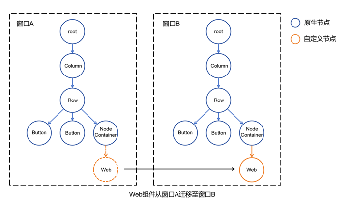

# Web组件在不同的窗口间迁移

Web组件能够实现在不同窗口的组件树上进行挂载或移除操作，这一能力使得开发者可以将同一个Web组件在不同窗口间迁移。例如，将浏览器的Tab页拖出成独立窗口，或拖入浏览器的另一个窗口。

Web组件在不同窗口间迁移，是基于[自定义节点](../ui/arkts-user-defined-node.md)能力实现的。实现的基本原理是：通过[BuilderNode](../ui/arkts-user-defined-arktsNode-builderNode.md)，开发者可创建Web组件的离线节点，并结合[自定义占位节点](../ui/arkts-user-defined-place-holder.md)控制Web节点的挂载与移除。当从一个窗口上移除Web节点，并挂载到另一个窗口中，即完成Web组件在窗口间的迁移。

在以下示例中，主窗Ability启动时，通过命令式的方式创建了一个Web组件。开发者可以利用common.ets中提供的方法和类，实现Web组件的挂载和移除。Index.ets则提供了一种挂载和移除Web组件的实现方法。通过这种方式，开发者能够实现Web组件在不同窗口中页面的挂载与移除，即实现了Web组件在不同窗口间的迁移。下图是展示了这一迁移过程的示意图。



> **说明：**
>
> 不要将一个Web组件同时挂载在两个父节点下，这会导致非预期行为。

```ts
// 主窗Ability
// EntryAbility.ets
import { createNWeb, defaultUrl } from '../pages/common'

// ...

  onWindowStageCreate(windowStage: window.WindowStage): void {
    hilog.info(0x0000, 'testTag', '%{public}s', 'Ability onWindowStageCreate');

    windowStage.loadContent('pages/Index', (err) => {
      if (err & err.code) {
        hilog.error(0x0000, 'testTag', 'Failed to load the content. Cause: %{public}s', JSON.stringify(err) ?? '');
        return;
      }
      // 创建Web动态组件（需传入UIContext），loadContent之后的任意时机均可创建，应用仅创建一个Web组件
      createNWeb(defaultUrl, windowStage.getMainWindowSync().getUIContext());
      hilog.info(0x0000, 'testTag', 'Succeeded in loading the content.');
    });
  }

// ...
```

```ts
// 提供动态挂载Web组件能力
// pages/common.ets
import { UIContext, NodeController, BuilderNode, FrameNode } from '@kit.ArkUI';
import { webview } from '@kit.ArkWeb';
import { hilog } from '@kit.PerformanceAnalysisKit';

export const defaultUrl : string = 'https://www.example.com';

// Data为入参封装类
class Data{
  url: string = '';
  webController: webview.WebviewController | null = null;

  constructor(url: string, webController: webview.WebviewController) {
    this.url = url;
    this.webController = webController;
  }
}

// @Builder中为动态组件的具体组件内容
@Builder
function WebBuilder(data:Data) {
  Web({ src: data.url, controller: data.webController })
    .width("100%")
    .height("100%")
    .borderStyle(BorderStyle.Dashed)
    .borderWidth(2)
}

let wrap = wrapBuilder<[Data]>(WebBuilder);

// 用于控制和反馈对应的NodeContainer上的节点的行为，需要与NodeContainer一起使用
export class MyNodeController extends NodeController {
  private builderNode: BuilderNode<[Data]> | null | undefined = null;
  private webController : webview.WebviewController | null | undefined = null;
  private rootNode : FrameNode | null = null;

  constructor(builderNode : BuilderNode<[Data]> | undefined, webController : webview.WebviewController | undefined) {
    super();
    this.builderNode = builderNode;
    this.webController = webController;
  }

  // 必须要重写的方法，用于构建节点数、返回节点挂载在对应NodeContainer中
  // 在对应NodeContainer创建的时候调用或者通过rebuild方法调用刷新
  makeNode(uiContext: UIContext): FrameNode | null {
    // 该节点会被挂载在NodeContainer的父节点下
    return this.rootNode;
  }

  // 挂载Webview
  attachWeb() : void {
    if (this.builderNode) {
      let frameNode : FrameNode | null = this.builderNode.getFrameNode();
      if (frameNode?.getParent() != null) {
        // 挂载自定义节点前判断该节点是否已经被挂载
        hilog.error(0x0000, 'testTag', '%{public}s', 'The frameNode is already attached');
        return;
      }
      this.rootNode = this.builderNode.getFrameNode();
    }
  }

  // 卸载Webview
  detachWeb() : void {
    this.rootNode = null;
  }

  getWebController() : webview.WebviewController | null | undefined {
    return this.webController;
  }
}

// 创建Map保存所需要的BuilderNode
let builderNodeMap : Map<string, BuilderNode<[Data]> | undefined> = new Map();
// 创建Map保存所需要的webview.WebviewController
let webControllerMap : Map<string, webview.WebviewController | undefined> = new Map();

// 初始化需要UIContext对象，UIContext对象可通过窗口或自定义组件的getUIContext方法获取
export const createNWeb = (url: string, uiContext: UIContext) => {
  // 创建WebviewController
  let webController = new webview.WebviewController() ;
  // 创建BuilderNode
  let builderNode : BuilderNode<[Data]> = new BuilderNode(uiContext);
  // 创建动态Web组件
  builderNode.build(wrap, new Data(url, webController));

  // 保存BuilderNode
  builderNodeMap.set(url, builderNode);
  // 保存WebviewController
  webControllerMap.set(url, webController);
}

// 自定义获取BuilderNode的接口
export const getBuilderNode = (url : string) : BuilderNode<[Data]> | undefined => {
  return builderNodeMap.get(url);
}
// 自定义获取WebviewController的接口
export const getWebviewController = (url : string) : webview.WebviewController | undefined => {
  return webControllerMap.get(url);
}

```

```ts
// 使用NodeController的Page页
// pages/Index.ets
import { getBuilderNode, MyNodeController, defaultUrl, getWebviewController } from "./common"

@Entry
@Component
struct Index {
  private nodeController : MyNodeController =
    new MyNodeController(getBuilderNode(defaultUrl), getWebviewController(defaultUrl));

  build() {
    Row() {
      Column() {
        Button("Attach Webview")
          .onClick(() => {
            // 注意不要将同一个节点同时挂载在不同的页面上！
            this.nodeController.attachWeb();
            this.nodeController.rebuild();
          })
        Button("Detach Webview")
          .onClick(() => {
            this.nodeController.detachWeb();
            this.nodeController.rebuild();
          })
        // NodeContainer用于与NodeController节点绑定，rebuild会触发makeNode
        // Page页通过NodeContainer接口绑定NodeController，实现动态组件页面显示
        NodeContainer(this.nodeController)
          .height("80%")
          .width("80%")
      }
      .width('100%')
    }
    .height('100%')
  }
}

```

