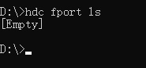
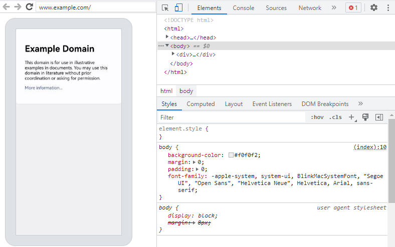

# 使用DevTools工具调试前端页面


Web组件支持使用DevTools工具调试前端页面。DevTools是一个 Web前端开发调试工具，提供了电脑上调试移动设备前端页面的能力。开发者通过[setWebDebuggingAccess()](../reference/apis-arkweb/js-apis-webview.md#setwebdebuggingaccess)接口开启Web组件前端页面调试能力，利用DevTools工具可以在电脑上调试移动设备上的前端网页，设备需为4.1.0及以上版本。


## 调试步骤

### 应用代码开启Web调试开关

调试网页前，需要应用侧代码调用[setWebDebuggingAccess()](../reference/apis-arkweb/js-apis-webview.md#setwebdebuggingaccess)接口开启Web调试开关。  
如果没有开启Web调试开关，则DevTools无法发现被调试的网页。

1. 在应用代码中开启Web调试开关，具体如下：

   ```ts
   // xxx.ets
   import { webview } from '@kit.ArkWeb';

   @Entry
   @Component
   struct WebComponent {
     controller: webview.WebviewController = new webview.WebviewController();

     aboutToAppear() {
       // 配置Web开启调试模式
       webview.WebviewController.setWebDebuggingAccess(true);
     }

     build() {
       Column() {
         Web({ src: 'www.example.com', controller: this.controller })
       }
     }
   }
   ```
2. 开启调试功能需要在DevEco Studio应用工程hap模块的module.json5文件中增加如下权限，添加方法请参考[在配置文件中声明权限](../security/AccessToken/declare-permissions.md)。

   ```
   "requestPermissions":[
      {
        "name" : "ohos.permission.INTERNET"
      }
    ]
   ```

### 将设备连接至电脑

请将设备连接至电脑，随后开启开发者模式，为后续的端口转发操作做好准备。

1. 请开启设备上的开发者模式，并启用USB调试功能。  

   (1) 终端系统查看“设置 > 系统”中是否有“开发者选项”，如果不存在，可在“设置 > 关于本机”连续七次单击“版本号”，直到提示“开启开发者模式”，点击“确认开启”后输入PIN码（如果已设置），设备将自动重启。

   (2) USB数据线连接终端和电脑，在“设置 > 系统 > 开发者选项”中，打开“USB调试”开关，弹出的“允许USB调试”的弹框，点击“允许”。

2. 使用hdc命令连接上设备。  
   打开命令行执行如下命令，查看hdc能否发现设备。
   ```shell
   hdc list targets
   ```
   - 如果命令有返回设备的ID，则说明hdc已连接上设备。  
   
   - 如果命令返回 `[Empty]`，则说明hdc还没有发现设备。  
   

3. 进入hdc shell。   
   当hdc命令连接上设备后，执行如下命令，进入hdc shell。
   ```shell
   hdc shell
   ```

### 端口转发
当应用代码调用setWebDebuggingAccess接口开启Web调试开关后，ArkWeb内核将启动一个domain socket的监听，以此实现DevTools对网页的调试功能。  
但是Chrome浏览器无法直接访问到设备上的domain socket， 所以需要将设备上的domain socket转发到电脑上。

1. 先在hdc shell里执行如下命令，查询ArkWeb在设备里创建的domain socket。  
   ```shell
   cat /proc/net/unix | grep devtools
   ```
   * 如果前几步操作无误，该命令的执行结果将显示用于查询的domain socket端口。  
   

   * 如果没有查询到结果， 请再次确认。  
     (1) 应用开启了Web调试开关。  
     (2) 应用使用Web组件加载了网页。

2. 将查询到的domain socket转发至电脑的TCP 9222端口。  
   执行exit退出hdc shell。
   ```shell
   exit
   ```
   在命令行里执行如下命令转发端口。
   ```shell
   hdc fport tcp:9222 localabstract:webview_devtools_remote_38532
   ```
   > **说明：**
   >
   > "webview_devtools_remote_" 后面的数字，代表ArkWeb所在应用的进程号， 该数字不是固定的。请将数字改为自己查询到的值。  
   > 如果应用的进程号发生变化（例如，应用重新启动），则需要重新进行端口转发。

   命令执行成功示意图：  
   

3. 在命令行里执行如下命令，检查端口是否转发成功。
   ```shell
   hdc fport ls
   ```
   * 如果有返回端口转发的任务，则说明端口转发成功。  
   
   * 如果返回 `[Empty]`， 则说明端口转发失败。  
   

### 在Chrome浏览器上打开调试工具页面
  1. 在电脑端Chrome浏览器地址栏中输入调试工具地址 chrome://inspect/\#devices 并打开该页面。  
  2. 修改Chrome调试工具的配置。  
     需要从本地的TCP 9222端口发现被调试网页，所以请确保已勾选 "Discover network targets"。然后再进行网络配置。  
     (1) 点击 "Configure" 按钮。  
     (2) 在 "Target discovery settings" 中添加要监听的本地端口localhost:9222。

     

  3. 为了同时调试多个应用，请在Chrome浏览器的调试工具网页内，于“Devices”选项中的“configure”部分添加多个端口号。

     

### 等待发现被调试页面

  如果前面的步骤执行成功，稍后，Chrome的调试页面将显示待调试的网页。  
  

### 开始网页调试

  

## 便捷脚本
### Windows平台
请复制以下信息建立bat文件，开启调试应用后执行。
   ```
   @echo off
   setlocal enabledelayedexpansion

   :: Initialize port number and PID list
   set PORT=9222
   set PID_LIST=

   :: Get the list of all forwarded ports and PIDs
   for /f "tokens=2,5 delims=:_" %%a in ('hdc fport ls') do (
       if %%a gtr !PORT! (
           set PORT=%%a
       )
       for /f "tokens=1 delims= " %%c in ("%%b") do (
           set PID_LIST=!PID_LIST! %%c
       )
   )

   :: Increment port number for next application
   set temp_PORT=!PORT!
   set /a temp_PORT+=1
   set PORT=!temp_PORT!

   :: Get the domain socket name of devtools
   for /f "tokens=*" %%a in ('hdc shell "cat /proc/net/unix | grep devtools"') do (
       set SOCKET_NAME=%%a

       :: Extract process ID
       for /f "delims=_ tokens=4" %%b in ("!SOCKET_NAME!") do set PID=%%b

       :: Check if PID already has a mapping
       echo !PID_LIST! | findstr /C:" !PID! " >nul
       if errorlevel 1 (
           :: Add mapping
           hdc fport tcp:!PORT! localabstract:webview_devtools_remote_!PID!
           if errorlevel 1 (
               echo Error: Failed to add mapping.
               pause
               exit /b
           )

           :: Add PID to list and increment port number for next application
           set PID_LIST=!PID_LIST! !PID!
           set temp_PORT=!PORT!
           set /a temp_PORT+=1
           set PORT=!temp_PORT!
       )
   )

   :: If no process ID was found, prompt the user to open debugging in their application code and provide the documentation link
   if "!SOCKET_NAME!"=="" (
       echo No process ID was found. Please open debugging in your application code using the corresponding interface. You can find the relevant documentation at this link: [https://gitee.com/openharmony/docs/blob/master/zh-cn/application-dev/web/web-debugging-with-devtools.md]
       pause
       exit /b
   )

   :: Check mapping
   hdc fport ls

   echo.
   echo Script executed successfully. Press any key to exit...
   pause >nul

   :: Try to open the page in Edge
   start msedge chrome://inspect/#devices.com

   :: If Edge is not available, then open the page in Chrome
   if errorlevel 1 (
       start chrome chrome://inspect/#devices.com
   )

   endlocal
   ```
### Linux或Mac平台
请复制以下信息建立sh文件，注意chmod以及格式转换，开启调试应用后执行。
   ```
   #!/bin/bash

   # Get current fport rule list
   CURRENT_FPORT_LIST=$(hdc fport ls)

   # Delete the existing fport rule one by one
   while IFS= read -r line; do
       # Extract the taskline
       IFS=' ' read -ra parts <<< "$line"
       taskline="${parts[1]} ${parts[2]}"

       # Delete the corresponding fport rule
       echo "Removing forward rule for $taskline"
       hdc fport rm $taskline
       result=$?

       if [ $result -eq 0 ]; then
           echo "Remove forward rule success, taskline:$taskline"
       else
           echo "Failed to remove forward rule, taskline:$taskline"
       fi

   done <<< "$CURRENT_FPORT_LIST"

   # Initial port number
   INITIAL_PORT=9222

   # Get the current port number, use initial port number if not set previously
   CURRENT_PORT=${PORT:-$INITIAL_PORT}

   # Get the list of all PIDs that match the condition
   PID_LIST=$(hdc shell cat /proc/net/unix | grep webview_devtools_remote_ | awk -F '_' '{print $NF}')

   if [ -z "$PID_LIST" ]; then
       echo "Failed to retrieve PID from the device"
       exit 1
   fi

   # Increment the port number
   PORT=$CURRENT_PORT

   # Forward ports for each application one by one
   for PID in $PID_LIST; do
       # Increment the port number
       PORT=$((PORT + 1))

       # Execute the hdc fport command
       hdc fport tcp:$PORT localabstract:webview_devtools_remote_$PID

       # Check if the command executed successfully
       if [ $? -ne 0 ]; then
           echo "Failed to execute hdc fport command"
           exit 1
       fi
   done

   # List all forwarded ports
   hdc fport ls
   ```

## 常见问题与解决方法

### hdc无法发现设备
**问题现象**

   在命令行里执行如下命令后，没有列出设备ID。
   ```shell
   hdc list targets
   ```

**解决方法**

  * 请确保设备上的USB调试开关已开启。
  * 请确保设备与电脑相连。

### hdc的命令显示设备"未授权"或"unauthorized"
**问题现象**

   执行hdc命令时，提示设备"未授权"或"unauthorized"。

**问题原因**

   设备没有授权该台电脑进行调试。

**解决方法**

  开启USB调试开关的设备连接没有授权的电脑后，会弹框提示"是否允许USB调试？"，请选择允许。

### 找不到DevTools的domain socket
**问题现象**

   在hdc shell里执行如下命令后，没有结果。
   ```shell
   cat /proc/net/unix | grep devtools
   ```

**解决方法**

  * 请确保应用[开启了Web调试开关](#应用代码开启web调试开关)。
  * 请确保应用使用Web组件加载了网页。

### 端口转发不成功
**问题现象**

   在命令行里执行如下命令后，没有列出之前设置过转发任务。
   ```shell
   hdc fport ls
   ```

**解决方法**

  * 请确保设备里的domain socket存在。
  * 请确保电脑端的tcp:9222没有被占用。  
    如果tcp:9222被占用，可以将domain socket转发到其他未被占用的TCP端口， 比如9223等。  
    如果转发到了新的TCP端口， 需要同步修改电脑端Chrome浏览器"Target discovery settings"中的端口号。

### 端口转发成功后，电脑端Chrome无法发现被调试网页
**问题现象**

  电脑端Chrome浏览器无法发现被调试网页。

**问题原因**

端口转发失效可能是以下原因：
  * 设备与电脑断连，会导致hdc里的所有转发任务被清空。
  * hdc服务重启，也会导致hdc里的所有转发任务被清空。
  * 设备里应用的进程号发生了变更（应用重新启动等），会导致hdc里旧的转发任务失效。
  * 多个转发任务转发到了同一个端口等异常配置，会导致转发异常。

**解决方法**

  * 请确保电脑端的本地tcp:9222（其他TCP端口同理）没有被占用。
  * 请确保设备端的domain socket还存在。
  * 请确保domain socket名称里的进程号与被调试的应用的进程号相同。
  * 请删除hdc里其他不必要的转发任务。
  * 转发成功后，请用电脑端的Chrome浏览器打开网址 http://localhost:9222/json ，URL里的9222需要改为自己实际配置的TCP端口。

    - 如果网页有内容， 说明端口转发成功，请在Chrome的调试页面[等待被调试页面的出现](#等待发现被调试页面)。  
    

    - 如果展示的是错误网页， 说明端口转发失败， 解决方法见上面的[端口转发不成功](#端口转发不成功)。  
    

  * 电脑端Chrome浏览器打开 http://localhost:9222/json 页面有内容，但是Chrome的调试工具界面还是无法发现调试目标。
    - 请确保Chrome调试工具界面的 "Configure" 中配置的端口号，与端口转发指定的TCP端口号一致。
    - 在本文档中，默认使用的TCP端口号为9222。   
      如果开发者使用了其他的TCP端口号(比如9223)，请同时修改[端口转发](#端口转发)中的TCP端口号和[Chrome调试工具界面"Configure"配置](#在chrome浏览器上打开调试工具页面)中的端口号。
