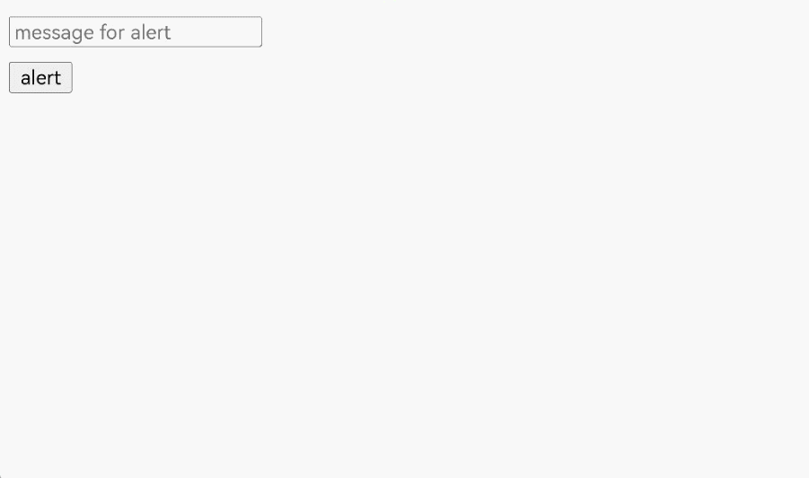
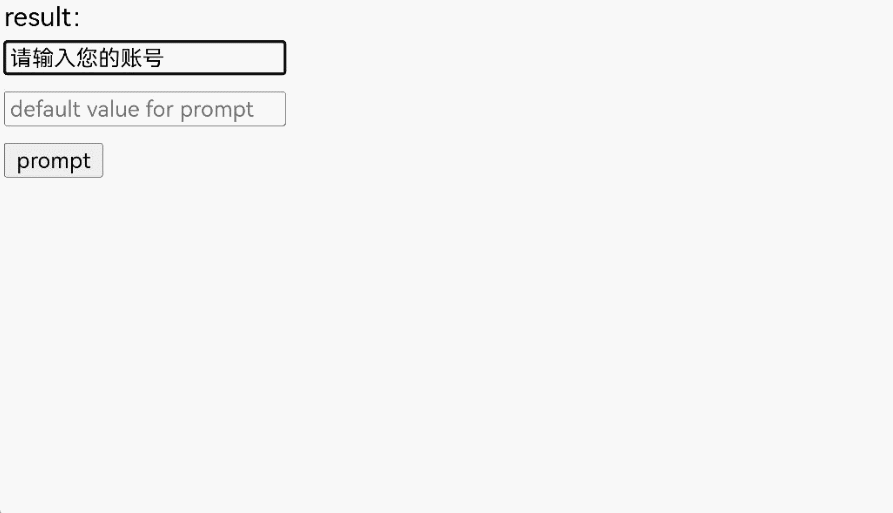

# 使用Web组件显示网页弹框

在HTML中，可以使用JavaScript创建三种类型的弹框：警告框`window.alert(message)`、确认框`window.confirm(message)`和提示框`window.prompt(message, defaultValue)`。这些弹框可以用于向用户传递信息、确认操作或请求输入。

当前，ArkWeb暂未提供默认的应用弹框。如果需要网页的弹框能够正常使用，应用需要通过[onAlert](../reference/apis-arkweb/arkts-basic-components-web-events.md#onalert)、[onConfirm](../reference/apis-arkweb/arkts-basic-components-web-events.md#onconfirm)和[onPrompt](../reference/apis-arkweb/arkts-basic-components-web-events.md#onprompt9)接口自定义弹框功能。

## 实现Alert弹框

`window.alert()`用于显示一个包含可选信息的对话框。警告框用于确保用户可以得到某些信息。当警告框出现后，用户需要点击确定按钮才能继续进行操作。
- 可选参数`message`是要显示在警告对话框中的字符串，如果传入其他类型的值，会转换成字符串。
- 该方法不存在返回值。

应用可以通过[onAlert](../reference/apis-arkweb/arkts-basic-components-web-events.md#onalert)事件监听网页`alert`方法，并创建合适的弹框。

- 用[AlertDialog](../reference/apis-arkui/arkui-ts/ts-methods-alert-dialog-box.md)创建弹框。

  ```ts
  import { webview } from '@kit.ArkWeb';

  @Entry
  @Component
  struct Index {
    @State message: string = 'Hello World';
    webviewController: webview.WebviewController = new webview.WebviewController();
    uiContext: UIContext = this.getUIContext();

    build() {
      Row() {
        Web({ src: $rawfile('test.html'), controller: this.webviewController })
          .onAlert((event) => {
            if (event) {
              console.log("event.url:" + event.url);
              console.log("event.message:" + event.message);
              this.uiContext.showAlertDialog({
                title: "来自" + event.url + "的警告",
                message: event.message,
                confirm:{
                  value: "确认",
                  action: ()=>{
                    console.info('Alert confirmed.');
                    event.result.handleConfirm();
                  }
                },
                cancel: () => {
                  event.result.handleCancel();
                }
              })
            }
            return true;
          })
      }
    }
  }
  ```
  加载的html。
  ```html
  <!doctype html>
  <html lang="en">
  <head>
      <meta charset="UTF-8">
      <meta name="viewport"
            content="width=device-width, user-scalable=no, initial-scale=1.0, maximum-scale=1.0, minimum-scale=1.0">
      <meta http-equiv="X-UA-Compatible" content="ie=edge">
      <title>Document</title>
      <style>
          button,label,input {
          margin: 5px 0;
          }
      </style>
  </head>
  <body>
  <input type="text" id="alert-message" placeholder="message for alert"><br/>
  <button onclick="handleAlert()">alert</button><br/>
  <script>
      function handleAlert() {
          let message = document.getElementById("alert-message").value;
          let result = window.alert(message ? message : 'alert');
      }
  </script>
  </body>
  </html>
  ```

- 用[CustomDialog-AlertDialog](../reference/apis-arkui/arkui-ts/ohos-arkui-advanced-Dialog.md#alertdialog)创建弹框。

  ```ts
  import { AlertDialog, router } from '@kit.ArkUI';
  import { webview } from '@kit.ArkWeb';

  @Entry
  @Component
  struct AlertDialogPage {
    @State message: string = 'Hello World';
    @State title: string = 'Hello World';
    @State subtitle: string = '';
    @State result: JsResult | null = null;
    webviewController: webview.WebviewController = new webview.WebviewController();
    dialogControllerAlert: CustomDialogController = new CustomDialogController({
      builder: AlertDialog({
        primaryTitle: this.title,
        secondaryTitle: this.subtitle,
        content: this.message,
        primaryButton: {
          value: '确认',
          role: ButtonRole.ERROR,
          action: () => {
            console.info('Callback when the second button is clicked');
            this.result?.handleConfirm();
          }
        },
      }),
      onWillDismiss: ()=>{
        this.result?.handleCancel();
        this.dialogControllerAlert.close();
      }
    })

    build() {
      Column() {
        Button('back').onClick((event: ClickEvent) => {
          router.back()
        })
        Web({ src: $rawfile('alert.html'), controller: this.webviewController })
          .onAlert((event) => {
            if (event) {
              console.log("event.url:" + event.url);
              console.log("event.message:" + event.message);
              this.title = "来自" + event.url + "的警告";
              this.message = event.message;
              this.result = event.result;
              this.dialogControllerAlert.open();
            }
            return true;
          })
      }
    }
  }
  ```
  加载的html。
  ```html
  <!doctype html>
  <html lang="en">
  <head>
      <meta charset="UTF-8">
      <meta name="viewport"
            content="width=device-width, user-scalable=no, initial-scale=1.0, maximum-scale=1.0, minimum-scale=1.0">
      <meta http-equiv="X-UA-Compatible" content="ie=edge">
      <title>Document</title>
      <style>
          button,label,input {
          margin: 5px 0;
          }
      </style>
  </head>
  <body>
  <input type="text" id="alert-message" placeholder="message for alert"><br/>
  <button onclick="handleAlert()">alert</button><br/>
  <script>
      function handleAlert() {
          let message = document.getElementById("alert-message").value;
          let result = window.alert(message ? message : 'alert');
      }
  </script>
  </body>
  </html>
  ```

  

## 实现Confirm弹框

`window.confirm()`用于显示一个包含可选消息的对话框，并等待用户确认或取消该对话框。
- 可选参数`message`是要显示在对话框中的字符串，如果传入其他类型的值，会转换成字符串。
- 该方法返回一个布尔值，表示是否选择了确定（`true`）或取消（`false`）。如果应用忽略了页面内的对话框，那么返回值总是`false`。

确认框用于验证用户是否接受某个操作，常用于询问用户是否离开网页，以防页面表单等数据丢失。

应用可以通过[onConfirm](../reference/apis-arkweb/arkts-basic-components-web-events.md#onconfirm)事件监听网页`confirm`方法，并创建合适的弹框。

- 用[AlertDialog](../reference/apis-arkui/arkui-ts/ts-methods-alert-dialog-box.md)创建弹框。

  ```ts
  import { webview } from '@kit.ArkWeb';

  @Entry
  @Component
  struct Index {
    @State message: string = 'Hello World';
    webviewController: webview.WebviewController = new webview.WebviewController();
    uiContext: UIContext = this.getUIContext();

    build() {
      Column() {
        Web({ src: $rawfile('test.html'), controller: this.webviewController })
          .onConfirm((event) => {
            if (event) {
              console.log("event.url:" + event.url);
              console.log("event.message:" + event.message);
              this.uiContext.showAlertDialog({
                title: "来自" + event.url + "的消息",
                message: event.message,
                primaryButton: {
                  value: 'cancel',
                  action: () => {
                    event.result.handleCancel();
                  }
                },
                secondaryButton: {
                  value: 'ok',
                  action: () => {
                    event.result.handleConfirm();
                  }
                },
                cancel: () => {
                  event.result.handleCancel();
                }
              })
            }
            return true;
          })
      }
    }
  }
  ```

  加载的html。
  ```html
  <!doctype html>
  <html lang="en">
  <head>
      <meta charset="UTF-8">
      <meta name="viewport"
            content="width=device-width, user-scalable=no, initial-scale=1.0, maximum-scale=1.0, minimum-scale=1.0">
      <meta http-equiv="X-UA-Compatible" content="ie=edge">
      <title>Document</title>
      <style>
          button,label,input {
          margin: 5px 0;
          }
      </style>
  </head>
  <body>
  result：<label id="confirmLabel" for="confirm"></label><br/>
  <input type="text" id="confirm-message" placeholder="message for confirm"><br/>
  <button id="confirm" onclick="handleConfirm()">confirm</button><br/>
  <script>
      function handleConfirm() {
          let message = document.getElementById("confirm-message").value;
          let result = window.confirm(message ? message : 'confirm');
          console.log(result);
          document.getElementById("confirmLabel").innerHTML=String(result);
      }
  </script>
  </body>
  </html>
  ```

- 用[CustomDialog-ConfirmDialog](../reference/apis-arkui/arkui-ts/ohos-arkui-advanced-Dialog.md#confirmdialog)创建弹框。

  ```ts
  import { webview } from '@kit.ArkWeb';
  import { ConfirmDialog } from '@kit.ArkUI';

  @Entry
  @Component
  struct DialogConfirmDialog {
    @State message: string = 'Hello World';
    @State title: string = 'Hello World';
    @State result: JsResult | null = null;
    webviewController: webview.WebviewController = new webview.WebviewController();
    isChecked = false;
    dialogControllerCheckBox: CustomDialogController = new CustomDialogController({
      builder: ConfirmDialog({
        title: this.title,
        content: this.message,
        // 勾选框选中状态
        isChecked: this.isChecked,
        // 勾选框说明文本
        checkTips: '禁止后不再提示',
        primaryButton: {
          value: '禁止',
          action: () => {
            this.result?.handleCancel();
          },
        },
        secondaryButton: {
          value: '允许',
          action: () => {
            this.isChecked = false;
            console.info('Callback when the second button is clicked');
            this.result?.handleConfirm();
          }
        },
        onCheckedChange: (checked) => {
          this.isChecked = checked;
          console.info('Callback when the checkbox is clicked');
        },
      }),
      onWillDismiss: () => {
        this.result?.handleCancel();
        this.dialogControllerCheckBox.close();
      },
      autoCancel: true
    })

    build() {
      Column() {
        Web({ src: $rawfile('confirm.html'), controller: this.webviewController })
          .onConfirm((event) => {
            if (event) {
              if (this.isChecked) {
                event.result.handleCancel();
              } else {
                console.log("event.url:" + event.url);
                console.log("event.message:" + event.message);
                this.title = "来自" + event.url + "的消息";
                this.message = event.message;
                this.result = event.result;
                this.dialogControllerCheckBox.open();
              }
            }
            return true;
          })
      }
    }
  }
  ```
  加载的html。
  ```html
  <!doctype html>
  <html lang="en">
  <head>
      <meta charset="UTF-8">
      <meta name="viewport"
            content="width=device-width, user-scalable=no, initial-scale=1.0, maximum-scale=1.0, minimum-scale=1.0">
      <meta http-equiv="X-UA-Compatible" content="ie=edge">
      <title>Document</title>
      <style>
          button,label,input {
          margin: 5px 0;
          }
      </style>
  </head>
  <body>
  result：<label id="confirmLabel" for="confirm"></label><br/>
  <input type="text" id="confirm-message" placeholder="message for confirm"><br/>
  <button id="confirm" onclick="handleConfirm()">confirm</button><br/>
  <script>
      function handleConfirm() {
          let message = document.getElementById("confirm-message").value;
          let result = window.confirm(message ? message : 'confirm');
          console.log(result);
          document.getElementById("confirmLabel").innerHTML=String(result);
      }
  </script>
  </body>
  </html>
  ```

  

## 实现Prompt弹框

`window.prompt()`用于显示一个对话框，并等待用户提交文本或取消对话框。用户需要输入某个值，然后点击确认或取消按钮。点击确认返回输入的值，点击取消返回`null`。
- 可选参数`message`向用户显示的一串文本。如果在提示窗口中没有什么可显示的，可以省略。
- 可选参数`defaultValue`是一个字符串，包含文本输入字段中显示的默认值。
- 返回值为用户输入文本的字符串，或`null`。

提示框用于提示用户输入某个值，常用于需要用户输入临时的口令或验证码等场景。

应用可以通过[onPrompt](../reference/apis-arkweb/arkts-basic-components-web-events.md#onprompt9)事件监听网页`prompt`方法，并创建合适的弹框。

- 用[CustomDialog-CustomContentDialog](../reference/apis-arkui/arkui-ts/ohos-arkui-advanced-Dialog.md#customcontentdialog12)创建弹框。

  ```ts
  import { CustomContentDialog } from '@kit.ArkUI';
  import { webview } from '@kit.ArkWeb';

  @Entry
  @Component
  struct PromptDialog {
    @State message: string = 'Hello World';
    @State title: string = 'Hello World';
    @State result: JsResult | null = null;
    promptResult: string = '';
    webviewController: webview.WebviewController = new webview.WebviewController();
    dialogController: CustomDialogController = new CustomDialogController({
      builder: CustomContentDialog({
        primaryTitle: this.title,
        contentBuilder: () => {
          this.buildContent();
        },
        buttons: [
          {
            value: '取消',
            buttonStyle: ButtonStyleMode.TEXTUAL,
            action: () => {
              console.info('Callback when the button is clicked');
              this.result?.handleCancel();
            }
          },
          {
            value: '确认',
            buttonStyle: ButtonStyleMode.TEXTUAL,
            action: () => {
              this.result?.handlePromptConfirm(this.promptResult);
            }
          }
        ],
      }),
      onWillDismiss: () => {
        this.result?.handleCancel();
        this.dialogController.close();
      }
    });

    // 自定义弹出框的内容区
    @Builder
    buildContent(): void {
      Column() {
        Text(this.message)
        TextInput()
          .onChange((value) => {
            this.promptResult = value;
          })
          .defaultFocus(true)
      }
      .width('100%')
    }

    build() {
      Column() {
        Web({ src: $rawfile('prompt.html'), controller: this.webviewController })
          .onPrompt((event) => {
            if (event) {
              console.log("event.url:" + event.url);
              console.log("event.message:" + event.message);
              console.log("event.value:" + event.value);
              this.title = "来自" + event.url + "的消息";
              this.message = event.message;
              this.promptResult = event.value;
              this.result = event.result;
              this.dialogController.open();
            }
            return true;
          })
      }
    }
  }
  ```
  加载的html。
  ```html
  <!doctype html>
  <html lang="en">
  <head>
      <meta charset="UTF-8">
      <meta name="viewport"
            content="width=device-width, user-scalable=no, initial-scale=1.0, maximum-scale=1.0, minimum-scale=1.0">
      <meta http-equiv="X-UA-Compatible" content="ie=edge">
      <title>Document</title>
      <style>
          button,label,input {
          margin: 5px 0;
          }
      </style>
  </head>
  <body>
  result：<label id="promptLabel" for="prompt"></label><br/>
  <input type="text" id="prompt-message" placeholder="message for prompt"><br/>
  <input type="text" id="prompt-value" placeholder="default value for prompt"><br/>
  <button id="prompt" onclick="handlePrompt()">prompt</button><br/>
  <script>
      function handlePrompt() {
          let message = document.getElementById("prompt-message").value;
          let defaultValue = document.getElementById("prompt-value").value;
          let result = window.prompt(message ? message : 'prompt', defaultValue);
          console.log(result);
          document.getElementById("promptLabel").innerHTML=result;
      }
  </script>
  </body>
  </html>
  ```

  
