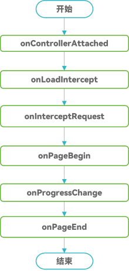

# Web组件的生命周期

## 概述

开发者可以使用Web组件加载本地或者在线网页。

Web组件提供了丰富的组件生命周期回调接口，通过这些回调接口，开发者可以感知Web组件的生命周期状态变化，进行相关的业务处理。

Web组件的状态主要包括：Controller绑定到Web组件、网页加载开始、网页加载进度、网页加载结束、页面即将可见等。

**图1**  Web组件网页正常加载过程中的回调事件



## Web组件网页加载的状态说明

- [aboutToAppear](../reference/apis-arkui/arkui-ts/ts-custom-component-lifecycle.md#abouttoappear)函数：在创建自定义组件的新实例后，在执行其build函数前执行。一般建议在此设置WebDebug调试模式[setWebDebuggingAccess](../reference/apis-arkweb/js-apis-webview.md#setwebdebuggingaccess)、设置Web内核自定义协议URL的跨域请求与fetch请求的权限[customizeSchemes](../reference/apis-arkweb/js-apis-webview.md#customizeschemes)、设置Cookie([configCookie](../reference/apis-arkweb/js-apis-webview.md#configcookie11-1))等。

- [onControllerAttached](../reference/apis-arkweb/ts-basic-components-web.md#oncontrollerattached10)事件：当Controller成功绑定到Web组件时触发该回调，且禁止在该事件回调前调用Web组件相关的接口，否则会抛出js-error异常。推荐在此事件中注入JS对象[registerJavaScriptProxy](../reference/apis-arkweb/js-apis-webview.md#registerjavascriptproxy)、设置自定义用户代理[setCustomUserAgent](../reference/apis-arkweb/js-apis-webview.md#setcustomuseragent10)，可以在回调中使用[loadUrl](../reference/apis-arkweb/js-apis-webview.md#loadurl)，[getWebId](../reference/apis-arkweb/js-apis-webview.md#getwebid)等操作网页不相关的接口。但因该回调调用时网页还未加载，因此无法在回调中使用有关操作网页的接口，例如[zoomIn](../reference/apis-arkweb/js-apis-webview.md#zoomin)、[zoomOut](../reference/apis-arkweb/js-apis-webview.md#zoomout)等。

- [onLoadIntercept](../reference/apis-arkweb/ts-basic-components-web.md#onloadintercept10)事件：当Web组件加载url之前触发该回调，用于判断是否阻止此次访问。默认允许加载。

- [onOverrideUrlLoading](../reference/apis-arkweb/ts-basic-components-web.md#onoverrideurlloading12)事件：当URL将要加载到当前Web中时，让宿主应用程序有机会获得控制权，回调函数返回true将导致当前Web中止加载URL，而返回false则会导致Web继续照常加载URL。onLoadIntercept接口和onOverrideUrlLoading接口行为不一致，触发时机也不同，所以在应用场景上存在一定区别。主要是在LoadUrl和iframe（HTML标签，表示HTML内联框架元素，用于将另一个页面嵌入到当前页面中）加载时，onLoadIntercept事件会正常回调到，但onOverrideUrlLoading事件在LoadUrl加载时不会触发，在iframe加载HTTP(s)协议或about:blank时也不会触发。详细介绍请见[onLoadIntercept](../reference/apis-arkweb/ts-basic-components-web.md#onloadintercept10)和[onOverrideUrlLoading](../reference/apis-arkweb/ts-basic-components-web.md#onoverrideurlloading12)的说明。

- [onInterceptRequest](../reference/apis-arkweb/ts-basic-components-web.md#oninterceptrequest9)事件：当Web组件加载url之前触发该回调，用于拦截url并返回响应数据。

- [onPageBegin](../reference/apis-arkweb/ts-basic-components-web.md#onpagebegin)事件：网页开始加载时触发该回调，且只在主frame（表示一个HTML元素，用于展示HTML页面的HTML元素）触发。如果是iframe或者frameset（用于包含frame的HTML标签）的内容加载时则不会触发此回调。多frame页面有可能同时开始加载，即使主frame已经加载结束，子frame也有可能才开始或者继续加载中。同一页面导航（片段、历史状态等）或者在提交前失败、被取消的导航等也不会触发该回调。

- [onProgressChange](../reference/apis-arkweb/ts-basic-components-web.md#onprogresschange)事件：告知开发者当前页面加载的进度。多frame页面或者子frame有可能还在继续加载而主frame可能已经加载结束，所以在[onPageEnd](../reference/apis-arkweb/ts-basic-components-web.md#onpageend)事件后依然有可能收到该事件。

- [onPageEnd](../reference/apis-arkweb/ts-basic-components-web.md#onpageend)事件：网页加载完成时触发该回调，且只在主frame触发。多frame页面有可能同时开始加载，即使主frame已经加载结束，子frame也有可能才开始或者继续加载中。同一页面导航（片段、历史状态等）或者在提交前失败、被取消的导航等也不会触发该回调。推荐在此回调中执行JavaScript脚本[loadUrl](../reference/apis-arkweb/js-apis-webview.md#loadurl)等。需要注意的是收到该回调并不能保证Web绘制的下一帧将反映此时DOM的状态。

- [onPageVisible](../reference/apis-arkweb/ts-basic-components-web.md#onpagevisible9)事件：Web回调事件。渲染流程中当HTTP响应的主体开始加载，新页面即将可见时触发该回调。此时文档加载还处于早期，因此链接的资源比如在线CSS、在线图片等可能尚不可用。

- [onRenderExited](../reference/apis-arkweb/ts-basic-components-web.md#onrenderexited9)事件：应用渲染进程异常退出时触发该回调，可以在此回调中进行系统资源的释放、数据的保存等操作。如果应用希望异常恢复，需要调用[loadUrl](../reference/apis-arkweb/js-apis-webview.md#loadurl)接口重新加载页面。

- [onDisAppear](../reference/apis-arkui/arkui-ts/ts-universal-events-show-hide.md#ondisappear)事件：组件卸载消失时触发此回调。该事件为通用事件，指组件从组件树上卸载时触发的事件。

应用侧代码。

  ```ts
  // xxx.ets
  import { webview } from '@kit.ArkWeb';
  import { BusinessError } from '@kit.BasicServicesKit';
  import { promptAction } from '@kit.ArkUI';

  @Entry
  @Component
  struct WebComponent {
    controller: webview.WebviewController = new webview.WebviewController();
    responseWeb: WebResourceResponse = new WebResourceResponse();
    heads: Header[] = new Array();
    @State webData: string = "<!DOCTYPE html>\n" +
      "<html>\n" +
      "<head>\n" +
      "<title>intercept test</title>\n" +
      "</head>\n" +
      "<body>\n" +
      "<h1>intercept test</h1>\n" +
      "</body>\n" +
      "</html>";

    aboutToAppear(): void {
      try {
        webview.WebviewController.setWebDebuggingAccess(true);
      } catch (error) {
        console.error(`ErrorCode: ${(error as BusinessError).code},  Message: ${(error as BusinessError).message}`);
      }
    }

    build() {
      Column() {
        Web({ src: $rawfile('index.html'), controller: this.controller })
          .onControllerAttached(() => {
            // 推荐在此loadUrl、设置自定义用户代理、注入JS对象等
            console.log('onControllerAttached execute')
          })
          .onLoadIntercept((event) => {
            if (event) {
              console.log('onLoadIntercept url:' + event.data.getRequestUrl())
              console.log('url:' + event.data.getRequestUrl())
              console.log('isMainFrame:' + event.data.isMainFrame())
              console.log('isRedirect:' + event.data.isRedirect())
              console.log('isRequestGesture:' + event.data.isRequestGesture())
            }
            // 返回true表示阻止此次加载，否则允许此次加载
            return false;
          })
          .onOverrideUrlLoading((webResourceRequest: WebResourceRequest) => {
            if (webResourceRequest && webResourceRequest.getRequestUrl() == "about:blank") {
              return true;
            }
            return false;
          })
          .onInterceptRequest((event) => {
            if (event) {
              console.log('url:' + event.request.getRequestUrl());
            }
            let head1: Header = {
              headerKey: "Connection",
              headerValue: "keep-alive"
            }
            let head2: Header = {
              headerKey: "Cache-Control",
              headerValue: "no-cache"
            }
            let length = this.heads.push(head1);
            length = this.heads.push(head2);
            this.responseWeb.setResponseHeader(this.heads);
            this.responseWeb.setResponseData(this.webData);
            this.responseWeb.setResponseEncoding('utf-8');
            this.responseWeb.setResponseMimeType('text/html');
            this.responseWeb.setResponseCode(200);
            this.responseWeb.setReasonMessage('OK');
            // 返回响应数据则按照响应数据加载，无响应数据则返回null表示按照原来的方式加载
            return this.responseWeb;
          })
          .onPageBegin((event) => {
            if (event) {
              console.log('onPageBegin url:' + event.url);
            }
          })
          .onFirstContentfulPaint(event => {
            if (event) {
              console.log("onFirstContentfulPaint:" + "[navigationStartTick]:" +
              event.navigationStartTick + ", [firstContentfulPaintMs]:" +
              event.firstContentfulPaintMs);
            }
          })
          .onProgressChange((event) => {
            if (event) {
              console.log('newProgress:' + event.newProgress);
            }
          })
          .onPageEnd((event) => {
            // 推荐在此事件中执行JavaScript脚本
            if (event) {
              console.log('onPageEnd url:' + event.url);
            }
          })
          .onPageVisible((event) => {
            console.log('onPageVisible url:' + event.url);
          })
          .onRenderExited((event) => {
            if (event) {
              console.log('onRenderExited reason:' + event.renderExitReason);
            }
          })
          .onDisAppear(() => {
            promptAction.showToast({
              message: 'The web is hidden',
              duration: 2000
            })
          })
      }
    }
  }
  ```

前端index.html。

  ```html
  <!-- index.html -->
  <!DOCTYPE html>
  <html>
  <head>
    <meta charset="UTF-8">
  </head>
  <body>
  <h1>Hello, ArkWeb</h1>
  </body>
  </html>
  ```

## Web组件网页加载的性能指标

网页加载过程中需要关注一些重要的性能指标。例如，FCP(First Contentful Paint)首次内容绘制，FMP(First Meaningful Paint)首次有效绘制，LCP(Largest Contentful Paint)最大内容绘制等。Web组件提供了如下接口来通知开发者。

- [onFirstContentfulPaint](../reference/apis-arkweb/ts-basic-components-web.md#onfirstcontentfulpaint10)事件：网页首次内容绘制的回调函数。首次绘制文本、图像、非空白Canvas或者SVG的时间点。

- [onFirstMeaningfulPaint](../reference/apis-arkweb/ts-basic-components-web.md#onfirstmeaningfulpaint12)事件：网页绘制页面主要内容的回调函数。首次绘制页面主要内容的时间点。

- [onLargestContentfulPaint](../reference/apis-arkweb/ts-basic-components-web.md#onlargestcontentfulpaint12)事件：网页绘制页面最大内容的回调函数。可视区域内容最大的可见元素开始出现在页面上的时间点。