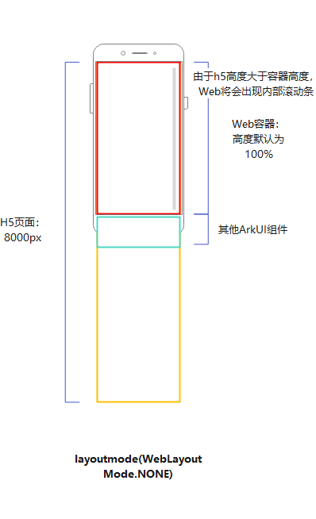
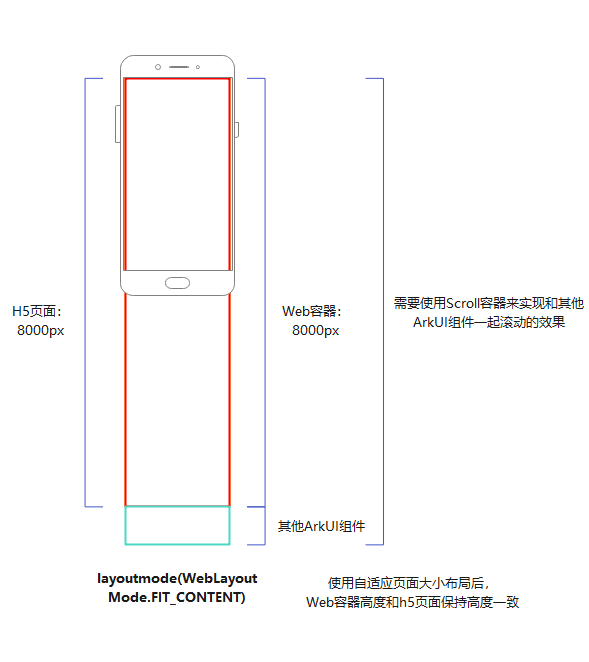

# Web组件大小自适应页面内容布局

使用Web组件大小自适应页面内容布局模式`layoutMode(WebLayoutMode.FIT_CONTENT)`时，能使Web组件的大小根据页面内容自适应变化。

## 使用场景

适用于Web组件需要根据网页高度撑开，与其他系统组件一起滚动的场景，如：

- 浏览长文章。Web组件同一布局层级有其他系统组件，如评论区、工具栏等。
- 长页面首页。Web组件同一布局层级有其他系统组件，如宫格菜单。

**Web布局跟随系统：**

如图一所示，Web组件的高度为一屏，H5页面的高度为8000px，大于Web组件的高度，此时Web组件内部将会出现滚动条。滚动Web组件时，页面的一部分将被隐藏，且不能充分利用整个屏幕展示Web页面，这会导致用户体验不佳。实际效果如图二所示。

| 图一  Web布局跟随系统| 图二 Web布局跟随系统实机效果|
| --- | --- |
|  |  |

**Web组件大小自适应页面内容布局：**

如图三所示，Web组件高度将自动与H5页面保持一致。右图显示，Web组件与H5页面的高度均为8000px。此时，Web组件内部不会生成滚动条，在滑动页面时，可同时带动其他ArkUI组件滚动，以整个屏幕展示Web组件。实际效果见图四。

| 图三 Web组件大小自适应页面内容布局| 图四 Web组件大小自适应页面内容布局实机效果|
| --- | --- |
|  |  |

## 规格与约束

1. 建议配置[渲染模式](web-render-mode.md)为同步渲染模式，避免因为组件大小超出限制导致异常场景（白屏，布局错误）。
2. 建议配置[过滚动模式](../reference/apis-arkweb/ts-basic-components-web.md#overscrollmode11)为关闭状态。当过滚动模式开启时，当用户在Web界面上滑动到边缘时，Web会通过弹性动画弹回界面，会与Scroll组件的回弹相互冲突，影响体验。
3. [键盘避让](../reference/apis-arkweb/ts-basic-components-web.md#keyboardavoidmode12)属性配置为RESIZE_CONTENT时，该避让模式不生效。
4. 不支持对页面进行缩放。
5. 不支持通过Web组件的height属性修改组件高度。
6. 仅支持根据页面内容自适应组件高度，不支持自适应宽度。
7. 不支持瀑布流页面。

## 示例代码

```typescript
// fit_content_test.ets
import { webview } from '@kit.ArkWeb';

@Entry
@Component
struct WebHeightPage {
  private webviewController: WebviewController = new webview.WebviewController()
  private scroller: Scroller = new Scroller()

  build() {
    Navigation() {
      Column() {
        Scroll(this.scroller) {
          Column() {
            Web({
              src: $rawfile("fit_content.html"),
              controller: this.webviewController,
              renderMode: RenderMode.SYNC_RENDER // 设置为同步渲染模式
            })
              .layoutMode(WebLayoutMode.FIT_CONTENT) // 设置为Web组件大小自适应页面内容
              .overScrollMode(OverScrollMode.NEVER) // 设置过滚动模式为关闭状态
            Text("评论区")
              .fontSize(28)
              .fontColor("#FF0F0F")
              .height(100)
              .width("100%")
              .backgroundColor("#f89f0f")
          }
        }

      }
    }
    .title("标题栏")
  }
}
```

```html
<!--fit_content.html-->
<!DOCTYPE html>
<html>
<head>
    <meta charset="UTF-8">
    <meta name="viewport" content="width=device-width, initial-scale=1, user-scalable=no">
    <title>Fit-Content</title>
</head>
<body>
<div>
    <div><h2 id="使用场景">使用场景</h2>
        <p>ArkWeb（方舟Web）提供了Web组件，用于在应用程序中显示Web页面内容。常见使用场景包括：</p>
        <ul>
            <li><p>
                应用集成Web页面：应用可以在页面中使用Web组件，嵌入Web页面内容，以降低开发成本，提升开发、运营效率。</p>
            </li>
            <li><p>
                浏览器网页浏览场景：浏览器类应用可以使用Web组件，打开三方网页，使用无痕模式浏览Web页面，设置广告拦截等。</p>
            </li>
            <li><p>小程序：小程序类宿主应用可以使用Web组件，渲染小程序的页面。</p></li>
        </ul>
    </div>
    <div><h2 id="能力范围">能力范围</h2>
        <p>Web组件为开发者提供了丰富的控制Web页面能力。包括：</p>
        <ul>
            <li><p>Web页面加载：声明式加载Web页面和离屏加载Web页面等。</p></li>
            <li><p>生命周期管理：组件生命周期状态变化，通知Web页面的加载状态变化等。</p></li>
            <li><p>常用属性与事件：User-Agent管理、Cookie与存储管理、字体与深色模式管理、权限管理等。</p>
            </li>
            <li><p>
                与应用界面交互：自定义文本选择菜单、上下文菜单、文件上传界面等与应用界面交互能力。</p>
            </li>
            <li><p>App通过JavaScriptProxy，与Web页面进行JavaScript交互。</p></li>
            <li><p>安全与隐私：无痕浏览模式、广告拦截、坚盾守护模式等。</p></li>
            <li><p>维测能力：DevTools工具调试能力，使用crashpad收集Web组件崩溃信息。
            </p></li>
            <li><p>
                其他高阶能力：与系统组件同层渲染、Web组件的网络托管、Web组件的媒体播放托管、Web组件输入框拉起自定义输入法、等。</p>
            </li>
        </ul>
    </div>
    <div><h2 id="约束与限制">约束与限制</h2>
        <ul>
            <li>Web内核版本：ArkWeb基于谷歌Chromium内核开发，使用的Chromium版本为M114。</li>
        </ul>
    </div>
</div>
</body>
</html>
```

## 常见问题

### 设置了FIT_CONTENT，但Web组件内仍出现滚动条

**可能原因：**

- 内部H5页面高度超过了7680px（物理像素），但没有设置渲染模式为[同步渲染模式](web-render-mode.md)。
- 未配置metaviewport属性。

**解决方案：**

- 更改渲染模式为[同步渲染模式](web-render-mode.md)。
- 在H5页面增加meta配置`<meta name="viewport" content="width=device-width, initial-scale=1.0">`


### 设置FIT_CONTENT后，页面白屏或页面消失不显示

**可能的原因：**

核心内容dom节点高度为0。

css样式`height：<number> vh`和Web组件大小自适应页面布局存在计算冲突，请检查`height：<number> vh`是否是由body节点而内的第一个高度css样式。如以下结构，id为2的dom节点高度将为0。

```
<body>
  <div id = "1">
    <div id = "2" style = "height: 100vh">子dom</div>
    <div id = "3" style = "height: 20px">子dom</div>
  </div>
</body>
```

**解决方案：**

- 子dom使用具体高度样式撑开父元素。

  ```
  <body>
    <div id = "1">
      <div id = "2"><div style = "height: 20px"><div/></div>
      <div id = "3" style = "height: 20px">子dom</div>
    </div>
  </body>
  ```

- 父元素使用实际高度样式。

  ```
  <body>
    <div id = "1">
      <div id = "2" style = "height: 20px">子dom</div>
      <div id = "3" style = "height: 20px">子dom</div>
    </div>
  </body>
  ```


