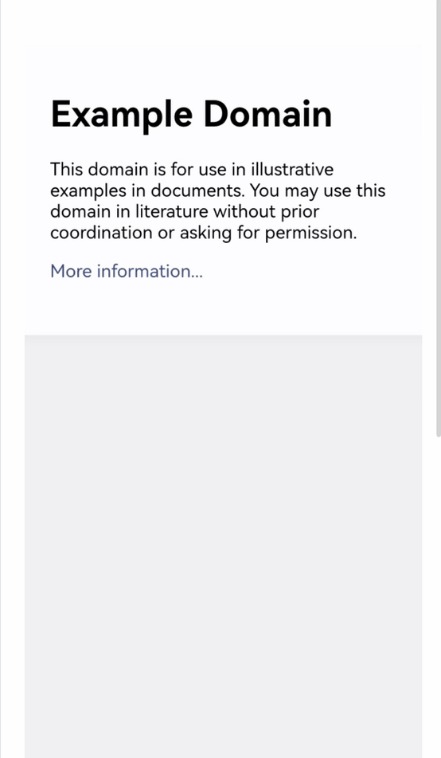

# 使用Web组件的手势与应用交互
在移动端或支持触控的Web应用中，用户通过触摸屏与页面交互，Web组件支持了常见的手势识别，例如长按、滑动、点击等，以支持丰富的用户交互体验。
## ArkWeb手势识别
ArkWeb接收ArkUI的[触摸事件](../ui/arkts-interaction-development-guide-touch-screen.md#触摸事件)，并识别出手势（触摸事件的分发策略详见[交互基础机制说明](../ui/arkts-interaction-basic-principles.md)）。ArkWeb手势符合W3c标准：Touch Events、UI Events、Pointer Events。

常见事件识别说明：
| 手势事件 | 触发条件 |
| --- | --- |
| Tap | 按下并抬起时触发，且间隔较短未触发长按。 |
| LongPress | 按下且不移动，经过一段延迟后触发。 |
| ScrollBegin | 滚动开始时触发。 |
| ScrollUpdate | 滚动时触发，包括抛滑和拖滑。手指未离开屏幕时的滚动为拖滑；若手指离开屏幕时带有速度，离手后页面继续滚动，被称为抛滑。|
| ScrollEnd | 滚动结束时触发。 |
| FlingStart| 滚动过程中手指抬起，且抬手速度足够快，触发了抛滑。|
| FlingCancel| 取消抛滑时触发。 |
| PinchBegin | 捏合开始时触发。 |
| PinchUpdate | 捏合过程中触发。 |
| PinchEnd | 捏合结束时触发。 |

## ArkWeb手势与ArkUI手势
ArkUI提供了[手势绑定](../ui/arkts-gesture-events-binding.md)，Web组件有独立的手势识别，因此需要区分两种手势：
- ArkWeb手势：Web组件接收触摸事件自动生成的手势，这些手势作用于网页上。
- ArkUI手势：Web组件作为通用组件会接收ArkUI手势，ArkUI手势并不直接作用于网页，而作用于Web组件上。

以缩放为例说明两种手势的区别：
- 在Web上使用双指捏合时，Web组件中的内容将会缩放。这是由于ArkWeb识别了Pinch事件并将其作用于网页上。
- 使用三指捏合，Web组件本身会进行缩放。这是因为ArkWeb接收到ArkUI识别出的[PinchGesture](../ui/arkts-gesture-events-single-gesture.md#捏合手势pinchgesture)，执行绑定的回调函数。同时，ArkWeb支持scale方法，能够调整Web组件的缩放比例。

> **说明：** 
>
> 该示例仅用于说明ArkUI手势和ArkWeb手势的区别，不建议使用此方法进行Web组件的缩放。
```ts
// xxx.ets
import { webview } from '@kit.ArkWeb';

@Entry
@Component
struct Index {
  @State scaleValue: number = 1;
  @State pinchValue: number = 1;
  controller: webview.WebviewController = new webview.WebviewController();

  build() {
    Column() {
      Web({ src: 'www.example.com', controller: this.controller })
      // 在组件上绑定缩放比例，可以通过修改缩放比例来实现组件的缩小或者放大
      .scale({ x: this.scaleValue, y: this.scaleValue, z: 1 })
      .zoomAccess(true)
      .gesture(
        // 在组件上绑定三指触发的捏合手势
        PinchGesture({ fingers: 3 })
          .onActionStart((event: GestureEvent|undefined) => {
            console.info('Pinch start');
          })
            // 当捏合手势触发时，可以通过回调函数获取缩放比例，从而修改组件的缩放比例
          .onActionUpdate((event: GestureEvent|undefined) => {
            if(event){
              this.scaleValue = this.pinchValue * event.scale;
              console.info('Pinch update');
            }
          })
          .onActionEnd(() => {
            this.pinchValue = this.scaleValue;
            console.info('Pinch end');
          })
      )
    }
  }
}
```


## Web组件的手势拦截
- ArkUI手势

  ArkWeb会消费部分ArkUI手势，例如[PanGesture](../ui/arkts-gesture-events-single-gesture.md#捏合手势pinchgesture)，若希望自行处理这些手势而非由ArkWeb消费，可以参考ArkUI的[手势拦截](../ui/arkts-gesture-events-gesture-judge.md)。

- ArkWeb手势

  ArkWeb手势的生成需要Web组件接收触摸事件，有两种拦截方案：
  1. 完全禁止触摸事件发送给Web组件，详见[触摸测试](../ui/arkts-interaction-basic-principles.md#触摸测试)。
  2. 发送TouchCancel触摸事件给Web组件，详见[OH_ArkUI_TouchRecognizer_CancelTouch](../reference/apis-arkui/capi-native-gesture-h.md#函数)。


## 常见问题

### 如何禁用缩放手势
Web组件提供了接口[zoomAccess](../reference/apis-arkweb/arkts-basic-components-web-attributes.md#zoomaccess)，控制是否可以缩放。网页上有user-scalable属性也会影响缩放。详见[使用Web组件管理网页缩放](web-scale-zoom.md)。
### Web组件中如何通过手势滑动返回上一个Web页面

**解决措施**

通过重写onBackPress函数来自定义返回逻辑，使用WebviewController判断是否返回上一个Web页面。

**示例代码**

```ts
import web_webview from '@ohos.web.webview';
@Entry
@Component
struct Index {
  controller: web_webview.WebviewController = new web_webview.WebviewController();
  build() {
    Column() {
      Web({ src: 'https://www.example.com', controller: this.controller })//需要手动替换为真实网站
    }
  }
  onBackPress() {
    // 当前页面是否可前进或者后退给定的step步(-1),正数代表前进，负数代表后退
    if (this.controller.accessStep(-1)) {
      this.controller.backward(); // 返回上一个web页
      // 执行用户自定义返回逻辑
      return true
    } else {
      // 执行系统默认返回逻辑，返回上一个page页
      return false
    }
  }
}
```

### 为什么Web加载后网页无法交互？

网页可能基于其他平台的User-Agent进行判断。为解决此问题，可以在Web组件中设置自定义User-Agent，例如：

```ts
import { webview } from '@kit.ArkWeb'

@Entry
@Component
struct Index {
    private webController: webview.WebviewController = new webview.WebviewController()
    build(){
      Column() {
        Web({
          src: 'https://www.example.com',
          controller: this.webController,
        }).onControllerAttached(() => {
          // 自定义User-Agent
          let customUA = 'Mozilla/5.0 (Phone; Android; OpenHarmony 5.0) AppleWebKit/537.36 (KHTML, like Gecko) Chrome/129.0.0.0 Mobile Safari/537.36'
          this.webController.setCustomUserAgent(customUA)
        })
      }
    }
}
```