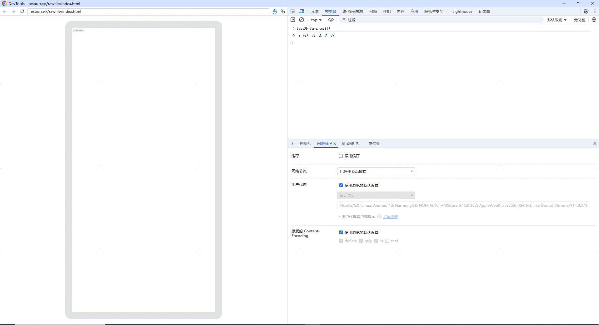

# 前端页面调用应用侧函数

开发者使用Web组件将应用侧代码注册到前端页面中，注册完成之后，前端页面中使用注册的对象名称就可以调用应用侧的方法，实现在前端页面中调用应用侧方法。

## 如何建立应用侧与H5侧的交互通道

注册应用侧代码有两种方式，一种在Web组件初始化调用，使用[javaScriptProxy()](../reference/apis-arkweb/arkts-basic-components-web-attributes.md#javascriptproxy)接口。另外一种在Web组件初始化完成后调用，使用[registerJavaScriptProxy()](../reference/apis-arkweb/arkts-apis-webview-WebviewController.md#registerjavascriptproxy)接口。两种方式都需要和[deleteJavaScriptRegister](../reference/apis-arkweb/arkts-apis-webview-WebviewController.md#deletejavascriptregister)接口配合使用，防止内存泄漏。

在下面的示例中，将test()方法注册在前端页面中， 该函数可以在前端页面触发运行。


- [javaScriptProxy()](../reference/apis-arkweb/arkts-basic-components-web-attributes.md#javascriptproxy)接口使用示例如下。

  ```ts
  // xxx.ets
  import { webview } from '@kit.ArkWeb';
  import { BusinessError } from '@kit.BasicServicesKit';

  class TestClass {
    constructor() {
    }

    test(): string {
      return 'ArkTS Hello World!';
    }
  }

  @Entry
  @Component
  struct WebComponent {
    webviewController: webview.WebviewController = new webview.WebviewController();
    // 声明需要注册的对象
    @State testObj: TestClass = new TestClass();

    build() {
      Column() {
        Button('deleteJavaScriptRegister')
          .onClick(() => {
            try {
              this.webviewController.deleteJavaScriptRegister("testObjName");
            } catch (error) {
              console.error(`ErrorCode: ${(error as BusinessError).code},  Message: ${(error as BusinessError).message}`);
            }
          })
        // Web组件加载本地index.html页面
        Web({ src: $rawfile('index.html'), controller: this.webviewController})
          // 将对象注入到web端
          .javaScriptProxy({
            object: this.testObj,
            name: "testObjName",
            methodList: ["test"],
            controller: this.webviewController,
            // 可选参数
            asyncMethodList: [],
            permission: '{"javascriptProxyPermission":{"urlPermissionList":[{"scheme":"resource","host":"rawfile","port":"","path":""},' +
                        '{"scheme":"e","host":"f","port":"g","path":"h"}],"methodList":[{"methodName":"test","urlPermissionList":' +
                        '[{"scheme":"https","host":"xxx.com","port":"","path":""},{"scheme":"resource","host":"rawfile","port":"","path":""}]},' +
                        '{"methodName":"test11","urlPermissionList":[{"scheme":"q","host":"r","port":"","path":"t"},' +
                        '{"scheme":"u","host":"v","port":"","path":""}]}]}}'
          })
      }
    }
  }
  ```
- 应用侧使用[registerJavaScriptProxy()](../reference/apis-arkweb/arkts-apis-webview-WebviewController.md#registerjavascriptproxy)接口注册示例如下。

  ```ts
  // xxx.ets
  import { webview } from '@kit.ArkWeb';
  import { BusinessError } from '@kit.BasicServicesKit';

  class TestClass {
    constructor() {
    }

    test(): string {
      return "ArkUI Web Component";
    }

    toString(): void {
      console.log('Web Component toString');
    }
  }

  @Entry
  @Component
  struct Index {
    webviewController: webview.WebviewController = new webview.WebviewController();
    @State testObj: TestClass = new TestClass();

    build() {
      Column() {
        Button('refresh')
          .onClick(() => {
            try {
              this.webviewController.refresh();
            } catch (error) {
              console.error(`ErrorCode: ${(error as BusinessError).code},  Message: ${(error as BusinessError).message}`);
            }
          })
        Button('Register JavaScript To Window')
          .onClick(() => {
            try {
              this.webviewController.registerJavaScriptProxy(this.testObj, "testObjName", ["test", "toString"],
                      // 可选参数, asyncMethodList
                      [],
                      // 可选参数, permission
                      '{"javascriptProxyPermission":{"urlPermissionList":[{"scheme":"resource","host":"rawfile","port":"","path":""},' +
                      '{"scheme":"e","host":"f","port":"g","path":"h"}],"methodList":[{"methodName":"test","urlPermissionList":' +
                      '[{"scheme":"https","host":"xxx.com","port":"","path":""},{"scheme":"resource","host":"rawfile","port":"","path":""}]},' +
                      '{"methodName":"test11","urlPermissionList":[{"scheme":"q","host":"r","port":"","path":"t"},' +
                      '{"scheme":"u","host":"v","port":"","path":""}]}]}}'
              );
            } catch (error) {
              console.error(`ErrorCode: ${(error as BusinessError).code},  Message: ${(error as BusinessError).message}`);
            }
          })
        Button('deleteJavaScriptRegister')
          .onClick(() => {
            try {
              this.webviewController.deleteJavaScriptRegister("testObjName");
            } catch (error) {
              console.error(`ErrorCode: ${(error as BusinessError).code},  Message: ${(error as BusinessError).message}`);
            }
          })
        Web({ src: $rawfile('index.html'), controller: this.webviewController })
      }
    }
  }
  ```

  > **说明：**
  >
  > - 使用[registerJavaScriptProxy()](../reference/apis-arkweb/arkts-apis-webview-WebviewController.md#registerjavascriptproxy)方法注册时，注册后需调用[refresh()](../reference/apis-arkweb/arkts-apis-webview-WebviewController.md#refresh)方法生效。

- 可选参数permission是一个json字符串，示例如下：
  ```json
  {
    "javascriptProxyPermission": {
      "urlPermissionList": [       // Object级权限，如果匹配，所有Method都授权
        {
          "scheme": "resource",    // 精确匹配，不能为空，必填
          "host": "rawfile",       // 精确匹配，不能为空，必填
          "port": "",              // 精确匹配，为空不检查，必填
          "path": ""               // 前缀匹配，为空不检查，必填
        },
        {
          "scheme": "https",       // 精确匹配，不能为空，必填
          "host": "xxx.com",       // 精确匹配，不能为空，必填
          "port": "8080",          // 精确匹配，为空不检查，必填
          "path": "a/b/c"          // 前缀匹配，为空不检查，必填
        }
      ],
      "methodList": [
        {
          "methodName": "test",
          "urlPermissionList": [   // Method级权限
            {
              "scheme": "https",   // 精确匹配，不能为空，必填
              "host": "xxx.com",   // 精确匹配，不能为空，必填
              "port": "",          // 精确匹配，为空不检查，必填
              "path": ""           // 前缀匹配，为空不检查，必填
            },
            {
              "scheme": "resource",// 精确匹配，不能为空，必填
              "host": "rawfile",   // 精确匹配，不能为空，必填
              "port": "",          // 精确匹配，为空不检查，必填
              "path": ""           // 前缀匹配，为空不检查，必填
            }
          ]
        },
        {
          "methodName": "test11",
          "urlPermissionList": [   // Method级权限
            {
              "scheme": "q",       // 精确匹配，不能为空，必填
              "host": "r",         // 精确匹配，不能为空，必填
              "port": "",          // 精确匹配，为空不检查，必填
              "path": "t"          // 前缀匹配，为空不检查，必填
            },
            {
              "scheme": "u",       // 精确匹配，不能为空，必填
              "host": "v",         // 精确匹配，不能为空，必填
              "port": "",          // 精确匹配，为空不检查，必填
              "path": ""           // 前缀匹配，为空不检查，必填
            }
          ]
        }
      ]
    }
  }
  ```

- index.html前端页面触发应用侧代码。

  ```html
  <!-- index.html -->
  <!DOCTYPE html>
  <html>
  <body>
  <button type="button" onclick="callArkTS()">Click Me!</button>
  <p id="demo"></p>
  <script>
      function callArkTS() {
          let str = testObjName.test();
          document.getElementById("demo").innerHTML = str;
          console.info('ArkTS Hello World! :' + str);
      }
  </script>
  </body>
  </html>
  ```
## 复杂类型使用方法

### 应用侧和前端页面之间传递Array

 Array可以作为注册对象方法的参数或返回值，在应用侧和前端页面之间传递。
  ```ts
  // xxx.ets
  import { webview } from '@kit.ArkWeb';
  import { BusinessError } from '@kit.BasicServicesKit';

  class TestClass {
    constructor() {
    }

    test(): Array<Number> {
      return [1, 2, 3, 4]
    }

    toString(param: String): void {
      console.log('Web Component toString' + param);
    }
  }

  @Entry
  @Component
  struct Index {
    webviewController: webview.WebviewController = new webview.WebviewController();
    @State testObj: TestClass = new TestClass();

    build() {
      Column() {
        Button('refresh')
          .onClick(() => {
            try {
              this.webviewController.refresh();
            } catch (error) {
              console.error(`ErrorCode: ${(error as BusinessError).code},  Message: ${(error as BusinessError).message}`);
            }
          })
        Button('Register JavaScript To Window')
          .onClick(() => {
            try {
              this.webviewController.registerJavaScriptProxy(this.testObj, "testObjName", ["test", "toString"]);
            } catch (error) {
              console.error(`ErrorCode: ${(error as BusinessError).code},  Message: ${(error as BusinessError).message}`);
            }
          })
        Button('deleteJavaScriptRegister')
          .onClick(() => {
            try {
              this.webviewController.deleteJavaScriptRegister("testObjName");
            } catch (error) {
              console.error(`ErrorCode: ${(error as BusinessError).code},  Message: ${(error as BusinessError).message}`);
            }
          })
        Web({ src: $rawfile('index.html'), controller: this.webviewController })
      }
    }
  }
  ```

  ```html
  <!-- index.html -->
  <!DOCTYPE html>
  <html>
  <body>
  <button type="button" onclick="callArkTS()">Click Me!</button>
  <p id="demo"></p>
  <script>
      function callArkTS() {
          testObjName.toString(testObjName.test());
      }
  </script>
  </body>
  </html>
  ```

### 非Function等复杂类型使用

  非Function等复杂类型作为注册对象方法的参数或返回值，在应用侧和前端页面之间传递。
  ```ts
  // xxx.ets
  import { webview } from '@kit.ArkWeb';
  import { BusinessError } from '@kit.BasicServicesKit';

  class Student {
    name: string = '';
    age: string = '';
  }

  class TestClass {
    constructor() {
    }

    // 传递的基础类型name:"jeck", age:"12"。
    test(): Student {
      let st: Student = { name: "jeck", age: "12" };
      return st;
    }

    toString(param: ESObject): void {
      console.log('Web Component toString' + param["name"]);
    }
  }

  @Entry
  @Component
  struct Index {
    webviewController: webview.WebviewController = new webview.WebviewController();
    @State testObj: TestClass = new TestClass();

    build() {
      Column() {
        Button('refresh')
          .onClick(() => {
            try {
              this.webviewController.refresh();
            } catch (error) {
              console.error(`ErrorCode: ${(error as BusinessError).code},  Message: ${(error as BusinessError).message}`);
            }
          })
        Button('Register JavaScript To Window')
          .onClick(() => {
            try {
              this.webviewController.registerJavaScriptProxy(this.testObj, "testObjName", ["test", "toString"]);
            } catch (error) {
              console.error(`ErrorCode: ${(error as BusinessError).code},  Message: ${(error as BusinessError).message}`);
            }
          })
        Button('deleteJavaScriptRegister')
          .onClick(() => {
            try {
              this.webviewController.deleteJavaScriptRegister("testObjName");
            } catch (error) {
              console.error(`ErrorCode: ${(error as BusinessError).code},  Message: ${(error as BusinessError).message}`);
            }
          })
        Web({ src: $rawfile('index.html'), controller: this.webviewController })
      }
    }
  }
  ```

  ```html
  <!-- index.html -->
  <!DOCTYPE html>
  <html>
  <body>
  <button type="button" onclick="callArkTS()">Click Me!</button>
  <p id="demo"></p>
  <script>
      function callArkTS() {
          testObjName.toString(testObjName.test());
      }
  </script>
  </body>
  </html>
  ```
### 应用侧调用前端页面的Callback

  Callback可以作为注册对象方法的参数或返回值，在应用侧和前端页面之间传递。
  ```ts
  // xxx.ets
  import { webview } from '@kit.ArkWeb';
  import { BusinessError } from '@kit.BasicServicesKit';

  class TestClass {
    constructor() {
    }

    test(param: Function): void {
      param("call callback");
    }

    toString(param: String): void {
      console.log('Web Component toString' + param);
    }
  }

  @Entry
  @Component
  struct Index {
    webviewController: webview.WebviewController = new webview.WebviewController();
    @State testObj: TestClass = new TestClass();

    build() {
      Column() {
        Button('refresh')
          .onClick(() => {
            try {
              this.webviewController.refresh();
            } catch (error) {
              console.error(`ErrorCode: ${(error as BusinessError).code},  Message: ${(error as BusinessError).message}`);
            }
          })
        Button('Register JavaScript To Window')
          .onClick(() => {
            try {
              this.webviewController.registerJavaScriptProxy(this.testObj, "testObjName", ["test", "toString"]);
            } catch (error) {
              console.error(`ErrorCode: ${(error as BusinessError).code},  Message: ${(error as BusinessError).message}`);
            }
          })
        Button('deleteJavaScriptRegister')
          .onClick(() => {
            try {
              this.webviewController.deleteJavaScriptRegister("testObjName");
            } catch (error) {
              console.error(`ErrorCode: ${(error as BusinessError).code},  Message: ${(error as BusinessError).message}`);
            }
          })
        Web({ src: $rawfile('index.html'), controller: this.webviewController })
      }
    }
  }
  ```

  ```html
  <!-- index.html -->
  <!DOCTYPE html>
  <html>
  <body>
  <button type="button" onclick="callArkTS()">Click Me!</button>
  <p id="demo"></p>
  <script>
      function callArkTS() {
          testObjName.test(function(param){testObjName.toString(param)});
      }
  </script>
  </body>
  </html>
  ```
### 应用侧调用前端页面Object里的Function

  前端页面Object里的Function可以作为注册对象方法的参数或返回值，在应用侧和前端页面之间传递。
  ```ts
  // xxx.ets
  import { webview } from '@kit.ArkWeb';
  import { BusinessError } from '@kit.BasicServicesKit';

  class TestClass {
    constructor() {
    }

    test(param: ESObject): void {
      param.hello("call obj func");
    }

    toString(param: String): void {
      console.log('Web Component toString' + param);
    }
  }

  @Entry
  @Component
  struct Index {
    webviewController: webview.WebviewController = new webview.WebviewController();
    @State testObj: TestClass = new TestClass();

    build() {
      Column() {
        Button('refresh')
          .onClick(() => {
            try {
              this.webviewController.refresh();
            } catch (error) {
              console.error(`ErrorCode: ${(error as BusinessError).code},  Message: ${(error as BusinessError).message}`);
            }
          })
        Button('Register JavaScript To Window')
          .onClick(() => {
            try {
              this.webviewController.registerJavaScriptProxy(this.testObj, "testObjName", ["test", "toString"]);
            } catch (error) {
              console.error(`ErrorCode: ${(error as BusinessError).code},  Message: ${(error as BusinessError).message}`);
            }
          })
        Button('deleteJavaScriptRegister')
          .onClick(() => {
            try {
              this.webviewController.deleteJavaScriptRegister("testObjName");
            } catch (error) {
              console.error(`ErrorCode: ${(error as BusinessError).code},  Message: ${(error as BusinessError).message}`);
            }
          })
        Web({ src: $rawfile('index.html'), controller: this.webviewController })
      }
    }
  }
  ```

  ```html
  <!-- index.html -->
  <!DOCTYPE html>
  <html>
  <body>
  <button type="button" onclick="callArkTS()">Click Me!</button>
  <p id="demo"></p>
  <script>
      // 写法1
      class Student {
          constructor(nameList) {
              this.methodNameListForJsProxy = nameList;
          }

          hello(param) {
              testObjName.toString(param)
          }
      }
      var st = new Student(["hello"])

      // 写法2
      //创建一个构造器，构造函数首字母大写
      function Obj1(){
          this.methodNameListForJsProxy=["hello"];
          this.hello=function(param){
              testObjName.toString(param)
          };
      }
      //利用构造器，通过new关键字生成对象
      var st1 = new Obj1();

      function callArkTS() {
          testObjName.test(st);
          testObjName.test(st1);
      }
  </script>
  </body>
  </html>
  ```

### 前端页面调用应用侧Object里的Function

  应用侧Object里的Function可以作为注册对象方法的参数或返回值，在应用侧和前端页面之间传递。
  ```ts
  // xxx.ets
  import { webview } from '@kit.ArkWeb';
  import { BusinessError } from '@kit.BasicServicesKit';

  class ObjOther {
    methodNameListForJsProxy: string[]

    constructor(list: string[]) {
      this.methodNameListForJsProxy = list
    }

    testOther(json: string): void {
      console.info(json)
    }
  }

  class TestClass {
    ObjReturn: ObjOther

    constructor() {
      this.ObjReturn = new ObjOther(["testOther"]);
    }

    test(): ESObject {
      return this.ObjReturn
    }

    toString(param: string): void {
      console.log('Web Component toString' + param);
    }
  }

  @Entry
  @Component
  struct Index {
    webviewController: webview.WebviewController = new webview.WebviewController();
    @State testObj: TestClass = new TestClass();

    build() {
      Column() {
        Button('refresh')
          .onClick(() => {
            try {
              this.webviewController.refresh();
            } catch (error) {
              console.error(`ErrorCode: ${(error as BusinessError).code},  Message: ${(error as BusinessError).message}`);
            }
          })
        Button('Register JavaScript To Window')
          .onClick(() => {
            try {
              this.webviewController.registerJavaScriptProxy(this.testObj, "testObjName", ["test", "toString"]);
            } catch (error) {
              console.error(`ErrorCode: ${(error as BusinessError).code},  Message: ${(error as BusinessError).message}`);
            }
          })
        Button('deleteJavaScriptRegister')
          .onClick(() => {
            try {
              this.webviewController.deleteJavaScriptRegister("testObjName");
            } catch (error) {
              console.error(`ErrorCode: ${(error as BusinessError).code},  Message: ${(error as BusinessError).message}`);
            }
          })
        Web({ src: $rawfile('index.html'), controller: this.webviewController })
      }
    }
  }
  ```

  ```html
  <!-- index.html -->
  <!DOCTYPE html>
  <html>
  <body>
  <button type="button" onclick="callArkTS()">Click Me!</button>
  <p id="demo"></p>
  <script>
      function callArkTS() {
        testObjName.test().testOther("call other object func");
      }
  </script>
  </body>
  </html>
  ```

### Promise场景

  第一种使用方法，在应用侧new Promise，将Promise作为对象方法的参数或返回值，向前端页面传递。
  ```ts
  // xxx.ets
  import { webview } from '@kit.ArkWeb';
  import { BusinessError } from '@kit.BasicServicesKit';

  class TestClass {
    constructor() {
    }

    test(): Promise<string> {
      let p: Promise<string> = new Promise((resolve, reject) => {
        setTimeout(() => {
          console.log('执行完成');
          reject('fail');
        }, 10000);
      });
      return p;
    }

    toString(param: String): void {
      console.log(" " + param);
    }
  }

  @Entry
  @Component
  struct Index {
    webviewController: webview.WebviewController = new webview.WebviewController();
    @State testObj: TestClass = new TestClass();

    build() {
      Column() {
        Button('refresh')
          .onClick(() => {
            try {
              this.webviewController.refresh();
            } catch (error) {
              console.error(`ErrorCode: ${(error as BusinessError).code},  Message: ${(error as BusinessError).message}`);
            }
          })
        Button('Register JavaScript To Window')
          .onClick(() => {
            try {
              this.webviewController.registerJavaScriptProxy(this.testObj, "testObjName", ["test", "toString"]);
            } catch (error) {
              console.error(`ErrorCode: ${(error as BusinessError).code},  Message: ${(error as BusinessError).message}`);
            }
          })
        Button('deleteJavaScriptRegister')
          .onClick(() => {
            try {
              this.webviewController.deleteJavaScriptRegister("testObjName");
            } catch (error) {
              console.error(`ErrorCode: ${(error as BusinessError).code},  Message: ${(error as BusinessError).message}`);
            }
          })
        Web({ src: $rawfile('index.html'), controller: this.webviewController })
      }
    }
  }
  ```

  ```html
  <!-- index.html -->
  <!DOCTYPE html>
  <html>
  <body>
  <button type="button" onclick="callArkTS()">Click Me!</button>
  <p id="demo"></p>
  <script>
      function callArkTS() {
        testObjName.test().then((param)=>{testObjName.toString(param)}).catch((param)=>{testObjName.toString(param)})
      }
  </script>
  </body>
  </html>
  ```
  第二种使用方法，在前端页面new Promise，将Promise作为对象方法的参数或返回值，向应用侧传递。
  ```ts
  // xxx.ets
  import { webview } from '@kit.ArkWeb';
  import { BusinessError } from '@kit.BasicServicesKit';

  class TestClass {
    constructor() {
    }

    test(param:Function): void {
      setTimeout( () => { param("suc") }, 10000)
    }

    toString(param:String): void {
      console.log(" " + param);
    }
  }

  @Entry
  @Component
  struct Index {
    webviewController: webview.WebviewController = new webview.WebviewController();
    @State testObj: TestClass = new TestClass();

    build() {
      Column() {
        Button('refresh')
          .onClick(() => {
            try {
              this.webviewController.refresh();
            } catch (error) {
              console.error(`ErrorCode: ${(error as BusinessError).code},  Message: ${(error as BusinessError).message}`);
            }
          })
        Button('Register JavaScript To Window')
          .onClick(() => {
            try {
              this.webviewController.registerJavaScriptProxy(this.testObj, "testObjName", ["test", "toString"]);
            } catch (error) {
              console.error(`ErrorCode: ${(error as BusinessError).code},  Message: ${(error as BusinessError).message}`);
            }
          })
        Button('deleteJavaScriptRegister')
          .onClick(() => {
            try {
              this.webviewController.deleteJavaScriptRegister("testObjName");
            } catch (error) {
              console.error(`ErrorCode: ${(error as BusinessError).code},  Message: ${(error as BusinessError).message}`);
            }
          })
        Web({ src: $rawfile('index.html'), controller: this.webviewController })
      }
    }
  }
  ```

  ```html
  <!-- index.html -->
  <!DOCTYPE html>
  <html>
  <body>
  <button type="button" onclick="callArkTS()">Click Me!</button>
  <p id="demo"></p>
  <script>
      function callArkTS() {
        let funpromise
        var p = new Promise(function(resolve, reject){funpromise=(param)=>{resolve(param)}})
        testObjName.test(funpromise)
        p.then((param)=>{testObjName.toString(param)})
      }
  </script>
  </body>
  </html>
  ```
## 验证通道是否建立成功

1. 打开web调试。

   开启web调试请参考[使用DevTools工具调试前端页面](web-debugging-with-devtools.md)。

2. 举例说明通道是否建立成功。

   使用[复杂类型使用方法](#复杂类型使用方法)中应用侧和前端页面之间传递Array作为示例，调试结果如下图所示：

   