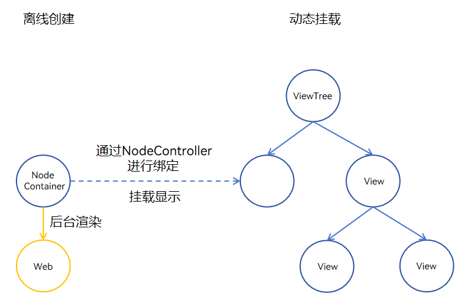

# 使用离线Web组件
<!--Kit: ArkWeb-->
<!--Subsystem: ArkWeb-->
<!--Owner: @wang-yanhan-->
<!--SE: @qianlf-->
<!--TSE: @ghiker-->

Web组件能够实现在不同窗口的组件树上进行挂载或移除操作，这一能力使得开发者可以预先创建Web组件，从而实现性能优化。例如，Tab页为Web组件时，页面预先渲染，便于即时显示。

离线Web组件基于自定义占位组件[NodeContainer](../reference/apis-arkui/arkui-ts/ts-basic-components-nodecontainer.md)实现。基本原理是构建支持命令式创建的Web组件，此类组件创建后不会立即挂载到组件树中，状态为Hidden和InActive，因此不会立即对用户呈现。开发者可以在后续使用中按需动态挂载这些组件，以实现更灵活的使用方式。

使用离线Web组件可以预启动渲染进程和预渲染Web页面。

- 预启动渲染进程：在未进入Web页面时，提前创建空Web组件，启动Web的渲染进程，为后续使用做好准备。
- 预渲染Web页面：在Web页面启动或跳转的场景下，预先在后台创建Web组件，加载数据并完成渲染，从而在Web页面启动或跳转时实现快速显示。

## 整体架构

如下图所示，在需要离屏创建Web组件时，定义一个自定义组件以封装Web组件，此Web组件在离线状态下被创建，封装于无状态的[NodeContainer](../reference/apis-arkui/arkui-ts/ts-basic-components-nodecontainer.md)节点中，并与相应的[NodeController](../reference/apis-arkui/js-apis-arkui-nodeController.md)组件绑定。Web组件在后台预渲染完毕后，当需要展示时，通过[NodeController](../reference/apis-arkui/js-apis-arkui-nodeController.md)将其挂载到ViewTree的[NodeContainer](../reference/apis-arkui/arkui-ts/ts-basic-components-nodecontainer.md)中，即与对应的[NodeContainer](../reference/apis-arkui/arkui-ts/ts-basic-components-nodecontainer.md)组件绑定，即可挂载上树并显示。



## 创建离线Web组件

本示例展示了如何预先创建离线Web组件，并在需要的时候进行挂载和显示。在后续内容中，预启动渲染进程和预渲染Web页面作为性能优化措施，均利用离线Web组件实现。

> **说明：**
>
> 创建Web组件将占用内存（每个Web组件大约200MB）和计算资源，建议避免一次性创建大量离线Web组件，以减少资源消耗。

```ts
// 载体Ability
// EntryAbility.ets
import { createNWeb } from '../pages/common'
onWindowStageCreate(windowStage: window.WindowStage): void {
  windowStage.loadContent('pages/Index', (err, data) => {
    let windowClass: window.Window = windowStage.getMainWindowSync(); // Obtain the main window of the application.
    if (!windowClass) {
      console.info('windowClass is null');
      return;
    }
    // 创建Web动态组件（需传入UIContext），loadContent之后的任意时机均可创建
    createNWeb("https://www.example.com", windowClass.getUIContext());
    if (err && err.code) {
      return;
    }
  });
}
```

```ts
// 创建NodeController
// common.ets
import { UIContext, NodeController, BuilderNode, Size, FrameNode } from '@kit.ArkUI';
import { webview } from '@kit.ArkWeb';

// @Builder中为动态组件的具体组件内容
// Data为入参封装类
class Data{
  url: ResourceStr = "https://www.example.com";
  controller: webview.WebviewController = new webview.WebviewController();
}

@Builder
function WebBuilder(data:Data) {
  Column() {
    Web({ src: data.url, controller: data.controller })
      .width("100%")
      .height("100%")
  }
}

let wrap = wrapBuilder<Data[]>(WebBuilder);

// 用于控制和反馈对应的NodeContainer上的节点的行为，需要与NodeContainer一起使用
export class myNodeController extends NodeController {
  private rootnode: BuilderNode<Data[]> | null = null;
  // 必须要重写的方法，用于构建节点数、返回节点挂载在对应NodeContainer中
  // 在对应NodeContainer创建的时候调用、或者通过rebuild方法调用刷新
  makeNode(uiContext: UIContext): FrameNode | null {
    console.log(" uicontext is undefined : "+ (uiContext === undefined));
    if (this.rootnode != null) {
      // 返回FrameNode节点
      return this.rootnode.getFrameNode();
    }
    // 返回null控制动态组件脱离绑定节点
    return null;
  }
  // 当布局大小发生变化时进行回调
  aboutToResize(size: Size) {
    console.log("aboutToResize width : " + size.width  +  " height : " + size.height );
  }

  // 当controller对应的NodeContainer在Appear的时候进行回调
  aboutToAppear() {
    console.log("aboutToAppear");
  }

  // 当controller对应的NodeContainer在Disappear的时候进行回调
  aboutToDisappear() {
    console.log("aboutToDisappear");
  }

  // 此函数为自定义函数，可作为初始化函数使用
  // 通过UIContext初始化BuilderNode，再通过BuilderNode中的build接口初始化@Builder中的内容
  initWeb(url:ResourceStr, uiContext:UIContext, control:webview.WebviewController) {
    if(this.rootnode != null)
    {
      return;
    }
    // 创建节点，需要uiContext
    this.rootnode = new BuilderNode(uiContext);
    // 创建动态Web组件
    this.rootnode.build(wrap, { url:url, controller:control });
  }
}
// 创建Map保存所需要的NodeController
let NodeMap:Map<ResourceStr, myNodeController | undefined> = new Map();
// 创建Map保存所需要的WebViewController
let controllerMap:Map<ResourceStr, webview.WebviewController | undefined> = new Map();

// 初始化需要UIContext，需在Ability获取
export const createNWeb = (url: ResourceStr, uiContext: UIContext) => {
  // 创建NodeController
  let baseNode = new myNodeController();
  let controller = new webview.WebviewController() ;
  // 初始化自定义Web组件
  baseNode.initWeb(url, uiContext, controller);
  controllerMap.set(url, controller)
  NodeMap.set(url, baseNode);
}
// 自定义获取NodeController接口
export const getNWeb = (url: ResourceStr) : myNodeController | undefined => {
  return NodeMap.get(url);
}
```

```ts
// 使用NodeController的Page页
// Index.ets
import { getNWeb } from './common'
@Entry
@Component
struct Index {
  build() {
    Row() {
      Column() {
        // NodeContainer用于与NodeController节点绑定，rebuild会触发makeNode
        // Page页通过NodeContainer接口绑定NodeController，实现动态组件页面显示
        NodeContainer(getNWeb("https://www.example.com"))
          .height("90%")
          .width("100%")
      }
      .width('100%')
    }
    .height('100%')
  }
}
```

## 预启动渲染进程

在后台预先创建一个Web组件，以启动用于渲染的Web渲染进程，这样可以节省后续Web组件加载时启动Web渲染进程所需的时间。

> **说明：**
>
> 仅在采用单渲染进程模式的应用中，即全局共享一个Web渲染进程时，优化效果显著。Web渲染进程仅在所有Web组件都被销毁后才会终止。因此，建议应用至少保持一个Web组件处于活动状态。
> 创建额外的Web组件会产生内存开销。

示例在onWindowStageCreate时预创建Web组件加载blank页面，提前启动Render进程，从index跳转到index2时，优化了Web渲染进程启动和初始化的耗时。

```ts
// 载体Ability
// EntryAbility.ets
import { createNWeb } from '../pages/common'
onWindowStageCreate(windowStage: window.WindowStage): void {
  windowStage.loadContent('pages/Index', (err, data) => {
    let windowClass: window.Window = windowStage.getMainWindowSync(); // Obtain the main window of the application.
    if (!windowClass) {
      console.info('windowClass is null');
      return;
    }
    // 创建空的Web动态组件（需传入UIContext），loadContent之后的任意时机均可创建
    createNWeb("about:blank", windowClass.getUIContext());
    if (err && err.code) {
      return;
    }
  });
}
```

```ts
// 创建NodeController
// common.ets
import { UIContext, NodeController, BuilderNode, Size, FrameNode } from '@kit.ArkUI';
import { webview } from '@kit.ArkWeb';

// @Builder中为动态组件的具体组件内容
// Data为入参封装类
class Data{
  url: ResourceStr = "https://www.example.com";
  controller: webview.WebviewController = new webview.WebviewController();
}

@Builder
function WebBuilder(data:Data) {
  Column() {
    Web({ src: data.url, controller: data.controller })
      .width("100%")
      .height("100%")
  }
}

let wrap = wrapBuilder<Data[]>(WebBuilder);

// 用于控制和反馈对应的NodeContainer上的节点的行为，需要与NodeContainer一起使用
export class myNodeController extends NodeController {
  private rootnode: BuilderNode<Data[]> | null = null;
  // 必须要重写的方法，用于构建节点数、返回节点挂载在对应NodeContainer中
  // 在对应NodeContainer创建的时候调用、或者通过rebuild方法调用刷新
  makeNode(uiContext: UIContext): FrameNode | null {
    console.log(" uicontext is undefined : "+ (uiContext === undefined));
    if (this.rootnode != null) {
      // 返回FrameNode节点
      return this.rootnode.getFrameNode();
    }
    // 返回null控制动态组件脱离绑定节点
    return null;
  }
  // 当布局大小发生变化时进行回调
  aboutToResize(size: Size) {
    console.log("aboutToResize width : " + size.width  +  " height : " + size.height );
  }

  // 当controller对应的NodeContainer在Appear的时候进行回调
  aboutToAppear() {
    console.log("aboutToAppear");
  }

  // 当controller对应的NodeContainer在Disappear的时候进行回调
  aboutToDisappear() {
    console.log("aboutToDisappear");
  }

  // 此函数为自定义函数，可作为初始化函数使用
  // 通过UIContext初始化BuilderNode，再通过BuilderNode中的build接口初始化@Builder中的内容
  initWeb(url:ResourceStr, uiContext:UIContext, control:webview.WebviewController) {
    if(this.rootnode != null)
    {
      return;
    }
    // 创建节点，需要uiContext 
    this.rootnode = new BuilderNode(uiContext);
    // 创建动态Web组件
    this.rootnode.build(wrap, { url:url, controller:control });
  }
}
// 创建Map保存所需要的NodeController
let NodeMap:Map<ResourceStr, myNodeController | undefined> = new Map();
// 创建Map保存所需要的WebViewController
let controllerMap:Map<ResourceStr, webview.WebviewController | undefined> = new Map();

// 初始化需要UIContext 需在Ability获取
export const createNWeb = (url: ResourceStr, uiContext: UIContext) => {
  // 创建NodeController
  let baseNode = new myNodeController();
  let controller = new webview.WebviewController();
  // 初始化自定义Web组件
  baseNode.initWeb(url, uiContext, controller);
  controllerMap.set(url, controller)
  NodeMap.set(url, baseNode);
}
// 自定义获取NodeController接口
export const getNWeb = (url: ResourceStr) : myNodeController | undefined => {
  return NodeMap.get(url);
}
```

```ts
// index.ets
import { webview } from '@kit.ArkWeb';

@Entry
@Component
struct Index1 {
  webviewController: webview.WebviewController = new webview.WebviewController();
  
  build() {
    Column() {
      //已经预启动Render进程 
      Button("跳转到Web页面").onClick(()=>{
        this.getUIContext().getRouter().pushUrl({url: "pages/index2"});
      })
        .width('100%')
        .height('100%')
    }
  }
}
```

```ts
// index2.ets
import { webview } from '@kit.ArkWeb';

@Entry
@Component
struct index2 {
  webviewController: webview.WebviewController = new webview.WebviewController();
  
  build() {
    Row() {
      Column() {
        Web({src: 'https://www.example.com', controller: this.webviewController})
          .width('100%')
          .height('100%')
      }
      .width('100%')
    }
    .height('100%')
  }
}
```

## 预渲染Web页面

预渲染Web页面优化方案适用于Web页面启动和跳转场景，例如，进入首页后，跳转到其他子页。建议在高命中率的页面使用该方案。

预渲染Web页面的实现是提前创建离线Web组件，设置Web为Active状态来开启渲染引擎，进行后台渲染。

> **说明：**
>
> 1. 预渲染Web页面时，需要明确加载的资源。
> 2. 由于该方案会将不可见的后台Web设置为Active状态，建议不要预渲染包含自动播放音视频的页面。应用开发者请自行检查和管理页面行为。
> 3. 预渲染的网页会在后台不断进行渲染，建议在预渲染完成后立即停止渲染，以防止发热和功耗问题。可以参考以下示例，使用 [onFirstMeaningfulPaint](../reference/apis-arkweb/arkts-basic-components-web-events.md#onfirstmeaningfulpaint12) 来确定停止时机，该接口适用于http和https网页。

```ts
// 载体Ability
// EntryAbility.ets
import {createNWeb} from '../pages/common';
import { UIAbility } from '@kit.AbilityKit';
import { window } from '@kit.ArkUI';

export default class EntryAbility extends UIAbility {
  onWindowStageCreate(windowStage: window.WindowStage): void {
    windowStage.loadContent('pages/Index', (err, data) => {
      let windowClass: window.Window = windowStage.getMainWindowSync(); // Obtain the main window of the application.
      if (!windowClass) {
        console.info('windowClass is null');
        return;
      }
      // 创建ArkWeb动态组件（需传入UIContext），loadContent之后的任意时机均可创建
      createNWeb("https://www.example.com", windowClass.getUIContext());
      if (err && err.code) {
        return;
      }
    });
  }
}
```

```ts
// 创建NodeController
// common.ets
import { UIContext } from '@kit.ArkUI';
import { webview } from '@kit.ArkWeb';
import { NodeController, BuilderNode, Size, FrameNode }  from '@kit.ArkUI';
// @Builder中为动态组件的具体组件内容
// Data为入参封装类
class Data{
  url: string = 'https://www.example.com';
  controller: webview.WebviewController = new webview.WebviewController();
}
// 通过布尔变量shouldInactive控制网页在后台完成预渲染后停止渲染
let shouldInactive: boolean = true;
@Builder
function WebBuilder(data:Data) {
  Column() {
    Web({ src: data.url, controller: data.controller })
      .onPageBegin(() => {
        // 调用onActive，开启渲染
        data.controller.onActive();
      })
      .onFirstMeaningfulPaint(() =>{
        if (!shouldInactive) {
          return;
        }
        // 在预渲染完成时触发，停止渲染
        data.controller.onInactive();
        shouldInactive = false;
      })
      .width("100%")
      .height("100%")
  }
}
let wrap = wrapBuilder<Data[]>(WebBuilder);
// 用于控制和反馈对应的NodeContainer上的节点的行为，需要与NodeContainer一起使用
export class myNodeController extends NodeController {
  private rootnode: BuilderNode<Data[]> | null = null;
  // 必须要重写的方法，用于构建节点数、返回节点挂载在对应NodeContainer中
  // 在对应NodeContainer创建的时候调用、或者通过rebuild方法调用刷新
  makeNode(uiContext: UIContext): FrameNode | null {
    console.info(" uicontext is undefined : "+ (uiContext === undefined));
    if (this.rootnode != null) {
      // 返回FrameNode节点
      return this.rootnode.getFrameNode();
    }
    // 返回null控制动态组件脱离绑定节点
    return null;
  }
  // 当布局大小发生变化时进行回调
  aboutToResize(size: Size) {
    console.info("aboutToResize width : " + size.width  +  " height : " + size.height )
  }
  // 当controller对应的NodeContainer在Appear的时候进行回调
  aboutToAppear() {
    console.info("aboutToAppear")
    // 切换到前台后，不需要停止渲染
    shouldInactive = false;
  }
  // 当controller对应的NodeContainer在Disappear的时候进行回调
  aboutToDisappear() {
    console.info("aboutToDisappear")
  }
  // 此函数为自定义函数，可作为初始化函数使用
  // 通过UIContext初始化BuilderNode，再通过BuilderNode中的build接口初始化@Builder中的内容
  initWeb(url:string, uiContext:UIContext, control:webview.WebviewController) {
    if(this.rootnode != null)
    {
      return;
    }
    // 创建节点，需要uiContext
    this.rootnode = new BuilderNode(uiContext)
    // 创建动态Web组件
    this.rootnode.build(wrap, { url:url, controller:control })
  }
}
// 创建Map保存所需要的NodeController
let NodeMap:Map<string, myNodeController | undefined> = new Map();
// 创建Map保存所需要的WebViewController
let controllerMap:Map<string, webview.WebviewController | undefined> = new Map();
// 初始化需要UIContext 需在Ability获取
export const createNWeb = (url: string, uiContext: UIContext) => {
  // 创建NodeController
  let baseNode = new myNodeController();
  let controller = new webview.WebviewController() ;
  // 初始化自定义Web组件
  baseNode.initWeb(url, uiContext, controller);
  controllerMap.set(url, controller)
  NodeMap.set(url, baseNode);
}
// 自定义获取NodeController接口
export const getNWeb = (url : string) : myNodeController | undefined => {
  return NodeMap.get(url);
}
```

```ts
// 使用NodeController的Page页
// Index.ets
import {createNWeb, getNWeb} from './common';

@Entry
@Component
struct Index {
  build() {
    Row() {
      Column() {
        // NodeContainer用于与NodeController节点绑定，rebuild会触发makeNode
        // Page页通过NodeContainer接口绑定NodeController，实现动态组件页面显示
        NodeContainer(getNWeb("https://www.example.com"))
          .height("90%")
          .width("100%")
      }
      .width('100%')
    }
    .height('100%')
  }
}
```

## 常见白屏问题排查

1.排查应用上网权限配置。

检查是否已在module.json5中添加网络权限，添加方法请参考在[配置文件中声明权限](../security/AccessToken/declare-permissions.md)。

```ts
"requestPermissions":[
    {
      "name" : "ohos.permission.INTERNET"
    }
  ]
```

2.排查[NodeContainer](../reference/apis-arkui/arkui-ts/ts-basic-components-nodecontainer.md)与节点绑定的逻辑。

检查节点是否已上组件树，建议在已有的Web组件上方加上Text（请参考以下例子），如果白屏的时候没有出现Text，建议检查[NodeContainer](../reference/apis-arkui/arkui-ts/ts-basic-components-nodecontainer.md)与节点绑定的情况。

```ts
@Builder
function WebBuilder(data:Data) {
  Column() {
    Text('test')
    Web({ src: data.url, controller: data.controller })
      .width("100%")
      .height("100%")
  }
}
```

3.排查Web可见性状态。

如果整个节点已上树，可通过日志[WebPattern::OnVisibleAreaChange](../reference/apis-arkui/arkui-ts/ts-universal-component-visible-area-change-event.md#onvisibleareachange)查看Web组件可见性状态是否正确，不可见的Web组件可能会造成白屏。