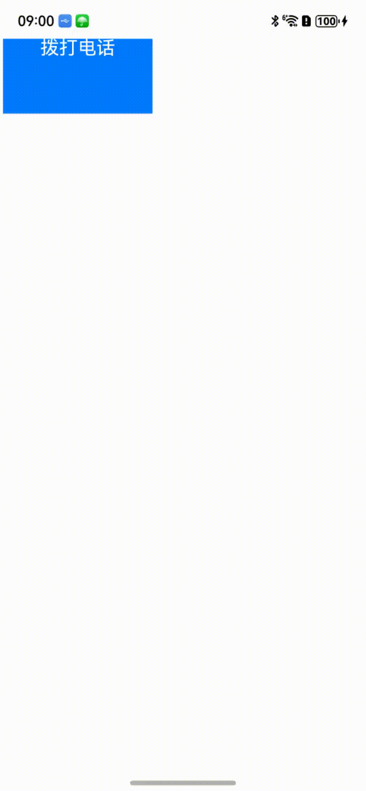

# 管理页面跳转及浏览记录导航
<!--Kit: ArkWeb-->
<!--Subsystem: Web-->
<!--Owner: @aohui-->
<!--SE: @yaomingliu-->
<!--TSE: @ghiker-->

为了提高页面访问速度，浏览记录导航允许用户通过“前进”和“后退”按钮在历史记录的页面之间切换。Web组件允许用户能够跳转到应用内其他页面或者进行跨应用跳转。

## 历史记录导航

在前端页面点击网页中的链接时，Web组件默认会自动打开并加载目标网址。当前端页面替换为新的加载链接时，会自动记录已经访问的网页地址。可以通过[forward()](../reference/apis-arkweb/arkts-apis-webview-WebviewController.md#forward)和[backward()](../reference/apis-arkweb/arkts-apis-webview-WebviewController.md#backward)接口向前/向后浏览上一个/下一个历史记录。

页面加载涉及网络资源时，需在module.json5中配置网络访问权限，添加方法请参考[在配置文件中声明权限](../security/AccessToken/declare-permissions.md#在配置文件中声明权限)。

  ```
  "requestPermissions":[
      {
        "name" : "ohos.permission.INTERNET"
      }
    ]
  ```

在以下示例中，通过点击应用按钮来触发前端页面的后退操作。

```ts
// xxx.ets
import { webview } from '@kit.ArkWeb';

@Entry
@Component
struct WebComponent {
  webviewController: webview.WebviewController = new webview.WebviewController();
  
  build() {
    Column() {
      Button('loadData')
        .onClick(() => {
          if (this.webviewController.accessBackward()) {
            this.webviewController.backward();
          }
        })
      Web({ src: 'https://www.example.com/cn/', controller: this.webviewController })
    }
  }
}
```


如果存在历史记录，[accessBackward()](../reference/apis-arkweb/arkts-apis-webview-WebviewController.md#accessbackward)接口将返回true。同样，开发者可以使用[accessForward()](../reference/apis-arkweb/arkts-apis-webview-WebviewController.md#accessforward)接口检查是否存在前进的历史记录。如果未执行检查，当用户浏览到历史记录的末尾时，调用[forward()](../reference/apis-arkweb/arkts-apis-webview-WebviewController.md#forward)和[backward()](../reference/apis-arkweb/arkts-apis-webview-WebviewController.md#backward)接口将不会执行任何操作。


## 页面跳转

当点击页面中的链接需要跳转到应用内其他页面时，可以通过使用Web组件的[onLoadIntercept()](../reference/apis-arkweb/arkts-basic-components-web-events.md#onloadintercept10)接口来实现。

在下面的示例中，应用首页Index.ets加载前端页面route.html，在route.html页面点击'个人中心'超链接，可跳转到应用的ProfilePage.ets页面。

- 应用首页Index.ets页面代码。
  
  ```ts
  // index.ets
  import { webview } from '@kit.ArkWeb';

  @Entry
  @Component
  struct WebComponent {
    webviewController: webview.WebviewController = new webview.WebviewController();

    build() {
      Column() {
        // 资源文件route.html存放路径src/main/resources/rawfile
        Web({ src: $rawfile('route.html'), controller: this.webviewController })
          .onLoadIntercept((event) => {
            if (event) {
              let url: string = event.data.getRequestUrl();
              if (url.indexOf('native://') === 0) {
                // 跳转其他界面
                this.getUIContext().getRouter().pushUrl({ url: url.substring(9) });
                return true;
              }
            }
            return false;
          })
      }
    }
  }
  ```

- route.html前端页面代码。
  
  ```html
  <!-- route.html -->
  <!DOCTYPE html>
  <html>
  <body>
    <div>
        <a href="native://pages/ProfilePage">个人中心</a>
     </div>
  </body>
  </html>
  ```

- 跳转页面ProfilePage.ets代码。
  
  ```ts
  @Entry
  @Component
  struct ProfilePage {
    @State message: string = 'Hello World';
  
    build() {
      Column() {
        Text(this.message)
          .fontSize(20)
      }
    }
  }
  ```


## 跨应用跳转

Web组件可以实现点击前端页面超链接跳转到其他应用。

在下面的示例代码中，点击call.html前端页面中的超链接，可以跳转到电话应用的拨号界面。

- 应用侧代码。
  
  ```ts
  // xxx.ets
  import { webview } from '@kit.ArkWeb';
  import { call } from '@kit.TelephonyKit';

  @Entry
  @Component
  struct WebComponent {
    webviewController: webview.WebviewController = new webview.WebviewController();

    build() {
      Column() {
        Web({ src: $rawfile('call.html'), controller: this.webviewController })
          .onLoadIntercept((event) => {
            if (event) {
              let url: string = event.data.getRequestUrl();
              // 判断链接是否为拨号链接
              if (url.indexOf('tel://') === 0) {
                // 跳转拨号界面
                call.makeCall(url.substring(6), (err) => {
                  if (!err) {
                    console.info('make call succeeded.');
                  } else {
                    console.info('make call fail, err is:' + JSON.stringify(err));
                  }
                });
                return true;
              }
            }
            return false;
          })
      }
    }
  }
  ```

- 前端页面call.html代码。
  
  ```html
  <!-- call.html -->
  <!DOCTYPE html>
  <html>
  <body>
    <div>
      <a href="tel://***********">拨打电话</a>
    </div>
  </body>
  </html>
  ```
