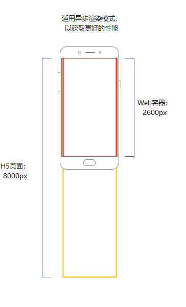
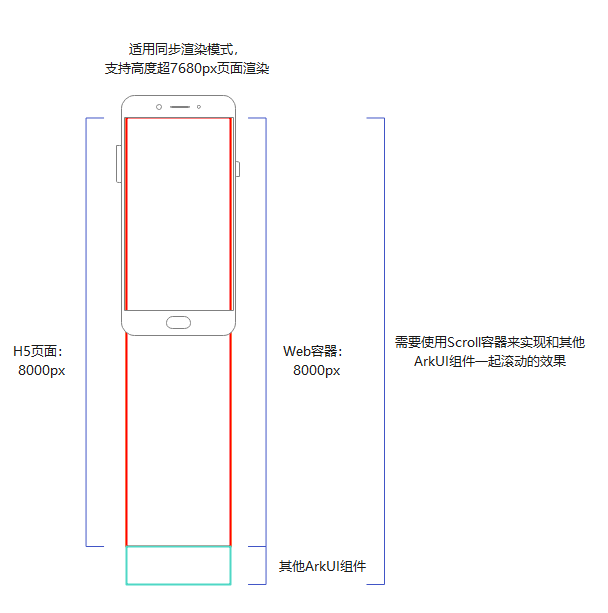

# Web组件渲染模式

Web组件提供了两种可配置的渲染模式，能够根据不同的容器大小进行适配，从而满足使用场景中对容器尺寸的需求。

## 异步渲染模式（默认）

异步渲染模式下（renderMode: [RenderMode](../reference/apis-arkweb/ts-basic-components-web-e.md#rendermode12).ASYNC_RENDER），Web组件作为图形surface节点，独立送显。建议在仅由Web组件构成的应用页面中使用此模式，以提高性能并降低功耗。

- Web组件的宽高不能超过7,680px（物理像素），超过会导致白屏。
- 不支持动态切换模式。

开发者预期Web组件作为主体显示应用页面，如图一所示。在此场景下，Web组件高度正好为一屏或接近一屏（内嵌在navigation中）。加载的H5页面高度大于Web组件高度，Web内部将产生滚动条，用户可以通过在Web内部滑动来浏览H5页面的信息。只需使用Web组件即可实现应用业务主体内容，建议采用异步渲染模式以提升性能。

**图一 异步渲染模式场景**



## 同步渲染模式

同步渲染模式下（ renderMode: [RenderMode](../reference/apis-arkweb/ts-basic-components-web-e.md#rendermode12).SYNC_RENDER），Web组件作为图形canvas节点, Web渲染跟随系统组件一起送显，可以渲染更长Web组件内容，但会增加性能消耗。

- Web组件的宽高不能超过500,000px（物理像素），超过会导致白屏。
- 不支持DSS合成。
- 不支持动态切换模式。

开发者预期Web作为富文本显示的载体，成为应用页面的一部分，与其他ArkUI组件共同滑动交互。如图二所示，H5页面与Web组件高度一致，Web内部不生成滚动条，作为一个超长组件展示，通过Scroll组件实现应用内部的滚动，确保用户能够平滑浏览Web内容及其他ArkUI组件的内容。需要Web作为业务内容的一部分渲染超长组件，不允许Web内部生成滚动条，与其余ArkUI组件协同完成页面布局，建议采用同步渲染模式，支持超长页面的渲染。

**图二 同步渲染模式场景**



## 示例代码

```typescript
// renderMode.ets
import { webview } from '@kit.ArkWeb';

@Entry
@Component
struct WebHeightPage {
  private webviewController: WebviewController = new webview.WebviewController()

  build() {
     Column() {
         Web({
             src: "https://www.example.com/",
             controller: this.webviewController,
             renderMode: RenderMode.ASYNC_RENDER // 设置渲染模式
         })
     }
  }
}
```

