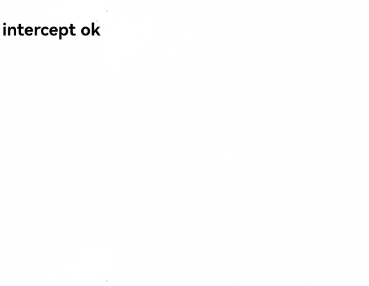

# 自定义页面请求响应


Web组件支持在应用拦截到页面请求后自定义响应请求能力。开发者通过[onInterceptRequest()](../reference/apis-arkweb/arkts-basic-components-web-events.md#oninterceptrequest9)接口来实现自定义资源请求响应 。自定义请求能力可以用于开发者自定义Web页面响应、自定义文件资源响应等场景。


Web网页上发起资源加载请求，应用层收到资源请求消息。应用层构造本地资源响应消息发送给Web内核。Web内核解析应用层响应信息，根据此响应信息进行页面资源加载。


在下面的示例中，Web组件通过拦截页面请求“https://www.example.com/test.html”， 在应用侧代码构建响应资源，实现自定义页面响应场景。


- 前端页面index.html代码。

  ```html
  <!DOCTYPE html>
  <html>
  <head>
      <meta charset="utf-8">
  </head>
  <body>
  <!-- 页面资源请求 -->
  <a href="https://www.example.com/test.html">intercept test!</a>
  </body>
  </html>
  ```

- 应用侧代码。

  ```ts
  // xxx.ets
  import { webview } from '@kit.ArkWeb';

  @Entry
  @Component
  struct WebComponent {
    controller: webview.WebviewController = new webview.WebviewController();
    responseResource: WebResourceResponse = new WebResourceResponse();
    // 开发者自定义响应数据
    @State webData: string = '<!DOCTYPE html>\n' +
      '<html>\n' +
      '<head>\n' +
      '<title>intercept test</title>\n' +
      '</head>\n' +
      '<body>\n' +
      '<h1>intercept ok</h1>\n' +
      '</body>\n' +
      '</html>'

    build() {
      Column() {
        Web({ src: $rawfile('index.html'), controller: this.controller })
          .onInterceptRequest((event) => {
            if (event) {
              console.info('url:' + event.request.getRequestUrl());
              // 拦截页面请求
              if (event.request.getRequestUrl() !== 'https://www.example.com/test.html') {
                return null;
              }
            }
            // 构造响应数据
            this.responseResource.setResponseData(this.webData);
            this.responseResource.setResponseEncoding('utf-8');
            this.responseResource.setResponseMimeType('text/html');
            this.responseResource.setResponseCode(200);
            this.responseResource.setReasonMessage('OK');
            return this.responseResource;
          })
      }
    }
  }
  ```

- 被拦截后的页面

  

为自定义的JavaScript请求响应生成 CodeCache：自定义请求响应的资源类型如果是JavaScript脚本，可以在响应头中添加“ResponseDataID”字段，Web内核读取到该字段后会在为该JS资源生成CodeCache，加速JS执行，并且ResponseData如果有更新时必须更新该字段。不添加“ResponseDataID”字段的情况下默认不生成CodeCache。

在下面的示例中，Web组件通过拦截页面请求“https://www.example.com/test.js”， 应用侧代码构建响应资源，在响应头中添加“ResponseDataID”字段，开启生成CodeCache的功能。

- 前端页面index.html代码。

  ```html
  <!DOCTYPE html>
  <html>
  <head>
      <meta charset="utf-8">
  </head>
  <body>
  
  <div id="div-1">this is a test div</div>
  <div id="div-2">this is a test div</div>
  <div id="div-3">this is a test div</div>
  <div id="div-4">this is a test div</div>
  <div id="div-5">this is a test div</div>
  <div id="div-6">this is a test div</div>
  <div id="div-7">this is a test div</div>
  <div id="div-8">this is a test div</div>
  <div id="div-9">this is a test div</div>
  <div id="div-10">this is a test div</div>
  <div id="div-11">this is a test div</div>
  
  <script src="https://www.example.com/test.js"></script>
  </body>
  </html>
  ```

- 应用侧代码。

  ```ts
  // xxx.ets
  import { webview } from '@kit.ArkWeb';

  @Entry
  @Component
  struct WebComponent {
    controller: webview.WebviewController = new webview.WebviewController();
    responseResource: WebResourceResponse = new WebResourceResponse();
    // 开发者自定义响应数据（响应数据长度需大于等于1024才会生成codecache）
    @State jsData: string = 'let text_msg = "the modified content:version 0000000000001";\n' +
      'let element1 = window.document.getElementById("div-1");\n' +
      'let element2 = window.document.getElementById("div-2");\n' +
      'let element3 = window.document.getElementById("div-3");\n' +
      'let element4 = window.document.getElementById("div-4");\n' +
      'let element5 = window.document.getElementById("div-5");\n' +
      'let element6 = window.document.getElementById("div-6");\n' +
      'let element7 = window.document.getElementById("div-7");\n' +
      'let element8 = window.document.getElementById("div-8");\n' +
      'let element9 = window.document.getElementById("div-9");\n' +
      'let element10 = window.document.getElementById("div-10");\n' +
      'let element11 = window.document.getElementById("div-11");\n' +
      'element1.innerHTML = text_msg;\n' +
      'element2.innerHTML = text_msg;\n' +
      'element3.innerHTML = text_msg;\n' +
      'element4.innerHTML = text_msg;\n' +
      'element5.innerHTML = text_msg;\n' +
      'element6.innerHTML = text_msg;\n' +
      'element7.innerHTML = text_msg;\n' +
      'element8.innerHTML = text_msg;\n' +
      'element9.innerHTML = text_msg;\n' +
      'element10.innerHTML = text_msg;\n' +
      'element11.innerHTML = text_msg;\n';

    build() {
      Column() {
        Web({ src: $rawfile('index.html'), controller: this.controller })
          .onInterceptRequest((event) => {
            // 拦截页面请求
            if (event?.request.getRequestUrl() == 'https://www.example.com/test.js') {
              // 构造响应数据
              this.responseResource.setResponseHeader([
                {
                  // 格式：不超过13位纯数字。js识别码，Js有更新时必须更新该字段
                  headerKey: "ResponseDataID",
                  headerValue: "0000000000001"
                }]);
              this.responseResource.setResponseData(this.jsData);
              this.responseResource.setResponseEncoding('utf-8');
              this.responseResource.setResponseMimeType('application/javascript');
              this.responseResource.setResponseCode(200);
              this.responseResource.setReasonMessage('OK');
              return this.responseResource;
            }
            return null;
          })
      }
    }
  }
  ```

- 被拦截后的页面

  