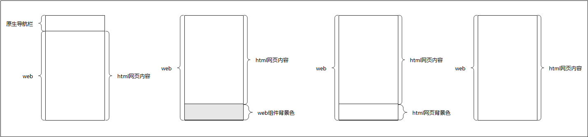

# 优化跳转至新Web组件过程中的页面闪烁现象
应用使用Navigation等路由策略导航至Web组件页面时，在网页加载过程中，页面底部可能出现闪烁现象，这会影响用户体验。

## 闪烁原因

使用Navigation等路由策略导航至Web组件页面时，通常根据网页的回调通知判断是否隐藏系统导航栏。若决定隐藏，Web组件布局会进行调整。这一布局调整过程可简化为如下四个阶段：

图中四个状态的说明（从左至右）。

1. 将应用路由至Web页面，页面顶部为系统导航栏，底部是Web组件。在此情况下，网页能够正常加载。

2. 在网页加载过程中，系统会回调通知应用侧隐藏系统导航栏，以便切换至网页端的导航栏。此时系统导航栏被隐藏，Web组件的布局随即进行调整，页面底部最初会显露出Web组件的背景色（假设为灰色）。

3. 网页继续根据新的尺寸加载并显示，首先呈现的是HTML网页的背景色（假设为白色）。

4. 最后，网页内容完全加载，展现出完整的HTML网页内容。

在上述流程中，如果Web组件的背景色与网页背景色不同，跳转时可能会出现闪烁。闪烁的概率取决于网页的复杂度和网络状况。

## 优化方法

应用可以通过设置与网页背景色相同的Web组件的背景色，避免视觉闪烁，提升用户体验。例如，将Web组件的背景色设置为白色。

在类似情况下，如果Web组件的默认背景色为白色，而网页背景色为灰色，导航到新的Web页面时可能会出现白色闪烁。同理，将Web组件的背景色设置为灰色可以解决此问题。

以下为设置Web组件背景色的接口示例（示例中将Web组件背景色设置为灰色，若不设置，Web组件背景色默认为白色）：
  ```ts
  Web({ src: $rawfile('xxx.html'),  controller: this.webController})
    .backgroundColor(Color.Gray)
  ```
