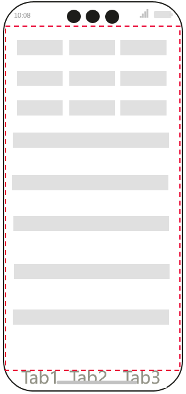
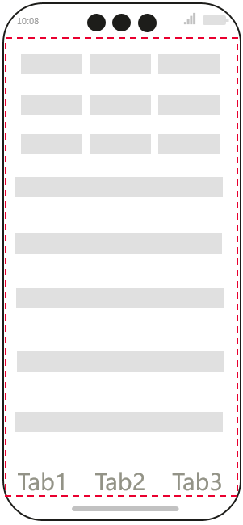

# 网页中安全区域计算和避让适配

## 概述
安全区域定义为页面的显示区域，其默认不与系统设置的非安全区域（如状态栏、导航栏）重叠，以确保开发者设计的界面均布局于安全区域内。然而，当Web组件启用沉浸式模式时，网页元素可能会出现与状态栏或导航栏重叠的问题。具体示例如图1所示，红色虚线框划定的区域即为安全区域，而顶部状态栏、屏幕挖孔区域和底部导航条则被界定为非安全区域，Web组件开启沉浸式效果时，网页内底部元素与导航条发生重叠。

**图1** Web组件开启沉浸式效果时网页内底部元素与导航条发生重叠



Web组件提供了利用W3C CSS进行安全区域计算并避让适配的能力，用来支持异形屏幕设备在沉浸式效果下页面的正常显示。此时，网页开发者想对重叠元素进行避让，就可以该能力。ArkWeb内核将持续监测Web组件及系统安全区域的位置与尺寸，依据两者的重叠部分，计算出当前Web组件的安全区域，以及在各个方向上所需避让的具体距离。

## 实现场景

### 开启Web组件沉浸式效果

开发者可以通过[expandSafeArea](../reference/apis-arkui/arkui-ts/ts-universal-attributes-expand-safe-area.md)来开启沉浸式效果。

  ```ts
  // xxx.ets
  import { webview } from '@kit.ArkWeb';

  @Entry
  @Component
  struct WebComponent {
    controller: webview.WebviewController = new webview.WebviewController();

    build() {
      Column() {
        Web({ src: 'www.example.com', controller: this.controller })
          .width('100%').height('100%')
          .expandSafeArea([SafeAreaType.SYSTEM], [SafeAreaEdge.TOP, SafeAreaEdge.BOTTOM])
      }
    }
  }
  ```

### 设置网页在可视窗口中的布局方式
`viewport-fit`用于限制网页在安全区域内的展示形态。默认为`auto`，与`contain`表现一致，表示可视窗口完全包含网页内容，即网页全部内容展示于安全区域内。而`cover`则表示网页内容完全覆盖可视窗口，即网页内容不仅展示于安全区域，还包含非安全区域，即可能与状态栏和导航栏发生重叠，只有这种场景下网页需要进行避让适配，设置方式如下：
```
<meta name='viewport' content='viewport-fit=cover'>
```
### 对网页元素进行避让

网页元素的避让适配主要依赖于env() CSS函数，该函数用于在CSS中插入由用户代码定义的变量。这使得开发人员能够将内容置于可视窗口（viewport）的安全区域内。在规范中定义的safe-area-inset-*值，确保了即使在非矩形视区中，内容也能得到完全显示。其语法如下：
```
/* safe-area-inset-*可设置上、右、下、左，四个方向上的避让值 */
env(safe-area-inset-top);
env(safe-area-inset-right);
env(safe-area-inset-bottom);
env(safe-area-inset-left);

/* 基于fallback，使用safe-area-inset-*设置四个方向上的避让值 */
/* 下述长度单位参见：https://developer.mozilla.org/zh-CN/docs/Web/CSS/length */
env(safe-area-inset-top, 20px);
env(safe-area-inset-right, 1em);
env(safe-area-inset-bottom, 0.5vh);
env(safe-area-inset-left, 1.4rem);
```

>  **说明：** safe-area-inset-*由四个环境变量组成，分别定义了可视窗口边缘内矩形的top、right、bottom和left，确保内容可以安全地放置，避免被非矩形显示区域切断。在矩形视口（如普通2in1设备的显示器）中，这些值等于零。而对于非矩形显示器（例如圆形表盘、移动设备屏幕等），所有内容都将在用户代理设定的四个值所形成的矩形区域内可见。

不同于其他的 CSS 属性，用户代理定义的属性名字对大小写敏感。同时，需要注意`env()`必须配合`viewport-fit=cover`使用。

对于一些购物网站，首页网页底部为Tab形式的绝对布局元素，在沉浸式状态下这些绝对布局元素就需要进行底部避让，以防止绝对布局元素与系统导航条发生重叠遮挡，避让效果见图2：
```
.tab-bottom {
    padding-bottom: env(safe-area-inset-bottom);
}
```
同时，上述`env()`使用还能基于部分数学计算函数`calc()`,`min()`,`max()`组合计算，如：
```
.tab-bottom {
    padding-bottom: max(env(safe-area-inset-bottom), 30px);
}
```

**图2** Web组件开启沉浸式效果时网页内底部元素避让导航条区域


