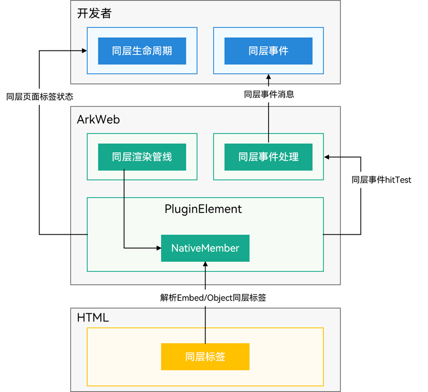
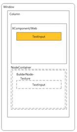
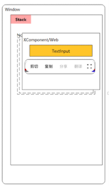
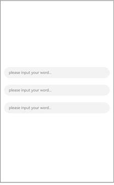

# 同层渲染

在系统中，应用可以使用Web组件加载Web网页。在非原生框架的UI组件功能或性能不如原生组件时，可使用同层渲染，使用ArkUI组件渲染这些组件（简称为同层组件）。

## 使用场景
### Web网页
小程序的地图组件，可以使用ArkUI的XComponent组件渲染来提升性能。小程序的输入框组件，可以使用ArkUI的TextInput组件渲染，达到与原生应用一致的输入体验。
- 在网页侧，应用开发者可将&lt;embed&gt;、&lt;object&gt;的网页UI组件（简称为同层标签），按一定规则进行同层渲染，详细规格见同层渲染规格小节。

- 在应用侧，应用开发者可以通过Web组件的同层渲染事件上报接口，感知到H5同层标签的生命周期以及输入事件，进行同层渲染组件的相应业务逻辑处理。

- 在应用侧，应用开发者可以使用ArkUI的NodeContainer等接口，构建H5同层标签对应的同层渲染组件。可支持同层渲染的ArkUI常用组件包括：[TextInput](../reference/apis-arkui/arkui-ts/ts-basic-components-textinput.md), [XComponent](../reference/apis-arkui/arkui-ts/ts-basic-components-xcomponent.md), [Canvas](../reference/apis-arkui/arkui-ts/ts-components-canvas-canvas.md), [Video](../reference/apis-arkui/arkui-ts/ts-media-components-video.md), [Web](../reference/apis-arkweb/ts-basic-components-web.md)。具体规格可参见[同层渲染规格小节](#规格约束)。

### 三方UI框架
Flutter提供了PlatformView与Texture抽象组件，这些组件可使用原生组件渲染，用来支持Flutter组件功能不足的部分。Weex2.0框架的Camera、Video、Canvas组件。

- 在三方框架页面侧，由于Flutter、Weex等三方框架不在操作系统范围，本文不列举可被同层渲染的三方框架UI组件的范围与使用方式。

- 在应用侧，应用开发者可以使用ArkUI的NodeContainer等接口，构建三方框架同层标签对应的同层渲染组件。可支持同层渲染的ArkUI常用组件包括：[TextInput](../reference/apis-arkui/arkui-ts/ts-basic-components-textinput.md), [XComponent](../reference/apis-arkui/arkui-ts/ts-basic-components-xcomponent.md), [Canvas](../reference/apis-arkui/arkui-ts/ts-components-canvas-canvas.md), [Video](../reference/apis-arkui/arkui-ts/ts-media-components-video.md), [Web](../reference/apis-arkweb/ts-basic-components-web.md)。具体规格可参见[同层渲染规格](#规格约束)。

## 整体架构
ArkWeb同层渲染特性主要提供两种能力：同层标签生命周期和事件命中转发处理。 

同层标签生命周期主要关联前端标签（&lt;embed&gt;/&lt;object&gt;），同时命中到同层标签的事件会被上报到开发者侧，由开发者分发到对应组件树。整体框架如下图所示：

**图1** 同层渲染整体架构 



## 规格约束
### 可被同层渲染的ArkUI组件

以下规格对Web网页和三方框架场景均生效。

**支持的组件范围:**

- 基础组件：[AlphabetIndexer](../reference/apis-arkui/arkui-ts/ts-container-alphabet-indexer.md), [Blank](../reference/apis-arkui/arkui-ts/ts-basic-components-blank.md), [Button](../reference/apis-arkui/arkui-ts/ts-basic-components-button.md), [CalendarPicker](../reference/apis-arkui/arkui-ts/ts-basic-components-calendarpicker.md), [Checkbox](../reference/apis-arkui/arkui-ts/ts-basic-components-checkbox.md), [CheckboxGroup](../reference/apis-arkui/arkui-ts/ts-basic-components-checkboxgroup.md), [ContainerSpan](../reference/apis-arkui/arkui-ts/ts-basic-components-containerspan.md), [DataPanel](../reference/apis-arkui/arkui-ts/ts-basic-components-datapanel.md), [DatePicker](../reference/apis-arkui/arkui-ts/ts-basic-components-datepicker.md), [Divider](../reference/apis-arkui/arkui-ts/ts-basic-components-divider.md), [Gauge](../reference/apis-arkui/arkui-ts/ts-basic-components-gauge.md), [Hyperlink](../reference/apis-arkui/arkui-ts/ts-container-hyperlink.md), [Image](../reference/apis-arkui/arkui-ts/ts-basic-components-image.md), [ImageAnimator](../reference/apis-arkui/arkui-ts/ts-basic-components-imageanimator.md), [ImageSpan](../reference/apis-arkui/arkui-ts/ts-basic-components-imagespan.md), [LoadingProgress](../reference/apis-arkui/arkui-ts/ts-basic-components-loadingprogress.md), [Marquee](../reference/apis-arkui/arkui-ts/ts-basic-components-marquee.md), [PatternLock](../reference/apis-arkui/arkui-ts/ts-basic-components-patternlock.md), [Progress](../reference/apis-arkui/arkui-ts/ts-basic-components-progress.md), [QRCode](../reference/apis-arkui/arkui-ts/ts-basic-components-qrcode.md), [Radio](../reference/apis-arkui/arkui-ts/ts-basic-components-radio.md), [Rating](../reference/apis-arkui/arkui-ts/ts-basic-components-rating.md), [Refresh](../reference/apis-arkui/arkui-ts/ts-container-refresh.md), [ScrollBar](../reference/apis-arkui/arkui-ts/ts-container-scroll.md), [Search](../reference/apis-arkui/arkui-ts/ts-basic-components-search.md), [Span](../reference/apis-arkui/arkui-ts/ts-basic-components-span.md), [Select](../reference/apis-arkui/arkui-ts/ts-basic-components-select.md), [Slider](../reference/apis-arkui/arkui-ts/ts-basic-components-slider.md), [Text](../reference/apis-arkui/arkui-ts/ts-basic-components-text.md), [TextArea](../reference/apis-arkui/arkui-ts/ts-basic-components-textarea.md), [TextClock](../reference/apis-arkui/arkui-ts/ts-basic-components-textclock.md), [TextInput](../reference/apis-arkui/arkui-ts/ts-basic-components-textinput.md), [TextPicker](../reference/apis-arkui/arkui-ts/ts-basic-components-textpicker.md), [TextTimer](../reference/apis-arkui/arkui-ts/ts-basic-components-texttimer.md), [TimePicker](../reference/apis-arkui/arkui-ts/ts-basic-components-timepicker.md), [Toggle](../reference/apis-arkui/arkui-ts/ts-basic-components-toggle.md)

- 容器类组件：[Badge](../reference/apis-arkui/arkui-ts/ts-container-badge.md), [Column](../reference/apis-arkui/arkui-ts/ts-container-column.md), [ColumnSplit](../reference/apis-arkui/arkui-ts/ts-container-columnsplit.md), [Counter](../reference/apis-arkui/arkui-ts/ts-container-counter.md), [Flex](../reference/apis-arkui/arkui-ts/ts-container-flex.md), [GridCol](../reference/apis-arkui/arkui-ts/ts-container-gridcol.md), [GridRow](../reference/apis-arkui/arkui-ts/ts-container-gridrow.md), [Grid](../reference/apis-arkui/arkui-ts/ts-container-grid.md), [GridItem](../reference/apis-arkui/arkui-ts/ts-container-griditem.md)，[List](../reference/apis-arkui/arkui-ts/ts-container-list.md), [ListItem](../reference/apis-arkui/arkui-ts/ts-container-listitem.md), [ListItemGroup](../reference/apis-arkui/arkui-ts/ts-container-listitemgroup.md), [RelativeContainer](../reference/apis-arkui/arkui-ts/ts-container-relativecontainer.md), [Row](../reference/apis-arkui/arkui-ts/ts-container-row.md), [RowSplit](../reference/apis-arkui/arkui-ts/ts-container-rowsplit.md), [Scroll](../reference/apis-arkui/arkui-ts/ts-container-scroll.md), [Stack](../reference/apis-arkui/arkui-ts/ts-container-stack.md), [Swiper](../reference/apis-arkui/arkui-ts/ts-container-swiper.md), [Tabs](../reference/apis-arkui/arkui-ts/ts-container-tabs.md), [TabContent](../reference/apis-arkui/arkui-ts/ts-container-tabcontent.md), [NodeContainer](../reference/apis-arkui/arkui-ts/ts-basic-components-nodecontainer.md), [SideBarContainer](../reference/apis-arkui/arkui-ts/ts-container-sidebarcontainer.md), [Stepper](../reference/apis-arkui/arkui-ts/ts-basic-components-stepper.md), [StepperItem](../reference/apis-arkui/arkui-ts/ts-basic-components-stepperitem.md), [WaterFlow](../reference/apis-arkui/arkui-ts/ts-container-waterflow.md), [FlowItem](../reference/apis-arkui/arkui-ts/ts-container-flowitem.md)

- 自绘制类组件：[XComponent](../reference/apis-arkui/arkui-ts/ts-basic-components-xcomponent.md), [Canvas](../reference/apis-arkui/arkui-ts/ts-components-canvas-canvas.md), [Video](../reference/apis-arkui/arkui-ts/ts-media-components-video.md), [Web](../reference/apis-arkweb/ts-basic-components-web.md)

- 命令式自定义绘制节点：[BuilderNode](../reference/apis-arkui/js-apis-arkui-builderNode.md), [ComponentContent](../reference/apis-arkui/js-apis-arkui-ComponentContent.md), [ContentSlot](../reference/apis-arkui/arkui-ts/ts-components-contentSlot.md), [FrameNode](../reference/apis-arkui/js-apis-arkui-frameNode.md), [Graphics](../reference/apis-arkui/js-apis-arkui-graphics.md), [NodeController](../reference/apis-arkui/js-apis-arkui-nodeController.md), [RenderNode](../reference/apis-arkui/js-apis-arkui-renderNode.md), [XComponentNode](../reference/apis-arkui/js-apis-arkui-xcomponentNode.md), [AttributeUpdater](../reference/apis-arkui/js-apis-arkui-AttributeUpdater.md)，[CAPI](../reference/apis-arkui/_ark_u_i___native_module.md)（支持同层渲染的组件范围同ArkTS）

**支持的组件通用属性与事件:**

- 不支持的通用属性：[分布式迁移标识](../reference/apis-arkui/arkui-ts/ts-universal-attributes-restoreId.md)，[特效绘制合并](../reference/apis-arkui/arkui-ts/ts-universal-attributes-use-effect.md)。

- 其他未明确标注不支持的属性与事件及组件能力，均默认支持。

### Web网页的同层渲染标签
此规格仅针对Web网页，不适用于三方框架场景。

如果应用需要在Web组件加载的网页中使用同层渲染，需要按照以下规格将网页中的&lt;embed&gt;、&lt;object&gt;标签指定为同层渲染组件。

**支持的产品形态：** 
当前仅支持移动设备和平板形态。

**支持的H5标签：**
- 支持&lt;embed&gt;标签：在开启同层渲染后，仅支持type类型为native前缀的标签识别为同层组件，不支持自定义属性。

- 支持&lt;object&gt;标签：在开启同层渲染后，支持将非标准MIME type的object标签识别为同层组件，支持通过param/value的自定义属性解析。

- 不支持W3C规范标准标签（如&lt;input&gt;、&lt;video&gt;）定义为同层标签。

- 不支持同时配置&lt;object&gt;标签和&lt;embed&gt;标签作为同层标签。  

- 标签类型只支持英文字符，不区分大小写。

**同层标签支持的css属性：** 

display，position，z-index，visibility，opacity， 
background-color，background-image，width，height，padding，padding-left，padding-top，padding-right，padding-bottom，margin，margin-left，margin-top，margin-right，margin-bottom，border-width，border-style，border-color，border-left-width，border-left-style，border-left-color，border-top-width，border-top-style，border-top-color，border-right-width，border-right-style，border-right-color，border-bottom-width，border-bottom-style，border-bottom-color，border-left，border-right，border-top，border-bottom，border，border-top-left-radius，border-top-right-radius，border-bottom-left-radius，border-bottom-right-radius，border-radius，transition，transform（仅支持translate/scale，scale对应参数只支持大于等于0的值）

 除上面支持的css属性范围，其他的css属性均不保证符合预期，比如transform属性中的rotate，shew等。

**同层标签的生命周期管理：** 
当Embed标签生命周期变化时触发[onNativeEmbedLifecycleChange()](../reference/apis-arkweb/ts-basic-components-web.md#onnativeembedlifecyclechange11)回调。

- 支持创建、销毁、位置宽高变化、不支持可见状态变化。

- 支持同层组件所在Web页面进入前进后退缓存。

**同层标签的输入事件分发处理：**
- 支持触摸事件TouchEvent的DOWN/UP/MOVE/CANCEL。支持[配置触摸事件消费结果](../reference/apis-arkweb/ts-basic-components-web.md#onnativeembedgestureevent11)，默认为应用侧消费。

- 不支持同层标签所在的应用页面缩放和[initialScale](../reference/apis-arkweb/ts-basic-components-web.md#initialscale9)、[zoom](../reference/apis-arkweb/js-apis-webview.md#zoom)、[zoomIn](../reference/apis-arkweb/js-apis-webview.md#zoomin)、[zoomOut](../reference/apis-arkweb/js-apis-webview.md#zoomout)等缩放接口。

- 暂不支持鼠标、键盘、触摸板事件。

**约束限制：**

- Web页面内不建议超过5个同层标签。超过5个后，渲染性能将会下降。

- 受GPU限制，同层标签最大高度不超过8000px，最大纹理大小为8000px。

- 开启同层渲染后，Web组件打开的所有Web页面将不支持同步渲染模式[RenderMode](../reference/apis-arkweb/ts-basic-components-web.md#rendermode12枚举说明)。

- Video组件：在非全屏Video变为全屏时，Video组件变为非纹理导出模式，视频播放状态保持延续；恢复为非全屏时，变为纹理导出模式，视频播放状态保持延续。

- Web组件：仅支持一层同层渲染嵌套，不支持多层同层渲染嵌套。输入事件只支持滑动、点击、缩放、长按 ，不支持拖拽、旋转。

- 涉及界面交互的ArkUI组件（如TextInput等）：建议在页面布局中使用Stack包裹同层组件容器与BuilderNode，并使两者位置一致，NodeContainer要与&lt;embed&gt;/&lt;object&gt;标签对齐，以保障组件正常交互。如两者位置不一致，可能出现的问题有：TextInput/TextArea等附属的文本选择框位置错位（如下图）、LoadingProgress/Marquee等组件的动画启停与组件可见状态不匹配。

  **图2** 未使用Stack包裹，TextInput的位置错位

  

  **图3** 使用Stack包裹，TextInput的位置正常

  

## Web页面中同层渲染输入框
在Web页面中，可以使用ArkUI原生的TextInput组件进行同层渲染。此处利用同层渲染展示三个输入框，渲染效果图如下：

**图4** 同层渲染输入框

  

1. 在Web页面中标记需要同层渲染的HTML标签。

   同层渲染支持&lt;embed&gt;/&lt;object&gt;两种标签。type类型可任意指定，两个字符串参数均不区分大小写，ArkWeb内核将会统一转换为小写。其中，tag字符串使用全字符串匹配，type使用字符串前缀匹配。

   若开发者不使用该接口或该接口接收的为非法字符串（空字符串）时，ArkWeb内核将使用默认设置，即"embed" + "native/"前缀模式。若指定类型与w3c定义的object或embed标准类型重合，如registerNativeEmbedRule("object", "application/pdf")，ArkWeb将遵循w3c标准行为，不会将其识别为同层标签。 

   - 采用&lt;embed&gt;标签。

     ```html
     <!--HAP's src/main/resources/rawfile/text.html-->
     <!DOCTYPE html>
     <html>
     <head>
         <title>同层渲染测试html</title>
         <meta name="viewport">
     </head>

     <body style="background:white">

     <embed id = "input1" type="native/view" style="width: 100%; height: 100px; margin: 30px; margin-top: 600px"/>

     <embed id = "input2" type="native/view2" style="width: 100%; height: 100px; margin: 30px; margin-top: 50px"/>

     <embed id = "input3" type="native/view3" style="width: 100%; height: 100px; margin: 30px; margin-top: 50px"/>

     </body>
     </html>
     ```

   - 采用&lt;object&gt;标签。

     需要使用registerNativeEmbedRule注册object标签。
     ```ts
     // ...
     Web({src: $rawfile("text.html"), controller: this.browserTabController})
       // 注册同层标签为"object"，类型为"test"前缀
       .registerNativeEmbedRule("object", "test")
       // ...
     ```

     与registerNativeEmbedRule相对应的前端页面代码，类型可使用"test"及以"test"为前缀的字串。

      ```html
      <!--HAP's src/main/resources/rawfile/text.html-->
      <!DOCTYPE html>
      <html>
      <head>
          <title>同层渲染测试html</title>
          <meta name="viewport">
      </head>

      <body style="background:white">

      <object id = "input1" type="test/input" style="width: 100%; height: 100px; margin: 30px; margin-top: 600px"></object>

      <object id = "input2" type="test/input" style="width: 100%; height: 100px; margin: 30px; margin-top: 50px"></object>

      <object id = "input3" type="test/input" style="width: 100%; height: 100px; margin: 30px; margin-top: 50px"></object>

      </body>
      </html>
      ```

2. 在应用侧开启同层渲染功能。

   同层渲染功能默认不开启，如果要使用同层渲染的功能，可通过enableNativeEmbedMode来开启。

   ```ts
   // xxx.ets
   import { webview } from '@kit.ArkWeb';
   @Entry
   @Component
   struct WebComponent {
     controller: webview.WebviewController = new webview.WebviewController();

     build() {
       Column() {
         Web({ src: 'www.example.com', controller: this.controller })
           // 配置同层渲染开关开启。
           .enableNativeEmbedMode(true)
       }
     }
   }
   ```

3. 创建自定义组件。

   同层渲染功能开启后，展示在对应区域的原生组件。

   ```ts
   @Component
   struct TextInputComponent {
     @Prop params: Params
     @State bkColor: Color = Color.White

     build() {
       Column() {
         TextInput({text: '', placeholder: 'please input your word...'})
           .placeholderColor(Color.Gray)
           .id(this.params?.elementId)
           .placeholderFont({size: 13, weight: 400})
           .caretColor(Color.Gray)
           .width(this.params?.width)
           .height(this.params?.height)
           .fontSize(14)
           .fontColor(Color.Black)
       }
       //自定义组件中的最外层容器组件宽高应该为同层标签的宽高
       .width(this.params.width)
       .height(this.params.height)
     }
   }

   @Builder
   function TextInputBuilder(params:Params) {
     TextInputComponent({params: params})
       .width(params.width)
       .height(params.height)
       .backgroundColor(Color.White)
   }
   ```

4. 创建节点控制器。

   用于控制和反馈对应NodeContainer上的节点行为。

   ```ts
   class MyNodeController extends NodeController {
     private rootNode: BuilderNode<[Params]> | undefined | null;
     private embedId_: string = "";
     private surfaceId_: string = "";
     private renderType_: NodeRenderType = NodeRenderType.RENDER_TYPE_DISPLAY;
     private width_: number = 0;
     private height_: number = 0;
     private type_: string = "";
     private isDestroy_: boolean = false;

     setRenderOption(params: NodeControllerParams) {
       this.surfaceId_ = params.surfaceId;
       this.renderType_ = params.renderType;
       this.embedId_ = params.embedId;
       this.width_ = params.width;
       this.height_ = params.height;
       this.type_ = params.type;
     }

     // 必须要重写的方法，用于构建节点数、返回节点数挂载在对应NodeContainer中。
     // 在对应NodeContainer创建的时候调用、或者通过rebuild方法调用刷新。
     makeNode(uiContext: UIContext): FrameNode | null {
       if (this.isDestroy_) { // rootNode为null
         return null;
       }
       if (!this.rootNode) {// rootNode 为undefined时
         this.rootNode = new BuilderNode(uiContext, { surfaceId: this.surfaceId_, type: this.renderType_ });
         if(this.rootNode) {
           this.rootNode.build(wrapBuilder(TextInputBuilder), {  textOne: "myTextInput", width: this.width_, height: this.height_  })
           return this.rootNode.getFrameNode();
         }else{
           return null;
         }
       }
       // 返回FrameNode节点。
       return this.rootNode.getFrameNode();
     }

     setBuilderNode(rootNode: BuilderNode<Params[]> | null): void {
       this.rootNode = rootNode;
     }

     getBuilderNode(): BuilderNode<[Params]> | undefined | null {
       return this.rootNode;
     }

     updateNode(arg: Object): void {
       this.rootNode?.update(arg);
     }

     getEmbedId(): string {
       return this.embedId_;
     }
     
     setDestroy(isDestroy: boolean): void {
       this.isDestroy_ = isDestroy;
       if (this.isDestroy_) {
         this.rootNode = null;
       }
     }
    
     postEvent(event: TouchEvent | undefined): boolean {
       return this.rootNode?.postTouchEvent(event) as boolean
     }
   }
   ```

5. 监听同层渲染的生命周期变化。

   开启该功能后，每当网页中存在同层渲染支持的标签时，ArkWeb内核会触发由[onNativeEmbedLifecycleChange](../reference/apis-arkweb/ts-basic-components-web.md#onnativeembedlifecyclechange11)注册的回调函数。

   开发者则需要调用[onNativeEmbedLifecycleChange](../reference/apis-arkweb/ts-basic-components-web.md#onnativeembedlifecyclechange11)来监听同层渲染标签的生命周期变化。

    ```ts
    build() {
      Row() {
        Column() {
          Stack() {
            ForEach(this.componentIdArr, (componentId: string) => {
              NodeContainer(this.nodeControllerMap.get(componentId))
                .position(this.positionMap.get(componentId))
                .width(this.widthMap.get(componentId))
                .height(this.heightMap.get(componentId))
            }, (embedId: string) => embedId)
            // Web组件加载本地text.html页面
            Web({src: $rawfile("text.html"), controller: this.browserTabController})
              // 配置同层渲染开关开启
              .enableNativeEmbedMode(true)
                // 注册同层标签为"object"，类型为"test"前缀
              .registerNativeEmbedRule("object", "test")
                // 获取embed标签的生命周期变化数据
              .onNativeEmbedLifecycleChange((embed) => {
                console.log("NativeEmbed surfaceId" + embed.surfaceId);
                // 如果使用embed.info.id作为映射nodeController的key，请在h5页面显式指定id
                const componentId = embed.info?.id?.toString() as string
                if (embed.status == NativeEmbedStatus.CREATE) {
                  console.log("NativeEmbed create" + JSON.stringify(embed.info));
                  // 创建节点控制器、设置参数并rebuild
                  let nodeController = new MyNodeController()
                  // embed.info.width和embed.info.height单位是px格式，需要转换成ets侧的默认单位vp
                  nodeController.setRenderOption({surfaceId : embed.surfaceId as string,
                    type : embed.info?.type as string,
                    renderType : NodeRenderType.RENDER_TYPE_TEXTURE,
                    embedId : embed.embedId as string,
                    width : px2vp(embed.info?.width),
                    height : px2vp(embed.info?.height)})
                  this.edges = {left: `${embed.info?.position?.x as number}px`, top: `${embed.info?.position?.y as number}px`}
                  nodeController.setDestroy(false);
                  //根据web传入的embed的id属性作为key，将nodeController存入Map
                  this.nodeControllerMap.set(componentId, nodeController);
                  this.widthMap.set(componentId, px2vp(embed.info?.width));
                  this.heightMap.set(componentId, px2vp(embed.info?.height));
                  this.positionMap.set(componentId, this.edges);
                  // 将web传入的embed的id属性存入@State状态数组变量中，用于动态创建nodeContainer节点容器,需要将push动作放在set之后
                  this.componentIdArr.push(componentId)
                } else if (embed.status == NativeEmbedStatus.UPDATE) {
                  let nodeController = this.nodeControllerMap.get(componentId);
                  console.log("NativeEmbed update" + JSON.stringify(embed));
                  this.edges = {left: `${embed.info?.position?.x as number}px`, top: `${embed.info?.position?.y as number}px`}
                  this.positionMap.set(componentId, this.edges);
                  this.widthMap.set(componentId, px2vp(embed.info?.width));
                  this.heightMap.set(componentId, px2vp(embed.info?.height));
                  nodeController?.updateNode({textOne: 'update', width: px2vp(embed.info?.width), height: px2vp(embed.info?.height)} as ESObject)
                } else if (embed.status == NativeEmbedStatus.DESTROY) {
                  console.log("NativeEmbed destroy" + JSON.stringify(embed));
                  let nodeController = this.nodeControllerMap.get(componentId);
                  nodeController?.setDestroy(true)
                  this.nodeControllerMap.clear();
                  this.positionMap.delete(componentId);
                  this.widthMap.delete(componentId);
                  this.heightMap.delete(componentId);
                  this.componentIdArr.filter((value: string) => value != componentId)
                } else {
                  console.log("NativeEmbed status" + embed.status);
                }
              })
          }.height("80%")
        }
      }
    }
    ```

6. 同层渲染手势事件。

   开启该功能后，每当在同层渲染的区域进行触摸操作时，ArkWeb内核会触发[onNativeEmbedGestureEvent](../reference/apis-arkweb/ts-basic-components-web.md#onnativeembedgestureevent11)注册的回调函数。

   开发者则需要调用[onNativeEmbedGestureEvent](../reference/apis-arkweb/ts-basic-components-web.md#onnativeembedgestureevent11)来监听同层渲染同层渲染区域的手势事件。

    ```ts
    build() {
      Row() {
        Column() {
          Stack() {
            ForEach(this.componentIdArr, (componentId: string) => {
              NodeContainer(this.nodeControllerMap.get(componentId))
                .position(this.positionMap.get(componentId))
                .width(this.widthMap.get(componentId))
                .height(this.heightMap.get(componentId))
            }, (embedId: string) => embedId)
            // Web组件加载本地text.html页面。
            Web({src: $rawfile("text.html"), controller: this.browserTabController})
              // 配置同层渲染开关开启。
              .enableNativeEmbedMode(true)
                // 获取embed标签的生命周期变化数据。
              .onNativeEmbedLifecycleChange((embed) => {
                // 生命周期变化实现
              })
              .onNativeEmbedGestureEvent((touch) => {
                console.log("NativeEmbed onNativeEmbedGestureEvent" + JSON.stringify(touch.touchEvent));
                this.componentIdArr.forEach((componentId: string) => {
                  let nodeController = this.nodeControllerMap.get(componentId);
                  // 将获取到的同层区域的事件发送到该区域embedId对应的nodeController上
                  if(nodeController?.getEmbedId() == touch.embedId) {
                    let ret = nodeController?.postEvent(touch.touchEvent)
                    if(ret) {
                      console.log("onNativeEmbedGestureEvent success " + componentId);
                    } else {
                      console.log("onNativeEmbedGestureEvent fail " + componentId);
                    }
                    if(touch.result) {
                      // 通知Web组件手势事件消费结果
                      touch.result.setGestureEventResult(ret);
                    }
                  }
                })
              })
          }
        }
      }
    }
    ```

**完整示例：**

使用前请在module.json5中添加网络权限，添加方法请参考[在配置文件中声明权限](../security/AccessToken/declare-permissions.md)。

  ```
  "requestPermissions":[
      {
        "name" : "ohos.permission.INTERNET"
      }
    ]
  ```

应用侧代码。

  ```ts
  // 创建NodeController
  import webview from '@ohos.web.webview';
  import { UIContext } from '@ohos.arkui.UIContext';
  import { NodeController, BuilderNode, NodeRenderType, FrameNode } from "@ohos.arkui.node";

  @Observed
  declare class Params{
    elementId: string
    textOne: string
    textTwo: string
    width: number
    height: number
  }

  declare class NodeControllerParams {
    surfaceId: string
    type: string
    renderType: NodeRenderType
    embedId: string
    width: number
    height: number
  }

  // 用于控制和反馈对应的NodeContainer上的节点的行为，需要与NodeContainer一起使用。
  class MyNodeController extends NodeController {
    private rootNode: BuilderNode<[Params]> | undefined | null;
    private embedId_: string = "";
    private surfaceId_: string = "";
    private renderType_: NodeRenderType = NodeRenderType.RENDER_TYPE_DISPLAY;
    private width_: number = 0;
    private height_: number = 0;
    private type_: string = "";
    private isDestroy_: boolean = false;

    setRenderOption(params: NodeControllerParams) {
      this.surfaceId_ = params.surfaceId;
      this.renderType_ = params.renderType;
      this.embedId_ = params.embedId;
      this.width_ = params.width;
      this.height_ = params.height;
      this.type_ = params.type;
    }

    // 必须要重写的方法，用于构建节点数、返回节点数挂载在对应NodeContainer中。
    // 在对应NodeContainer创建的时候调用、或者通过rebuild方法调用刷新。
    makeNode(uiContext: UIContext): FrameNode | null {
      if (this.isDestroy_) { // rootNode为null
        return null;
      }
      if (!this.rootNode) {// rootNode 为undefined时
        this.rootNode = new BuilderNode(uiContext, { surfaceId: this.surfaceId_, type: this.renderType_ });
        if(this.rootNode) {
          this.rootNode.build(wrapBuilder(TextInputBuilder), {  textOne: "myTextInput", width: this.width_, height: this.height_  })
          return this.rootNode.getFrameNode();
        }else{
          return null;
        }
      }
      // 返回FrameNode节点。
      return this.rootNode.getFrameNode();
    }

    setBuilderNode(rootNode: BuilderNode<Params[]> | null): void {
      this.rootNode = rootNode;
    }

    getBuilderNode(): BuilderNode<[Params]> | undefined | null {
      return this.rootNode;
    }

    updateNode(arg: Object): void {
      this.rootNode?.update(arg);
    }

    getEmbedId(): string {
      return this.embedId_;
    }

    setDestroy(isDestroy: boolean): void {
      this.isDestroy_ = isDestroy;
      if (this.isDestroy_) {
        this.rootNode = null;
      }
    }

    postEvent(event: TouchEvent | undefined): boolean {
      return this.rootNode?.postTouchEvent(event) as boolean
    }
  }

  @Component
  struct TextInputComponent {
    @Prop params: Params
    @State bkColor: Color = Color.White

    build() {
      Column() {
        TextInput({text: '', placeholder: 'please input your word...'})
          .placeholderColor(Color.Gray)
          .id(this.params?.elementId)
          .placeholderFont({size: 13, weight: 400})
          .caretColor(Color.Gray)
          .fontSize(14)
          .fontColor(Color.Black)
      }
      //自定义组件中的最外层容器组件宽高应该为同层标签的宽高
      .width(this.params.width)
      .height(this.params.height)
    }
  }

  // @Builder中为动态组件的具体组件内容。
  @Builder
  function TextInputBuilder(params:Params) {
    TextInputComponent({params: params})
      .width(params.width)
      .height(params.height)
      .backgroundColor(Color.White)
  }

  @Entry
  @Component
  struct Page{
    browserTabController: WebviewController = new webview.WebviewController()
    private nodeControllerMap: Map<string, MyNodeController> = new Map();
    @State componentIdArr: Array<string> = [];
    @State posMap: Map<string, Position | undefined> = new Map();
    @State widthMap: Map<string, number> = new Map();
    @State heightMap: Map<string, number> = new Map();
    @State positionMap: Map<string, Edges> = new Map();
    @State edges: Edges = {};

    build() {
      Row() {
        Column() {
          Stack() {
            ForEach(this.componentIdArr, (componentId: string) => {
              NodeContainer(this.nodeControllerMap.get(componentId))
                .position(this.positionMap.get(componentId))
                .width(this.widthMap.get(componentId))
                .height(this.heightMap.get(componentId))
            }, (embedId: string) => embedId)
            // Web组件加载本地text.html页面。
            Web({src: $rawfile("text.html"), controller: this.browserTabController})
              // 配置同层渲染开关开启。
              .enableNativeEmbedMode(true)
              // 获取embed标签的生命周期变化数据。
              .onNativeEmbedLifecycleChange((embed) => {
                 console.log("NativeEmbed surfaceId" + embed.surfaceId);
                 // 如果使用embed.info.id作为映射nodeController的key，请在h5页面显式指定id
                 const componentId = embed.info?.id?.toString() as string
                 if (embed.status == NativeEmbedStatus.CREATE) {
                   console.log("NativeEmbed create" + JSON.stringify(embed.info));
                   // 创建节点控制器、设置参数并rebuild
                   let nodeController = new MyNodeController()
                   // embed.info.width和embed.info.height单位是px格式，需要转换成ets侧的默认单位vp
                   nodeController.setRenderOption({surfaceId : embed.surfaceId as string,
                     type : embed.info?.type as string,
                     renderType : NodeRenderType.RENDER_TYPE_TEXTURE,
                     embedId : embed.embedId as string,
                     width : px2vp(embed.info?.width),
                     height : px2vp(embed.info?.height)})
                   this.edges = {left: `${embed.info?.position?.x as number}px`, top: `${embed.info?.position?.y as number}px`}
                   nodeController.setDestroy(false);
                   //根据web传入的embed的id属性作为key，将nodeController存入Map
                   this.nodeControllerMap.set(componentId, nodeController);
                   this.widthMap.set(componentId, px2vp(embed.info?.width));
                   this.heightMap.set(componentId, px2vp(embed.info?.height));
                   this.positionMap.set(componentId, this.edges);
                   // 将web传入的embed的id属性存入@State状态数组变量中，用于动态创建nodeContainer节点容器,需要将push动作放在set之后
                   this.componentIdArr.push(componentId)
                 } else if (embed.status == NativeEmbedStatus.UPDATE) {
                   let nodeController = this.nodeControllerMap.get(componentId);
                   console.log("NativeEmbed update" + JSON.stringify(embed));
                   this.edges = {left: `${embed.info?.position?.x as number}px`, top: `${embed.info?.position?.y as number}px`}
                   this.positionMap.set(componentId, this.edges);
                   this.widthMap.set(componentId, px2vp(embed.info?.width));
                   this.heightMap.set(componentId, px2vp(embed.info?.height));
                   nodeController?.updateNode({textOne: 'update', width: px2vp(embed.info?.width), height: px2vp(embed.info?.height)} as ESObject)
                 } else if (embed.status == NativeEmbedStatus.DESTROY) {
                   console.log("NativeEmbed destroy" + JSON.stringify(embed));
                   let nodeController = this.nodeControllerMap.get(componentId);
                   nodeController?.setDestroy(true)
                   this.nodeControllerMap.clear();
                   this.positionMap.delete(componentId);
                   this.widthMap.delete(componentId);
                   this.heightMap.delete(componentId);
                   this.componentIdArr.filter((value: string) => value != componentId)
                 } else {
                   console.log("NativeEmbed status" + embed.status);
                 }
               })// 获取同层渲染组件触摸事件信息。
              .onNativeEmbedGestureEvent((touch) => {
                console.log("NativeEmbed onNativeEmbedGestureEvent" + JSON.stringify(touch.touchEvent));
                this.componentIdArr.forEach((componentId: string) => {
                  let nodeController = this.nodeControllerMap.get(componentId);
                  // 将获取到的同层区域的事件发送到该区域embedId对应的nodeController上
                  if(nodeController?.getEmbedId() == touch.embedId) {
                    let ret = nodeController?.postEvent(touch.touchEvent)
                    if(ret) {
                      console.log("onNativeEmbedGestureEvent success " + componentId);
                    } else {
                      console.log("onNativeEmbedGestureEvent fail " + componentId);
                    }
                    if(touch.result) {
                      // 通知Web组件手势事件消费结果
                      touch.result.setGestureEventResult(ret);
                    }
                  }
                })
              })
          }
        }
      }
    }
  }
  ```

## 绘制XComponent+AVPlayer和Button组件

开发者可通过[enableNativeEmbedMode()](../reference/apis-arkweb/ts-basic-components-web.md#enablenativeembedmode11)控制同层渲染开关。Html文件中需要显式使用embed标签，并且embed标签内type必须以“native/”开头。同层标签对应的元素区域的背景为透明。

- 应用侧代码组件使用示例。

  ```ts
  // HAP's src/main/ets/pages/Index.ets
  // 创建NodeController
  import { webview } from '@kit.ArkWeb';
  import { UIContext, NodeController, BuilderNode, NodeRenderType, FrameNode } from "@kit.ArkUI";
  import { AVPlayerDemo } from './PlayerDemo';

  @Observed
  declare class Params {
    textOne : string
    textTwo : string
    width : number
    height : number
  }

  declare class NodeControllerParams {
    surfaceId : string
    type : string
    renderType : NodeRenderType
    embedId : string
    width : number
    height : number
  }

  // 用于控制和反馈对应的NodeContainer上的节点的行为，需要与NodeContainer一起使用。
  class MyNodeController extends NodeController {
    private rootNode: BuilderNode<[Params]> | undefined | null;
    private embedId_ : string = "";
    private surfaceId_ : string = "";
    private renderType_ :NodeRenderType = NodeRenderType.RENDER_TYPE_DISPLAY;
    private width_ : number = 0;
    private height_ : number = 0;
    private type_ : string = "";
    private isDestroy_ : boolean = false;

    setRenderOption(params : NodeControllerParams) {
      this.surfaceId_ = params.surfaceId;
      this.renderType_ = params.renderType;
      this.embedId_ = params.embedId;
      this.width_ = params.width;
      this.height_ = params.height;
      this.type_ = params.type;
    }
    // 必须要重写的方法，用于构建节点数、返回节点数挂载在对应NodeContainer中。
    // 在对应NodeContainer创建的时候调用、或者通过rebuild方法调用刷新。
    makeNode(uiContext: UIContext): FrameNode | null{
      if (this.isDestroy_) { // rootNode为null
        return null;
      }
      if (!this.rootNode) { // rootNode 为undefined时
        this.rootNode = new BuilderNode(uiContext, { surfaceId: this.surfaceId_, type: this.renderType_});
        if (this.type_ === 'native/video') {
          this.rootNode.build(wrapBuilder(VideoBuilder), {textOne: "myButton", width : this.width_, height : this.height_});
        } else {
          // other
        }
      }
      // 返回FrameNode节点。
      return this.rootNode.getFrameNode();
    }

    setBuilderNode(rootNode: BuilderNode<Params[]> | null): void{
      this.rootNode = rootNode;
    }

    getBuilderNode(): BuilderNode<[Params]> | undefined | null{
      return this.rootNode;
    }

    updateNode(arg: Object): void {
      this.rootNode?.update(arg);
    }
    getEmbedId() : string {
      return this.embedId_;
    }

    setDestroy(isDestroy : boolean) : void {
      this.isDestroy_ = isDestroy;
      if (this.isDestroy_) {
        this.rootNode = null;
      }
    }

    postEvent(event: TouchEvent | undefined) : boolean {
      return this.rootNode?.postTouchEvent(event) as boolean
    }
  }

  @Component
  struct VideoComponent {
    @ObjectLink params: Params
    @State bkColor: Color = Color.Red
    mXComponentController: XComponentController = new XComponentController();
    @State player_changed: boolean = false;
    player?: AVPlayerDemo;

    build() {
      Column() {
        Button(this.params.textOne)

        XComponent({ id: 'video_player_id', type: XComponentType.SURFACE, controller: this.mXComponentController})
          .border({width: 1, color: Color.Red})
          .onLoad(() => {
            this.player = new AVPlayerDemo();
            this.player.setSurfaceID(this.mXComponentController.getXComponentSurfaceId());
            this.player_changed = !this.player_changed;
            this.player.avPlayerLiveDemo()
          })
          .width(300)
          .height(200)
      }
      //自定义组件中的最外层容器组件宽高应该为同层标签的宽高
      .width(this.params.width)
      .height(this.params.height)
    }
  }
  // @Builder中为动态组件的具体组件内容。
  @Builder
  function VideoBuilder(params: Params) {
    VideoComponent({ params: params })
      .backgroundColor(Color.Gray)
  }

  @Entry
  @Component
  struct WebIndex {
    browserTabController: WebviewController = new webview.WebviewController()
    private nodeControllerMap: Map<string, MyNodeController> = new Map();
    @State componentIdArr: Array<string> = [];

    aboutToAppear() {
      // 配置web开启调试模式。
      webview.WebviewController.setWebDebuggingAccess(true);
    }

    build(){
      Row() {
        Column() {
          Stack() {
            ForEach(this.componentIdArr, (componentId: string) => {
              NodeContainer(this.nodeControllerMap.get(componentId))
            }, (embedId: string) => embedId)
            // Web组件加载本地test.html页面。
            Web({ src: $rawfile("test.html"), controller: this.browserTabController })
              // 配置同层渲染开关开启。
              .enableNativeEmbedMode(true)
                // 获取embed标签的生命周期变化数据。
              .onNativeEmbedLifecycleChange((embed) => {
                console.log("NativeEmbed surfaceId" + embed.surfaceId);
                // 1. 如果使用embed.info.id作为映射nodeController的key，请在h5页面显式指定id
                const componentId = embed.info?.id?.toString() as string
                if (embed.status == NativeEmbedStatus.CREATE) {
                  console.log("NativeEmbed create" + JSON.stringify(embed.info))
                  // 创建节点控制器，设置参数并rebuild。
                  let nodeController = new MyNodeController()
                  // 1. embed.info.width和embed.info.height单位是px格式，需要转换成ets侧的默认单位vp
                  nodeController.setRenderOption({surfaceId : embed.surfaceId as string, type : embed.info?.type as string,
                    renderType : NodeRenderType.RENDER_TYPE_TEXTURE, embedId : embed.embedId as string,
                    width : px2vp(embed.info?.width), height : px2vp(embed.info?.height)})
                  nodeController.setDestroy(false);
                  // 根据web传入的embed的id属性作为key，将nodeController存入map。
                  this.nodeControllerMap.set(componentId, nodeController)
                  // 将web传入的embed的id属性存入@State状态数组变量中，用于动态创建nodeContainer节点容器，需要将push动作放在set之后。
                  this.componentIdArr.push(componentId)
                } else if (embed.status == NativeEmbedStatus.UPDATE) {
                  let nodeController = this.nodeControllerMap.get(componentId)
                  nodeController?.updateNode({textOne: 'update', width: px2vp(embed.info?.width), height: px2vp(embed.info?.height)} as ESObject)
                } else {
                  let nodeController = this.nodeControllerMap.get(componentId);
                  nodeController?.setDestroy(true)
                  this.nodeControllerMap.clear();
                  this.componentIdArr.length = 0;
                }
              })// 获取同层渲染组件触摸事件信息。
              .onNativeEmbedGestureEvent((touch) => {
                console.log("NativeEmbed onNativeEmbedGestureEvent" + JSON.stringify(touch.touchEvent));
                this.componentIdArr.forEach((componentId: string) => {
                  let nodeController = this.nodeControllerMap.get(componentId)
                  // 将获取到的同层区域的事件发送到该区域embedId对应的nodeController上
                  if (nodeController?.getEmbedId() === touch.embedId) {
                    let ret = nodeController?.postEvent(touch.touchEvent)
                    if (ret) {
                      console.log("onNativeEmbedGestureEvent success " + componentId)
                    } else {
                      console.log("onNativeEmbedGestureEvent fail " + componentId)
                    }
                    if (touch.result) {
                      // 通知Web组件手势事件消费结果
                      touch.result.setGestureEventResult(ret);
                    }
                  }
                })
              })
          }
        }
      }
    }
  }
  ```

- 应用侧代码，视频播放示例，使用时需替换正确的视频链接地址。

  ```ts
  // HAP's src/main/ets/pages/PlayerDemo.ets
  import { media } from '@kit.MediaKit';
  import { BusinessError } from '@ohos.base';

  export class AVPlayerDemo {
    private count: number = 0;
    private surfaceID: string = ''; // surfaceID用于播放画面显示，具体的值需要通过Xcomponent接口获取，相关文档链接见上面Xcomponent创建方法。
    private isSeek: boolean = true; // 用于区分模式是否支持seek操作。

    setSurfaceID(surface_id: string){
      console.log('setSurfaceID : ' + surface_id);
      this.surfaceID = surface_id;
    }
    // 注册avplayer回调函数。
    setAVPlayerCallback(avPlayer: media.AVPlayer) {
      // seek操作结果回调函数。
      avPlayer.on('seekDone', (seekDoneTime: number) => {
        console.info(`AVPlayer seek succeeded, seek time is ${seekDoneTime}`);
      })
      // error回调监听函数，当avplayer在操作过程中出现错误时，调用reset接口触发重置流程。
      avPlayer.on('error', (err: BusinessError) => {
        console.error(`Invoke avPlayer failed, code is ${err.code}, message is ${err.message}`);
        avPlayer.reset();
      })
      // 状态机变化回调函数。
      avPlayer.on('stateChange', async (state: string, reason: media.StateChangeReason) => {
        switch (state) {
          case 'idle': // 成功调用reset接口后触发该状态机上报。
            console.info('AVPlayer state idle called.');
            avPlayer.release(); // 调用release接口销毁实例对象。
            break;
          case 'initialized': // avplayer 设置播放源后触发该状态上报。
            console.info('AVPlayer state initialized called.');
            avPlayer.surfaceId = this.surfaceID; // 设置显示画面，当播放的资源为纯音频时无需设置。
            avPlayer.prepare();
            break;
          case 'prepared': // prepared调用成功后上报该状态机。
            console.info('AVPlayer state prepared called.');
            avPlayer.play(); // 调用播放接口开始播放。
            break;
          case 'playing': // play成功调用后触发该状态机上报。
            console.info('AVPlayer state prepared called.');
            if(this.count !== 0) {
              if (this.isSeek) {
                console.info('AVPlayer start to seek.');
                avPlayer.seek(avPlayer.duration); // seek到视频末尾。
              } else {
                // 当播放模式不支持seek操作时继续播放到结尾。
                console.info('AVPlayer wait to play end.');
              }
            } else {
              avPlayer.pause(); // 调用暂停接口暂停播放。
            }
            this.count++;
            break;
          case 'paused': // pause成功调用后触发该状态机上报。
            console.info('AVPlayer state paused called.');
            avPlayer.play(); // 再次播放接口开始播放。
            break;
          case 'completed': //播放接口后触发该状态机上报。
            console.info('AVPlayer state paused called.');
            avPlayer.stop(); // 调用播放接口接口。
            break;
          case 'stopped': // stop接口后触发该状态机上报。
            console.info('AVPlayer state stopped called.');
            avPlayer.reset(); // 调用reset接口初始化avplayer状态。
            break;
          case 'released': //播放接口后触发该状态机上报。
            console.info('AVPlayer state released called.');
            break;
          default:
            break;
        }
      })
    }

    // 通过url设置网络地址来实现播放直播码流。
    async avPlayerLiveDemo(){
      // 创建avPlayer实例对象
      let avPlayer: media.AVPlayer = await media.createAVPlayer();
      // 创建状态机变化回调函数。
      this.setAVPlayerCallback(avPlayer);
      this.isSeek = false; // 不支持seek操作。
      // 使用时需要自行替换视频链接
      avPlayer.url = 'https://xxx.xxx/demo.mp4';
    }
  }
  ```

- 前端页面示例。

  ```html
  <!--HAP's src/main/resources/rawfile/test.html-->
  <!DOCTYPE html>
  <html>
  <head>
      <title>同层渲染测试html</title>
      <meta name="viewport">
  </head>
  <body>
  <div>
      <div id="bodyId">
          <embed id="nativeVideo" type = "native/video" width="1000" height="1500" src="test" style = "background-color:red"/>
      </div>
  </div>
  </body>
  </html>
  ```

  