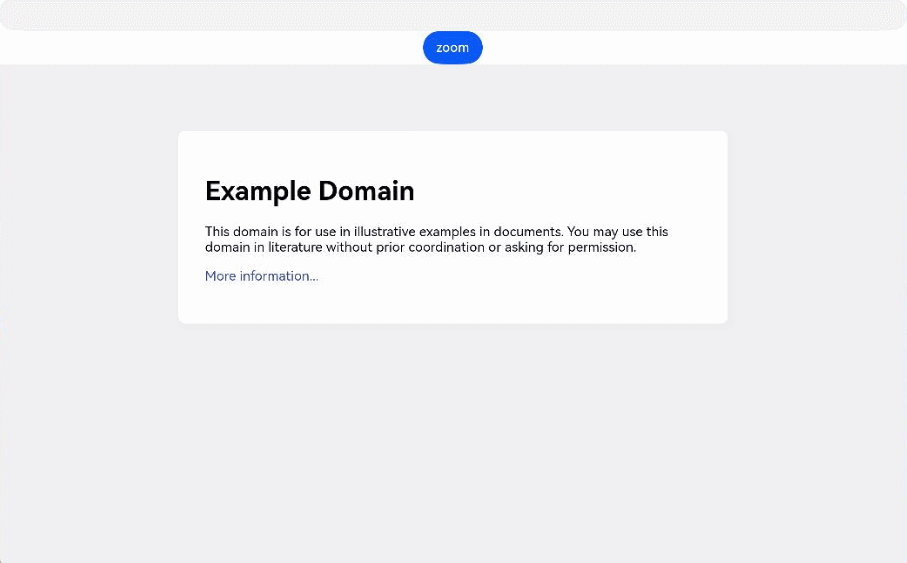
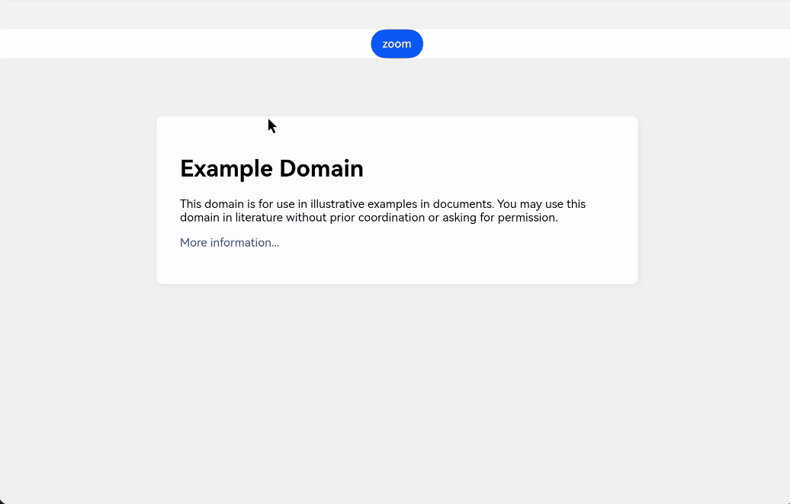

# 使用Web组件管理网页缩放
<!--Kit: ArkWeb-->
<!--Subsystem: Web-->
<!--Owner: @zourongchun-->
<!--Designer: @zhufenghao-->
<!--Tester: @ghiker-->
<!--Adviser: @HelloShuo-->

Web组件支持手势缩放、鼠标滚轮、键盘缩放，以方便用户调整到舒适的显示大小。并对应用提供监听、控制页面缩放比例的功能，以便应用实现个性化的视觉效果。

## 启用/禁用网页缩放

### 启用/禁用网页手势缩放

通过属性[zoomAccess](../reference/apis-arkweb/arkts-basic-components-web-attributes.md#zoomaccess)控制网页缩放功能，当设置为false时，网页不允许手势缩放行为。

当html网页设置`<meta name="viewport" id="viewport" content="user-scalable=no">`时，网页不允许手势缩放。

仅当`zoomAccess`和`viewport`标签都设置为允许缩放时，才允许手势缩放。

> **说明：**
>
> 在PC/2in1设备上，`viewport`标签不生效，仅能通过设置`zoomAccess`为`false`来禁用手势缩放。
> 
> 以上方法仅能控制缩放功能的开关，但如果网页在`viewport`标签中设置了`minimum-scale`和`maximum-scale`，那么缩放的范围也会受到这两个属性的限制，当最大、最小值相等时，网页也是不能缩放的。目前，ArkWeb暂未提供强制缩放页面的功能。
>
> 另外，网页的内容宽度也会限制缩小的比例。

```ts
// xxx.ets
import { webview } from '@kit.ArkWeb';

@Entry
@Component
struct WebComponent {
  controller: webview.WebviewController = new webview.WebviewController();

  build() {
    Column() {
      Web({ src: 'www.example.com', controller: this.controller })
        .zoomAccess(false)
    }
  }
}
```

### 启用/禁用网页键盘鼠标缩放

ArkWeb默认支持通过`Ctrl`+按键`'-'/'+'` 或者 `Ctrl`+鼠标滚轮进行缩放。应用可以通过拦截键盘事件来阻止按键缩放，当前暂未支持拦截`Ctrl`+鼠标滚轮缩放。

通过拦截键盘事件来阻止按键缩放：

```ts
// xxx.ets
import { webview } from '@kit.ArkWeb';
import { KeyCode } from '@kit.InputKit';

@Entry
@Component
struct WebComponent {
  controller: webview.WebviewController = new webview.WebviewController();

  build() {
    Column() {
      Web({ src: 'www.example.com', controller: this.controller })
        .zoomAccess(true)
        .onKeyPreIme((event) => {
          if (event.type == KeyType.Down &&
              event.getModifierKeyState &&
              event.getModifierKeyState(['Ctrl']) &&
              (event.keyCode == KeyCode.KEYCODE_MINUS || event.keyCode == KeyCode.KEYCODE_EQUALS ||
               event.keyCode == KeyCode.KEYCODE_NUMPAD_SUBTRACT || event.keyCode == KeyCode.KEYCODE_NUMPAD_ADD)) {
            return true;
          }
          return false;
        })
    }
  }
}
```

## 监听页面缩放比例变化

应用可以通过[onScaleChange](../reference/apis-arkweb/arkts-basic-components-web-events.md#onscalechange9)接口监听页面缩放比例的变化。
该接口事件对应手势事件(双指缩放)，`event.newScale`对应网页属性`visualViewport.scale`。

```ts
// xxx.ets
import { webview } from '@kit.ArkWeb';

@Entry
@Component
struct WebComponent {
  controller: webview.WebviewController = new webview.WebviewController();

  build() {
    Column() {
      Web({ src: 'www.example.com', controller: this.controller })
        .onScaleChange((event) => {
          console.info('onScaleChange changed from ' + event.oldScale + ' to ' + event.newScale);
        })
    }
  }
}
```

## 控制网页的缩放比例

应用可以通过设置[initialScale](../reference/apis-arkweb/arkts-basic-components-web-attributes.md#initialscale9)属性设置页面初始缩放比例。

应用可以通过[zoom](../reference/apis-arkweb/arkts-apis-webview-WebviewController.md#zoom)、[zoomIn](../reference/apis-arkweb/arkts-apis-webview-WebviewController.md#zoomin)、[zoomOut](../reference/apis-arkweb/arkts-apis-webview-WebviewController.md#zoomout)接口控制页面缩放。

 > **说明：**
 >
 > 使用以上接口控制页面缩放时，必须设置属性`zoomAccess`为`true`。`zoomAccess`为`false`时，`zoom`类接口会抛出异常`17100004`。

### 以固定比例缩放页面

`zoomIn`将当前网页进行放大，比例为25%；`zoomOut`将当前网页进行缩小，比例为20%。

```ts
// xxx.ets
import { webview } from '@kit.ArkWeb';
import { BusinessError } from '@kit.BasicServicesKit';

@Entry
@Component
struct WebComponent {
  controller: webview.WebviewController = new webview.WebviewController();
  build() {
    Column() {
      Button('zoomIn')
        .onClick(() => {
          try {
            this.controller.zoomIn();
          } catch (error) {
            console.error(`ErrorCode: ${(error as BusinessError).code},  Message: ${(error as BusinessError).message}`);
          }
        })
      Button('zoomOut')
        .onClick(() => {
          try {
            this.controller.zoomOut();
          } catch (error) {
            console.error(`ErrorCode: ${(error as BusinessError).code},  Message: ${(error as BusinessError).message}`);
          }
        })
      Web({ src: 'www.example.com', controller: this.controller })
        .zoomAccess(true)
    }
  }
}
```

### 根据输入值控制页面缩放比例:

`zoom`基于当前网页比例进行缩放，入参要求大于0，当入参为1时为默认加载网页的缩放比例，入参小于1为缩小，入参大于1为放大。

```ts
// xxx.ets
import { webview } from '@kit.ArkWeb';
import { BusinessError } from '@kit.BasicServicesKit';

@Entry
@Component
struct WebComponent {
  controller: webview.WebviewController = new webview.WebviewController();
  @State factor: number = 1;

  build() {
    Column() {
      TextInput()
        .type(InputType.NUMBER_DECIMAL)
        .onChange((value)=>{
            this.factor = Number(value);
        })
      Button('zoom')
        .onClick(() => {
          try {
            this.controller.zoom(this.factor);
          } catch (error) {
            console.error(`ErrorCode: ${(error as BusinessError).code},  Message: ${(error as BusinessError).message}`);
          }
        })
      Web({ src: 'www.example.com', controller: this.controller })
        .zoomAccess(true)
    }
  }
}
```


### 缩放页面到目标比例:

通过`onScaleChange`接口，应用可以得知当前网页的缩放比例，配合`zoom`接口即可实现将页面缩放至指定比例的功能。根据当前页面缩放比例`pageFactor`和目标比例`targetFactor`计算`zoom`入参的公式为：

```
factor = 100 * targetFactor / pageFactor
```

```ts
// xxx.ets
import { webview } from '@kit.ArkWeb';
import { BusinessError } from '@kit.BasicServicesKit';

@Entry
@Component
struct WebComponent {
  controller: webview.WebviewController = new webview.WebviewController();
  @State targetFactor: number = 1;
  @State pageFactor: number = 100;

  build() {
    Column() {
      TextInput()
        .type(InputType.NUMBER_DECIMAL)
        .onChange((value)=>{
          this.targetFactor = Number(value);
        })
      Button('zoom')
        .onClick(() => {
          try {
            let factor = this.targetFactor * 100 / this.pageFactor;
            this.controller.zoom(factor);
          } catch (error) {
            console.error(`ErrorCode: ${(error as BusinessError).code},  Message: ${(error as BusinessError).message}`);
          }
        })
      Web({ src: 'www.example.com', controller: this.controller })
        .zoomAccess(true)
        .onScaleChange((event) => {
          console.info('onScaleChange changed from ' + event.oldScale + ' to ' + event.newScale);
          this.pageFactor = event.newScale;
        })
    }
  }
}
```

