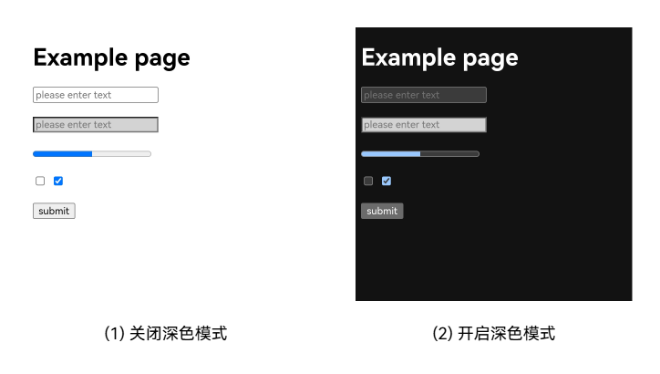
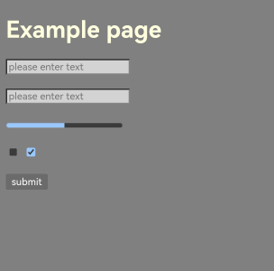
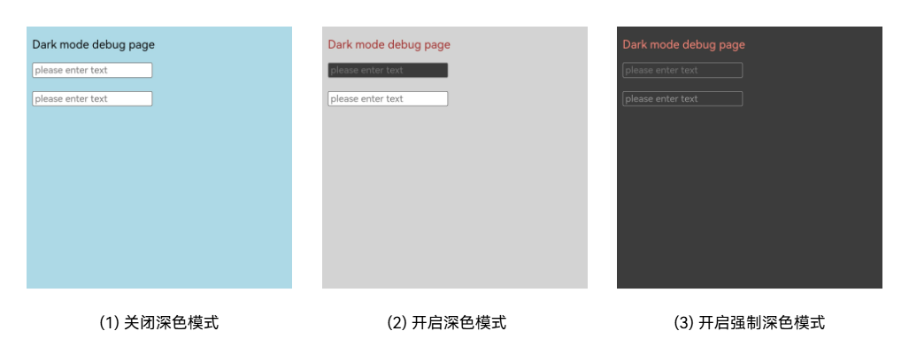

# Web深色模式适配

系统提供浅色和深色的主题模式供用户选择。深色模式在低光环境下能够降低屏幕亮度，减少光线刺激，改善阅读体验。Web组件根据网页样式进行渲染。若网页未适配深色模式，会造成与系统主题的割裂感。网页开发者应考虑用户的主题偏好，适配深色模式，以保证用户体验的一致性。

ArkWeb提供灵活控制Web组件深色模式的能力，支持独立于系统进行设置。此外，ArkWeb还可以强制不同网页适配深色模式，以兼容不同的系统主题。

## 网页深色模式适配
在网页开发过程中，可以使用color-scheme和prefers-color-scheme属性进行深色模式适配。

- color-scheme是一个CSS属性，用于表示网页支持的配色方案，可以影响表单、滚动条和CSS系统颜色。CSS系统颜色指Web组件内置的颜色，是部分元素未定义样式时应用的默认颜色。

  当声明支持深色配色方案时，Web组件可以将网页内的表单、滚动条以及使用CSS系统颜色的元素切换为深色样式。如果元素自定义了颜色样式，则不受color-scheme的影响，保持自定义的颜色样式。

  color-scheme未设置时，默认为`normal`，表示未指定配色方案，使用Web组件的默认配色方案，表现与`light`一致。使用样例如下：

  ```html
  /* 使用方式1：使用meta标签全局设置 */
  <meta name="color-scheme" content="light"> /* 只支持浅色模式 */

  /* 使用方式2：使用style全局设置 */
  :root {
    color-scheme: light dark; /* 支持浅色和深色模式，跟随系统切换 */
  }

  /* 使用方式3：使用style针对特定元素设置 */
  div {
    color-scheme: light; /* 只支持浅色模式 */
  }
  ```

  例如，color-scheme.html页面在Web深色模式关闭和开启时的渲染效果如下图所示。关闭深色模式，网页采用浅色配色方案，input2应用自定义背景样式。开启深色模式，网页采用深色配色方案，input2保持自定义样式，而网页背景、字体、表单、进度条及按钮的颜色均自动切换为深色配色。

  ```html
  <!-- color-scheme.html -->
  <!DOCTYPE html>
  <html>
  <head>
      <meta name="viewport" content="width=device-width, initial-scale=1.0, maximum-scale=1.0, user-scalable=no">
      <meta name="color-scheme" content="light dark">
  </head>
  <body>
    <h1>Example page</h1>
    <input name="input1" type="text" placeholder="please enter text">
    <br><br>
    <input name="input2" type="text" placeholder="please enter text" style="background-color: Lightgray;">
    <br><br>
    <progress value="50" max="100"></progress>
    <br><br>
    <input type="checkbox">
    <input type="checkbox" checked>
    <br><br>
    <button>submit</button>
  </body>
  </html>
  ```

  **图1** color-scheme效果图

  

- prefers-color-scheme是CSS中的一个媒体查询功能，可以检测系统的主题颜色。网页开发者可以通过该特性，为不同的系统主题颜色定义不同的网页CSS样式，以适应用户的主题偏好。使用样例如下：

  ```html
  <style>
    /* 默认样式 */
    body { background-color: White; }

    /* 浅色样式，Web关闭深色模式时覆盖默认样式 */
    @media (prefers-color-scheme: light) {
      body { background-color: Gray; }
    }

    /* 深色样式，Web开启深色模式时覆盖默认样式 */
    @media (prefers-color-scheme: dark) {
      body { background-color: Black; }
    }
  </style>
  ```

  color-scheme可声明网页配色方案，切换网页元素的默认样式。然而，其作用范围有限，使用prefers-color-scheme可以更灵活地定义网页深色模式。prefers-color-scheme可以结合color-scheme使用。

  例如，在color-scheme.html中增加以下样式定义。当Web深色模式开启时，网页将应用深色配色，并应用@media (prefers-color-scheme: dark)中定义的样式，渲染效果如图2所示。

  ```html
  <style>
    @media (prefers-color-scheme: dark) {
      body { background-color: Gray; color: LightYellow; }
      input { background-color: Lightgray; }
    }
  </style>
  ```

  **图2** prefers-color-scheme效果图

  


## Web深色模式设置

通过[darkMode()](../reference/apis-arkweb/arkts-basic-components-web-attributes.md#darkmode9)接口可以配置Web深色模式，默认状态为关闭。应用可设置[WebDarkMode.Auto](../reference/apis-arkweb/arkts-basic-components-web-e.md#webdarkmode9)，表示Web深色模式跟随系统设置。也可以手动设置[WebDarkMode.On](../reference/apis-arkweb/arkts-basic-components-web-e.md#webdarkmode9)或[WebDarkMode.Off](../reference/apis-arkweb/arkts-basic-components-web-e.md#webdarkmode9)来控制深色模式的开启与关闭。

设置[WebDarkMode.On](../reference/apis-arkweb/arkts-basic-components-web-e.md#webdarkmode9)，或设置[WebDarkMode.Auto](../reference/apis-arkweb/arkts-basic-components-web-e.md#webdarkmode9)并启用系统深色模式时，Web将进入深色模式。在深色模式下，Web会应用媒体查询@media(prefers-color-scheme: dark)中定义的深色样式。如果网页未定义深色样式，则保持原有样式。

若要使未适配深色模式的网页强制转换为深色样式，可以使用[forceDarkAccess()](../reference/apis-arkweb/arkts-basic-components-web-attributes.md#forcedarkaccess9)接口开启强制深色模式。强制深色模式可以覆盖网页默认样式，转换网页背景和文字的颜色，以适应在深色模式下显示。强制深色模式无法保证所有颜色转换符合预期。

在强制深色模式下，高亮度色值将被转换为适合低光环境的色值，低亮度色值则保持不变。具体色值转换算法沿用Chromium内核标准，随Chromium内核的更新迭代。色值转换只针对不支持深色配色方案的元素。如果网页全局声明支持深色配色方案，则整个网页的色值均不会被Web转换。

> **说明：**
>
> 若在@media(prefers-color-scheme: dark)中定义了元素的深色样式但未通过color-scheme声明支持深色配色方案，Web会在该深色样式的色值基础上进行转换，如表1所示。

**表1** 深色模式/强制深色模式/color-scheme三者关系

| 深色模式 | 强制深色模式 | color-scheme | 预期结果 |
| - | - | - | - |
| 关闭 | 无影响 | - | 网页采用color-scheme支持的配色方案。 |
| 开启 | 关闭 | - | 网页采用color-scheme支持的配色方案，并应用@media(prefers-color-scheme: dark)中定义的样式。 |
| 开启 | 开启 | 支持深色 | 网页采用深色配色方案，并应用@media(prefers-color-scheme: dark)中定义的样式。 |
| 开启 | 开启 | 不支持深色 | 根据算法转换网页高亮元素色值。若网页在@media(prefers-color-scheme: dark)中定义了样式，则会在该样式色值上进行转换。 |

[forceDarkAccess()](../reference/apis-arkweb/arkts-basic-components-web-attributes.md#forcedarkaccess9)接口仅在Web深色模式开启时生效。在下面的示例中，应用设置Web深色模式跟随系统。系统开启深色模式时，Web进入强制深色模式。

```ts
// xxx.ets
import { webview } from '@kit.ArkWeb';

@Entry		
@Component
struct WebComponent {
  controller: webview.WebviewController = new webview.WebviewController();
  @State mode: WebDarkMode = WebDarkMode.Auto;
  @State access: boolean = true;

  build() {
    Column() {
      Web({ src: $rawfile('index.html'), controller: this.controller })
        .darkMode(this.mode)
        .forceDarkAccess(this.access)
    }
  }
}
```

index.html页面代码如下：

```html
<!-- index.html -->
<!DOCTYPE html>
<html>
<head>
    <meta name="viewport" content="width=device-width, initial-scale=1.0, maximum-scale=1.0, user-scalable=no">
    <style type="text/css">
        body { background: LightBlue; color: Black; }
        @media (prefers-color-scheme: dark) {
            body { background: LightGray; color: Brown; }
        }
    </style>
</head>
<body class="contentCss">
  <p>Dark mode debug page</p>
  <input name="input1" placeholder="please enter text" style="color-scheme: light dark;">
  <br><br>
  <input name="input2" placeholder="please enter text">
</body>
</html>
```

index.html页面在深色模式关闭、深色模式开启及强制深色模式开启时的样式如图3所示。关闭深色模式，网页采用默认样式。开启深色模式，input1的配色方案切换为深色，网页应用@media(prefers-color-scheme: dark)中定义的灰色背景、棕色文字样式。开启强制深色模式，input1的配色方案为深色，未被Web转换，而网页背景色、文字颜色及input2背景色均依据(2)中色值转换为(3)所示。

**图3** Web深色模式和强制深色模式效果图



## 常见问题

### 网页未切换为深色样式

**问题现象**

网页未切换为深色样式。

**解决措施**

网页未切换为深色样式的原因有多种，可以按以下步骤排查：

1. 检查Web是否开启深色模式。Web深色模式接口[darkMode()](../reference/apis-arkweb/arkts-basic-components-web-attributes.md#darkmode9)默认状态为关闭，需显式声明为[WebDarkMode.On](../reference/apis-arkweb/arkts-basic-components-web-e.md#webdarkmode9)或[WebDarkMode.Auto](../reference/apis-arkweb/arkts-basic-components-web-e.md#webdarkmode9)，才能开启深色模式。

2. Web已开启深色模式时，检查网页是否定义深色样式。网页的深色样式需要网页开发者适配。如果未定义深色样式，即使Web开启深色模式，网页样式也会保持不变。若需强制适配，可以使用[forceDarkAccess()](../reference/apis-arkweb/arkts-basic-components-web-attributes.md#forcedarkaccess9)接口开启强制深色模式。

3. Web已开启强制深色模式时，检查网页是否声明支持深色配色方案。通过color-scheme声明支持深色配色方案的网页，在强制深色模式下色值不会被Web转换。同时，如果网页内元素自定义了颜色样式，则不会被color-scheme影响。因此表现为网页样式未切换为深色样式。此时，需要网页开发者进行适配修改。

### 强制深色模式开启后，网页样式异常

**问题现象**

强制深色模式开启，网页样式转换显示异常，例如字体显示不清、样式不美观或颜色转换不当等。

**解决措施**

强制深色模式下，Web使用Chromium色值转换算法自动调整元素颜色样式。不同网页的布局和样式写法各异，算法无法确保所有转换均符合预期。建议网页开发者自定义深色样式。

### 未开启深色模式，但Web网页背景变深

**问题现象**

Web组件未开启深色模式，但Web网页背景变深。

**解决措施**

Web网页未设置背景颜色，或者设置背景颜色透明时，会呈现Web组件的背景颜色。因此出现该问题时，可排查Web组件是否设置了深色的[backgroundColor()](../reference/apis-arkui/arkui-ts/ts-universal-attributes-background.md#backgroundcolor)。