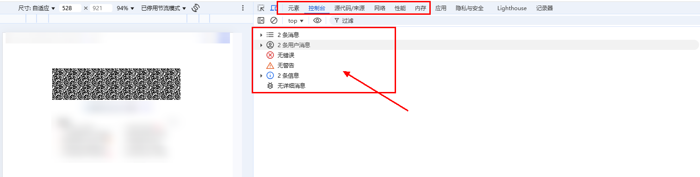
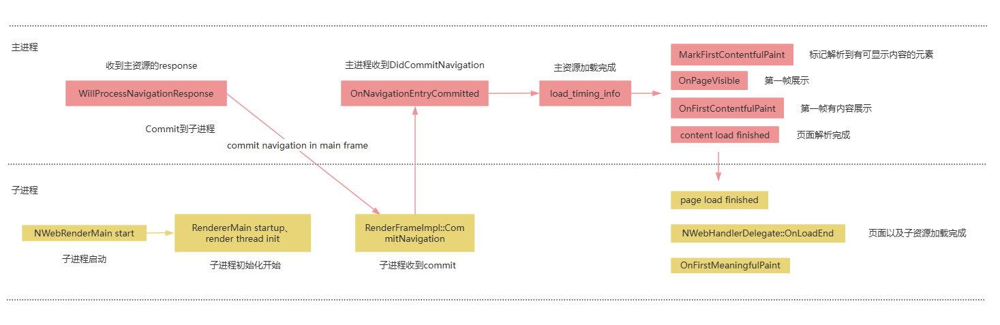

# 定位与解决Web白屏问题

Web页面出现白屏的原因众多，本文列举了若干常见白屏问题的排查步骤，供开发者快速定位。

1. 首先排查权限和网络状态。
2. 通过[使用DevTools工具调试前端页面](web-debugging-with-devtools.md)定位具体报错类型（跨域、资源404、JS异常）。
3. 在复杂布局场景中，排查渲染模式及组件约束条件的问题。
4. 处理H5代码兼容性问题。
5. 从日志中排查生命周期和网络加载相关关键字。

## 检查权限和网络状态
如果应用未开启联网或文件访问权限或者设备网络状态不佳，将导致Web组件加载失败或页面元素缺失，进而引起白屏。
* 验证设备的网络状态，包括是否已连接网络，设备自带的浏览器能否正常访问网页等（在线页面场景）。
* 确保应用已添加网络权限：ohos.permission.INTERNET（在线页面必需）。
  ```
  // 在module.json5中添加相关权限
  "requestPermissions":[
     {
        "name" : "ohos.permission.INTERNET"
     }
  ]
  ```
* 开启相关权限：
    | 名称   | 说明  |                       
    | ----   | -------------------------------- |
    | [domStorageAccess](../reference/apis-arkweb/arkts-basic-components-web-attributes.md#domstorageaccess) | DOM Storage API权限，若不开启，无法使用localStorage存储数据，任何调用localStorage的代码都将失效，依赖本地存储的功能会异常。 |
    | [fileAccess](../reference/apis-arkweb/arkts-basic-components-web-attributes.md#fileaccess) | ‌若不开启，文件读写功能完全被阻断，依赖文件的模块会崩溃。 | 
    | [imageAccess](../reference/apis-arkweb/arkts-basic-components-web-attributes.md#imageaccess) | 设置是否允许自动加载图片资源。 | 
    | [onlineImageAccess](../reference/apis-arkweb/arkts-basic-components-web-attributes.md#onlineimageaccess) | 设置是否允许从网络加载图片资源（通过HTTP和HTTPS访问的资源）。 |
    | [javaScriptAccess](../reference/apis-arkweb/arkts-basic-components-web-attributes.md#javascriptaccess) | 设置是否允许执行JavaScript脚本。 | 


  ```ts
  // xxx.ets
  import { webview } from '@kit.ArkWeb';

  @Entry
  @Component
  struct WebComponent {
    controller: webview.WebviewController = new webview.WebviewController();

    build() {
      Column() {
        Web({ src: 'www.example.com', controller: this.controller })
          .domStorageAccess(true)
          .fileAccess(true)
          .imageAccess(true)
          .onlineImageAccess(true)
          .javaScriptAccess(true)
      }
    }
  }
  ```
* 修改[UserAgent](../reference/apis-arkweb/arkts-apis-webview-WebviewController.md#setcustomuseragent10)后再观察页面是否恢复正常。

  ```ts
  // xxx.ets
  import { webview } from '@kit.ArkWeb';
  import { BusinessError } from '@kit.BasicServicesKit';

  @Entry
  @Component
  struct WebComponent {
    controller: webview.WebviewController = new webview.WebviewController();
    @State customUserAgent: string = ' DemoApp';

    build() {
      Column() {
        Web({ src: 'www.example.com', controller: this.controller })
        .onControllerAttached(() => {
          console.log("onControllerAttached");
          try {
            let userAgent = this.controller.getUserAgent() + this.  customUserAgent;
            this.controller.setCustomUserAgent(userAgent);
          } catch (error) {
            console.error(`ErrorCode: ${(error as BusinessError).code},  Message: ${(error as BusinessError).message}`);
          }
        })
      }
    }
  }
  ```
## 使用DevTools工具进行页面内容验证
在确保网络与权限配置无误后，若仍出现白屏，则应利用DevTools工具调试前端页面以及监听Web相关错误上报接口，来定位具体报错类型。

1. 查阅控制台的错误信息，定位具体的资源加载失败问题。资源加载失败会导致页面元素缺失，布局紊乱，图片和动画效果失效等，严重时可能导致渲染进程崩溃，页面呈现空白。如同所示，依次排查：<br>
  1、元素是否完整，html元素、结构是否正确。<br> 2、控制台是否有报错。<br>3、网络里面是否有资源加载时间特别长等。
   

2. 检查控制台，确认是否存在因MixedContent策略或CORS策略导致的异常，或JS错误等。可参考[解决Web组件本地资源跨域问题](web-cross-origin.md)。跨域问题频现于Vue/React项目中，根源在于ArkWeb内核禁止使用file://或resource://协议加载跨域资源（例如Vue项目中的本地文件请求）。

    解决方案：
    * 改用HTTP或HTTPS协议加载主页面（需本地服务器支持）。
    * 若必需使用本地文件，通过[onInterceptRequest](../reference/apis-arkweb/arkts-basic-components-web-events.md#oninterceptrequest9)拦截资源请求并替换为本地资源。
   ```c
   // 在web组件中拦截请求并返回本地资源
   Web({
       src: 'http://your-domain/indexl.html',
       controller: this.controller
   })
   .onInterceptRequest((event) => {
       if (event.request.url.endWith('.js')) {
           // 读取本地文件并返回响应
           const data = fs.readSync('/path/to/local/file.js');
           return {
               responseCode: 200,
               responseData: { data: data },
               header: { 'Content-Type': 'application/javascript' }
           };
       }
    return null;  //其他请求不拦截
   })
   ```

3. 查看onErrorReceive、onHttpErrorReceive、onSslErrorEvent、onHttpAuthRequest、onClientAuthenticationRequest等错误上报接口是否有被调用。

    | 名称   | 说明  |                       
    | ----   | -------------------------------- |
    | [onErrorReceive](../reference/apis-arkweb/arkts-basic-components-web-events.md#onerrorreceive) | 资源加载失败会上报该回调，比如访问内核不支持的scheme， 会报302(UNKNOWN_URL_SCHEME)。 |
    | [onHttpErrorReceive](../reference/apis-arkweb/arkts-basic-components-web-events.md#onhttperrorreceive) | 服务器返回HTTP错误码，这类问题一般需要跟服务器进行联调。 | 
    | [onHttpAuthRequest](../reference/apis-arkweb/arkts-basic-components-web-events.md#onhttpauthrequest9) | 服务器返回407需要端侧提供用户名密码认证，如果不正确处理，可能会导致加载异常、白屏。 | 
    | [onClientAuthenticationRequest](../reference/apis-arkweb/arkts-basic-components-web-events.md#onclientauthenticationrequest9) | 服务器向端侧请求证书，如果不正确处理，会导致页面加载异常。 | 
    | [onSslErrorEvent](../reference/apis-arkweb/arkts-basic-components-web-events.md#onsslerrorevent12) | 证书错误，需要应用根据证书错误信息进行排查，是证书配错了？还是过期了。 | 


## 复杂的布局与渲染模式导致白屏
若页面使用了复杂布局或渲染模式，需注意其应用场景和约束条件，不当使用可能导致布局混乱或白屏。比如使用[layoutMode](../reference/apis-arkweb/arkts-basic-components-web-attributes.md#layoutmode11)：

- 配置同步渲染模式：webSetting({renderingMode: WebRenderingMode.SYNCHRONOUS})。
- 关闭滚动效果：webSetting({overScrollMode: OverScrollMode.NEVER})。
- 此模式下不支持动态调整组件高度，确保页面高度固定。
- 避免在FIT_CONTENT模式下启用键盘避让属性RESIZE_CONTENT，以免导致布局失效。

## 处理H5代码兼容性
兼容性问题处理不当也会导致页面白屏。
* 特殊协议拦截。
* 若H5页面调用tel:、mailto:等协议导致白屏，需通过onInterceptRequest拦截并调用系统拨号能力：
   ```c
   .onInterceptRequest((event) => {
       if (event.request.url.startWith('tel:')) {
           // 调用系统拨号能力
           call.makeCall({ phoneNumber: '123456' });
           return { responseCode: 404 }; // 阻止默认行为
       }
       return null;  
   })
   ```
## 监控内存与生命周期
内存达到阈值会导致渲染进程被终止，从而引发白屏现象；同样，渲染进程创建失败或非正常销毁也会导致白屏。可从日志中排查原因。检查Web组件是否与WebController正确绑定，或是否因过早释放导致白屏。关注日志中与Render进程相关的信息：是否存在内存泄漏使渲染内存不足。关键字“MEMORY_PRESSURE_LEVEL_CRITICAL”表明内存已达到阈值，此情形下Web可能遭遇黑屏、花屏或闪屏等异常状况，需排查是否存在内存泄漏问题。Render进程是否成功启动或异常退出。

下面列举一些日志中的关键字和对应的情况说明：

| 日志关键字   | 说明  |                       
| ----   | -------------------------------- |
| StartRenderProcess failed | 渲染render进程启动失败。 |
| MEMORY_PRESSURE_LEVEL_CRITICAL | 整机内存压力达到阈值，继续使用可能造成黑屏、闪屏白屏等问题。 |
| crashpad SandboxedHandler::HandlerCrash, received signo = xxx | 渲染render进程crash，会造成白屏、Web组件卡死等问题。 |
| SharedContextState context lost via Skia OOM | 共享内存不足，会导致应用闪退、花屏卡死等问题。
| CreateNativeViewGLSurfaceEGLOhos::normal surface | 创建egl surface成功，如果没有该日志打印则会造成白屏问题。|
| INFO: request had no response within 5 seconds | 网络超时。 |
| final url: ***, error_code xxx(net::ERR_XXX) | 主资源加载报错。|

下面说明一下Web组件网络加载过程中的关键日志，正常情况下一个Web组件的加载过程应该包含这些关键节点：


| 日志关键字   | 说明  |                       
| ----   | -------------------------------- |
| NWebRenderMain start  | 子进程启动。 |
| RendererMain startup 、<br> render thread init | 子进程初始化开始。 |
| event_message: WillProcessNavigationResponse source_id xxx navigation_handle id: xxx| 收到主资源的response。 |
| event_message: commit navigation in main frame, routing_id: 4, url: *** | Commit到子进程。
| RenderFrameImpl::CommitNavigation、<br> event_message: page load start | 子进程收到commit。|
| NWebHandlerDelegate::OnNavigationEntryCommitted、<br> event_message: Commit source_id xxx | 主进程收到DidCommitNavigation。|
| event_message: load_timing_info errpr_code:0,...| 主资源加载完成，以及各阶段耗时。|
| event_message: MarkFirstContentfulPaint| 标记解析到有可显示内容的元素。|
| NWebHandlerDelegate::OnPageVisible| 第一帧展示。|
| NWebHandlerDelegate::OnFirstContentfulPaint| 第一帧有内容展示。|
| event_message: content load finished | 页面解析完成。|
| event_message: page load finished、<br> NWebHandlerDelegate::OnLoadEnd、<br> NWebHandlerDelegate::MainFrame OnLoadEnd、<br> NWebHandlerDelegate::OnFirstMeaningfulPaint | 页面以及子资源加载完成。|

