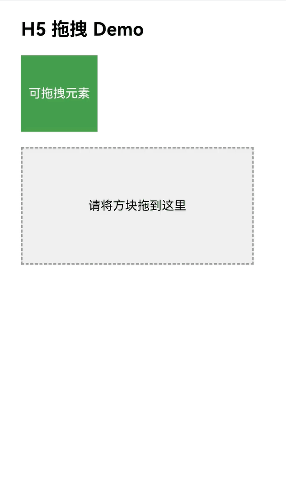

# 使用Web组件的拖拽功能与网页交互
<!--Kit: ArkWeb-->
<!--Subsystem: Web-->
<!--Owner: @zourongchun-->
<!--Designer: @zhufenghao-->
<!--Tester: @ghiker-->
<!--Adviser: @HelloShuo-->

ArkWeb的拖拽功能使应用能够在网页中实现元素的拖放，用户可以长按可拖拽的元素，将其拖至可放置的元素上，然后松手完成放置。ArkWeb在网页内容中的拖拽功能满足H5标准。

## 将网页内容拖拽至其他应用

ArkWeb目前支持以下四种数据格式。应用按照 H5 标准设置这些格式的拖拽数据，即可将内容拖拽到其他应用中。

| 数据格式      | 说明     |
| ------------- | -------- |
| text/plain    | 文本     |
| text/uri-list | 链接     |
| text/html     | HTML格式 |
| Files         | 文件     |

## 拖拽事件通知

ArkWeb拖拽不同于ArkUI的组件级拖拽，主要针对网页内容的拖拽，因此仅支持部分拖拽事件的监听方法。

| 监听方法    | 说明                                                  |
| ----------- | ----------------------------------------------------- |
| [onDragStart](../reference/apis-arkui/arkui-ts/ts-universal-events-drag-drop.md#ondragstart)  | 不建议使用此方法，否则会影响Web组件的拖拽行为，造成拖拽逻辑不符合预期，如无法触发html拖拽事件监听，预览图无法创建或预览图错误，拖拽数据无法预置等。|
|  [onDragEnter](../reference/apis-arkui/arkui-ts/ts-universal-events-drag-drop.md#ondragenter) | 拖拽的元素进入Web区域。 |
| [onDragMove](../reference/apis-arkui/arkui-ts/ts-universal-events-drag-drop.md#ondragmove)  | 拖拽的元素在Web区域移动。  |
| [onDragLeave](../reference/apis-arkui/arkui-ts/ts-universal-events-drag-drop.md#ondragleave) | 拖拽的元素离开Web区域。          |
| [onDragEnd](../reference/apis-arkui/arkui-ts/ts-universal-events-drag-drop.md#ondragend10) | 由Web发起的拖拽元素结束拖拽。         |

## 在ArkTS侧实现拖拽相关逻辑

在多数情况下，应用在H5端实现的拖拽功能能够满足需求。如有需要，请参考以下案例，实现在ArkTS端进行拖拽数据读取等操作。
1. [建立应用侧与前端页面数据通道](web-app-page-data-channel.md)。
2. 在onDrop方法中，做简单逻辑，例如暂存一些关键数据。
3. 在ArkTS侧接受消息的方法中，添加应用处理逻辑，可以进行耗时任务。

由于ArkTS侧的onDrop方法会早于H5中放置事件的处理方法（html示例中的droppable.addEventListener('drop')）执行，若在onDrop方法中进行页面跳转等操作，将导致H5中的drop方法无法正确执行，产生不符合预期的结果。因此，应建立双向通信机制，在H5中的drop方法执行完毕后，通知ArkTS侧执行相应的业务逻辑，以确保业务逻辑的预期执行。

```ts
import { webview } from '@kit.ArkWeb'
import { unifiedDataChannel, uniformTypeDescriptor } from '@kit.ArkData';

@Entry
@Component
struct DragDrop {
  private controller: webview.WebviewController = new webview.WebviewController()
  @State ports: Array<webview.WebMessagePort> = []
  @State dragData: Array<unifiedDataChannel.UnifiedRecord> = []

  build() {
    Column() {
      Web({
        src: $rawfile("drag.html"),
        controller: this.controller,
      }).onPageEnd((event) => {
        //注册通信端口
        this.ports = this.controller.createWebMessagePorts();
        this.ports[1].onMessageEvent((result: webview.WebMessage) => {
          //ArkTS收到html传来的数据后的处理，可以先打日志确认下消息，双端的消息格式可以自己约定，能唯一识别就行
          console.info("ETS receive Message: typeof (result) = " + typeof (result) + ";" + result);
          //这里添加result中消息接收到后的处理,可进行耗时任务
        });
        console.info("ETS postMessage set h5port ");
        //完成通信端口注册后，向前端发送注册完成消息，完成双向的端口绑定
        this.controller.postMessage('__init_port__', [this.ports[0]], '*');
      })// onDrop 可做简单逻辑，例如暂存一些关键数据
        .onDrop((DragEvent: DragEvent) => {
          console.info("ETS onDrop!")
          let data: UnifiedData = DragEvent.getData();
          if(!data) {
            return false;
          }
          let uriArr: Array<unifiedDataChannel.UnifiedRecord> = data.getRecords();
          if (!uriArr || uriArr.length <= 0) {
            return false;
          }
          // 可以遍历records取数据暂存，或者以其他方式暂存数据
          for (let i = 0; i < uriArr.length; ++i) {
            if (uriArr[i].getType() === uniformTypeDescriptor.UniformDataType.PLAIN_TEXT) {
              let plainText = uriArr[i] as unifiedDataChannel.PlainText;
              if (plainText.textContent) {
                console.info("plainText.textContent: ", plainText.textContent);
              }
            }
          }
          return true
        })
    }

  }
}
```

html示例:

```html
<html lang="zh-CN">
<head>
    <meta charset="UTF-8">
    <meta name="viewport" content="width=device-width, initial-scale=1.0, user-scalable=no">
    <title>H5 拖拽 Demo</title>
</head>
<style>
    body {
      font-family: Arial, sans-serif;
      padding: 20px;
    }

    .draggable {
      width: 100px;
      height: 100px;
      background-color: #4CAF50;
      color: white;
      text-align: center;
      line-height: 100px;
      margin-bottom: 20px;
      cursor: grab;
    }

    .droppable {
      width: 300px;
      height: 150px;
      border: 2px dashed #999;
      background-color: #f0f0f0;
      text-align: center;
      line-height: 150px;
      font-size: 16px;
    }

    .success {
      background-color: #4CAF50;
      color: white;
    }
</style>
<body>

<h2>H5 拖拽 Demo</h2>

<div id="draggable" class="draggable" draggable="true">可拖拽元素</div>

<div id="droppable" class="droppable">请将方块拖到这里</div>

<script>
    const draggable = document.getElementById('draggable');
    const droppable = document.getElementById('droppable');

    // 拖拽开始事件
    draggable.addEventListener('dragstart', function (e) {
      e.dataTransfer.setData('text/plain', this.id);
      this.style.opacity = '0.4';
    });

    // 拖拽结束事件
    draggable.addEventListener('dragend', function (e) {
      this.style.opacity = '1';
    });

    // 拖入目标区域时触发
    droppable.addEventListener('dragover', function (e) {
      e.preventDefault(); // 必须调用，否则无法触发 drop 事件
    });

    // 放置事件
    droppable.addEventListener('drop', function (e) {
      e.preventDefault();
      const data = e.dataTransfer.getData('text/plain');
      // 传入ArkTS
      PostMsgToArkTS(data);
      const draggableEl = document.getElementById(data);
      this.appendChild(draggableEl);
      this.classList.add('success');
      this.textContent = "放置成功！";
    });

    // 	scriptproxy端口在js侧设置
    var h5Port;
    window.addEventListener('message', function (event) {
    console.info("H5 receive settingPort message");
        if (event.data == '__init_port__') {
            if (event.ports[0] != null) {
                console.info("H5 set h5Port " + event.ports[0]);
                h5Port = event.ports[0];
            }
        }
    });

    // 通过scriptproxy方式,发送数据到ArkTS侧的实现
    function PostMsgToArkTS(data) {
        console.info("H5 PostMsgToArkTS, h5Port " + h5Port);
        if (h5Port) {
          h5Port.postMessage(data);
        } else {
          console.error("h5Port is null, Please initialize first");
        }
    }
</script>

</body>
</html>
```

日志打印：


## 常见问题

### 为什么H5设置的拖拽事件没有触发？
请检查相关CSS资源是否正常设置，因为有些网页UA做了判断，针对特定设备的UA才会进行CSS样式设置。可以考虑在Web组件设置自定义UA解决这种问题，例如：

```ts
import { webview } from '@kit.ArkWeb'

@Entry
@Component
struct Index {
    private webController: webview.WebviewController = new webview.WebviewController()
    build(){
      Column() {
        Web({
          src: "example.com",
          controller: this.webController,
        }).onControllerAttached(() => {
          // 特定UA
          let customUA = 'android'
          this.webController.setCustomUserAgent(this.webController.getUserAgent() + customUA)
        })
      }
    }
}
```
