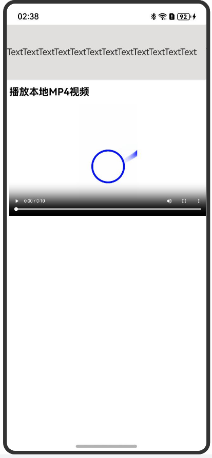
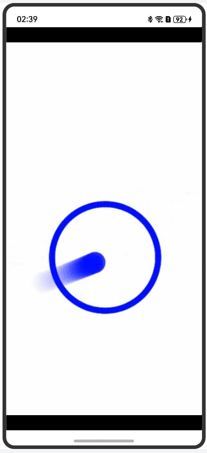

# Web组件支持视频沉浸式全屏播放

Web组件提供了视频进入全屏和退出全屏的事件功能，应用可通过监听这些事件实现进入和退出沉浸式全屏模式。

Web组件引用第三方H5页面加载的视频，当点击视频全屏时，视频仅扩展至整个Web组件区域，无法实现系统全屏显示（如图2所示）。若要达到系统全屏的沉浸式视频播放效果（如图3所示），则需应用监听进入全屏的事件并调整页面其他组件的属性。


| 图1 退出全屏模式 | 图2 非沉浸式全屏模式 | 图3 沉浸式全屏模式 |
| :--------------------------------------------: | :---------------------------------------------: | :---------------------------------------------: |
| |  |  |

Web组件可通过[onFullScreenEnter](../reference/apis-arkweb/ts-basic-components-web-events.md#onfullscreenenter9)和[onFullScreenExit](../reference/apis-arkweb/ts-basic-components-web-events.md#onfullscreenexit9)回调监听全屏按键的点击事件。其中，onFullScreenEnter表示Web组件进入全屏模式，onFullScreenExit表示Web组件退出全屏模式。在这两个监听事件中，可根据具体业务场景调整某些全局变量，例如组件的显隐状态、组件的margin属性等，以实现退出和进入沉浸式全屏模式的页面效果，如图1和图3所示。

显隐控制[visibility](../reference/apis-arkui/arkui-ts/ts-universal-attributes-visibility.md#visibility)是ArkUI开发框架提供的组件通用属性。开发者可通过设置组件属性visibility的不同值，控制组件的显隐状态。


```ts
import { webview } from '@kit.ArkWeb';

@Entry
@Component
struct ShortWebPage {
  controller: webview.WebviewController = new webview.WebviewController()
  CONSTANT_HEIGHT = 100;
  @State marginTop: number = this.CONSTANT_HEIGHT;
  @State isVisible: boolean = true; // 自定义标志位isVisible，来控制是否需要显示组件

  build() {
    Column() {
      Text('TextTextTextText')
        .width('100%')
        .height(this.CONSTANT_HEIGHT)
        .backgroundColor('#e1dede') // 当isVisible标志位为true的时候，组件状态为可见，否则组件状态为不可见，不参与布局、不进行占位
        .visibility(this.isVisible ? Visibility.Visible :
        Visibility.None)
      Web({
        src: "http://www.example.com", // 示例网址
        controller: this.controller
      })
        .onFullScreenEnter((event) => {
          console.log("onFullScreenEnter...")
          // 当全屏的时候，isVisible标志位为false，组件状态为不可见，不参与布局、不进行占位
          this.isVisible = false;
        })
        .onFullScreenExit(() => {
          console.log("onFullScreenExit...")
          // 当退出全屏的时候，isVisible标志位为true，组件状态为可见
          this.isVisible = true;
        })
        .width('100%')
        .height("100%")
        .zIndex(10)
        .zoomAccess(true)
    }.width('100%').height('100%')
  }
}
```