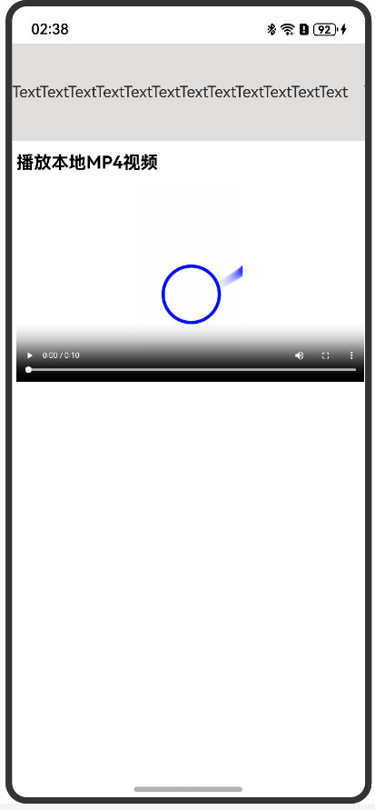

# Web组件支持视频沉浸式全屏播放
<!--Kit: ArkWeb-->
<!--Subsystem: Web-->
<!--Owner: @zhangyao75477-->
<!--Designer: @gzweioh-->
<!--Tester: @ghiker-->
<!--Adviser: @HelloShuo-->

Web组件提供了视频进入全屏和退出全屏的事件功能，应用可通过监听这些事件实现进入和退出沉浸式全屏模式。

Web组件引用第三方H5页面加载的视频，当单击视频全屏时，视频仅扩展至整个Web组件区域，无法实现系统全屏显示（如图2所示）。若要达到系统全屏的沉浸式视频播放效果（如图3所示），则需应用监听进入全屏的事件并调整界面其他组件的属性。


| 图1 退出全屏模式 | 图2 非沉浸式全屏模式 | 图3 沉浸式全屏模式 |
| :--------------------------------------------: | :---------------------------------------------: | :---------------------------------------------: |
| |  |  |

Web组件可通过[onFullScreenEnter](../reference/apis-arkweb/arkts-basic-components-web-events.md#onfullscreenenter9)和[onFullScreenExit](../reference/apis-arkweb/arkts-basic-components-web-events.md#onfullscreenexit9)回调监听全屏按键的单击事件。其中，onFullScreenEnter表示Web组件进入全屏模式，onFullScreenExit表示Web组件退出全屏模式。在这两个监听事件中，可根据具体业务场景调整某些全局变量，例如组件的显隐状态、组件的margin属性等，以实现退出和进入沉浸式全屏模式的界面效果，如图1和图3所示。

可见性[visibility](../reference/apis-arkui/arkui-ts/ts-universal-attributes-visibility.md#visibility)是ArkUI提供的组件通用属性。开发者可通过设置组件属性visibility的不同值，控制组件的显隐状态。

<!-- @[web_full_screen](https://gitcode.com/openharmony/applications_app_samples/blob/master/code/DocsSample/ArkWeb/ArkWebPictureInPicture/entry1/src/main/ets/pages/Index.ets) -->

``` TypeScript
import { webview } from '@kit.ArkWeb';

@Entry
@Component
struct ShortWebPage {
  controller: webview.WebviewController = new webview.WebviewController();
  CONSTANT_HEIGHT = 100;
  @State isVisible: boolean = true; // 自定义标志位isVisible，来控制是否需要显示组件

  build() {
    Column() {
      Text('TextTextTextText')
        .width('100%')
        .height(this.CONSTANT_HEIGHT)
        .backgroundColor('#e1dede')
        .visibility(this.isVisible ? Visibility.Visible :
          Visibility.None) // 当isVisible标志位为true的时候，组件状态为可见，否则组件状态为不可见，不参与布局、不进行占位
      Web({
        src: $rawfile('FullScreen.html'), // 示例网址
        controller: this.controller
      })
        .onFullScreenEnter((event) => {
          console.info('onFullScreenEnter...');
          // 当全屏的时候，isVisible标志位为false，组件状态为不可见，不参与布局、不进行占位
          this.isVisible = false;
        })
        .onFullScreenExit(() => {
          console.info('onFullScreenExit...');
          // 当退出全屏的时候，isVisible标志位为true，组件状态为可见
          this.isVisible = true;
        })
        .width('100%')
        .height('100%')
        .zIndex(10)
        .zoomAccess(true)
    }.width('100%').height('100%')
  }
}
```

## 常见问题

全屏播放中可能会遇到的问题如下。

### Web组件加载视频，点击全屏按钮怎么切换横竖屏显示

**问题现象**

播放视频时点击全屏按钮，进入沉浸式全屏界面，但不是横屏。

**可能原因**

Web组件全屏模式仅改变内容布局，不触发应用窗口方向切换。

**解决措施**

使用Web组件进入全屏模式时，窗口的横竖屏状态不会主动发生变化，需要通过Web组件的[onFullScreenEnter](../reference/apis-arkweb/arkts-basic-components-web-events.md#onfullscreenenter9)和[onFullScreenExit](../reference/apis-arkweb/arkts-basic-components-web-events.md#onfullscreenexit9)方法，监听Web组件进入和退出全屏模式事件。

<!-- @[toggle fullscreen](https://gitcode.com/openharmony/applications_app_samples/blob/master/code/DocsSample/ArkWeb/ArkWebFullScreen/entry/src/main/ets/pages/Index.ets) -->
``` TypeScript
Web({ src:$rawfile("video.html"), controller: this.controller }) // 注意替换
  .domStorageAccess(true)
  .expandSafeArea([SafeAreaType.SYSTEM])
  .onFullScreenEnter(() => {
    this.isFullScreen = true;
    this.changeOrientation(true);
  })
  .onFullScreenExit(() => {
    this.isFullScreen = false;
    this.changeOrientation(false);
  })
```

通过Window提供的setPreferredOrientation方法设置横竖屏。

<!-- @[toggle screen orientation](https://gitcode.com/openharmony/applications_app_samples/blob/master/code/DocsSample/ArkWeb/ArkWebFullScreen/entry/src/main/ets/pages/Index.ets) -->
``` TypeScript
// 改变设备横竖屏状态
private changeOrientation(isLandscape: boolean) {
  // 获取UIAbility实例的上下文信息
  let context: common.UIAbilityContext = this.getUIContext().getHostContext() as common.UIAbilityContext;
  // 调用该接口手动改变设备横竖屏状态
  window.getLastWindow(context).then((lastWindow) => {
    lastWindow.setPreferredOrientation(isLandscape ? window.Orientation.LANDSCAPE : window.Orientation.PORTRAIT);
  }).catch((err: Error) => {
    console.error(`获取窗口失败: ${err.message}`);
  });
}
```

自定义侧滑操作时，判断当前视频是否处于全屏状态，若处于全屏状态下则先执行侧滑退出全屏的逻辑。

<!-- @[exit full screen](https://gitcode.com/openharmony/applications_app_samples/blob/master/code/DocsSample/ArkWeb/ArkWebFullScreen/entry/src/main/ets/pages/Index.ets) -->
``` TypeScript
 onBackPress(): boolean | void {
    if (this.isFullScreen) {
      this.isFullScreen = false;
      this.changeOrientation(false);
      return true;
    } else {
      router.back();
      return true;
    }
  }
```

完整示例：

<!-- @[switch between portrait and landscape](https://gitcode.com/openharmony/applications_app_samples/blob/master/code/DocsSample/ArkWeb/ArkWebFullScreen/entry/src/main/ets/pages/Index.ets) -->
``` TypeScript
import { webview } from '@kit.ArkWeb';
import { window, router } from '@kit.ArkUI';
import { common } from '@kit.AbilityKit';

@Entry
@Component
struct WebVideo {
  controller: webview.WebviewController = new webview.WebviewController();
  @State isFullScreen: boolean = false;

  // 改变设备横竖屏状态
  private changeOrientation(isLandscape: boolean) {
  // 获取UIAbility实例的上下文信息
  let context: common.UIAbilityContext = this.getUIContext().getHostContext() as common.UIAbilityContext;
  // 调用该接口手动改变设备横竖屏状态
    window.getLastWindow(context).then((lastWindow) => {
      lastWindow.setPreferredOrientation(isLandscape ? window.Orientation.LANDSCAPE : window.Orientation.PORTRAIT);
    }).catch((err: Error) => {
      console.error(`获取窗口失败: ${err.message}`);
    });
  }

  onBackPress(): boolean | void {
    if (this.isFullScreen) {
      this.isFullScreen = false;
      this.changeOrientation(false);
      return true;
    } else {
      router.back();
      return true;
    }
  }

  build() {
    Column() {
      Web({
        src:$rawfile('video.html'), // 需要替换
        controller: this.controller
      })
        .domStorageAccess(true)
        .expandSafeArea([SafeAreaType.SYSTEM])
        .onFullScreenEnter(() => {
          this.isFullScreen = true;
          this.changeOrientation(true);
        })
        .onFullScreenExit(() => {
          this.isFullScreen = false;
          this.changeOrientation(false);
        })
    }
    .height('100%')
    .width('100%')
    .backgroundColor('#000000')
  }
}
```
