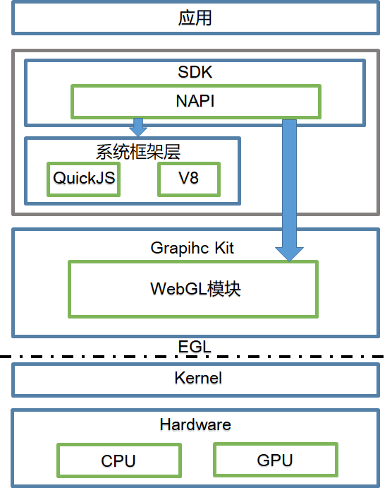

# 概述

WebGL的全称为Web Graphic Library(网页图形库)，主要用于交互式渲染2D图形和3D图形。目前OpenHarmony中使用的WebGL是基于OpenGL裁剪的OpenGL ES，可以在HTML5的canvas元素对象中使用，无需使用插件，支持跨平台。WebGL程序是由JavaScript代码组成的，其中使用的API可以利用用户设备提供的GPU硬件完成图形渲染和加速。更多信息请参考[WebGL™标准](https://www.khronos.org/registry/webgl/specs/latest/1.0/)。

## 基本概念

### 着色器

可以理解为运行在显卡中的指令和数据。在WebGL中，着色器是用OpenGL ES着色语言(GLSL)编写的。

完整的着色器包括顶点着色器和片元着色器。顶点着色器和片元着色器的交互则涉及到图片光栅化。

- 顶点着色器：最基本的任务是接收三维空间中点的坐标，将其处理为二维空间中的坐标并输出。

- 片元着色器：最基本的任务是对需要处理的屏幕上的每个像素输出一个颜色值。

- 图片光栅化：将顶点着色器输出的二维空间中的点坐标，转化为需要处理的像素并传递给片元着色器的过程。

### 缓冲区

驻存于内存中的JavaScript对象，存储着即将推送到着色器中的attribute对象。

### 着色器程序

将缓冲区中的数据推送到着色器中还需涉及“着色器程序”，一个负责关联着色器和缓冲区的JavaScript对象。一个WebGLProgram 对象由两个编译过后的 WebGLShader 组成，即顶点着色器和片段着色器（均由 GLSL 语言所写）。

## 运作机制

**图1** WebGL运作机制

- 应用前端HTML5绘制界面组件。

- Native API完成前端JavaScript与C++代码交互。

- JavaScript engine为图形框架，为WebGL模块提供绘制对象Surface。

- WebGL模块对外暴露OpenGL ES的GPU绘制接口。

- 中间接口层EGL（Embedded Graphics Library）完成不同平台的适配。
