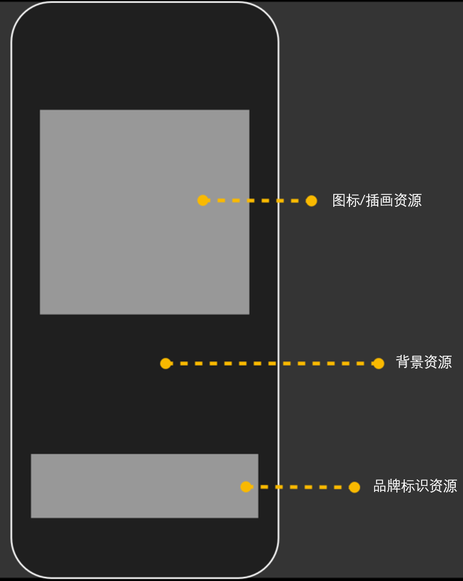

# 配置应用启动页
<!--Kit: ArkUI-->
<!--Subsystem: Window-->
<!--Owner: @waterwin-->
<!--Designer: @nyankomiya-->
<!--Tester: @qinliwen0417-->
<!--Adviser: @ge-yafang-->

## 启动页的分类和实现方式

启动页分为简易启动页和增强启动页，开发者通过在module.json5配置文件中的[abilities标签](../quick-start/module-configuration-file.md#abilities标签)配置启动页资源，涉及的对应字段及含义如下表所示。

| 字段 | 类型 | 是否可缺省 | 含义 |
| -------- | -------- | -------- | -------- |
| startWindowIcon | string | 否 | 标识当前UIAbility组件简易启动页面图标资源文件的索引，取值为长度不超过255字节的字符串。<br/>此图标资源会在启动页面上按实际大小居中显示。<br/>当startWindow被配置时失效。 |
| startWindowBackground | string | 否 | 标识当前UIAbility组件简易启动页面背景颜色资源文件的索引，取值为长度不超过255字节的字符串。<br/>考虑到启动页在各种场景下的显示效果及系统动效的连续性，不建议采用透明色。<br/>当startWindow被配置时失效。 |
| startWindow | string | 是 | 标识当前UIAbility组件增强启动页面配置资源json文件的索引，取值为长度不超过255字节的字符串。<br/>指向二级配置json文件，当应用需要配置增强启动页时，填写此字段，以提供更丰富的启动页资源配置项。<br/><!--RP1-->从API version 20开始，支持使用startWindow字段配置增强启动页。<!--RP1End--> |

## 配置简易启动页

简易启动页是每个UIAbility都必须配置的能力，开发者通过配置module.json5文件中的[abilities标签](../quick-start/module-configuration-file.md#abilities标签)的startWindowIcon和startWindowBackground字段，实现简易启动页的配置。

> **说明：**
>
> - startWindowIcon用于展示应用图标，不会随窗口尺寸进行缩放。建议开发者避免设计针对单个产品全屏尺寸的startWindowIcon图标资源，避免在其他尺寸设备的显示效果无法自动适配。
>
> - 全屏资源的展示建议采用[配置增强启动页](#配置增强启动页)。

在创建的UIAbility模板中，简易启动页相关字段的默认配置如下：

```json
"startWindowIcon": "$media:startIcon",
"startWindowBackground": "$color:start_window_background",
```

此时，默认启动页呈现示意图如下：

**图1** 默认启动页示意图 


开发者可以根据应用需要，配置使用自定义设计的图标资源和颜色资源。

## 配置增强启动页

<!--RP1-->从API version 20开始，支持使用startWindow字段配置增强启动页。<!--RP1End-->

startWindow字段提供了增强的启动页配置能力，可用于元素更复杂的启动页配置。同时，相应资源也具备根据窗口尺寸进行缩放的能力，更易于多设备适配设计，更有利于“一次开发，多端部署”。

> **说明：**
>
> - 由于应用进程创建包括启动页图片资源的解码，使用适当分辨率的图片是影响应用启动时延体验的关键。若对启动时延体验有较高要求，建议启动页中使用不超过256\*256分辨率的图片资源。
> 
> - 启动页中的图片资源支持的文件格式同[Image组件](../reference/apis-arkui/arkui-ts/ts-basic-components-image.md)，考虑到解码性能和显示效果，建议启动页中使用jpg或png格式的图片资源。

1. 在创建的UIAbility模板中，开发者可以新增startWindow字段指向二级配置json文件，以启用启动页增强配置。

   其中，json文件需要由开发者自行创建并放置到工程目录下。推荐的文件名及路径为resources/base/profile/start_window.json，此时需在module.json5的abilities标签中配置如下：

   ```json
   "startWindow": "$profile:start_window"
   ```

2. 配置二级json文件的具体字段。启动页资源主要在上、下两个区域进行展示，如果对应区域的资源未配置，则留空，其他区域的位置和尺寸不受影响。

   具体可配置字段、各字段含义及增强启动页示意图请见下文。

   | 字段 | 类型 | 是否可缺省 | 含义 |
   | -------- | -------- | -------- | -------- |
    | startWindowType | string | 是 | 标识当前UIAbility组件是否隐藏启动页。<br/>当前仅支持在2in1设备或平板设备的自由多窗模式下使用。<br/>不同取值含义如下：<br/>\- "REQUIRED_SHOW"：强制显示启动页。不受[Ability管理服务（即StartOptions中hideStartWindow字段）](../reference/apis-ability-kit/js-apis-app-ability-startOptions.md#startoptions)的影响。<br/>\- "REQUIRED_HIDE"：强制隐藏启动页。不受[Ability管理服务（即StartOptions中hideStartWindow字段）](../reference/apis-ability-kit/js-apis-app-ability-startOptions.md#startoptions)的影响。<br/>\- "OPTIONAL_SHOW"：可选显示，默认行为为显示启动页，如果[Ability管理服务（即StartOptions中hideStartWindow字段）](../reference/apis-ability-kit/js-apis-app-ability-startOptions.md#startoptions)设置隐藏启动页，则隐藏启动页。<br/>\- 如未配置该字段，默认取值为"REQUIRED_SHOW"，即强制显示启动页。 |
   | startWindowAppIcon | string | 是 | 标识当前UIAbility组件增强启动页面图标资源文件的索引，取值为长度不超过255字节的字符串。<br/>在窗口上部分展示，资源由系统侧进行缩放，使其完全显示在展示区域内，宽高比保持不变。<br/>图标资源展示区域的尺寸由系统侧根据窗口尺寸选取，取值为128vp\*128vp、192vp\*192vp或256vp\*256vp。<br/>与插画资源startWindowIllustration同时配置时，仅展示图标资源。 |
   | startWindowIllustration | string | 是 | 标识当前UIAbility组件增强启动页面插画资源文件的索引，取值为长度不超过255字节的字符串。<br/>在窗口上部分展示，如资源尺寸超出其展示区域，将由系统侧保持宽高比缩小，使得资源完全显示在其展示区域内；否则其尺寸保持不变。<br/>插画资源展示区域宽高比为1。<br/>与图标资源startWindowAppIcon同时配置时，仅展示图标资源。 |
   | startWindowBrandingImage | string | 是 | 标识当前UIAbility组件增强启动页面品牌标识资源文件的索引，取值为长度不超过255字节的字符串。<br/>在窗口下部分展示，如资源尺寸超出其展示区域，将由系统侧保持宽高比缩小，使得资源完全显示在其展示区域内；否则其尺寸保持不变。<br/>如果窗口高度不足300vp，此资源将被隐藏。 |
   | startWindowBackgroundColor | string | 否 | 标识当前UIAbility组件增强启动背景色资源文件的索引，取值为长度不超过255字节的字符串。<br/>背景色填充整个窗口，显示层级最低，不建议采用透明色。<br/>如未配置该字段，则启动页增强配置文件不生效，采用简易启动页配置。 |
   | startWindowBackgroundImage | string | 是 | 标识当前UIAbility组件增强启动背景图片资源文件的索引，取值为长度不超过255字节的字符串。<br/>以整个窗口为容器，填充方式由startWindowBackgroundImageFit字段指定。 |
   | startWindowBackgroundImageFit | string | 是 | 标识当前UIAbility组件增强启动背景图片的填充方式，当前支持取值为：<br/>- "Contain"：保持宽高比进行缩小或者放大，使得图片完全显示在显示边界内。<br/>- "Cover"：保持宽高比进行缩小或者放大，使得图片两边都大于或等于显示边界。<br/>- "Auto"：图像会根据其自身尺寸和组件的尺寸进行适当缩放，以在保持比例的同时填充视图。<br/>- "Fill"：不保持宽高比进行放大缩小，使得图片充满显示边界。<br/>- "ScaleDown"：保持宽高比显示，图片缩小或者保持不变。<br/>- "None"：保持原有尺寸显示。<br/>如未配置该字段，默认采用Cover填充方式。 |
   
**图2** 增强启动页示意图
   

   
示例如下：
   
   ```json
   {
     "startWindowType": "REQUIRED_SHOW",
     "startWindowAppIcon": "$media:icon",
     "startWindowIllustration": "$media:illustration",
     "startWindowBrandingImage": "$media:brand",
     "startWindowBackgroundColor": "$color:start_window_background",
     "startWindowBackgroundImage": "$media:bgImage",
     "startWindowBackgroundImageFit": "Contain"
   }
   ```