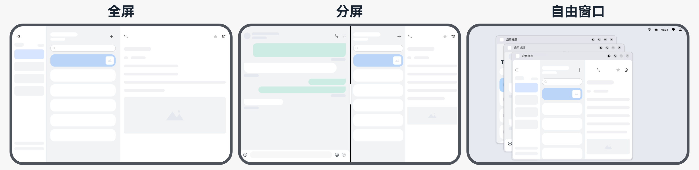

# 窗口开发概述

## 窗口模块的定义

窗口模块用于在同一块物理屏幕上，提供多个应用界面显示、交互的机制。

- 对应用开发者而言，窗口模块提供了界面显示和交互能力。

- 对终端用户而言，窗口模块提供了控制应用界面的方式。

- 对整个操作系统而言，窗口模块提供了不同应用界面的组织管理逻辑。

## 窗口模块的用途

在OpenHarmony中，窗口模块主要负责以下职责：

-  **提供应用和系统界面的窗口对象。** 应用开发者通过窗口加载UI界面，实现界面显示功能。

-  **组织不同窗口的显示关系，即维护不同窗口间的叠加层次和位置属性。** 应用和系统的窗口具有多种类型，不同类型的窗口具有不同的默认位置和叠加层次（Z轴高度）。同时，用户操作也可以在一定范围内对窗口的位置和叠加层次进行调整。

-  **提供窗口装饰。窗口装饰指窗口标题栏和窗口边框。** 窗口标题栏通常包括窗口最大化、最小化及关闭按钮等界面元素，具有默认的点击行为，方便用户进行操作；窗口边框则方便用户对窗口进行拖拽缩放等行为。窗口装饰是系统的默认行为，开发者可选择启用/禁用，无需关注UI代码层面的实现。

-  **提供窗口动效。** 在窗口显示、隐藏及窗口间切换时，窗口模块通常会添加动画效果，以使各个交互过程更加连贯流畅。在OpenHarmony中，应用窗口的动效为默认行为，不需要开发者进行设置或者修改。

-  **指导输入事件分发。** 即根据当前窗口的状态或焦点，进行事件的分发。触摸和鼠标事件根据窗口的位置和尺寸进行分发，而键盘事件会被分发至焦点窗口。应用开发者可以通过窗口模块提供的接口设置窗口是否可以触摸和是否可以获焦。

## 基本概念

### 窗口类型

OpenHarmony的窗口模块将窗口界面分为系统窗口、应用窗口两种基本类型。
- **系统窗口**：系统窗口指完成系统特定功能的窗口。如音量条、壁纸、通知栏、状态栏、导航栏等。
- **应用窗口**：应用窗口区别于系统窗口，指与应用显示相关的窗口。根据显示内容的不同，应用窗口又分为应用主窗口、应用子窗口两种类型。
  - 应用主窗口：应用主窗口用于显示应用界面，会在"任务管理界面"显示。 
  - 应用子窗口：应用子窗口用于显示应用的弹窗、悬浮窗等辅助窗口，不会在"任务管理界面"显示。应用子窗口的生命周期跟随应用主窗口。

### 应用窗口模式

应用窗口模式指应用主窗口启动时的显示方式。OpenHarmony目前支持全屏、分屏、自由窗口三种应用窗口模式。这种对多种应用窗口模式的支持能力，也称为操作系统的“多窗口能力”。

-  **全屏**：应用主窗口启动时铺满整个屏幕。
-  **分屏**：应用主窗口启动时占据屏幕的某个部分，当前支持二分屏。两个分屏窗口之间具有分界线，可通过拖拽分界线调整两个部分的窗口尺寸。
-  **自由窗口**：自由窗口的大小和位置可自由改变。同一个屏幕上可同时显示多个自由窗口，这些自由窗口按照打开或者获取焦点的顺序在Z轴排布。当自由窗口被点击或触摸时，将导致其Z轴高度提升，并获取焦点。

## 实现原理

当前窗口的实现和开发与应用开发模型相关联，不同模型下的接口功能略有区别。当前应用开发模型分为FA模型和Stage模型。

两个模型的整体架构和设计思想，详见[应用模型](../application-models/application-models.md)。

针对窗口开发，推荐使用Stage模型进行相关开发。

### Stage模型下主窗口的生命周期

在Stage模型下，由UIAbility通过WindowStage管理主窗口并维护其生命周期，可以通过`onWindowStageCreate`和`onWindowStageDestroy`接收主窗口创建和销毁的通知。详见：[UIAbility生命周期](../application-models/uiability-lifecycle.md#windowstagecreate和windowstagedestroy状态)。

此外，WindowStage也提供了[on('windowStageEvent')](../reference/apis-arkui/arkts-apis-window-WindowStage.md#onwindowstageevent9)接口用于监听其生命周期变化。

在Stage模型下，应用主窗口从前台进入后台状态也会驱动UIAbility的生命周期。在该模型下，需要额外关注这个机制在不同类型产品的差异化行为。

- **phone类型设备上**：窗口从前台进入后台状态，会驱动Ability到后台状态。

- **tablet类型设备上：**

  - 针对不支持在2in1设备上运行的应用，或可同时支持在phone和2in1上运行的应用，窗口从前台进入后台状态，会驱动UIAbility为后台状态。

  - 针对不支持在phone设备上运行且支持在2in1设备上运行的应用，窗口从前台进入后台状态，不会驱动UIAbility为后台状态。

- **2in1类型设备上：**

  - 针对支持在phone设备运行的应用，窗口从前台进入后台状态，会驱动UIAbility为后台状态。

  - 针对不支持在phone设备运行的应用，窗口从前台进入后台状态，不会驱动UIAbility为后台状态。

## 约束与限制

-  在FA模型下，不支持系统窗口的相关开发。

-  应用主窗口与子窗口存在大小限制，宽度范围：[320, 2560]，高度范围：[240, 2560]，单位为vp。

-  系统窗口存在大小限制，宽度范围：(0, 2560]，高度范围：(0, 2560]，单位为vp。