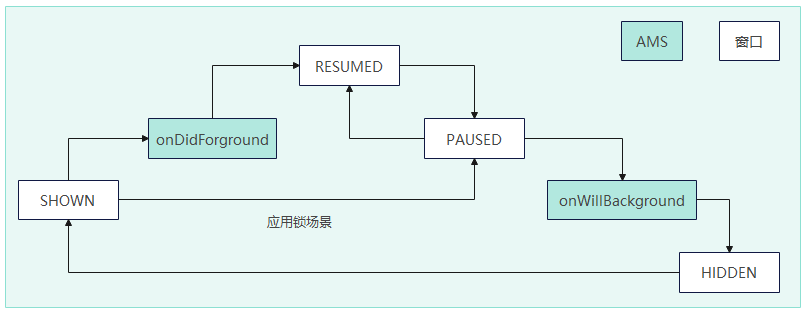

# 窗口开发概述
<!--Kit: ArkUI-->
<!--Subsystem: Window-->
<!--Owner: @Pakoo007-->
<!--Designer: @ki_ja-->
<!--Tester: @qinliwen0417-->
<!--Adviser: @ge-yafang-->

## 窗口模块的定义

窗口模块用于在同一块物理屏幕上，提供多个应用界面显示、交互的机制。

- 对应用开发者而言，窗口模块提供了界面显示和交互能力。

- 对终端用户而言，窗口模块提供了控制应用界面的方式。

- 对整个操作系统而言，窗口模块提供了不同应用界面的组织管理逻辑。

## 窗口模块的用途

在OpenHarmony中，窗口模块主要负责以下职责：

-  **提供应用和系统界面的窗口对象。** 应用开发者通过窗口加载UI界面，实现界面显示功能。

-  **组织不同窗口的显示关系，即维护不同窗口间的叠加层次和位置属性。** 应用和系统的窗口具有多种类型，不同类型的窗口具有不同的默认位置和叠加层次（Z轴高度）。同时，用户操作也可以在一定范围内对窗口的位置和叠加层次进行调整。

-  **提供窗口装饰。窗口装饰指窗口标题栏和窗口边框。** 窗口标题栏通常包括窗口最大化、最小化及关闭按钮等界面元素，具有默认的点击行为，方便用户进行操作；窗口边框则方便用户对窗口进行拖拽缩放等行为。窗口装饰是系统的默认行为，开发者可选择启用/禁用，无需关注UI代码层面的实现。

-  **提供窗口动效。** 在窗口显示、隐藏及窗口间切换时，窗口模块通常会添加动画效果，以使各个交互过程更加连贯流畅。在OpenHarmony中，应用窗口的动效为默认行为，不需要开发者进行设置或者修改。

-  **指导输入事件分发。** 即根据当前窗口的状态或焦点，进行事件的分发。触摸和鼠标事件根据窗口的位置和尺寸进行分发，而键盘事件会被分发至焦点窗口。应用开发者可以通过窗口模块提供的接口设置窗口是否可以触摸和是否可以获焦。

## 基本概念

### 窗口类型

OpenHarmony的窗口模块将窗口界面分为系统窗口、应用窗口两种基本类型。
- **系统窗口**：系统窗口指完成系统特定功能的窗口。如音量条、壁纸、通知栏、状态栏、导航栏等。
- **应用窗口**：应用窗口区别于系统窗口，指与应用显示相关的窗口。根据显示内容的不同，应用窗口又分为应用主窗口、应用子窗口两种类型。
  - 应用主窗口：应用主窗口用于显示应用界面，会在“任务管理界面”显示。 
  - 应用子窗口：应用子窗口用于显示应用的弹窗、悬浮窗等辅助窗口，不会在“任务管理界面”显示。应用子窗口的生命周期跟随应用主窗口。

### 应用窗口模式

应用窗口模式指应用主窗口启动时的显示方式。OpenHarmony目前支持全屏、分屏、自由窗口三种应用窗口模式。这种对多种应用窗口模式的支持能力，也称为操作系统的“多窗口能力”。

-  **全屏**：应用主窗口启动时铺满整个屏幕。
-  **分屏**：应用主窗口启动时占据屏幕的某个部分，当前支持二分屏。两个分屏窗口之间具有分界线，可通过拖拽分界线调整两个部分的窗口尺寸。
-  **自由窗口**：自由窗口的大小和位置可自由改变。同一个屏幕上可同时显示多个自由窗口，这些自由窗口按照打开或者获取焦点的顺序在Z轴排布。当自由窗口被点击或触摸时，将导致其Z轴高度提升，并获取焦点。

## 实现原理

当前窗口的实现和开发与应用开发模型相关联，不同模型下的接口功能略有区别。当前应用开发模型分为FA模型和Stage模型。

两个模型的整体架构和设计思想，详见[应用模型](../application-models/application-models.md)。

针对窗口开发，推荐使用Stage模型进行相关开发。

## 主窗口的生命周期

### 生命周期概述

在Stage模型下，一个UIAbility对应一个WindowStage，一个WindowStage对应一个应用主窗，UIAbility、WindowStage和应用主窗三者之间的关系如下图所示。

每个UIAbility实例都会与一个WindowStage类实例绑定，该类起到了应用进程内窗口管理器的作用。它包含一个主窗口，也就是说UIAbility实例通过WindowStage持有了一个主窗口，该主窗口为ArkUI提供了绘制区域，可以加载不同的ArkUI页面。

在Stage模型下，由UIAbility通过WindowStage管理主窗口并维护其生命周期，可以通过[onWindowStageCreate](../reference/apis-ability-kit/js-apis-app-ability-uiAbility.md#onwindowstagecreate)和[onWindowStageDestroy](../reference/apis-ability-kit/js-apis-app-ability-uiAbility.md#onwindowstagedestroy)接收主窗口创建和销毁的通知。详见：[UIAbility生命周期](../application-models/uiability-lifecycle.md)。

### 生命周期状态

窗口在进入前台、前后台切换及退后台时，会触发窗口相应的生命周期状态变化。

Stage模型下主窗口的生命周期状态包括切到前台（SHOWN）、可交互状态（RESUMED）、不可交互状态（PAUSED）和切到后台（HIDDEN）。
- **SHOWN**：窗口进入到前台。当应用从后台切换至前台时，会触发SHOWN事件。

- **RESUMED**：窗口进入可交互状态。窗口到前台后会进入该状态，另外窗口恢复也会触发RESUMED事件。

- **PAUSED**：窗口进入不可交互状态。窗口在前台可见但是不可交互时，触发PAUSED事件。窗口会保持这种状态，直到重新恢复或退后台。如果窗口恢复，则会触发RESUMED事件，进入可交互状态。

- **HIDDEN**：窗口进入到后台。当应用从前台切换至后台时，会触发HIDDEN事件。

> **说明**
>
> RESUMED和PAUSED状态分别在窗口切换至前台和切换至后台时触发。但是在一些场景下，RESUMED和PAUSED状态触发会有差异。
> - 在一些系统管控场景下会导致RESUMED和PAUSED事件差异，例如应用管控场景，应用窗口在切换至前台进入到认证界面时，触发PAUSED事件，认证通过后，触发RESUMED事件。

|**生命周期状态**|**触发场景举例**|
|---------------|---------------|
|SHOWN          |例如：应用全屏启动、悬浮窗被拉起等。|
|RESUMED        |例如：应用全屏启动、悬浮窗被拉起或应用上滑悬停后回到应用等。|
|PAUSED         |例如：应用退后台回到桌面、应用全屏状态上滑跟手进入多任务或全屏状态下被系统管控等。|
|HIDDEN         |例如：应用全屏状态上滑退后台回到桌面以及其他退后台或销毁等。|

应用主窗口生命周期事件流转关系如下图：

**特殊场景**：存在应用被系统管控的场景，会导致应用在启动过程中或RESUMED状态下，进入PAUSED状态，并触发回调通知。

### 监听生命周期状态变化

如果需要感知应用主窗口生命周期变化，开发者可以使用下述注册监听接口来监听应用主窗口的生命周期变化。

- API version 20之前，通过调用[on('windowStageEvent')](../reference/apis-arkui/arkts-apis-window-WindowStage.md#onwindowstageevent9)注册WindowStage生命周期变化的监听，通过调用[off('windowStageEvent')](../reference/apis-arkui/arkts-apis-window-WindowStage.md#offwindowstageevent9)注销WindowStage生命周期变化的监听。本接口无法保证生命周期状态切换间的顺序，对于状态间的顺序有要求的情况下不建议使用。
- API version 20开始，通过调用[on('windowStageLifecycleEvent')](../reference/apis-arkui/arkts-apis-window-WindowStage.md#onwindowstagelifecycleevent20)注册WindowStage生命周期变化的监听，通过调用接口[off('windowStageLifecycleEvent')](../reference/apis-arkui/arkts-apis-window-WindowStage.md#offwindowstagelifecycleevent20)注销WindowStage新生命周期变化的监听。本接口不提供WindowStage的获焦失焦状态监听，对于WindowStage获焦失焦状态有监听需求的情况下，推荐使用[on('windowEvent')](../reference/apis-arkui/arkts-apis-window-Window.md#onwindowevent10)， 对生命周期状态间的顺序有要求的情况下建议使用本接口。

### 不同设备生命周期的差异化行为

在Stage模型下，应用主窗口从前台进入后台状态也会驱动UIAbility的生命周期。在该模型下，需要额外关注这个机制在不同类型产品的差异化行为。

- **Phone类型设备上**：窗口从前台进入后台状态，会驱动UIAbility到后台状态。

- **Tablet类型设备上：**

  - 针对不支持在2in1设备上运行的应用，或可同时支持在phone和2in1上运行的应用，窗口从前台进入后台状态，会驱动UIAbility为后台状态。

  - 针对不支持在phone设备上运行且支持在2in1设备上运行的应用，窗口从前台进入后台状态，不会驱动UIAbility为后台状态。

- **2in1类型设备上：**

  - 针对支持在phone设备运行的应用，窗口从前台进入后台状态，会驱动UIAbility为后台状态。

  - 针对不支持在phone设备运行的应用，窗口从前台进入后台状态，不会驱动UIAbility为后台状态。

## 约束与限制

-  在FA模型下，不支持系统窗口的相关开发。

-  应用主窗口与子窗口存在大小限制，宽度范围：[320, 2560]，高度范围：[240, 2560]，单位为vp。

-  系统窗口存在大小限制，宽度范围：(0, 2560]，高度范围：(0, 2560]，单位为vp。