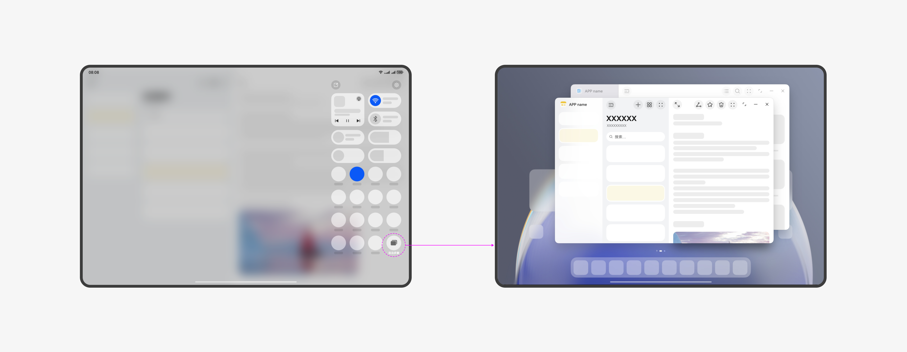
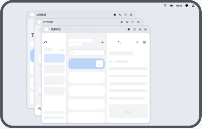
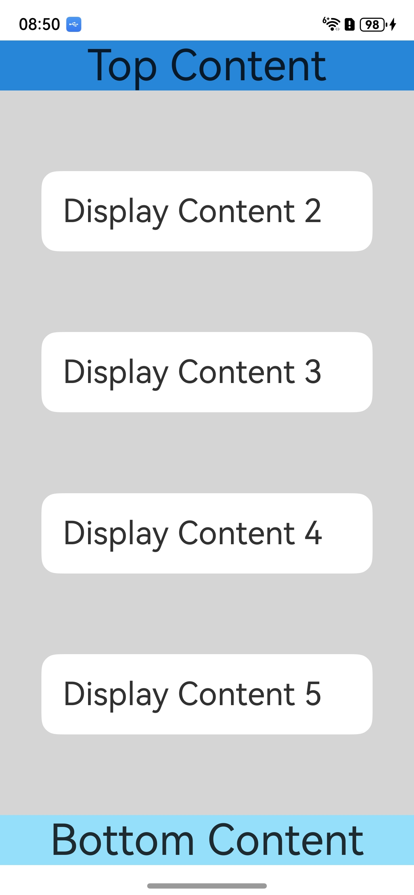
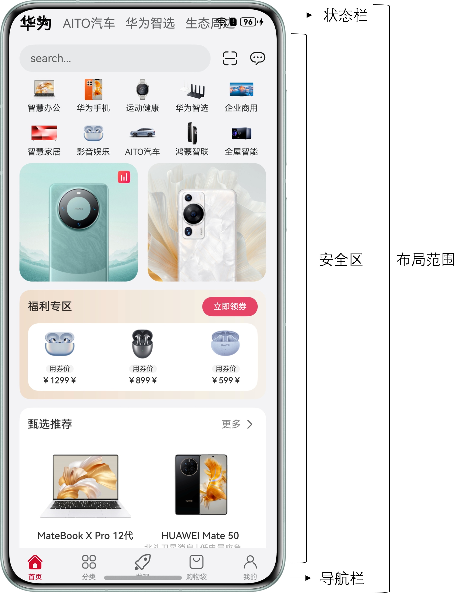
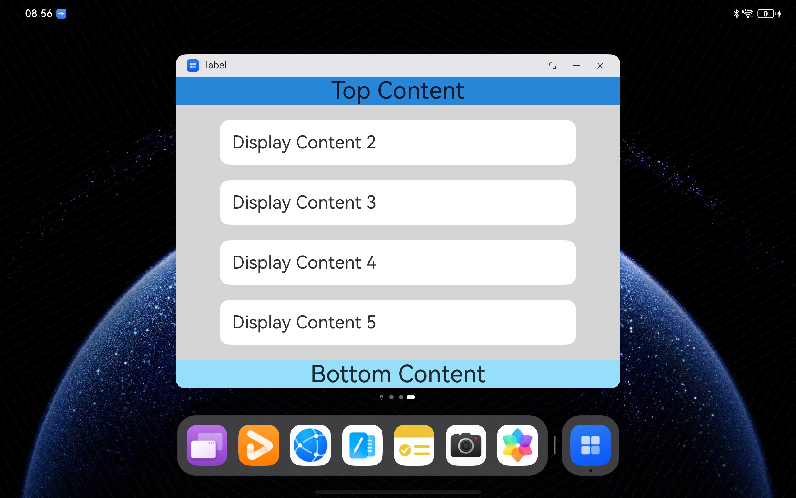
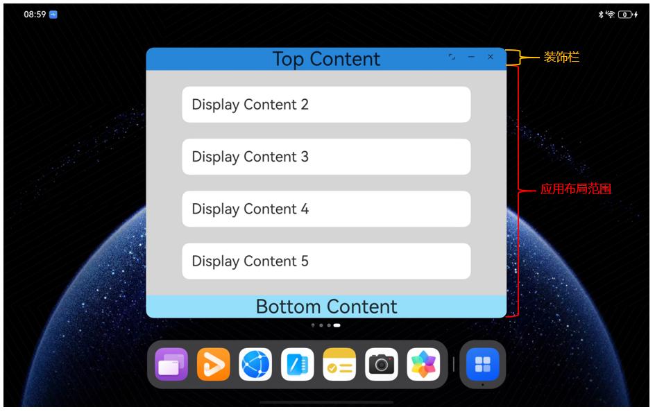

# 窗口开发术语
<!--Kit: ArkUI-->
<!--Subsystem: Window-->
<!--Owner: @waterwin-->
<!--Designer: @nyankomiya-->
<!--Tester: @qinliwen0417-->
<!--Adviser: @ge-yafang-->

## 自由多窗模式

自由多窗模式是一种支持用户在移动设备上进行多任务处理的交互方式。

自由多窗下，允许用户在一块屏幕上同时显示多个应用窗口。此时的应用窗口为[自由窗口](#自由窗口)。

部分Tablet设备上，可通过下拉控制中心，点击“自由多窗”按钮开启自由多窗。

## 自由窗口

自由窗口是一种允许用户在同一屏幕上以自由大小、位置显示的窗口状态。自由窗口支持拖拽、缩放和分屏组合，从而实现多任务处理。

自由窗口按照打开或者获取焦点的顺序在Z轴层叠排布。当自由窗口被点击或触摸时，将导致其Z轴高度提升，并获取焦点。

启动新的自由窗口时，默认以一定间距在上一个窗口的右下方层叠显示。

每个自由窗口默认会在窗口上方显示窗口标题栏，标题栏左侧显示应用图标，右侧显示三键控制按钮（窗口最大化/还原、窗口最小化和关闭窗口），且窗口标题栏支持额外的[沉浸式配置](https://developer.huawei.com/consumer/cn/doc/best-practices/bpta-multi-device-window-immersive#section1477255312219)。

自由窗口可以通过拖动窗口边缘调节窗口大小，可以通过拖动标题栏移动窗口位置。

当前设备支持情况：

-  **2in1设备**：2in1设备上的窗口，默认为自由窗口。
-  **Tablet设备**：部分Tablet设备，支持开启[自由多窗模式](#自由多窗模式)（通过下拉控制中心，点击“自由多窗”按钮开启），开启此模式后，应用窗口默认为自由窗口。

## 沉浸式布局

沉浸式布局是一种让应用界面聚焦内容，减少无关元素干扰的窗口状态。

非[自由窗口](#自由窗口)可以通过调用[setWindowLayoutFullScreen](../reference/apis-arkui/arkts-apis-window-Window.md#setwindowlayoutfullscreen9)进入沉浸式布局。

| 非自由窗口的非沉浸式布局示意                    | 非自由窗口的沉浸式布局示意               |
|----------------------------------------------|----------------------------------------|
|     |     |

自由窗口可以通过隐藏装饰栏进入沉浸式布局。

| 自由窗口的非沉浸式布局示意                      | 自由窗口的沉浸式布局示意                 |
|----------------------------------------------|----------------------------------------|
|     |     |

应用窗口进入沉浸式布局之后，页面的所有组件布局范围从安全区域扩展为整个窗口。可以通过[isImmersiveLayout](../reference/apis-arkui/arkts-apis-window-Window.md#isimmersivelayout20)判断当前窗口是否处于沉浸式布局。

多设备场景下不同窗口形态的沉浸式开发与实现可以参考[窗口沉浸式最佳实践](https://developer.huawei.com/consumer/cn/doc/best-practices/bpta-multi-device-window-immersive)。