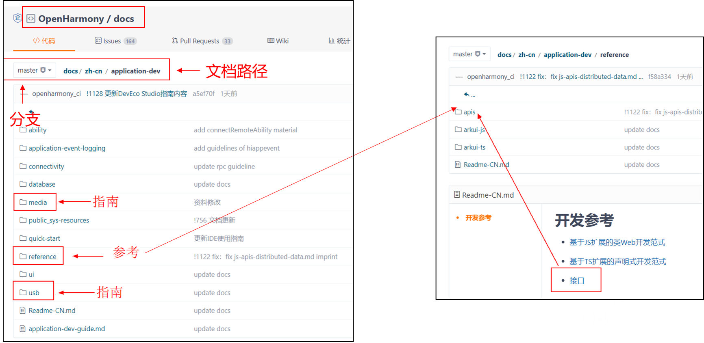
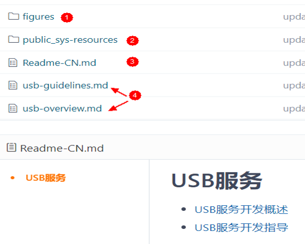
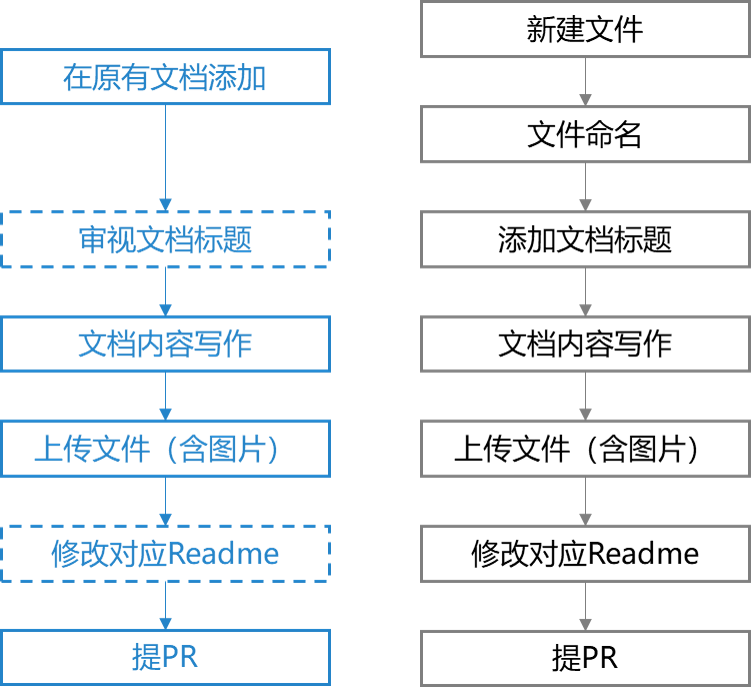
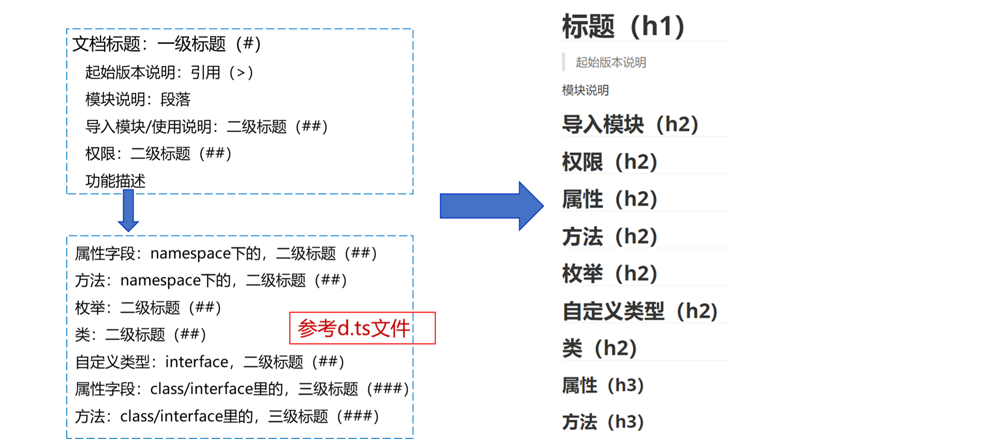
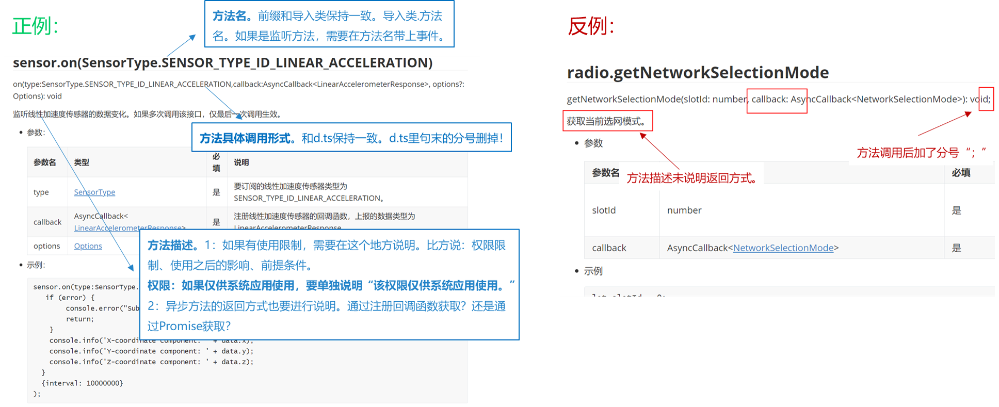
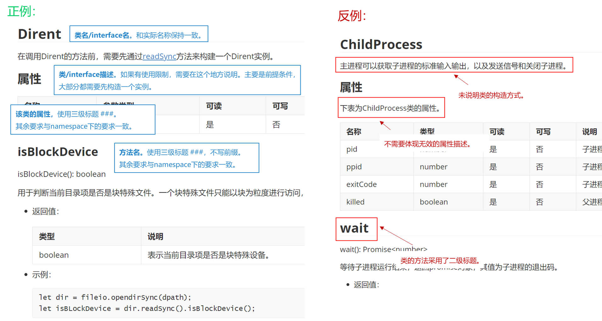
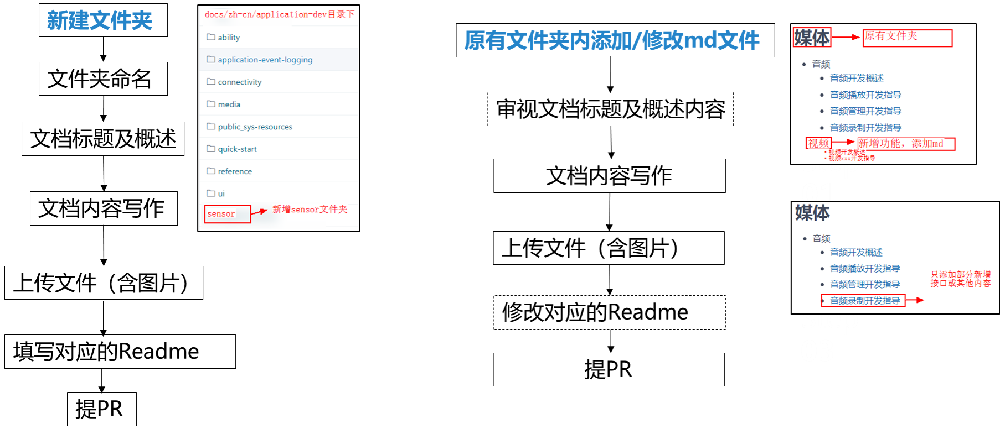
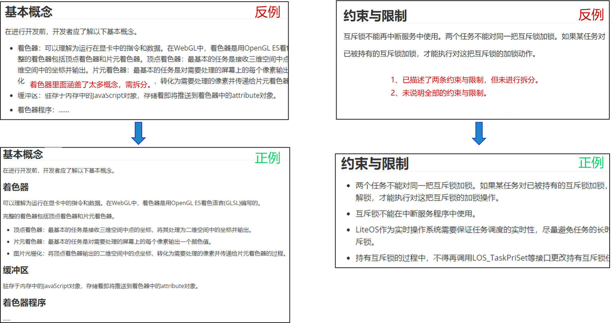
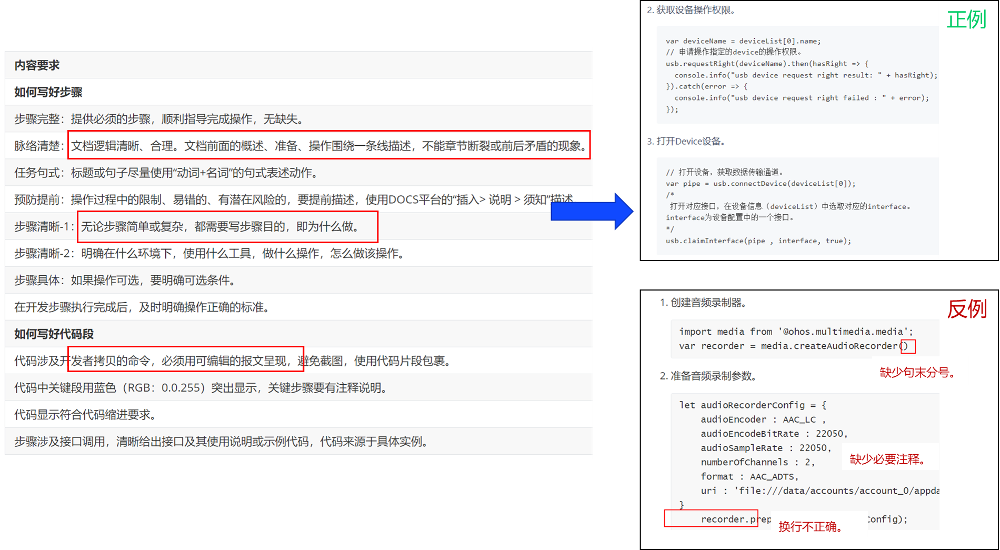

# 开源社区文档写作规范

## 文档交付清单（应用开发）

- **JS API参考**：应用程序接口。

  按照**d.ts**文件进行分类，**一个d.ts文件对应一个md文档，该文档包含当前版本需要交付的所有接口**，每一个接口都需要包括接口的功能描述、参数描述、返回值描述、示例代码等。

- **开发指南**：**用于指导用户进行应用程序的设计和开发**，从应用程序开发角度介绍基于平台功能特性开发应用程序的过程。

  按照**场景进行分类**，通过描述场景功能、使用限制、调用接口等，以步骤的形式循序渐进地指导开发人员完成基于平台/产品提供的开放API或 SDK进行二次开发，最终实现某个特性或功能。

- **术语**：向开发者传递**完整、准确、唯一的**概念。

  当出现一个新概念时，需要提供统一的术语依据，规范化概念和名词表达。例如，eTS。

- **apidiff/changelog**：向开发者说明**版本变更**情况。

  apidiff说明该版本所有接口的修改，包括新增、变更、废弃三种情况，若无修改则不用说明。

  若该版本存在变更后无法适配的接口，需要在changelog中说明每一个接口需要做的适配操作。

- **FAQ**（ Frequently Asked Questions ）：开发者常见异常及处理建议。

- **Readme**：向开发者介绍OpenHarmony子系统/部件的需求背景。

## 文档写作基本要求（适用于所有文档）

- **完整性**

  文档无场景缺失、无操作断点，交付内容需和版本实际交付范围一致，不遗漏、不超前。

- **正确性**

  文档描述和实现**功能一致**，版本信息、参数、返回值描述无误，**用户可以通过文档进行实际操作**。

- **规范性**

  文档描述**符合资料规范**，无低错、前后矛盾、上下文不一致、有歧义、敏感词等问题。注意：文档描述遵循术语规范，非必要场景不体现厂家信息。

- **易理解**

  文档描述简洁、清晰，面向开发者，对开发者可感知和使用的能力进行描述。示例代码易理解，上下文完整（或提示）、参数明确、复杂逻辑有注释。

- **合规性**

  **无抄袭或合规风险**。包括但不限于：描述不可与友商高度一致，禁止使用友商特有的概念。

## 明确文档结构（应用开发）

应用开发文档链接： [https://](https://gitee.com/openharmony/docs/tree/master/zh-cn/application-dev)[gitee.com/openharmony/docs/tree/master/zh-cn/application-dev](https://gitee.com/openharmony/docs/tree/master/zh-cn/application-dev)

开发指南按不同功能分文件夹，平铺在application-dev中，比如media存放媒体开发指南，usb存放usb服务的开发指南。API参考统一放到application/reference/apis文件夹中。

## 每一个文档包含的内容（JS API和开发指南）

1. 图片文件夹：放置文档中引用的图片，包含svg、png、gif等。
2. 系统资源文件夹：放置文档中引用的系统图标，无需关注。
3. Readme：目录每一个新增的md文档，都需要写在Readme中。
4. 文档：重点关注文档命名，详见后续描述。

## JS API内容写作

### 新建文档 or 在原有的文档里继续添加？

该模块（以一个d.ts为单位）之前是否有文档？——是，在原有的文档里继续添加新增接口。否，新建一个markdown（md）文件。

1. **文件命名**：一个d.ts文件对应一个js api接口文档，文件名称：**js-apis-模块名.md**。示例：

   媒体@ohos.multimedia.audio，文件命名为：js-apis-audio.md。

   电话@ohos.telephony.sms，文件命名为：js-apis-sms.md。

2. **文档标题：**使用**中文短语**概括本模块功能。但如果部分概念使用英文更便于开发者理解，不必强求，比方说，Ability、SIM卡等概念可以直接使用。

   如果在原有文档添加接口，需要检查新增了接口后，标题还能不能概括所有内容。比如说，media在API 6叫音频播放，但API 7新增了“音频录制”、“视频解码”的能力后，名字就要修改了。

3. **内容写作**较多，在后续指导中详细描述。

4. **上传路径**：docs/zh-cn/application-dev/reference/apis，图片放到对应的figures文件夹中。

5. **修改对应的Readme**，即docs/zh-cn/application-dev/reference/apis/Readme-CN.md。如果文档标题没有修改，无需修改Readme。

**Tips：docs仓的PR合入后，将自动触发翻译issue。**

### 内容写作

JS API 文档模板路径：[https://](https://gitee.com/openharmony/docs/blob/master/zh-cn/contribute/template/js-template.md)[gitee.com/openharmony/docs/blob/master/zh-cn/contribute/template/js-template.md](https://gitee.com/openharmony/docs/blob/master/zh-cn/contribute/template/js-template.md)

**每一个文档必须包含的内容：**

- **文档标题**

  - **起始版本说明（必选）**：本模块首批接口的起始版本，以说明的形式进行插入。

    

  - **模块说明（必选）**：对该模块提供的功能、使用场景和使用建议进行简要描述。

    例如，轻量级存储为应用提供key-value键值型的文件数据处理能力，支持应用对数据进行轻量级存储及查询。

  - **导入模块/使用说明（必选）**：根据实际情况填写导入模块，如果没有导入模块，将“导入模块”修改为“使用说明”。

       导入模块，采用**代码段**的样式，给出import语句。

       使用说明，说明使用接口的先决条件，例如：在使用AbilityContext的功能前，需要通过getContext()先获取Context对象。

  - **权限（必选）**：对该模块接口的使用权限做以说明。

    例如，需要权限：ohos.permission.XXX（如不涉及可删除，如果是系统权限要说明）

  - **功能描述（必选）**：对该模块涉及到的属性、接口等做以说明，在功能描述中进行详细解释。

- **功能描述（与d.ts文件保持一致）**：

  - **属性字段（namespace下的，可选）**：定义了对象的特征。 以表格形式呈现，包括属性名称、属性类型、可读、可写、属性说明。

  - **方法（namespace下的，必选）**：关联到对象的函数。以section形式呈现，包括方法名称、调用形式、功能说明、参数、返回值、示例代码。

  - **枚举（可选）**：一组值组成的类型。 以表格形式呈现，包括枚举名称、枚举值、说明。

  - **类/interface（可选）**：一般包含自有属性和方法。以section形式呈现，包括类名/interface名、描述、自有属性等。

  - **自定义类型（ 可选）**：以k-v键值对表示的interface，描述和方法的参数一致。以表格形式呈现，包括参数名、类型、是否必填、说明。

  - **属性字段（ class/interface里的，可选）**

  - **方法（ class/interface里的）**

**标题层级**：

**版本标记**：

1. 如果新版本增加了一个类，则该类、类的方法、类的属性均需打上版本标记。以全球化intl的文档为例说明。

   intl的起始版本是API 7，在API 8新增了类**Collator、constructor方法等**，**于是给类Collator及其所有的方法打上8+的上标**，标记方式为直接在新增内容后面标记8+。

   

2. 对于新版本废弃的内容，不能直接在文档上删去，需在废弃内容后面加上标标注deprecated，并使用“>”引用语法建议使用的替代方式，加上对应的链接。示例如下：

   abandonmentMethod(deprecated)

   \> 从API version 7 开始废弃，建议使用newMethod替代。

**写作示例**：

1. 参数返回值说明、示例代码写作示例：

 2. 类、interface写作示例：

## JS 开发指南写作

### 文档创建方式

**注意**：

1. 文件夹命名：一个文件夹对应相关模块的开发指导。
2. 上传路径：docs/zh-cn/application-dev/xxx文件夹，图片放到对应的figures文件夹中。
3. 新增指南/添加文档，均需填写对应的Readme，即docs/zh-cn/application-dev/xxx文件夹/Readme-CN.md。

### 内容写作

开发指南模板链接：[guide-template.md](template/guide-template.md)

**每一个文档必须包含的内容**：

-  **概述/xxx开发概述（必选）** 

   -  **功能简介（必选）** ：描述本指南提供了什么能力，指导开发者完成什么任务。

   -  **基本概念（必选）** ：描述开发任务相关的基本概念。

   -  **运作机制（可选）** ：描述开发任务实现功能的基本运作原理。

   -  **约束与限制（必选）** ：描述本开发任务过程中的约束条件，以及此操作约束带来相应的负面影响。

-  **Xxx开发指导（必选）** 

   -  **场景介绍（必选）** ：描述在什么情景下解决什么问题，最终达到什么样的效果。

   -  **接口说明（必选）** ：描述本开发指导相关的接口有哪些。

   -  **开发步骤（必选）** ：描述开发的整体过程，便于开发者快速完成开发

   -  **调测验证（可选）** ：开发完成后，如有独立的调测验证操作，需提供指导，以确认操作是否成功。

   -  **开发实例/sample（必选）** ：开发完成后，基于一个任务整体做代码段的描述。

可选≠不写，可选=子系统可能没有这个情况。

**写作示例：**

1. 概述写作示例：

   

2. 开发指导步骤写作示例：

   
