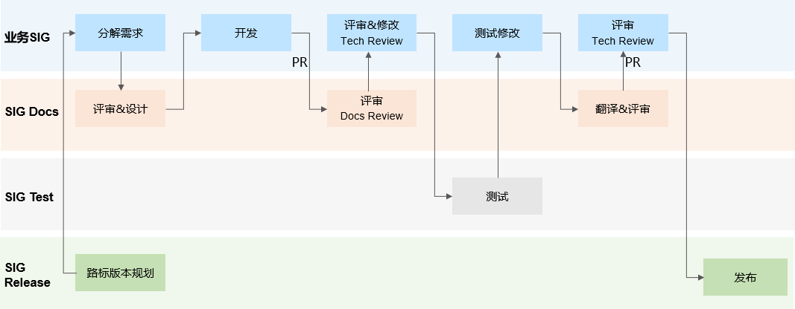
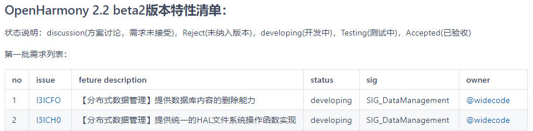

# 为发行版本撰写配套文档

为了帮助开发者更高效使用OpenHarmony社区的每个Release版本，社区会根据每个版本规划的需求特性提供配套文档（如指南、API参考、开发示例、Release Notes、API Changelog、FAQ等）。有的需求涉及新增功能特性和文档，有的需求的是对现有特性和文档内容更新。

## OpenHarmony社区文档开发流程

每个SIG团队在规划功能特性需求时，需要判断该需求是否涉及新增开发者文档、或变更现有开发者文档，分解需求给SIG Docs 团队，便于文档需求跟踪闭环。SIG Docs团队会根据相关需求，提供文档设计意见，并配合各业务SIG团队完成开发者文档的评审、翻译和发布。社区文档完整开发流程如下：

## 业务SIG团队成员或其他开发人员

通过每个业务SIG团队为发行版本撰写配套文档基础稿，欢迎社区开发人员参与相关功能特性文档开发。

### 分解文档需求

1. 在业务SIG需求Issue中给出【配套文档】的分解，如果涉及开发者文档新增、更新，需要关联SIG-Docs。

2. 在 [OpenHarmony社区版本发布计划](https://gitee.com/openharmony/release-management/blob/master/OpenHarmony-RoadMap.md)中查看对应版本的特性需求，此文档中给出了OpenHarmony的版本发布时间计划、各版本交付特性、特性状态，所属SIG。

   如果该特性需求涉及文档交付，需要在对应的Need Docs列补充判断，SIG_Docs，便于SIG Docs团队闭环跟踪文档交付。

### 开发文档

如果你是某个业务SIG的成员，负责开发某一新特性，你需要与SIG Docs一起配合，确保在版本发布之前完成该新特性文档开发。否则，在最终的版本发布中未提供配套文档的特性可能被移除。

如果你需要文档组织方面的帮助，请在`#SIG-Docs` Zulip频道中提问求助。

1. 参考[评审人沟通表](docs-reviewers.md)，联系SIG Docs资料作者，沟通文档设计建议。
2. 获取[文档模板](template)，了解文档写作规范。
3. 尽可能为功能特性提供详细的文档及使用说明，完成功能特性初稿后，提交PR并在PR描述中提供对应的需求Issue链接。

### 提交PR评审

所有新增内容的PR评审，为确保技术描述准确性需要指定相应业务SIG的技术专家参与技术评审，同时指定SIG Docs的资料专家评审文档规范性内容，请参考[评审人沟通表](docs-reviewers.md)在PR评论区@相关专家。也可以在`#SIG-Docs` Zulip频道中反馈评审需求。

在评审周期内，所有评审意见闭环修改后，该PR通过审核可以合并入仓的必要条件：

- 技术评审专家审核后给出`TechApprove`的评论。
- 文档规范性评审专家审核后给出`DocsApprove`的评论。

### 提交测试

文档随版本转测试，测试过程中的文档问题，由SIG Test团队测试人员以Issue形式提交到Docs仓，对应文档作者闭环确认测试意见并完成文档修改。

### 提交翻译

#### Docs仓文档翻译

OpenHarmony社区为开发者提供中文、英文的官方文档，中文文档完成评审、测试定稿后，可提交翻译需求Issue，由SIG Docs团队的翻译专家完成英文文档。

翻译专家通过PR提交英文文档，并在PR描述中提供对应的中文需求Issue链接。为确保技术翻译描述准确性需要指定相应业务SIG的技术专家参与技术评审，可以是中文文档作者，请参考[评审人沟通表](docs-reviewers.md)在PR评论区@相关专家。

在评审周期内，所有评审意见闭环修改后，该PR通过审核可以合并入仓的必要条件：

- 技术评审专家审核后给出`TechApprove`的评论。
- 英文文档规范性评审专家审核后给出`DocsApprove`的评论。

#### 非Docs仓文本类翻译

针对OpenHarmony核心业务SIG的非Docs仓翻译需求（如API注释等），可提交翻译需求Issue到Docs仓，SIG Docs团队的翻译专家完成英文文档交付。

提交翻译需求时，需确保：

1. 相关中文文档为发布交付件质量标准。
2. 提供中文文档PR或相关文档路径。
3. 中文临时文件可提交至[SIG-Docs仓](https://gitee.com/openharmony/community/tree/master/sig/)。

## Docs SIG团队成员或文档贡献者

SIG Docs团队成员或文档贡献者或，配合各业务SIG团队，评审、优化相关文档输出，英文翻译，确保相关输出符合发布条件。

### 了解发行版本规划特性

想要了解对应发行版本规划的功能特性、发布计划，可以参加每双周周五例行组织的[SIG Release](https://gitee.com/openharmony/release-management/blob/master/README.md)例会。了解版本进度，需求交付进度，文档交付进度等。

同时可以在 [OpenHarmony社区版本发布计划](https://gitee.com/openharmony/release-management/blob/master/OpenHarmony-RoadMap.md)中查看对应版本的特性需求，选择标识有SIG_Docs的相关特性Issue，及关联的文档PR。

### 评审PR中提交的中文文档

在评审对应特性文档时，建议从以下方面给出中肯的评审建议。

#### 语言描述规范

- 前后逻辑表达通顺，术语名词表述一致
- 语言正式避免口语化
- 避免使用侵犯第三方知识产权的风险词汇

#### 内容易理解

- 内容逻辑清晰，前后表达一致
- 内容表达易读易理解，避免使用晦涩、生僻的词语
- 步骤清晰，有效指导开发者完成相关任务开发

#### 图表规范

- 图片清晰、图文配合使用
- 表格有表头、表标题，避免出现单行或单列表
- 表格中无内容用“-"或者"NA"，避免出现空白单元格  

#### 网站风格

- 该PR变更涉及新增Markdown页面时，需确保：
  - 该页面内容使用了正确的内容模板
  - 该Markdown文件名称定义符合规范
  - 该页面在整本手册Readme导航中正常显示

- 删除Markdown页面、变更Markdown页面名称，需确保：
  - 该页面对社区其他内容链接未产生影响，建议本地运行链接检查
  - 整本手册Readme导航中更新目录   

更多详细规范请参考OpenHarmony社区文档[写作规范](写作规范.md)。

### 翻译英文文档

社区的翻译需求Issue会由SIG Docs团队技术翻译专家完成翻译，也欢迎文档贡献者领取翻译需求任务，提交英文文档PR。

