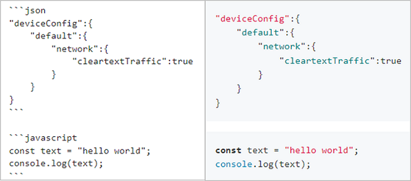

# 示例代码风格
本规范适用于文档中ArkTS、JavaScript和C/C++等编程语言的示例代码片段，旨在提高OpenHarmony文档示例代码的可读性、可维护性，以及风格一致性。

## 代码规范

### 【规则】遵守基本编程规范

【描述】

文档的示例代码需要遵循[OpenHarmony应用ArkTS编程规范](../../contribute/OpenHarmony-ArkTS-coding-style-guide.md)、[JavaScript语言编程规范](../OpenHarmony-JavaScript-coding-style-guide.md)、[C语言编程规范](../OpenHarmony-c-coding-style-guide.md)和[C++语言编程规范](../OpenHarmony-cpp-coding-style-guide.md)基本的编码规范，包括命名规范、代码格式和代码规范等。

### 【规则】每个接口提供示例代码

【描述】

API参考中，每个接口（包括方法和组件）均需要提供示例代码。如果多个API存在关联关系，则需要在一个场景化的代码示例中体现。

### 【规则】API参考示例代码不包含异常处理

【描述】

API参考文档的主要目的是展示如何调用和使用API。为了保持示例代码的简洁性和易读性，API参考示例中无需添加异常处理逻辑。这使得开发者可以快速理解API的基本用法。

【正例】

```ts
declare function doSthAsync(): Promise<void>;

declare function doSthSync(): void;

// 正例1在API示例代码中，异步场景，无需增加`.catch()`分支
doSthAsync()
  .then(() => {
  })

// 正例2：在API示例代码中，同步场景，无需使用`try...catch...`包裹
doSthSync();
```

【反例】

```ts
import { BusinessError } from '@kit.BasicServicesKit';

declare function doSthAsync(): Promise<void>;

declare function doSthSync(): void;

// 反例1：在API示例代码中，异步场景，无须增加`try...catch...`，也无须使用 `.catch()` 方法处理错误。
try {
  doSthAsync()
    .then(() => {
    })
    .catch((err: BusinessError) => {
      console.error(`Failed to do sth. Code is ${err.code}, message is ${err.message}`);
    });
} catch (error) {
  const err: BusinessError = error as BusinessError;
  // 处理入参错误异常
  console.error(`Failed to do sth. Code is ${err.code}, message is ${err.message}`);
}

// 反例2：在API示例代码中，同步场景，无须增加`try...catch...`
try {
  doSthSync();
} catch (error) {
  const err: BusinessError = error as BusinessError;
  // 处理入参错误异常
  console.error(`Failed to copy file. Code is ${err.code}, message is ${err.message}`);
}
```

### 【规则】开发指南示例代码包含异常处理

【描述】

开发指南旨在提供全面的代码示例，帮助开发者在实际应用中正确使用API。为了确保代码的健壮性和可靠性，示例代码中需要包含异常处理逻辑。这有助于开发者理解如何在不同情况下处理错误，提高代码质量。

通过在开发指南的示例代码中添加异常处理，开发者可以更好地理解如何编写健壮的代码，并在实际开发中应用这些实践。

【正例】

```ts
import { BusinessError } from '@kit.BasicServicesKit';

declare function doSthAsync1(): Promise<void>;

declare function doSthAsync2(): Promise<void>;

declare function doSthAsync3(): Promise<void>;

declare function doSthSync1(): void;

declare function doSthSync2(): void;

// 正例1：异步接口，Promise场景，加上`.catch()`相关的分支判断
doSthAsync1()
  .then(() => {
  })
  .catch((err: BusinessError) => {
    console.error(`Failed to do sth. Code is ${err.code}, message is ${err.message}`);
  });

// 正例2：异步接口，结合async/await使用，增加`try...catch...`包裹
async () => {
  try {
    await doSthAsync1();
    await doSthAsync2();
    await doSthAsync3();
  } catch (error) {
    const err: BusinessError = error as BusinessError;
    // 处理入参错误异常
    console.error(`Failed to do sth. Code is ${err.code}, message is ${err.message}`);
  }
}

// 正例3：同步接口，增加`try...catch...`包裹
try {
  doSthSync1();
  doSthSync2();
} catch (error) {
  const err: BusinessError = error as BusinessError;
  // 处理入参错误异常
  console.error(`Failed to do sth. Code is ${err.code}, message is ${err.message}`);
}

// 正例4：对于同步接口增加`try...catch...`包裹，按需增加对应的异常错误码判断
try {
  doSthSync1();
  doSthSync2();
} catch (err) {
  switch (err.code) {
    case 401:
      // Handle parameters exceptions
      break;
    case 12300001:
      // Handle 12300001 exceptions
      break;
    case 12300002:
    case 12300003:
    case 12300004:
      console.error(`Failed to do sth. Code is ${err.code}, message is ${err.message}`);
      break;
  }
}
```

【反例】

```ts
declare function doSthAsync1(): Promise<void>;

declare function doSthAsync2(): Promise<void>;

declare function doSthAsync3(): Promise<void>;

declare function doSthSync1(): void;

declare function doSthSync2(): void;

// 反例1：异步接口，缺少`.catch()`异常处理
doSthAsync1()
  .then(() => {
  })

// 反例2：异步接口，结合async/await使用，缺少`try...catch...`异常处理
async () => {
  await doSthAsync1();
  await doSthAsync2();
  await doSthAsync3();
}

// 反例3：同步接口，缺少`try...catch...`异常处理
doSthSync1();
doSthSync2();
```

### 【规则】明确变量定义与用途

【描述】

示例代码中的变量需要包含定义、使用方法或者来源链接参考或者说明，以确保开发者能够理解如何使用。例如，如果涉及到应用开发路径，需要提供获取应用开发路径的链接参考或方法。

【正例】

示例中的`context`的获取方式请参见[获取UIAbility的上下文信息](../../application-dev/application-models/uiability-usage.md#获取uiability的上下文信息)。

```ts
import { common, Want } from '@kit.AbilityKit';

const context: common.UIAbilityContext = this.context; // UIAbilityContext
let want: Want = {
  deviceId: '', // deviceId为空表示本设备
  bundleName: 'com.example.myapplication',
  abilityName: 'FuncAbility',
  moduleName: 'func', // moduleName非必选
  parameters: {
    // 自定义信息
    info: '来自EntryAbility Index页面',
  },
}
// context为调用方UIAbility的UIAbilityContext
context.startAbilityForResult(want)
  .then((data) => {
    // ...
  })
```

【反例】

```ts
// 反例：使用到的context和want变量未进行定义
// context为调用方UIAbility的UIAbilityContext
context.startAbilityForResult(want)
  .then((data) => {
    // ...
  })
```

### 【建议】统一依赖包命名风格

【描述】

导入的依赖包的命名与其依赖包的命名空间保持一致，以便于维护和理解代码。

采用一致的依赖包命名风格还可以方便IDE进行提示导入，提高编码效率。

【正例】

```ts
import { promptAction } from '@kit.ArkUI';
```

【反例】

```ts
// 包名和其命名空间不一致，不利于维护和理解代码
import { promptAction as prompt } from '@kit.ArkUI';
```

### 【规则】UI组件宽高等属性不加单位

【描述】

为了保持代码的一致性和简洁性，在设置组件的宽度、高度等属性时，应该尽量避免添加单位（例如`vp`/`fp`/`px`），因为组件的宽度、高度等属性默认以像素为单位。同时，避免添加单位也可以提高代码的可读性和便于维护。

【正例】

```ts
Text('Hello World')
  .width(100)
  .height(100)

Text('Hello World')
  .fontSize(50)
```

【反例】

```ts
Text('Hello World')
  .width('100vp')
  .height('100vp')

Text('Hello World')
  .width('300px')
  .height('400px')

Text('Hello World')
  .fontSize('50fp')
```

## 代码展示

### 【规则】行内代码使用反引号显示

【描述】

正文描述中涉及代码的内容，比如实际代码中的方法名、参数名或代码文件名等，使用`包裹显示。

【正例】

在`Index.ets`文件中实现页面跳转。

【反例】

在Index.ets文件中实现页面跳转。

### 【规则】代码示例使用代码块进行代码染色

【描述】

对代码示例、命令行使用代码样式。在Markdown中，使用```呈现代码样式，同时指定语言类型。

代码染色是指在编辑器中对代码进行不同颜色的标记，以区分不同语法元素的功能。例如在编辑器中对不同的关键字、变量名、注释等使用不同的颜色进行标记，可以让代码更加易读易懂。



### 【规则】代码格式化

【描述】

在将代码示例放入指南之前，使用DevEco Studio中的代码格式化功能对代码进行格式化，以确保代码的一致性和可读性。

格式化代码的方法包括缩进、空格、换行等，这些方法可以使代码更易于阅读和理解，提高代码的可维护性和扩展性。

【正例】

```ts
import { window } from '@kit.ArkUI';
import { UIAbility } from '@kit.AbilityKit';
import { BusinessError } from '@kit.BasicServicesKit';

export default class EntryAbility extends UIAbility {
  onWindowStageCreate(windowStage: window.WindowStage) {
    windowStage.loadContent('pages/Index', (err: BusinessError, data) => {
    });
  }
}
```

【反例】

```ts
import { window } from '@kit.ArkUI';
import { UIAbility } from '@kit.AbilityKit';
import { BusinessError } from '@kit.BasicServicesKit';

export default class EntryAbility extends UIAbility {
  onWindowStageCreate(windowStage: window.WindowStage) {
  // 代码未格式化，没有缩进
  windowStage.loadContent('pages/Index', (err: BusinessError, data) => {
  });
  }
}
```

### 【规则】使用省略符展示代码省略部分

【描述】

当需要在文档或代码中展示省略的部分时，使用统一的省略代码格式。省略代码应该简洁明了，避免冗长或混乱的格式。

【正例】

```ts
// 正例1
// ...

// 正例2
// To do sth.
```

【反例】

```ts
// 反例1
...

// 反例2
....

// 反例3
......
```

### 【规则】添加清晰的代码注释

【描述】

示例代码中的关键内容和逻辑需要添加注释来说明，以确保开发者理解代码的作用。

适时为代码块添加注释，特别是有解释说明、开发建议或注意事项的位置。恰当的注释可有效提升代码块可读性，帮助开发者快速掌握开发过程。

注释符与代码块语法保持一致，禁止自创注释符。注释符与注释内容间统一添加一个空格。例如：对于ArkTS代码块，注释写法为“// 注释内容”。

当一行注释内容过长时，注意断句切分到下一行呈现。

代码注释应该清晰、简洁、有用，能够方便别人理解代码的含义和作用。注释应该写在代码上方或右方。

【正例】

```ts
// 正例1
// 定义生命周期回调对象
let abilityLifecycleCallback = {};

// 正例2
let abilityLifecycleCallback = {}; // 定义生命周期回调对象
```

【反例】

```ts
// 反例1：注释符与注释内容之间没有添加空格
//定义生命周期回调对象
let abilityLifecycleCallback = {};

// 反例2：注释符与注释内容之间没有添加空格
let abilityLifecycleCallback = {}; //定义生命周期回调对象

// 反例3：注释符与代码行之间添加了多个空格
let abilityLifecycleCallback = {};       // 定义生命周期回调对象
```

### 【规则】同一个代码块中只放置单个文件的代码内容

【描述】

在技术文档中展示代码示例时，应遵循单一文件代码块原则。这意味着每个代码块应只包含来自单个文件的代码内容。这种做法有助于提高代码的可读性、可理解性，并且更贴近实际开发环境。混合多个文件的代码可能会导致读者混淆，难以理解代码的结构和上下文关系。通过遵循这一原则，可以确保代码示例清晰、有组织，并且易于复制和实施。

【正例】

将不同文件的代码分别放在独立的代码块中。这种方式清晰地展示了每个文件的内容，使读者能够轻松理解文件结构和组件之间的关系。例如：

1. 开发`MyComponent`自定义组件。

   ```ts
   // MyComponent.ets
   @Component
   export struct MyComponent {
     @State message: string = 'Hello, World!';
   
     build() {
       Row() {
         Text(this.message)
           .fontSize(50)
           .fontWeight(FontWeight.Bold)
       }
       .height('100%')
     }
   }
   ```

2. 在`Index.ets`文件中引用该自定义组件。

   ```ts
   // pages/Index.ets
   import { MyComponent } from '../common/components/MyComponent';
   
   @Entry
   @Component
   struct Index {
     build() {
       Column() {
         MyComponent()
       }
       .width('100%')
       .height('100%')
     }
   }
   ```

【反例】

将多个文件的代码混合在一个代码块中，这可能会导致读者难以区分不同文件的边界，增加理解难度，同时也不利于代码的复制和实际应用。例如：

开发`MyComponent`自定义组件。在`Index.ets`文件中引用该自定义组件。

```ts
// MyComponent.ets
@Component
export struct MyComponent {
  @State message: string = 'Hello, World!';

  build() {
    Row() {
      Text(this.message)
        .fontSize(50)
        .fontWeight(FontWeight.Bold)
    }
    .height('100%')
  }
}


// pages/Index.ets
import { MyComponent } from '../common/components/MyComponent';
@Entry
@Component
struct Index {
  build() {
    Column() {
      MyComponent()
    }
    .width('100%')
    .height('100%')
  }
}
```

## 异常处理

### 【规则】在可能的异常处添加异常捕获

【描述】

在可能出现异常的代码段加上异常捕获，并按不同的异常类型进行分支判断，针对不同的异常类型需要使用统一的异常分支判断方式。

【正例】

```ts
// 正例1：情形一、err为undefined的场景
if (err) {
  // ...
}

// 正例2：情形二、err.code为非0的场景
if (err.code) {
  // ...
}
```

【反例】

```ts
// 反例1
if (err == null) {
  // ...
}

// 反例2
if (err != null) {
  // ...
}

// 反例3
if (err == undefined) {
  // ...
}

// 反例4
if (err === undefined) {
  // ...
}

// 反例5
if (err !== undefined) {
  // ...
}
```

### 【规则】使用`console.error`输出详细异常信息

【描述】

当存在异常情况时，统一使用`console.error(...)`方法将异常信息打印到控制台，以便在调试时能够快速发现问题。

在异常处理中，应该打印出异常的详细信息以便调试。

在打印异常信息时，应该使用模板字符串，并标明异常信息的`code`和`message`参数。

【正例】

```ts
// 模板
console.error(`Failed to do sth. Code: ${err.code}, message: ${err.message}`);

// 正例1
notificationManager.publish(notificationRequest, (err: BusinessError) => {
  if (err) {
    // 异常分支打印
    console.error(`Failed to publish notification. Code: ${err.code}, message: ${err.message}`);
    return;
  }
  // ...
});

// 正例2
notificationManager.publish(notificationRequest)
  .then(() => {
    // ...
  })
  .catch((err: BusinessError) => {
    // 异常分支打印
    console.error(`Failed to publish notification. Code: ${err.code}, message: ${err.message}`);
  })

// 正例3
let pathDir: string = '<pathDir>'; // 应用文件路径
let filePath: string = pathDir + '/test.txt';
try {
  let str: string = fs.readTextSync(filePath, { offset: 1, length: 3 });
  console.info(`Succeeded in reading text, str is ${str}`);
} catch (error) {
  const err: BusinessError = error as BusinessError;
  console.error(`Failed to read text. Code is ${err.code}, message is ${err.message}`);
}
```

【反例】

```ts
// 反例1：错误日志使用console.log输出，不足以让开发者在调试时快速找到问题
notificationManager.publish(notificationRequest, (err: BusinessError) => {
  if (err) {
    // 异常分支打印
    console.log(`Failed to publish notification. Code: ${err.code}, message: ${err.message}`);
    return;
  }
  // ...
});

// 反例2：错误日志使用console.info输出，而非console.error，不利于开发者区分日志级别，快速找到问题
notificationManager.publish(notificationRequest, (err: BusinessError) => {
  if (err) {
    // 异常分支打印
    console.info(`Failed to publish notification. Code: ${err.code}, message: ${err.message}`);
    return;
  }
  // ...
});

// 反例3：异常信息缺乏具体的code和message参数，不利于开发者定位和解决问题
console.error(`Failed to publish notification, err: ${err}`);

// 反例4：使用单引号而非模板字符串的双引号，导致变量无法解析，输出的日志信息不正确
console.error('Failed to publish notification, err: ${err}');

// 反例5：使用字符串拼接和JSON序列化输出错误信息，不够直观和简洁，会增加日志产生量，不利于快速定位问题
console.error('Failed to publish notification, err: ' + JSON.stringify(err));
```

## 日志打印

### 【规则】使用`console.info`进行正常日志打印

【描述】

在代码编写过程中，为了更好地记录程序运行过程中的信息，开发者需要使用日志打印，以便于在程序出现异常时进行定位和排查。

在正常情况下，使用`console.info(...)`来打印正常日志信息。

【正例】

```ts
// 模板
console.info('Succeeded in doing sth.');

// 正例
declare function doSthAsync1(): Promise<void>;

doSthAsync1()
  .then(() => {
    console.info('Succeeded in publishing notification.');
  })
```

【反例】

```ts
declare function doSthAsync1(): Promise<void>;

// 反例1：使用console.log(...)可能会让程序员产生困惑，无法明确该日志信息是正常日志还是错误日志
doSthAsync1()
  .then(() => {
    console.log('Succeeded in publishing notification.');
  })

// 反例2：使用了console.error(...)而不是console.info(...)来打印正常日志信息。console.error通常用于打印错误信息，而不是正常的日志信息
doSthAsync1()
  .then(() => {
    console.error('Succeeded in publishing notification.');
  })
```

### 【规则】使用`Succeeded`表示成功的日志信息

【描述】

在日志打印中使用一致的语言，例如成功日志可以使用`Succeeded`来表达。

【正例】

```ts
// 模板
console.info('Succeeded in doing sth.');

// 正例
declare function doSthAsync1(): Promise<void>;

doSthAsync1()
  .then(() => {
    console.info('Succeeded in doing sth.');
  })
```

【反例】

```ts
declare function doSthAsync1(): Promise<void>;

// 反例1
doSthAsync1()
  .then(() => {
    console.info('Invoke do sth success.');
  })

// 反例2
doSthAsync1()
  .then(() => {
    console.info('Invoke do sth successful.');
  })

// 反例3
doSthAsync1()
  .then(() => {
    console.info('Invoke do sth successfully.');
  })
```

## 代码逻辑

### 【规则】回调方法中使用箭头函数

【描述】

在使用回调方法时，应该尽可能使用箭头方法代替常规方法，箭头方法的一个主要优点是可以避免 `this` 指向问题。在箭头方法中，`this` 绑定的是它所处的上下文的 `this` 值，而不是方法被调用时的 `this` 值。这样可以避免在使用常规方法时需要使用 `bind()` 或 `call()` 来绑定 `this` 的问题，从而简化代码并提高可读性。

【正例】

```ts
notificationManager.publish(notificationRequest, (err: BusinessError) => {
  if (err) {
    // ...
    return;
  }
  console.info('Succeeded in publishing notification.');
});
```

【反例】

```ts
notificationManager.publish(notificationRequest, function (err: BusinessError) {
  if (err) {
    // ...
    return;
  }
  console.info('Succeeded in publishing notification.');
});
```

### 【规则】禁止使用废弃接口

【描述】

禁止使用废弃接口，因为他们可能会在未来的版本中被删除或更改。使用最新的接口可以确保代码的稳定性和可维护性。

使用废弃接口可能导致代码不稳定，也可能会因为该接口在后续版本的更新中被废弃而引发编译错误、运行错误等问题。

如果在后续的版本中废除了某些接口，所有依赖这些接口的示例代码都需要同步适配修改。

【正例】

```ts
import { common } from '@kit.AbilityKit';
import { fileIo } from '@kit.CoreFileKit';

/**
 * 获取应用文件路径
 **/
const context: common.UIAbilityContext = this.context; // UIAbilityContext
let filesDir: string = context.filesDir;

// 新建并打开文件
let file: fileIo.File = fileIo.openSync(filesDir + '/test.txt', fileIo.OpenMode.READ_WRITE | fileIo.OpenMode.CREATE);
// 写入一段内容至文件
let writeLen: number = fileIo.writeSync(file.fd, 'Try to write str.');
// 从文件读取一段内容
let buf: ArrayBuffer = new ArrayBuffer(1024);
let readLen: number = fileIo.readSync(file.fd, buf, {
  offset: 0
});
// 关闭文件
fileIo.closeSync(file);
```

【反例】

```ts
// 使用了废弃的fileio接口，而不是推荐的fileIo接口
import fileio from '@ohos.fileio';
import common from '@ohos.app.ability.common';

// 获取应用文件路径
const context: common.UIAbilityContext = this.context; // UIAbilityContext
let filesDir: string = context.filesDir;

// 新建并打开文件
let fileFD: number = fileio.openSync(filesDir + '/test.txt', 0o102, 0o640);
// 写入一段内容至文件
let writeLen: number = fileio.writeSync(fileFD, 'Try to write str.');
// 从文件读取一段内容
let buf: ArrayBuffer = new ArrayBuffer(1024);
let readLen: number = fileio.readSync(fileFD, buf, { offset: 0 });
// 关闭文件
fileio.closeSync(fileFD);
```