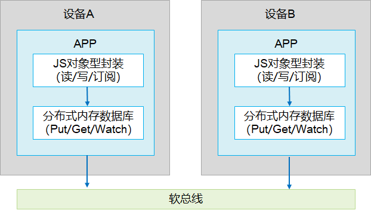

# 开发指南写作模板


> **注意：**
>
> _1、本模板提供推荐的开发指南文档框架、典型知识点写作要求及写作指导。实际写作中，应视具体**方案/特性/功能/模块**情况，先完成开发者任务场景分析与开发指南大纲设计，然后参照本模板写作具体内容。_
>
> _2、文档写作时，一级标题与二级标题之间的位置不允许添加内容。_
>
> _3、所有斜体为写作指导，正式文档中注意全部删除。_


## xxx概述

_必选。根据具体**方案/特性/功能/模块**情况的场景划分情况，此处的“xxx概述”与具体任务场景下的“任务场景n概述”按需提供一处或共存，具体的：_

_1、此处的“xxx概述”：用于承载开发者需要了解的、本特性各任务场景通用的概述内容。如无，则删除。_

_2、“任务场景n概述”：用于承载任务场景n直接相关的概述内容，知识点构成及写作要点与“xxx概述”相同，包括任务场景n简介、任务场景n直接相关的基本概念、任务场景n直接相关的实现原理、任务场景n直接相关的约束与限制、任务场景n直接相关的相关实例。如无，则删除。_

**_【开发指南总体写作要求】_**

**_1、目标对象：_**_面向内、外部开发者（含产品经理、开发人员）。面向UX设计师的指导文档通常由专门的UX设计规范承载，不在开发指南范畴。本文如需提及，以超链接方式指向对应UX规范即可。_

**_2、内容定位：_**_介绍**方案/特性/功能/模块**是什么（What）、能做什么（Why），以及如何进行相关应用程序/设备的设计、开发、发布上架（How）。支撑开发者学习必要知识，最终在实际开发活动中完成既定任务目标。_

**_3、用户视角：_**_变身开发者，始终以开发者视角，提供开发者关注的、可感知和使用的内容。_

**_4、面向任务：_**_聚焦开发者实际任务，完整、正确、易用，具备权威指导性。_

_5、不要受限：模板只是基础框架，不要僵化。_


### xxx简介

_必选。_

_**【开发者关注点】**_

_这个方案/特性/功能/模块是什么（定义-what）？我为什么要用它？它能解决哪些问题或带来哪些收益？（目的/客户价值-why）_

_**【写作要点】**_

- _提供易理解的场景化描述。_ _可参考如下SCQA方式介绍方案/特性/功能/模块客户面的功能场景、特点。_
  - _S：situation（情景），由大家都熟悉的的情景、事实引入。_
  - _C：complication（冲突），但是实际情况往往和我们的要求有冲突。_
  - _Q：question（疑问），怎么办？_
  - _A：answer（回答），我们的解决方案是 …_

- _抽象的概念要具象化，可以适当引入2C视角（如UX中的场景效果）的内容，帮助理解。_

**_【写作要求】_**

- _清晰易懂，避免模糊、晦涩、有歧义的表述。_

- _仅使用必要的术语、缩略语或专有名词，并给出解释（提供到术语表链接也可以）。_

- _文中使用的术语、缩略语或专有名词应全文保持一致。_


### xxx基本概念

_可选。此处放置以下各任务场景通用的基本概念。_

_**【开发者关注点】**_

_要使用该方案/特性/功能/模块，有哪些独有概念是我需要了解的？_

**_【写作要点】_**

- _仅提供开发者任务中必须的概念。_

- _运作机制、约束限制、开发过程等多个章节相关的概念在此介绍，仅某个章节用到的概念在对应章节中介绍。_

- _业界通用的概念不用在此赘述。_ _注意使用业界通用术语来表达，不用华为研发内部语言。_

- _概念之间如有逻辑关系，推荐使用图形描述。_

**_【写作要求】_**

- _清晰易懂，避免模糊、晦涩、有歧义的表述。_

- _仅使用必要的术语、缩略语或专有名词，并给出解释（提供到术语表链接也可以）。_

- _文中使用的术语、缩略语或专有名词应全文保持一致。_

**【写作样例】**

在进行关系型数据库开发前，开发者应了解以下基本概念：

- **关系型数据库**
  

基于关系模型来管理数据的数据库，以行和列的形式存储数据。

- **谓词**

  数据库中用来代表数据实体的性质、特征或者数据实体之间关系的词项，主要用来定义数据库的操作条件。

- **结果集**

  指用户查询之后的结果集合，可以对数据进行访问。结果集提供了灵活的数据访问方式，可以更方便的拿到用户想要的数据。


### 实现原理

_可选。此处放置以下各任务场景通用的实现原理。_

_**【开发者关注点】**_

_该方案/特性/功能/模块是如何工作的？关键步骤相关接口调用和触发时机？我要了解其原理，以更好的使用、调试它。_

**_【写作要点】_**

- _如果原理简单，通过前面基本概念就可以说清楚，此章节可以不提供，删除即可。_

- _仅描述开发者任务（使用或接入）过程中可见的机制原理，不要提供开发者不可见的内部实现。_

- _尽量图文结合，一般使用时序图、流程图等形式。文字描述与图形描述匹配。_

- _注意不要泄密。_

**_【写作要求】_**

- _清晰易懂，避免模糊、晦涩、有歧义的表述。_

- _仅使用必要的术语、缩略语或专有名词，并给出解释（提供到术语表链接也可以）。_

- _文中使用的术语、缩略语或专有名词应全文保持一致。_

**【写作样例】**

分布式数据对象生长在分布式内存数据库之上，在分布式内存数据库上进行了JS对象型的封装，能像操作本地变量一样操作分布式数据对象，数据的跨设备同步由系统自动完成。

**图1** 分布式数据对象运行机制




### 约束与限制

_可选。此处放置以下各任务场景通用的约束与限制。_

_**【开发者关注点】**_

_我要使用该方案/特性/功能/模块，有什么约束条件吗？该方案/特性/功能/模块实现的程度如何，能满足我的需求吗？_

**_【写作要点】_**

- _描述对开发活动有影响、可感知的约束限制，及其带来的影响，包括但不限于如下几方面：_
  - **_功能限制_**
     - _功能使用范围（明确不支持的场景）。_
     - _规格限制。_
  - **_操作限制_**
     - _已知问题的操作。_
     - _潜在风险的操作（如引起性能降低）。_

- _容易出错的操作在步骤里描述，不在此体现。_

**【写作样例】**

- 不同设备间只有相同bundleName的应用才能直接同步。

- 不建议创建过多分布式数据对象，每个分布式数据对象将占用100-150KB内存。

- 每个分布式数据对象大小不超过500KB。


### 相关实例

_可选。此处放置以下各任务场景通用的相关实例。_

**_【开发者关注点】_**

_有哪些Sample code、Codelabs、Demo工程可供学习、参考。_

**_【写作要点】_**

_已发布的Sample code、Codelabs、Demo工程包，请在此处提供链接（一般为Gitee链接）。_ _注意：不允许将工程包等作为附件插入到文档中。_

**【写作样例】**

针对Ability开发，有以下相关实例可供参考：

-  [UIAbility内和UIAbility间页面的跳转（ArkTS）](https://gitee.com/openharmony/codelabs/tree/master/Ability/StageAbility)


## 环境准备

_可选。_

_根据具体的开发场景分析分解情况，本节内容可按需放入“开发指导”下，作为“前提条件”或“开发准备”与具体场景的“开发步骤”就近放置。_

_明确如何准备开发环境（如软硬件配置要求、工具要求、设备要求等）。_

_如果不涉及上述特殊要求，此章节删除。_


### 环境要求

**_【写作要求】_**

_明确开发环境所需要的软硬件配置，旨在要用户提前准备环境。如果软硬件内容比较多，可以再增加子标题。_

**【写作样例】**

Hi3861开发板对环境配置的特有要求如下表所示。

  **表1** Hi3861开发板对环境配置的特有要求

| 平台类型 | 开发工具 | 用途 | 获取途径 |
| -------- | -------- | -------- | -------- |
| Linux服务器 | SCons3.0.4+ | 编译构建工具 | 通过互联网获取 |
| Linux服务器 | build-essential | 编译依赖的基础软件包 | 通过互联网获取 |


### 搭建环境

**_【写作要求】_**

_描述搭建开发环境的具体步骤，如果内容比较多，可以再区分章节，如：搭建编译基础环境、搭建编译工具环境等。_

**【写作样例】**

1. 打开Linux编译服务器终端。

2. 运行如下命令，安装工具安装包。
   
   ```
   xxxxx
   ```

3. 运行如下命令，查看是否安装成功。
   
   ```
   xxxxx
   ```


### 检验环境是否搭建成功

**_【写作要求】_**

_可选。环境搭建完成后，需要明确给出环境搭建是否成功的检验标准，也可以与搭建步骤合一。如上述写作样例。_


## 任务场景n（使用具体任务/场景名称替代，只有1个场景时使用特性名称xxx）开发指导

_必选。_

_**【开发者关注点】**_

_我要使用/接入这个方案/特性/功能/模块，需要怎么做（how）？_

_**【写作要点】**_

_贴近开发者实际开发场景：_

- _开发者需要通过哪些任务来达成开发目标，这就是任务场景。_

- _任务场景可以有1个或多个，可按需添加多个“开发指导”章节。同时要遵循分层分级逻辑，即大场景（任务场景n）-&gt;小场景（子任务场景n-x）-&gt;任务逻辑（对应“开发流程”）-&gt;操作步骤（一个个step）。_

### 任务场景n概述

_根据具体特性的场景划分情况，“任务场景n概述”与开篇的“xxx概述”按需提供一处或共存，具体的：_

_1、开篇的“xxx概述”"：用于承载开发者需要了解的、本特性各任务场景通用的概述内容。如无，则删除。_

_2、“任务场景n概述”：用于承载任务场景n直接相关的概述内容，知识点构成及写作要点与开篇的“xxx概述”相同，包括任务场景n简介、任务场景n直接相关的基本概念、任务场景n直接相关的实现原理、任务场景n直接相关的约束与限制、任务场景n直接相关的相关实例。如无，则删除。_

### 开发流程

**_【写作要点】_**

- _可选。当开发步骤较多（达到5步及以上核心操作）或步骤间存在复杂的逻辑关系时，请提供开发流程，让开发者对他要执行的操作有一个全景认知。_

- _一般使用流程图、表。_


### 接口说明

**_【写作要求】_**

- _可选。描述以下开发步骤中有哪些关键接口，并提供接口简介。旨在要开发者在开发前有大体了解，提升开发效率。_

- _如果相关接口超过10个，只提供主要接口即可_。

- _接口及其涉及的功能必须在文档发布时的对应版本已支持。_

**【写作样例】**

部分接口仅系统应用才可以调用，且需要具备权限：SystemCapability.Notification.Notification ，接口返回值有两种返回形式：callback和promise，下表中为callback形式接口，promise和callback只是返回值方式不一样，功能相同。具体API说明详见[接口文档](https://gitee.com/openharmony/docs/blob/master/zh-cn/application-dev/reference/apis/js-apis-notification.md)。

**表1** 通知使能开关接口功能介绍 

| 接口名                                                       | 描述             |
| ------------------------------------------------------------ | ---------------- |
| isNotificationEnabled(bundle: BundleOption, callback: AsyncCallback\<boolean>): void | 查询通知使能开关 |
| enableNotification(bundle: BundleOption, enable: boolean, callback: AsyncCallback\<void>): void | 设置使能开关     |


### 开发步骤

**_【写作要求】_**

_必选。_

- _完整性、正确性要求_
  - _描述开发的完整过程，使开发者能够完整（如HAP中代码、资源、第三方库及应用配置文件都涉及哪些相关步骤）、正确的完成开发，不可遗漏关键配置操作。_
  - _文档中的片段示例代码直接拷贝进DevEco Studio中，放入上下文可以正常编译。_
  - _文档中的完整示例代码直接拷贝进DevEco Studio中能够运行，并和文档中描述的执行结果一致。_

- _清晰性要求_
  - _每个步骤有清晰的执行主体（who），明确操作目的（why）、操作内容（what/how）、场景（when/where）。使用祈使句描述步骤。_
  - _步骤中如果涉及接口调用，需要清晰给出使用的接口及其使用说明、示例代码。_
  - _关键步骤和示例代码中有开发建议或注意事项的位置，需要提供相关描述（示例代码中采用注释）。_
       变身开发者，假想自己在操作，可能会提出什么问题？这些问题就是开发者的障碍。需要在文档中提供支撑信息，来帮助开发者处理及应对这些障碍。例如：
     - 分支选取原则：步骤分支选取原则、参数选取原则或建议。
     
     - 必要的随操作步骤就近放置的补充说明：可能存在的特殊操作、操作权限要求、效率提升技巧、几句话即可说清的背景知识等。
     
     - 需要事先告知用户并提醒注意的信息：对其他功能可能造成影响的操作；对系统性能、可靠性可能造成影响的操作；可能导致数据丢失或各类安全问题的操作。这些信息需要在“操作步骤”开始前，以区别于正文的样式加以提示强调。
     
     - 防错/纠错信息：针对开发全流程中可能遇到的典型问题，提供预防、定位或恢复指导，以提高开发效率。防错/纠错信息可酌情在“开发步骤”或下文的“常见问题”中承载。

- _规范性要求_
  - _保证示例代码的逻辑/语法正确性、书写规范性。涉及用户手机号码、身份证、帐号名等敏感信息均需要打码处理，如186\*\*\*\*\*\*\*\*；涉及IP地址、域名等，需要使用私网IP或相应格式代替，如xx.xx.xx.xx、www.example.com，禁止使用真实IP地址、域名。_
  - _代码显示符合代码缩进要求。缩进不要用tab键，改为4个空格，否则上网格式错乱。_

**【写作样例-节选】**

1. 导入相关模块。

   ```javascript
   import formBindingData from '@ohos.application.formBindingData'
   import formInfo from '@ohos.application.formInfo'
   import formProvider from '@ohos.application.formProvider'
   ```
   
2. 实现LifecycleForm生命周期接口。

   ```javascript
   export default {
       onCreate(want) {
           console.log('FormAbility onCreate');
           // 由开发人员自行实现，将创建的卡片信息持久化，以便在下次获取/更新该卡片实例时进行使用
           let obj = {
               "title": "titleOnCreate",
               "detail": "detailOnCreate"
           };
           let formData = formBindingData.createFormBindingData(obj);
           return formData;
       },
       onCastToNormal(formId) {
           // 使用方将临时卡片转换为常态卡片触发，提供方需要做相应的处理
           console.log('FormAbility onCastToNormal');
       },
   }
   ```


### 调测验证

**_【写作要求】_**

- _可选。开发完成后，如有独立的调测验证操作，需提供指导，以确认操作是否成功。操作步骤要求同“开发步骤”。_

- _此处仅提供最后的业务调测，每个小任务的操作结果，推荐在开发步骤执行完成后及时验证。_


## 常见问题

_可选。_

**_【开发者关注点】_**

_该方案/特性/功能/模块开发全流程中可能遇到哪些典型问题？如何定位、解决？_

**_【写作要点】_**

_描述开发过程遇到的各类问题以及解决方案，以提高开发效率。_

- _如果无常见问题，删除此章节。_

- _各任务场景通用的常见问题，建议以单独章节呈现；单个任务场景相关的常见问题，放在对应任务场景的章节下即可。_


### 1.XX问题（简单问题）

XXX


### 2.XX问题（复杂问题）

**现象描述**

XXX

**可能原因**

XXX

**解决办法**

XXX
