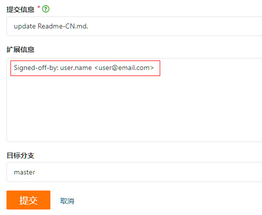

# 贡献文档

非常欢迎您贡献文档，我们鼓励开发者以各种方式参与文档反馈和贡献。您可以对现有文档进行评价、简单更改、反馈文档质量问题、贡献您的原创内容。

-   [贡献方式](#贡献方式)
-   [文档风格](style-guide/Readme-CN.md)

## 内容版权

用户提交的内容、图片必须是原创内容，不得侵犯他人知识产权。

对应采纳的内容，OpenHarmony有权根据相关规范修改用户提交的内容。

## License

Creative Commons License version 4.0

## 贡献方式

### 反馈文档问题

高质量的问题反馈有助于我们不断完善文档内容和质量，您提供的信息越详尽，对我们问题改进越有帮助。

1.  在Gitee页面中，“Issue”页签中单击“新建Issue”，在标题栏中描述问题，在编辑框中添加详细问题描述。
2.  单击“创建”按钮，提交Issue，耐心等待文档团队成员确认您的问题。

>**说明**：
>**如何反馈一个高质量的问题**？
>
>-   提供问题的清晰描述，描述具体缺失、过时、错误的内容或者需要改进的文字。
>-   解释该问题对用户的影响。
>-   将给定问题的范围限定在一个具体内容、任务。如果问题牵涉的领域较大，可以将其分解为多个小一点的问题。例如：“文档需要优化” 是一个过于宽泛的问题，而 “XX开发指南缺少对XXX步骤的介绍” 就是一个足够具体的、可操作的问题。
>-   搜索现有问题的列表，查看是否已经有相关的或者类似的问题已被记录。
>-   如果新问题与某其他问题或PR有关联，可以使用其完整 URL 或带 \# 字符的PR编号来引用它。

### 简单更改

针对现有文档进行快速更改和修复，适合少量内容修改和补充。

1.  在文档页面右上角单击“编辑“按钮即可跳转到对应的Gitee工程源文件页面。
2.  在Gitee源文件md页面中，在对应内容处完成更改、修复。
3.  修改完成后，可单击“预览“按钮，确认修改结果。
4.  确认无误后，在“扩展信息框”中填写修改意见和补充信息、Signed-off-by邮箱信息触发DCO校验，单击提交审核。

    例如：Signed-off-by: user.name <user.email> //与DCO签署邮箱保持一致

    

    文档团队成员将评审并合并您的修改内容，感谢您对OpenHarmony文档的支持和帮助。

更多内容可参考[贡献流程](贡献流程.md)。

### 为发行版本贡献文档

为了帮助开发者更高效使用OpenHarmony社区的每个Release版本，社区会根据每个版本规划的需求特性提供配套文档（如指南、API参考、开发示例、Release Notes、API Changelog、FAQ等）。有的需求涉及新增功能特性和文档，有的需求是对现有特性和文档内容更新。

欢迎开发者参与贡献，详细参考：[为发行版本贡献文档](docs-release-process.md)

### 贡献经验分享内容

鼓励开发者在学习、开发过程中，总结经验并创建技术内容帮助更多开发者快速上手。推荐输出各类How to教程、常见问题FAQ等。请参考如下写作模板：

-   [How to教程](https://gitee.com/openharmony/docs/blob/master/zh-cn/contribute/template/tutorial-template.md)：贡献至`contribute/tutorial`文件夹下。
-   [FAQ](https://gitee.com/openharmony/docs/blob/master/zh-cn/contribute/template/faq-template.md)：贡献至`contribute/faqs`文件夹下。

内容写作模板归档在Docs文档仓下contribute文件夹中。

