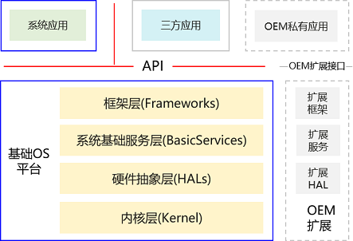

# OpenHarmony API治理章程

## 总览

为了引导OpenHarmony应用生态健康、有序发展演进，本章程对OpenHarmony API的新增、变更、废弃、删除等生命周期与治理流程进行约束，同时定义了基本的API设计要求。

本章程由API SIG制定，经PMC批准发布；本对章程的修订必须经由API SIG评审后，由PMC批准发布。 
## API范围与定义
应用程序接口(API)位于应用层和框架层之间，是由操作系统预定义的、由框架层和系统应用提供给应用(包括系统应用和三方应用)开发使用的类、方法等用户程序编程接口；不包括OEM扩展接口。

OpenHarmony API按可授权使用方分类包括：
- Public API：公开发布，提供给三方应用开发使用的API。
- System API：非公开发布，仅授权平台签名应用、预置特权应用使用的API。
- Test API：受限发布，仅适用于xTS或应用调试阶段可使用的API。

如无特别说明，本章程定义的条款同时适用于Public API、System API或Test API等三种OpenHarmony API。针对System API和Test API的额外要求或例外说明，通过特别说明方式加以补充说明。

OpenHarmony API按编程语言分类包括：
- Java API：面向应用开放的Java编程语言接口。
- JS API：面向应用开放的JavaScript编程语言接口。
- Native API：面向应用开放的C/C++编程语言接口。

如无特别说明，本章程定义的条款同时适用于Java API、JS API和Native API等三种编程语言OpenHarmony API。

## API治理

### 角色与职责

|**涉及角色**|**API治理中的职责**|
| - | - |
|Contributor|API的设计和交付主体，负责API相关的代码与设计文档提交。|
|Committer|API相关的代码评审，涉及API提交预审。|
|领域SIG|
新增API相关的代码提交评审，领域SIG评审通过即可合入。

变更API相关的代码提交预审。
|
|API SIG|变更API相关的代码提交评审。|
|PMC|API Version计划发布、API治理章程修订评审发布等。|

### API评审流程
API评审流程如下：

主要过程说明：
1. API评审申请、代码提交（Owner：Contributor），除代码提交外，如果涉及API新增或变更需同步提交相应的API设计文档，详细说明API的需求来源、场景与使用方法、权限设计、隐私保护澄清等，详见后面的API评审申请要素。为避免后续的返工，Contributor可以在正式的API评审申请、代码提交之前，先通过邮件方式将API设计文档提交Committer、领域SIG、API SIG等相关人员预审。
1. 代码评审（Owner：Committer），代码评审和API预审，涉及API提交CodeReview通过后，还需要进一步领域SIG评审。如果单次提交同时涉及多个领域的API新增或变更，相应的API评审申请和代码需要同时提交给相关领域的Committer评审，只有所有对应领域的Committer都完成CodeReview后才能进入下一评审环节。
1. API评审（Owner：领域SIG），新增API相关的代码提交评审，领域SIG评审通过即可代码合入；变更API相关的代码提交，领域SIG评审通过后，还需要进一步提交API SIG。如果单次提交同时涉及多个领域的API新增，相应的API评审申请和代码需要同时提交给相关领域的SIG评审，只需一个领域SIG评审通过即可代码合入。如果单次提交同时涉及多个领域的API变更，相应的API评审申请和代码需要同时提交给相关领域的SIG评审，只有所有对应领域的SIG都要评审通过才能进入下一评审环节。
1. API变更评审（Owner：API SIG），变更API相关的代码提交评审，评审通过即可代码。
1. 评审完成。

### API评审申请要素
如果涉及API新增或变更需同步提交相应的API设计文档。

针对新增API，需要包含如下要素：
1. 需求来源与使用场景（必须）。
1. API现状与差距分析，说明API新增或变更的必要性（必须）。
1. API原型设计与使用方法说明（必须）；必要时，可以进一步包含相应的使用样例（可选）。
1. API权限设计（必须）。
1. API隐私保护方案与要求满足情况澄清（必须）；
1. 提交代码的同时提交相应的API参考（必须）；必要时，可同步提交相应的开发者指南文档（可选）。
1. 兼容性/性能/功耗/可靠性/测试等相关情况说明（可选，如不满足本章程 “4 API设计要求”，则必须包含相关说明）。

针对变更API，需要额外包含如下要素：
1. 针对老接口的处理方式（废弃、隐藏或彻底删除）以及对使用老SDK开发应用的兼容措施（必须）；
2. 变更影响、替代接口和相应的应用适配方案（必须）。
3. 刷新ChangeLog（必须） 和 API-diff文档（涉及JS/Native API变更，必须；Java API的差异报告可工具化生成，不需要人工提交）。

## API设计要求
### 一致性要求
1. 概念一致性：基于场景的业务模型抽象，形成OpenHarmony的连贯、一致、自恰的用户程序模型和业务概念。
1. 术语一致性：相应的业务术语必须采用统一名词，不允许使用多个语意接近的名词表示同一个业务对象；同样地，为了避免产生混淆，也不允许针对不同的业务对象使用相同的名词或语言接近的名词。
1. 操作一致性：相同的操作动作必须采用同一动词。
1. 参数顺序一致性：相同参数/参数序列在多个API中的位置和顺序保持一致。
1. 机制及算法一致性：通信机制、调用模式、认证机制、加密算法等保持一致。
1. 帮助、Demo、模板风格一致性：排版、用法等保持一致。

### 易用性要求
以“能力使用者”视角，而不是“能力提供者”视角设计API：
1. 可理解：API命名和功能特性必须容易理解。
1. 易使用：提供简单易用的API，减少API之间不必要的耦合，避免多个无之间关联关系API之间调用顺序的依赖，尽可能使调用者优雅，尽量避免使用单一功能时必须同时组合调用多个包/模块或类中的多方法才能实现。
1. 避免误导：提供使用者期望的能力，避免误导，减少误用。
1. 提供必要的API文档。

### 命名要求
1. 能清晰的表达意图：使用完整的描述性的单词。
1. 避免造成误导：有误导的名字比表达不清的名字还要有危害性。
1. 词义清晰明了，避免使用info，data，object等一般意义的词。
1. 作用域越大，命名应越精确。
1. 不用或少用缩写，业界通用术语遵从行业习惯允许使用缩写。
1. 包名/模块名/命名空间前缀约定：
   1. Java API 统一包名： package ohos.\*。
   2. JS API 统一模块名：@ohos.\*。
   3. Native API 统一命名空间：namespace OHOS.\*。
   4. 引用外部开源代码的，可以保留原包名/模块名/命名空间，也可以按照上述规则对包名统一进行替换。
1. 包名/模块名/命名空间最短不少于2段，最长不超过4段；每一段建议使用一个单词，最长不超过2个单词。
1. 类名、方法名/函数名、成员变量、变量名最多不超过4个单词。

### 权限控制要求
1. 完备性原则：一切穿透应用沙箱的行为都需考虑使用权限来管控。
1. 最优粒度原则：一个权限只保护一类对象；一个接口仅需申请一个权限即可访问。
1. 清晰完整原则：权限定义中必须清晰说明保护对象、开放范围、敏感级别。
1. 最小开放原则：一个权限仅对确有正当业务需求的应用开放，开放控制可通过权限来实现。

### 隐私保护要求
1. API调用的返回仅包含必要的内容， 避免携带额外信息。
1. API调用不允许获取、手机用户个人数据， 除非通过用户权限管控、由用户授权同意。
1. API涉及跨应用调用时，如涉及个人数据向被调用者的披露，由调用方在隐私声明中说明披露的数据类型、数据接收者和数据使用目的。
1. API涉及到用户敏感数据（如电话、通讯录、媒体等）访问时，需要使用system picker的机制，禁止API通过申请敏感权限方式访问。
1. API开放禁止捆绑与所开放能力不相关的功能。

### 文档化要求
1. API参考采用英文方式交付。
1. 模块/包模块的API参考必须包括简要描述和详细描述。
1. 类、方法、“Interface”、枚举或成员变量的API参考必须包括简要描述。
1. 类、方法、“Interface”、枚举或成员变量的API参考可选包括详细描述。
1. 方法、“Interface”的API参考必须包括所有入参的参数描述。
1. 如果方法或“Interface”有返回值，则API参考必须包含返回值描述。
1. 如果执行过程中可能抛出异常，则API参数必须包含相关的异常描述。
1. 必须包含API的起始版本号（使用@since注释标记）。
1. 可选包括本模块或类自己的版本号（使用@version注释标记）。
1. 涉及API变更(不兼容)，必须同步交付API-Diff和ChangeLog文档。

### 兼容性要求
1. 按严格程度从高到低，API兼容要求包括：契约兼容 > 二进制兼容 > 源码兼容。
   1. 源码兼容：指版本演进后，开发者已有的源代码可正常编译通过。
   1. 二进制兼容：指版本演进后，开发者已有程序不用重新编译可正常链接、运行。
   1. 契约兼容：也称语义兼容，指版本演进后，开发者原有程序行为不发生变化。
1. OpenHarmony API后向兼容必须满足二进制兼容要求，例外情况需要通过API SIG评审并经过PMC批准。常见破坏二进制兼容的API变更包括：
   1. 任何API元素删除；
   1. 降低方法的可见性，例如protected修改为了private，或者public修改为protected。
   1. 类类型发生变化，例如抽象类变更为非抽象类，或者接口类(“Interface”)变更为非接口类。
   1. 方法原型发生变化，例如返回值类型修改，或入参顺序或入参类型发生变化。
   1. 成员final/static等属性发生变化，例如非final成员变成final，或者非static的成员变成static。
1. 禁止“原型相同、功能不兼容”的API修改，可受限使用“废弃old-api、新增new-api”的方式进行修改。
1. 根据发布类型不同，API的生命周期和兼容性要求：

   1. Canary版本：早期发布的预览版本，不承诺API稳定。
       1. 对上一Release发布版本保持API兼容。
       1. 相同API Version的多个Canary版本之间无API兼容性要求。
   1. Beta版本：公开发布的Beta测试版本，不承诺API稳定。
       1. 对上一Release发布版本保持API兼容。
       1. 对同一API Version的早期发布的Canary版本不兼容。
       1. 相同API Version的多个Beta版本之间无API兼容性要求。
       1. API Stable版本发布之后API即冻结，之后再发布的Beta版不允许任何形式的API新增或变更。
   1. Release版本：正式发布版本。
       通过Release版本对外发布的API，需要遵守对外部开发者的“契约承诺”，原则上不允许对已经Release发布的API进行不兼容修改，受限允许对已发布的API进行废弃。已经Release发布的API废弃基本要求包括：
       1. 废弃接口标记。
       1. 提供可替代接口。
       1. 废弃API至少保留5个API Version版本（对废弃5个API Version的API可以彻底删除，不再支持）。

### 性能/功耗/可靠性要求
1. 应及时响应，避免调用者等待；如果API调用执行时间过长应设计为异步方式。
1. 应关注API调用时机、调用频次对RAM占用的影响。
1. 应关注API调用时机、调用频次对功耗的影响。
1. API内部创建对象的生命周期要闭合，避免对象资源泄漏。
1. 满足幂等性要求，相同业务含义的请求API调用一次或多次重试总能获得相同的效果（API调用依赖外部资源的变化除外）。针对可重入的API调用实现内部应尽量避免引入时变因素，如系统tick、静态变量、没有互斥保护的全局变量等；针对同一客户端的多次重复调用，可以使用contextID、clientToken、squenceNo等作为调用入参。

### 测试要求
1. 新增API必须同步交付API自动化测试用例，用例100%覆盖API接口。
1. 用例场景单一，单条用例覆盖接口单个功能场景，简化单条用例代码逻辑。
1. 用例执行高效，每条用例执行时间控制在毫秒级。