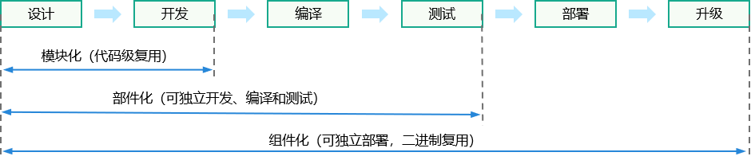
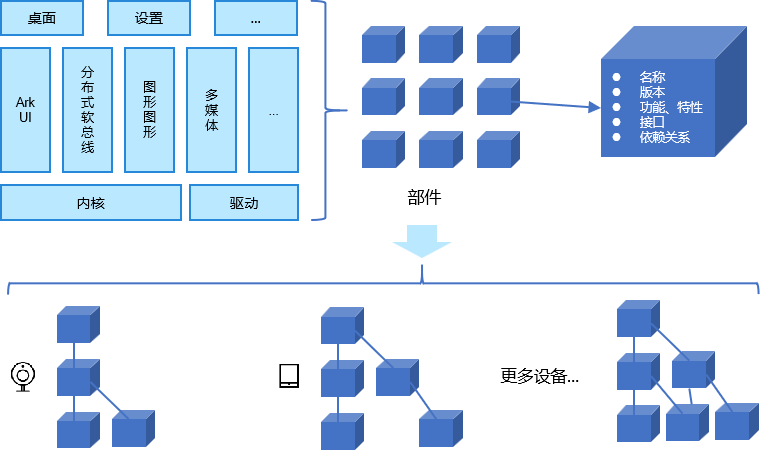
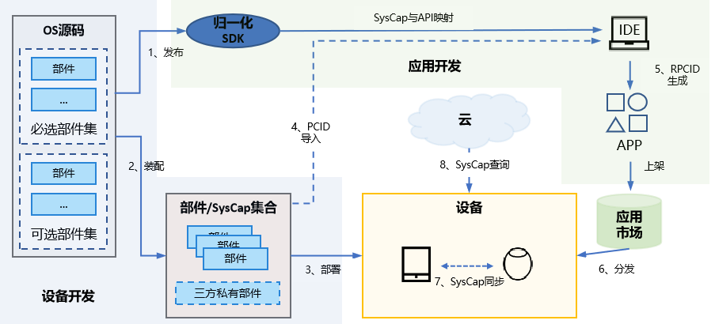

# OpenHarmony部件设计和开发指南

## 基本概念

组件化、部件化、模块化是指软件基于组件、部件、模块解耦，实现各个领域软件分而治之的软件设计方法。它们的关系如下：



### 部件定义

OpenHarmony参考机械装配领域的零部件的概念将系统能力抽象为部件，通过拼装和配置部件的方式定制适用于不同设备的操作系统。

**部件**：系统能力的基本单元，以源码为划分依据，具有独立的文件和目录，在不同设备上可以实例化为对应的库或可执行文件。

部件化的目标是实现一套OS代码支持多种产品形态，解决千行百业硬件和产品碎片化问题，提高设备开发的效率。



## 部件设计

### 划分原则

当开发一个新的功能时，应该新增部件还是模块？如果是系统非必选的功能、有可裁剪的产品化诉求，则需独立为部件。并且需要满足如下要求：

- 具备独立的代码目录，可独立编译出库或可执行文件。
- 小型和标准系统中具备独立部署的能力，非必选的功能被裁剪后不会导致系统异常。
- 可独立测试和验证。

### 规则和建议

部件的设计应遵循如下规则和建议：

**规则1.1** 部件应当实现独立自制原则，保持部件本身的解耦和独立。

**规则1.2** 禁止系统通用的部件依赖特定的芯片、开发板或产品形态，驱动和内核相关的部件例外。

**规则1.3** 最小系统部件集中的部件为必选部件，禁止依赖最小系统以外的可选部件。

> 说明：最小系统定义以及对应的部件集合请在[OpenHarmony产品兼容性规范](https://www.openharmony.cn/certification/document/pcs)PCS章节下按版本查询。

**规则1.4** 新增部件需要经过架构师和本领域的设计人员评审。

**规则1.5** 禁止部件间反向依赖、循环依赖，下层部件禁止依赖上层部件。

**规则1.6** 部件提供的应用接口应保持稳定和版本兼容性，标识为废弃的接口须按计划有节奏的回收。

**规则1.7** 对于具有可配置特性的部件，特性可按需配置，特性有无不应导致部件对外提供的接口变化。

**规则1.8** 部件英文命名规则：名词形式，需体现部件的功能，在系统内全局唯一，不超过63个有效英文字符，使用小写加下划线的内核风格命名，例如：unix_like。

**规则1.9** 部件中文命名规则：名词形式，需体现部件的功能，不超过16个中文字符，不建议中英文混合。

**规则1.10** 部件仓命名规则：部件仓名使用英文，命名规则：<子系统>_<部件>，例如：文件管理子系统的存储服务部件的仓名为“filemanagement_storage_service”。仓名总长度不超过100个字符。

> 说明：
>
> 1）部件和仓原则上是一一对应关系，特殊情况下多个部件可以共享一个仓，但部件的目录必须独立。
>
> 2）第三方开源的部件名保持第三方原始的命名，仓名前添加“third_party”前缀。第三方开源部件统一放到third_party目录下。
>
> 3）仓名和路径名中的子系统名均不带下划线。

**规则1.11** 部件源码路径规则：<领域>/<子系统>/<部件>， 例如：foundation/filemanagement/storage_service。

**规则1.12** 部件目录结构规则如下：

```xml
├── interfaces          # 接口
│   ├── kits			# 应用接口，可选
│   │    ├── js			# JS接口，可选
│   │    └── native  	# C/C++接口，可选
│   └── inner_api       # 系统内部件间接口
├── frameworks          # 部件无独立进程的实现，可选
│   ├── native          # C/C++实现，可选
│   └── js              # JS API的实现，可选
│        ├── napi       # napi代码实现，可选
│        ├── builtin	# 仅用于LiteOS-M，可选
│        └── plugin     # ArkUI特有，可选
├── services            # 独立进程的实现，可选
├── test                # 测试代码，必选
├── BUILD.gn            # 编译入口，必选
└── bundle.json         # 部件描述文件，必选
```

**建议1.1** 部件应支持自动化构建和验证的能力。

### 系统能力（SysCap）

SysCap(全称SystemCapability），即系统能力，由部件提供，每个SysCap绑定一个或多个应用API。SysCap是设备开发和应用开发的桥梁，设备部件装配的差异体现为SysCap差异，即不同设备上可使用API的范围也不同。完整的SysCap使用场景如下：



1、应用开发者使用归一化的、支持多设备的SDK进行应用开发，其中包含了全量的SysCap集合（包括可选和必选）以及对应的API。

2、设备开发者可按需装配可选部件、添加私有的部件形成目标设备的SysCap集合。

3、装配完成后的SysCap集合随编译和打包自动写入设备。

4、PCID(Product Compatibility ID)，即设备兼容性标识。它设备编译时自动生成，在开发特定设备的应用时可导入IDE，便于应用在开发阶段获取设备的SysCap集合。

5、RPCID(Required Product Compatibility ID)，即要求的产品兼容性标识。它在应用编译打包时自动生成，为应用要求的SysCap集合。

6、应用市场分发应用时，将应用的RPCID与设备的PCID进行匹配，如果设备的SysCap集合能覆盖应用要求的SysCap则分发。

7、在应用流转场景下，SysCap将在设备间同步。

8、在免安装场景下，云侧可查询设备的SysCap。

#### 应用开发者如何使用SysCap?

应用开发者可以通过CanIUse接口在运行时查询设备具备某个SysCap，从而保证应用在不同设备上的兼容性。示例代码如下：

```javascript
import geolocation from '@ohos.geolocation'

const isLocationAvailable = canIUse('SystemCapability.Location.Location');
if (isLocationAvailable) {
    geolocation.getCurrentLocation((location) => {
        console.log(location.latitude, location.longitue);
    });
} else {
    console.log('Location not by this device.')
}
```

此外，SDK中定义了典型设备类型包含的SysCap集合，应用开发时选定设备类型的情况下，如果API调用了超出设备类型必选SysCap对应的API范围，IDE会提示API不被该设备支持，导致应用编译失败。

#### 设备开发者如何定义SysCap?

部件与SysCap为一对一关系，SysCap之间是正交的，不同的SysCap之间映射的API无重叠。SysCap命名格式：SystemCapability.分类.特性.子特性（可选），例如：SystemCapability.Media.Camera和SystemCapability.Media.Camera.Front。子特性一般独立的部件实现，该部件依赖基础特性对应的部件，须一起装配到产品中。

1、在部件的bundle.json中声明SysCap，示例代码片段如下：

```json
{
  ...
  "component": {
    "name": "camera",                              # 部件名称
    "syscap": [ "SystemCapability.Media.Camera" ]  # 部件的Syscap
  },
  ...
}
```

2、在对应的d.ts文件中声明API的SysCap属性，完成API与SysCap的绑定，示例代码片段如下：

```js
/**
 * @name camera
 * @syscap SystemCapability.Media.Camera
 * @ since 9
 */
declare namespace camera {
    ...
}
```

### 部件评审

部件的新增、修改（功能和接口变化）和删除需经架构SIG（Special Interest Group）和[相关领域的SIG leader](https://gitee.com/openharmony/community/blob/master/sig/sigs_subsystem_list.md)评审，流程如下：

1、准备如下的部件属性列表：

表1. 部件属性评审表

| 部件属性     | 说明                                                         |
| ------------ | ------------------------------------------------------------ |
| 英文名称     | 名词形式，需体现部件的功能，在系统内全局唯一，不超过63个有效英文字符，使用小写加下划线的内核风格命名，例如：unix_like。 |
| 中文名称     | 名词形式，需体现部件的功能，不超过16个中文字符，不建议中英文混合。 |
| 子系统       | 部件归属的子系统。                                           |
| 功能描述     | 一句话简要描述部件功能，100字以内。                          |
| 可配置特性   | 部件对外可配置的特性。                                       |
| SysCap       | 系统能力，示例：SystemCapability.Media.Camera、SystemCapability.Media.Camera.Front |
| 适用系统类型 | 部件适用的系统类型：小型、轻量和标准，可以同时支持多种。     |
| 源码目录     | 部件的源码根目录。                                           |
| ROM          | 部件设计的ROM基线值。                                        |
| RAM          | 部件设计的RAM基线值。                                        |
| 依赖         | 部件依赖的其他部件和开源软件。                               |

2、发邮件给架构SIG(dev@openharmony.io)和[相关领域的SIG leader](https://gitee.com/openharmony/community/blob/master/sig/sigs_subsystem_list.md)进行邮件评审，邮件标题【OpenHarmony部件新增/修改/删除评审申请】，邮件正文中按部件实际情况填写“表1.部件属性评审表" 。

> 说明：删除的部件需提供部件停止维护的计划。删除和变更部件要谨慎，要评估对存量版本的影响。

3、评审通过后，请按[SIG管理章程](https://gitee.com/openharmony/community/tree/master/sig)新建部件仓和修改manifest，SIG孵化完成后合入OpenHarmony组织代码主库。

## 开发一个部件

部件评审通过后，部件的名称、仓和源码路径等信息都已经确定。开发者可按如下的步骤进行详细的开发：

### 添加描述文件

在开发态，首先需要在部件根目录下创建一个bundle.json描述文件。该文件中包含了部件的名称、编译、测试、SysCap、特性和系统内部件间接口等信息，字段的详细说明请见[部件描述](https://gitee.com/openharmony/docs/blob/master/zh-cn/device-dev/subsystems/subsys-build-component-building-rules.md#%E6%8F%8F%E8%BF%B0%E6%96%87%E4%BB%B6)。示例如下：

```json
{
    "name": "@ohos/my_component",
    "description": "my first component",
    "version": "4.0",
    "license": "Apache License 2.0",
    "publicAs": "code-segment",
    "segment": {
        "destPath": "my_domain/my_subsystem/my_component"
    },
    "component": {
        "name": "my_component",
        "subsystem": "my_subsystem",
        "syscap": [
            "SystemCapability.MySubsystem.MyComponent"
        ],
        "build": {
            "moudles": [
                "//my_domain/my_subsystem/my_component/my_module:my_module"
            ],
            "inner_api": [
                "name": "//my_domain/my_subsystem/my_component/my_module:inner_api",
                "header_base": "//my_domain/my_subsystem/my_component/interfaces/inner_api/my_module"
            ],
            "test": [
                "//my_domain/my_subsystem/my_component:unit_test"
            ]
        }
    }
}
```

inner_api是部件声明的系统内部件间的接口，是部件间依赖的唯一途径。其他部件可通过externel_deps的方式依赖，示例：

```c
ohos_executable("other_component") {
    ...
    external_deps = [ "my_module:inner_api" ]
}
```

### 添加编译脚本

bundle.json中的build:moudles列表为部件编译入口，动态库my_module模块的编译脚本示例如下：

```c
ohos_shared_library("my_module") {
  sources = [ ... ]
  ...
  external_deps = [ ... ]
    
  part_name = "my_component"
  subsystem_name = "my_subsystem"
}
```

部件编译脚本的编写须要遵从部件化相关的要求，请见[部件编译构建规范](https://gitee.com/openharmony/docs/blob/master/zh-cn/device-dev/subsystems/subsys-build-component-building-rules.md#%E9%83%A8%E4%BB%B6%E7%BC%96%E8%AF%91%E6%9E%84%E5%BB%BA%E8%A7%84%E8%8C%83)。

### 编译验证

添加完部件的描述文件和编译脚本后，就可以编写代码源文件开发部件的功能。要使能部件的编译需要将部件配置到产品配置文件中，示例如下：

```json
{
  "product_name": "my_product",
  "device_company": "my_device_company",
  "target_cpu": "arm",
  ...
  "subsystems": [
    {
      "subsystem": "my_subsystem",
      "components": [
        {
          "component": "my_component"
        }
      ]
    },  
  ...
  ]
}
```

单独编译部件的命令示例如下：

```c
./build.sh --product-name my_product --build-target my_domain/my_subsystem/my_component/my_module:my_module
```

将部件的编译产物和测试用例上传到设备中即可验证功能。

当然，全量编译产品也可以验证新增的部件，更多详细使能部件编译的信息请见[新增并编译部件](https://gitee.com/openharmony/docs/blob/master/zh-cn/device-dev/subsystems/subsys-build-component.md#%E6%96%B0%E5%A2%9E%E5%B9%B6%E7%BC%96%E8%AF%91%E9%83%A8%E4%BB%B6)。

## 装配部件

产品配置文件vendor/{company}/{product}/config.json可以按部件和特性维度按需装配目标产品形态。它可以让设备开发者快速构建目标产品，并且无需侵入式修改OpenHarmony源代码。产品配置主要包括产品名称、开发板、所选子系统和部件等信息，示例如下：

```json
{
  "product_name": "my_product",
  "device_company": "my_device_company",
  "target_cpu": "arm64",
  "subsystems": [
    {
      "subsystem": "my_subsystem",
      "components": [
        {
          "component": "my_component",
          "features": []
        }
      ]
    },
    ...
   ]
}
```

编译命令：`./build.sh --product-name my_product`

更多详细的产品装配指导请见[部件化编译最佳实践](https://gitee.com/openharmony/build/blob/master/docs/%E9%83%A8%E4%BB%B6%E5%8C%96%E7%BC%96%E8%AF%91%E6%9C%80%E4%BD%B3%E5%AE%9E%E8%B7%B5.md#%E9%83%A8%E4%BB%B6%E5%8C%96%E7%BC%96%E8%AF%91%E6%9C%80%E4%BD%B3%E5%AE%9E%E8%B7%B5)。

### 部件有无

产品可按硬件情况和产品功能需要配置部件集合，比如在没有NFC的设备上不配置NFC相关的部件。

> 说明：
>
> 1）OpenHarmony最小系统定义部件集默认需要配置。
>
> 2）部件以及依赖的部件需要一起配置，编译框架在构建时会检查依赖部件是否被配置。

### 配置特性

#### 编译时

部件bundle.json中的特性是部件对外声明的编译态选项，它可以是布尔、数值或字符串类型。产品配置文件中的特性配置值可改写部件提供的默认值。比如电源管理的屏保特性默认是关闭的，可以通过如下方式在产品中开启：

```json
{
  {
    "subsystem": "powermgr",
    "components": [
      { "component": "powermgr", "features":[ "powermgr_screensaver_enable = true" ] }
    ]
  }
}
```

更详细的特性配置说明请见[编译构建特性配置](https://gitee.com/openharmony/docs/blob/master/zh-cn/device-dev/subsystems/subsys-build-feature.md)。

#### 运行时

对于复杂的部件，可在运行时读取系统参数或者自定义的配置文件加载不同特性，从而满足产品的差异化诉求。运行时配置的好处是部件只需要编译一次，不同的产品在装配时修改系统参数或配置文件后再制作镜像即可。

### 继承

产品配置文件可通过inherit字段继承部件集合，当前OpenHarmony提供了两类：最小系统部件集和典型产品形态集，分别定义在productdefine/common/base和productdefine/common/inherit目录下。继承最小系统部件集的示例如下：

```json
{
    "inherit": [ "productdefine/common/base/standard_system.json" ],
}
```

通过继承的方式可以简化产品配置，提高效率。