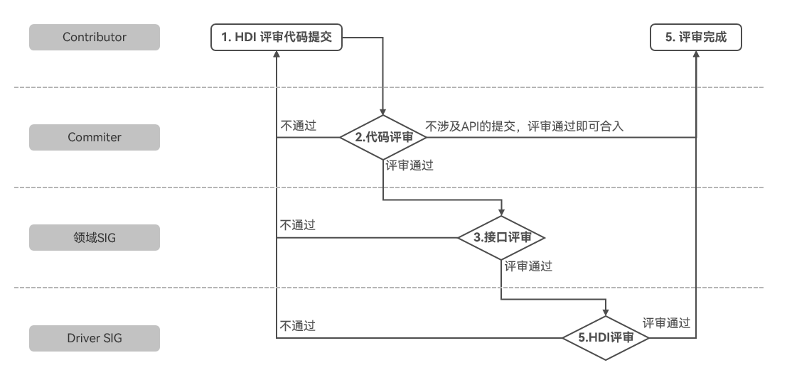

# OpenHarmony设备接口设计规范

## 总览

硬件设备接口（以下简称为设备接口）作为连通驱动程序和系统服务进行数据流通的桥梁，直接影响着系统的高效性、稳定性、兼容性、可靠性以及数据的正确性、完整性。本文档的目的是规范OpenHarmony设备接口的设计和开发，保证接口的风格一致、功能完备，提升设备接口的设计质量。
本章程由[Driver SIG](https://gitee.com/openharmony/community/blob/master/sig/sig_driver/sig_driver_cn.md)制定，经[PMC](https://gitee.com/link?target=https%3A%2F%2Fwww.openharmony.cn%2Fcommunity%2Fpmc%2F)批准发布；对本章程的修订必须经由Driver SIG评审后，由PMC批准发布。

**术语和定义：**

| 术语  | 缩略语                            | 中文解释   |
| --- | ------------------------------ | ------ |
| HDI | Hardware Device Interface      | 硬件设备接口 |
| IDL | Interface Description Language | 接口描述语言 |

**用词约定：**

规则：必须遵守的约定。

建议：需要加以考虑的约定。

说明：对此规则或建议进行相应的解释。

**文档变更说明：**
| 版本  | 变更说明               |
| ---  | --------------------- |
| v1.0 Beta | 初始试行版本               |
| v1.0  | 发布正式版本               |


## 范围与定义


硬件设备接口(HDI)如上图所示，位于基础系统服务层和设备驱动层之间，是提供给硬件系统服务开发者使用的、统一的硬件设备功能抽象接口，其目的是为系统服务屏蔽南向设备差异。

## 通用规则

### 接口版本控制

设备接口版本号采用“major.minor”点分格式进行定义，major和minor版本号都应该是整数编号, 其中minor为1位整数，major可以依次递增：

- major代表架构调整或不兼容的接口定义，更新意味着新版本的接口包不向后兼容旧接口包。

- minor代表兼容的接口定义(增强或扩展)，更新意味着新版本的接口包向后兼容旧接口包。

major版本号变化时， minor版本号重置为 0。

【举例说明】

对于已发布的vibrator相关接口：

```cpp
package ohos.hdi.vibrator.v1_0;
interface IVibrator {
   ...
   SetModulationParameter([in] unsigned int vibrationPeriod, [in] int intensity, [in] int frequency);
   ...
}
```

当对原有接口进行不破坏向后兼容的修改时，如在最后追加新增接口、新增枚举定义、修改变量名称等，只需要增加`minor`版本号，新的包名为`ohos.hdi.vibrator.v1_1`。如：

```cpp
package ohos.hdi.vibrator.v1_1;
interface IVibrator {
   ...
   SetModulationParameter([in] unsigned int vibrationPeriod, [in] int intensity, [in] int freq);
   ...
}
```

如果对原有接口进行更名、修改变量列表等不向后兼容修改时，需要增加`major`版本号，新的包名为`ohos.hdi.vibrator.v2_0`。如：

```cpp
package ohos.hdi.vibrator.v2_0;
interface IVibrator {
   ...
   SetModulationParameter([in] unsigned int vibrationPeriod, [in] int intensity, [in] int frequency, [int] time);
   ...
}
```

### 注释标签说明
1、@since标签，标识这个IDL文件/数据结构（结构体、枚举）/函数接口 定义发布的OpenHarmony版本号(4.0/4.1/5.0);

如这个文件/数据结构/函数接口是4.1版本新增的，那这个文件的since标签始终都是@since 4.1;

简单理解：since时间标识就是文件/数据结构/函数接口 出身版本。

```cpp
/**
 * @brief Enumerates the audio port type.
 *
 * @since 4.1
 * @version 2.0
 */
```

2、@version标签，标识这个IDL文件/数据结构（结构体、枚举）/函数接口 自身的版本号(1.0/1.1/1.2);

version标签只标识对应接口等的版本号，不与since冲突;

比如:

    1、enum AXXX在4.0版本时新增，则@since 4.0 @version 1.0;

    2、4.1版本enum AXXX扩展了枚举值，则该enum 注释标识为@since 4.0 @version 1.1。


### 接口评审与管控

设备接口主要来源于上层系统服务业务的需求、 以及硬件操作本身具备的属性操作需求，如初始化动作等。新增接口需要充分考虑，该接口的适用范围，不通用的接口会使接口变得十分臃肿，而且增加了维护的难度，因此接口新增和变更必须经过严格的管控。

Table 1 接口评审&管控角色

| **涉及角色**    | **HDI接口治理中的职责**                                    |
| ----------- | ------------------------------------------------ |
| Contributor | HDI的设计和交付主体，负责HDI相关的代码与设计文档提交。                   |
| Committer   | HDI相关的代码评审，涉及HDI提交预审。                            |
| 领域SIG     | 新增/变更HDI相关的代码提交，本领域SIG首先进行评审。 |
| Driver SIG  | 新增/变更HDI相关的代码提交评审。                                  |
| PMC         | HDI设计规范修订评审发布等。                  |

#### 设备接口发布

- 接口评审流程

    

    主要过程说明：

    1. HDI评审申请、代码提交（Owner：Contributor），所有涉及HDI新增或变更需同步提交相应的HDI评审文档，详细说明HDI的需求来源、场景与使用方法、权限设计、隐私保护澄清等，详见后面的评审申请要素。为避免后续的返工，Contributor可以在正式的HDI评审申请、代码提交之前，先通过邮件方式将HDI相关设计文档提交Committer、领域SIG、Driver SIG等相关人员预审。
    2. 代码评审（Owner：Committer），代码评审和接口预审，涉及HDI的提交Code Review通过后，还需要进一步领域SIG评审。
    3. 领域SIG评审（Owner：领域SIG），涉及新增/变更HDI相关接口的代码提交，领域SIG评审通过后，还需要进一步提交Driver SIG。
    4. HDI评审（Owner：Driver SIG），对新增/变更HDI相关的代码提交进行接口评审，评审通过即可合入代码。
    5. 评审完成。

- 评审要素

    接口设计完成以后，需经领域SIG组织有效的评审，并提供相应的配套资料，发布前需提供：

    - 提供完善的用例，确保用例的合理性和完备性。

    - **提供接口版本差异报告，明确接口新增或者变更范围**。

    - 需要在设计文档中提供完整的接口上下文，明确接口的使用范围和方法。

    - 在设计面向资源性的接口时，需要在设计文档中提供相应的资源状态迁移图。

    - 本文档中提出的接口设计约束的遵从性。

- 规范要求

    1. **当接口变更存在不兼容时，需要变更“major”版本号；**

    2. **“功能扩展”接口发布时需要修改“minor”版本号。**

    3. 针对废弃已发布设备接口，本规范要求：

        - 对废弃接口增加标识废弃标记。

        - 废弃HDI至少保留4个OpenHarmony API版本。

## 接口设计约束

### 一致性要求

#### 【规则】业务术语必须采用统一名词

相应的业务术语必须采用统一名词，不允许使用多个语意接近的名词表示同一个业务对象；同样地，为了避免产生混淆，也不允许针对不同的业务对象使用相同的名词或语言接近的名词。

#### 【规则】接口参数顺序必须一致性

相同参数/参数序列在多个接口中的位置和顺序保持一致。

对于C面向对象编程时，对象方法接口按照惯例应该放到第一个参数。

#### 【规则】内存所有权必须保持一致

在设计设备接口时，通过入参（in）或出参（out）传递的内存（存储数据），如果由调用者申请，则必须由调用者释放，如果由被调用者申请，则必须由被调用者释放，从而避免因为内存所有权混乱导致的内存释放类问题。无论是将数据由服务传递到驱动中，还是从驱动中接收数据，都不能改变数据的所有权，也就是说数据所有权始终属于内存数据申请者；

【举例说明】

```cpp
int (*OpenLayer)(uint32_t devId, const LayerInfo *layerInfo, uint32_t *layerId);
```

在调用OpenLayer接口时，根据入参layerInfo创建图层数据内存，并返回layerId；

```cpp
int (*CloseLayer)(uint32_t devId, uint32_t layerId);
```

对应以上OpenLayer接口，必须提供CloseLayer接口；

这样，在调用者业务操作结束后，可以调用该接口关闭被调用者创建的图层数据内存；

#### 【规则】同步接口必须有明确的返回值

定义同步接口必须明确指定返回值，可以提供必要的接口调用状态信息。调用是否成功？如果接口调用失败了，那么失败的原因是什么，即使有些看似必然会成功的接口。返回值定义，根据实际的错误原因可以自行定义，本规范不做强制要求。

【例外说明】

如果某个接口属于单向方法，即调用该接口后不用等待该接口执行即可返回，在注解中使用关键字“one way”进行修饰。示例：

```cpp
/* one way */
void WriteReady();
```

### 命名要求

#### 【规则】接口命名使用‘I’+“接口名“的格式
接口命名应当简洁、易懂、准确，避免冗余、误导性、不通用的缩写等降低可读性的表达。

【举例说明】
```
    /* good */
    interface IBattery {
        ...
    }

   /* bad: Interface后缀与I前缀重复 */
    interface IBatteryInterface {
        ...
    }
```
#### 【规则】接口包名使用“package ohos.hdi.[接口名].v[major_version]_[minor_version]”格式
【举例说明】
```
    /* good */
    package ohos.hdi.battery.v1_0;
    interface IBattery {
        ...
    }

   /* bad: 缺少hdi命名空间与version信息 */
   package ohos.battery;
    interface IBattery {
        ...
    }
```
#### 【规则】类、结构体、接口方法、参数等采用驼峰命名风格
__驼峰风格(CamelCase)__
大小写字母混用，单词连在一起，不同单词间通过单词首字母大写来分开。
按连接后的首字母是否大写，又分: 大驼峰(UpperCamelCase)和小驼峰(lowerCamelCase)。


| 类型                                       | 命名风格      |
| ---------------------------------------- | --------- |
| 接口类型，接口方法，结构体类型，枚举类型，联合体类型等类型定义       | 大驼峰       |
| 函数参数，结构体和联合体中的成员变量 | 小驼峰       |
| 常量，枚举值                  | 全大写，以下划线分割 |

#### 【规则】接口文件应与接口类同名且使用'.idl'文件后缀
- 每个接口类应定义在独立的接口文件中，并使文件命名与接口类保持一致（大驼峰命名），并以`.idl`后缀结尾。
- 对于类型定义的描述文件应该命名为`Types.idl`，也可使用有适当前缀的`XxxTypes.idl`风格。

【举例说明】

```
    package ohos.hdi.battery.v1_0;
    interface IBattery {
        ...
    }
```
   以上接口的接口描述文件应该命名为`IBattery.idl`.

### 易用性要求

#### 【规则】接口设计必须遵从单一职责原则

设备接口的功能职责应该是固定的、明确的，引起接口变化触发源是唯一的；

【举例说明】

以更新设备状态为例，设备状态可能包含状态电源状态、端口状态。

**正例：**

```cpp
int UpdatePowerState(int_t deviceId, int status); //该接口只负责更新设备电源状态的职责。

int UpdatePortStatus(int deviceId, int status); // 该接口只负责更新设备端口状态的职责。
```

**反例：**

```cpp
int UpdateDeviceStatus(int deviceId, int powerStatus, int portStatus);
```

#### 【规则】接口参数设计时必须考虑内聚性

在定义一个接口参数时，需要考虑是单独传递参数还是将参数封装在结构体中传递，在做选择时，需要权衡以下几个因素：

1. 是否存在有意义的封装边界？

    如果参数间存在明显的内聚性或者关联，那么可以将这些参数封装在一个结构体中。

2. 如果采用结构化参数传递时，该结构是否还有其他用处？

    如果没有，可考虑单独传递参数；

3. 是否在多个接口中重复相同的参数组？

    如果是，可以考虑将这些参数组成一个结构进行传递；当然，也需要考虑这些重复使用的参数组是否有内聚性；

4. 是否有大量的参数是可选的，或者通常会给一个默认值？

    如果是，可以考虑使用结构体来简化接口调用者的使用；

【举例说明】

音频采样属性包括采样格式、采样频率、通道数等，属于采样相关的参数性质，可考虑结构化传递。

```cpp
struct AudioSampleAttributes
{
    enum AudioFormat format;
    uint32_t sampleRate;
    uint32_t channelCount;
};
```

#### 【规则】不同类别接口间不能相互依赖

设备接口以驱动类别如`Camera`, `Input`, `Display`, `Audio`, `Sensor`, `Storage`等为粒度进行管理。要求不同类别设备接口不能出现相互依赖场景。针对超过两个类别驱动模块都可能使用的通用能力，建议抽象成通用接口，统一归档到通用接口能力库进行管理。

【例外场景】

对于公共能力的接口部分不做约束，如：基础类型的定义和接口的声明部分，可以被所有接口引用。

### 隐私保护要求

### 【规则】接口必须考虑隐私安全

在系统服务通过驱动中经常可以访问到设备信息和标识等数据，部分信息如设备名称、序列号、设备地址等属于隐私保护规范中的敏感数据，在接口设计时，需要特别注意这些类型字段的使用，需要仔细、彻底的审查，确保设计的接口无超出信息。

【举例说明】

`Bluetooth`地址主要用于设备发现和连接，当设备处于可发现状态时，`Bluetooth`的地址可能被用于个人跟踪；

对于调用者获取`Bluetooth`设备地址的目的主要用于唯一标识设备，基于这个考虑可将`Bluetooth`设备进行唯一标识转换提供给用户使用，或者限制该接口的使用范围。

### 权限控制要求

#### 【规则】接口权限需要遵循最小开放原则

一切穿透沙箱的行为都需考虑使用权限来管控，一个权限仅对确有正当业务需求的应用开放。

### 性能要求

#### 【规则】必须考虑传输效率

驱动存在大量数据传输接口。在数据传输过程中可能需要跨进程，这意味着系统开销，可能会触发系统调度等，过多的数据量对传输的压力非常大。所以在接口定义时，需要综合考虑各种情况进行设计，对于必须在开销较小且实时性要求高的进程间传输数据时，可以使用共享内存、消息队列等；

【举例说明】

在某个驱动模块设计数据传输接口时，接口定义如下：

```cpp
// 不涉及跨进程通信（接口直调）
int WriteData(…); // 这里入参直接定义为数据的地址指针和数据长度

/*
 * 涉及跨进程通信（涉及IPC远程调用）
 *
 * 这里入参是共享内存或消息队列的对象
 * 通过这种方式实现数据的高效传输（尽可能减少复制操作的次数）
 */
int PrepareWriteData(…);
```

#### 【建议】接口需要考虑执行时间

为了提高IPC的通信性能，当服务端流程业务较长时，建议采用异步处理。如果客户端需要同步等待结果时，建议在客户端中增加阻塞，等待异步回调返回方式实现，以便于及时释放IPC通道。

【举例说明】

Camera提供了设备初始化的设备接口，但是该接口因为软硬件的原因耗时较长（>150ms），如果该接口为同步方式，可能较长时间占用Camera HDI
Service IPC线程，造成其他请求不能及时响应。故该接口设计为异步调用更为合理，如果客户端需要获得初始化结果，可以使用回调的方式获得。客户端流程如需等待初始化接口返回再继续执行，可以在客户端阻塞等待回调结果。

#### 【建议】尽可能减少新增进程实体

为了降低系统开销，对于同一子系统、同类型的接口，应当部署到同一进程中，无切实必要不新增进程。

### 功耗要求

#### 【规则】接口设计需要考虑对系统功耗的影响

当调用者释放对硬件资源的访问时，相应驱动模块应释放对系统唤醒锁的持有，避免阻塞系统休眠。

### 可靠性要求

#### 【规则】接口参数禁止生命周期相互依赖

接口参数的生命周期必须是独立的，应禁止相互依赖，不能出现指针参数指向其他对象的内存，比较典型的是出现指针参数指向本序列化内存块的场景，因为当序列化内存传递到对端函数处理时，它的生命周期会随着参数解析完成而消亡，而指针可能在不同函数间传递，容易出现UAF(Used After Free)等稳定性问题。

【举例说明】

反序列化接口ReadUnpadBuffer和ReadCString均返回一个指针变量，该指针指向序列化对象内部内存，当服务端响应回调返回后，用于传递参数的序列化对象将被销毁，同时内存也被释放。如果服务端其他流程还在使用上述两个接口返回的指针，很可能因为UAF而出现crash等问题。

正确做法是如果需要在服务响应接口返回后继续使用数据，应将数据拷贝到自己管理的内存中再使用。

#### 【规则】必须考虑可重入性

设备接口往往需要支持多客户端，单一客户端也可能存在并发请求，所以接口设计时必须考虑可重入。为了保证接口重入的正确处理，对于存在竞争的资源应该使用锁/信号量等妥善保护。

【举例说明】

某驱动服务提供了资源请求/释放接口，当两个客户端同时请求资源时，如果服务端资源管理临界资源未考虑重入，可能导致资源管理数据读写竞争出现提前释放/不能释放等问题。正确做法应该为临界资源加锁保护。

#### 【建议】需要考虑传输缓冲能力

本规范不强制限制在接口或回调接口中发送的数据量（流量控制），如果出现传输超过通信最大缓冲能力的调用情况时，建议重新设计给定的设备接口。在设计接口时，如果超过通信缓冲能力限制的调用时，应考虑增加阻塞等方式直到资源可用。

【举例说明】

当内存申请失败时，通过信号量等待方式阻塞当前线程，直到内存可用返回。

#### 【规则】禁止跨地址空间传递函数指针

进程间存在虚拟地址空间隔离，通过IPC传递函数指针必然会导致访问异常，所以禁止传递函数指针。如果需要实现回调函数功能，请使用回调对象替代。

【举例说明】

Wi-Fi模块提供接口要在客户端接受服务端的回调，错误做法是将客户端实现的函数指针直接写入序列化对象，这样会在服务端调用该函数指针时发生crash等问题。

正确做法是基于回调对象设计并实现回调接口，将回调对象通过序列化接口传递给服务端，服务端在需要的时候可以回调。

### 兼容性要求

#### 【规则】客户端调用设备接口前，必须校验版本号

因为组件独立升级策略，客户端和服务端接口版本号可能存在不一致，客户端在调用设备接口之前必须先校验服务端实际版本号并使用与之匹配的客户端接口版本进行调用。

【举例说明】

假设TP模块存在1.0和1.1等版本接口，其中1.1扩展了1.0接口，新增了接口。因为组件独立升级，适配了1.1接口的系统组件可能先升级，服务端在芯片组件未升级还是1.0实现。如果在客户端使用1.1接口直接调用服务端尚不支持的接口，可能会导致调用错误，影响功能实现。所以在调用前应先使用服务版本查询接口先确认服务端版本号，如果服务端是1.0版本则使用1.0版本客户端接口调用。

#### 【规则】设备接口必须以IDL形式对外发布

目前类Unix体系的驱动采用VFS接口形式对外暴露接口，用户态和内核态采用System Call方式进行通信，由于分别打包在不同镜像中，因此需要单独维护两套接口。为了保持二者之间的接口定义和参数形式的一致性，同时也考虑HDF跨内核部署这个设计目标，因此建议设备接口通过IDL形式发布，通过工具根据目标形态生成目标形态的接口形式。同时也禁止用户态调用者直接通过文件接口操作驱动VFS接口，因为这样会引入Framework对内核的强依赖，也违背了依赖接口而不依赖实现的原则。

建议的做法：驱动提供IDL服务接口，在设备接口实现中封装对内核设备的访问。

【举例说明】

输入设备需要对外提供属性查询的功能，如设备类型、数据精度等信息，输入服务不应该直接通过open-IOCtl的方式直接访问内核创建的VFS设备接口，输入驱动应该提供设备接口，将输入设备抽象为对象，输入服务调用输入设备对象的接口实现相应功能。

### 文档化要求

#### 【规则】设备接口必须以IDL形式发布
为了保证接口的兼容性与一致性，必须以IDL形式发布设备接口，禁止通过C/C++头文件的形式直接发布接口。


#### 【规则】接口发布时必须提供接口说明
接口说明应该包含接口的功能、参数的取值范围、返回的结果、注意事项等信息，接口说明文本应该在接口idl文件中的接口描述的上方，随着接口一起发布。

【举例说明】

```
/**
    * @brief Get executor info.
    *
    * @param executorInfo Indicates executor info, see {@link ExecutorInfo}.
    *
    * @return Returns <b>0</b> if the operation is successful.
    * @return Returns a non-zero value if the operation fails.
    */
GetExecutorInfo([out] struct ExecutorInfo executorInfo);
```

### 编程语言要求

为了保证不同语言实现的设备接口数据互通，设备接口描述中的基本数据类型需要严格按照下表对应。

#### 基础类型使用约束

| IDL基本数据类型  | C++数据类型  | C数据类型        | 数据长度(bytes) |
| -------------- | ----------- | --------------- | ----------- |
| void           | void        | void            | NA          |
| boolean        | bool        | bool            | 1           |
| byte           | int8_t      | int8_t          | 1           |
| short          | int16_t     | int16_t         | 2           |
| int            | int32_t     | int32_t         | 4           |
| long           | int64_t     | int64_t         | 8           |
| float          | float       | float           | 4           |
| double         | double      | double          | 8           |
| String         | std::string | char*, int size | NA          |
| unsigned char  | uint8_t     | uint8_t         | 1           |
| unsigned short | uint16_t    | uint16_t        | 2           |
| unsigned int   | uint32_t    | uint32_t        | 4           |
| unsigned long  | uint64_t    | uint64_t        | 8           |

#### 容器类型使用约束

| IDL容器数据类型 | C++数据类型      | C数据类型       |
| ----------- | ------------ | ----------- |
| List<T>     | std::list<T> | T*,int size |

#### 数组类型使用约束

| IDL数组数据类型 | C++数据类型        | C数据类型       |
| --------- | -------------- | ----------- |
| T[]       | std::vector<T> | T*,int size |

#### 自定义类型使用约束

| IDL数据类型 | C++数据类型 | C数据类型  |
| ------- | ------- | ------ |
| struct  | struct  | struct |
| enum    | enum    | enum   |
