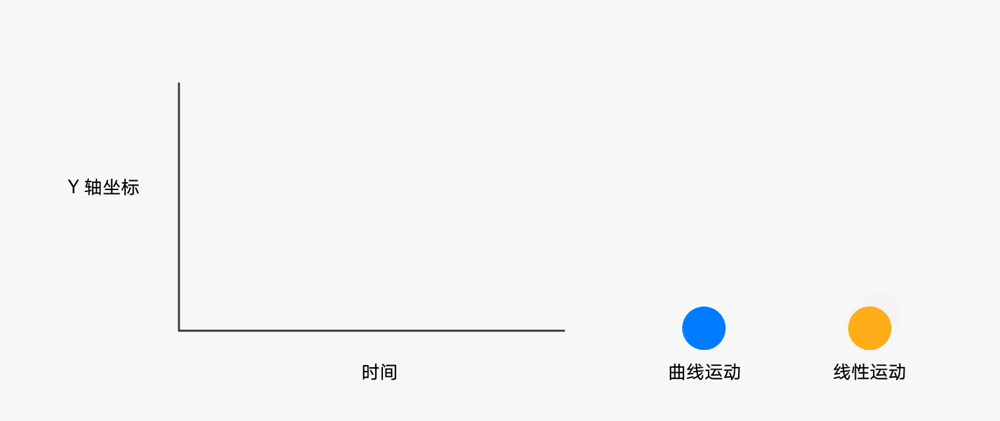
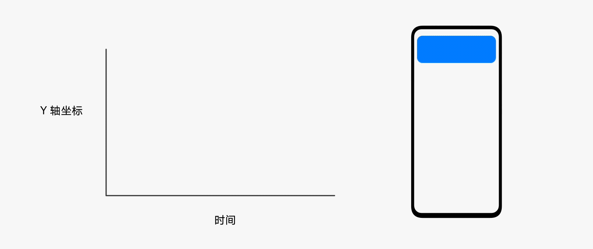
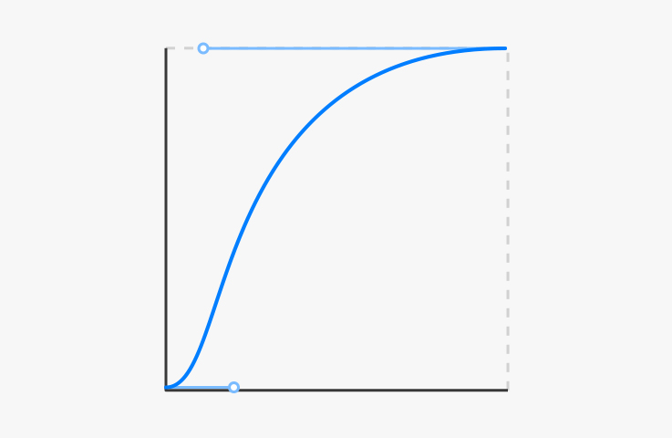
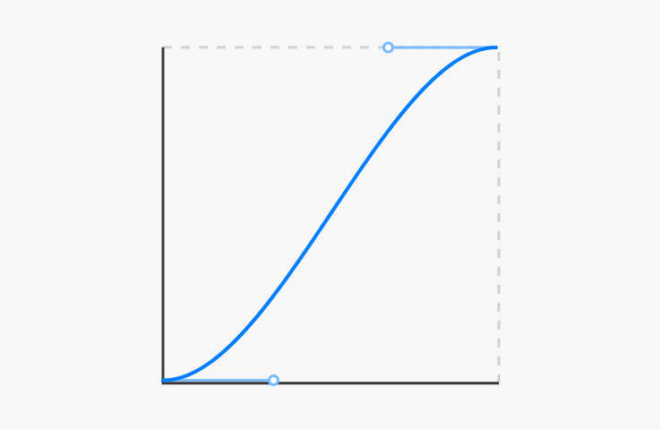
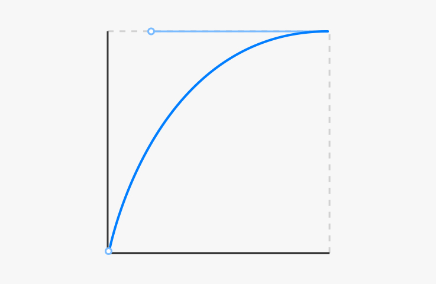
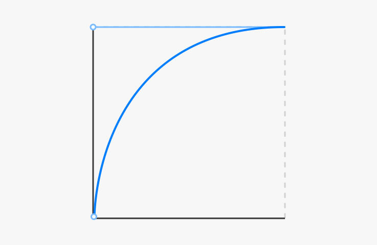
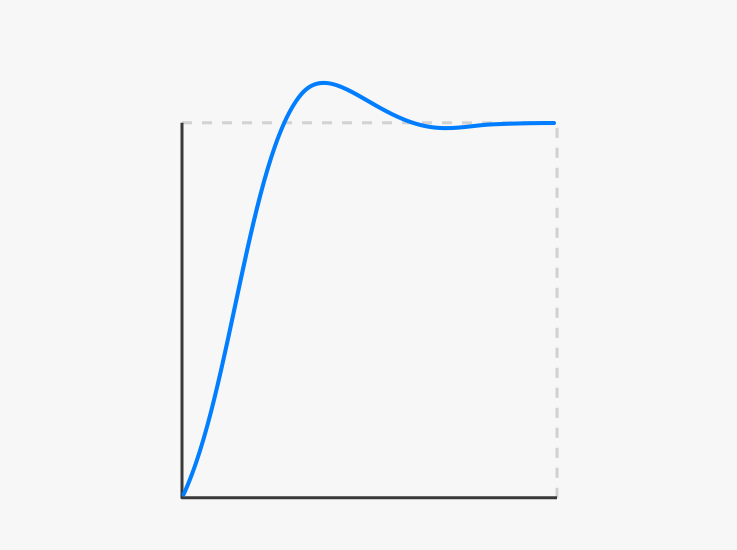
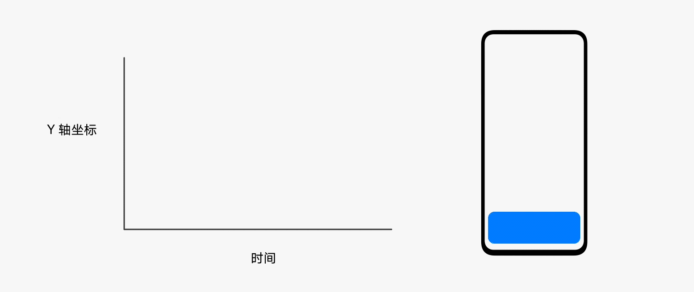

# 动效属性

任何类型的动效都包含三大基本的动效属性：时长、曲线、帧率。这些基本属性形成了动效不可缺少的基本要素。通过组合这些基本的动效属性，可以塑造产品动效的不同风格特点，例如稳重、活泼、轻盈、舒缓等。

## 时长

时间是产生动效的基本要素，不同类型的元素、场景适用不同的时长，过短或太长都会让用户不适。以下因素详细说明了时长应如何设计以适应不同类型的动效。

### 单位

动效设计的时长单位一般使用毫秒（ms）表示，1秒=1000毫秒。在帧率（FPS）60帧的环境下，1帧=16.67毫秒。

### 复杂程度

复杂的动画比简单的动画需要更多的时间来表达，基于图形的特点来进行动画设计。

  | | |
| -------- | -------- |
| **简单动画** 前后状态只通过颜色动效来实现&nbsp;时长：100ms | **复杂动画** 旋转动画需要合适的时间来保证&nbsp;时长：300ms | 

### 区域范围

动效运动在一定的范围内进行，小范围内比全屏幕运动所用的时间相对更短。

  |  |  |  | 
| -------- | -------- | -------- |
| **小范围内运动** 开关图标动效&nbsp;时长：150ms | **局部范围内运动** 删除一条列表&nbsp;时长：200ms | **全屏范围的运动** 打开一张图片&nbsp;时长：350ms | 

## 曲线

曲线与时长相互配合产⽣运动的韵律感。调整曲线能使物体实现加速和减速，⽽不是以恒定的速率运动。在自然定律下，物体不会突然开始或停止移动，它们需要一定的时间来加速和减速。

没有缓和曲线的过渡看起来僵硬和机械。

## 贝塞尔曲线

贝塞尔曲线(Bézier curve)是一种数学曲线，在动效设计中广泛使用。从曲线形态的类型上可以分为这几类：标准曲线、减速曲线、加速曲线。

### 标准曲线

最常用的曲线类型，开始和结束处静止，速度峰值在中段，加速阶段相对于减速阶段用时更少。  使用原则：运动前后始终在用户视线范围内的物体，符合物体启动和停止的真实规律。  应用场景：图片缩放，Tab切换，Switch开关等。

cubic-bezier(0.40,0.00,0.20,1.00)

### 标准曲线的其他类型

  |  |  | 
| -------- | -------- |
| cubic-bezier(0.20,0.00,0.10,1.00) | cubic-bezier(0.33,&nbsp;0.00,&nbsp;0.67,&nbsp;1.00) | 

### 减速曲线

开始处物体运动速度最快，初始即达到峰值速度，渐渐变缓，在结束处完全静止。  使用原则：适用从视线中新出现的物体，结束时通过相对较长的缓冲让人眼适应运动变化。  应用场景： 弹框出现等。

cubic-bezier(0.00, 0.00, 0.40, 1.00)

### 减速曲线的其他类型

  |  |  | 
| -------- | -------- |
| cubic-bezier(0.00,&nbsp;0.00,&nbsp;0.20,&nbsp;1.00) | cubic-bezier(0.00,&nbsp;0.00,&nbsp;0.00,&nbsp;1.00) | 

## 加速曲线

从静止启动，逐渐加速，在达到峰值速度时结束（出场）。  使用原则：适用原本在视线中的物体，需要消失或出场，逐渐加速符合退场行为特征。  应用场景：窗口出场、卡片删除等。

### 临界阻尼

当阻尼使对象刚好能不产生振动，又以最短时间到达稳定平衡状态的情况。

### 欠阻尼

阻尼较弱，对象会通过振荡运动来消耗刚性能量，最后达到稳定平衡的状态。

### 欠阻尼的其他类型

  |  |  | 
| -------- | -------- |
|  |  | 

### 过阻尼

阻尼较临界状态过大，对象运动的动画曲线呈现衰减更慢的现象，最后达到稳定平衡状态。

## 帧率

每秒钟显示的帧数即帧率（FPS）。由于人眼的特殊生理结构，所看画面帧率一般高于每秒约10~12帧，就会认为是连贯的，该现象为视觉暂留。但连贯不代表感知流畅，运动较快的动画需要更高的帧率来保障流畅度。

相同时间和位移距离情况下，不同帧率效果对比（90FPS和120FPS受浏览器播放器的限制，可能无法看出差异）。

### 交互类动效帧率

移动设备的屏幕一般使用60赫兹刷新率，动画帧率与其保持一致能让动效呈现最好状态。与观看类动画不同，交互型动效需要更严苛的帧率稳定性，否则易造成体验上的卡顿感受。

  |||
| -------- | -------- |
| 60FPS | 30FPS | 

### 纯动画帧率

纯动画（如操作引导动画）的帧率要求没有交互类动效那么严苛，早期迪士尼的手绘动画基本帧率是24FPS，也能满足观看流畅的程度。高帧率的动画则拥有更细腻的视觉体验，特别是针对快速类的动作，细腻度尤为明显。有些动画创作会选择8FPS，这更多的是动画风格上的需要。

  | | |
| -------- | -------- |
| 60FPS&nbsp;动画过程细腻而流畅 | 12FPS&nbsp;低帧率导致元素两帧之间变化过大，中间状态缺失导致眼跳感 | 

## 风格

通过调整时长、曲线的参数，在转场、特征等动效设计上的差异来表达品牌的动效设计语言。例如较多地使用弹性动画会让产品的动效风格显得更加灵动和活泼。
