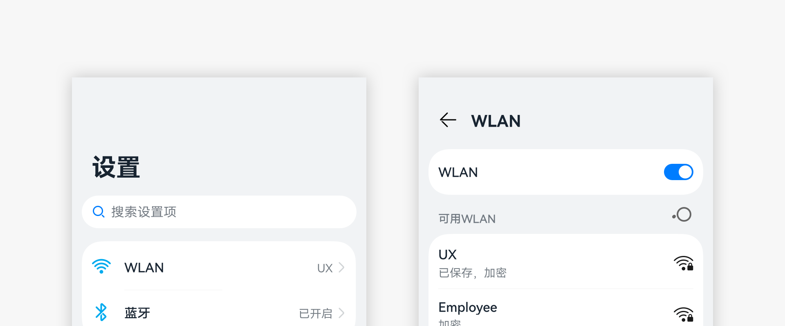

# 应用导航结构设计要求

应用中的导航用于引导用户在应用的各个页面进行浏览。好的导航让用户知道身处何处，去往何方，以及来自哪里。

## 导航的原则

导航需要遵循以下原则：

- **一致**：导航操作的结果应该与用户的期望保持一致。相同或类似的场景使用用户熟悉的界面布局和控件，在多设备上确保一致的应用架构和导航行为，让用户无论在什么页面，都知道如何导航。例如二级界面使用左上角的返回按钮来返回界面的上一个层级。

- **清晰**：导航应该提供清晰的路径。用户使用的时候，逻辑关系简单且容易理解，能够知道当前处在界面的什么位置，操作后将会跳转到什么位置，不会迷失方向。例如使用底部页签，让用户在平级页面之间进行切换。

导航要避免以下设计：

- **层级过深**：导航层级建议在三层以内。对于太深的层次，会带来操作效率的问题。如果确实需要深层级设计，建议使用面包屑设计或增加一键回到首页的功能。

- **导航复杂**：在侧边导航中，使用底部页签，会让操作变得复杂，建议仅使用侧边导航。

## 导航的分类

常用的应用导航有：平级导航、层级导航和混合导航。

**平级导航**

平级导航结构中，页面均处在同一层级。

使用场景：用于展示同等地位或同等层级的界面。

例如：以Tab方式组成的页面。图中照片、相册、发现为一级界面，从视频相册进入二级内容界面。

多设备设计：可转化导航类控件到符合设备体验的位置上。默认设备上使用Tab导航，PAD和PC使用侧边Tab导航，智慧屏使用顶部Tab导航。

**层级导航**

层级导航结构由父页面和子页面组成。父页面可以有一个或多个子页面。每个子页面都有一个父页面。

层级导航适用于多层级的复杂结构。层级结构深的内容，用户访问的路径变长，效率降低，可以通过适当的层级穿透设计（例如：控制中心中的蓝牙开关，解决了进“设置-蓝牙”界面设置操作路径过长的问题）解决此问题。

使用场景：页面存在上下级关系的应用。

例如：通过从内容进入后经返回键返回之前的页面。

多设备设计：可以考虑将上下层级的界面在同一界面展示。默认设备和智慧屏上使用上下层级关系。平板和PC使用上分栏的方式展示内容。

**混合导航**

在实际应用设计中，仅使用平级或层级导航可能无法应对更复杂的业务结构。此时需区分不同页面的导航关系，对同等地位或同等层级的页面使用平级导航结构，对具有复杂关系的页面使用层级导航结构。

使用场景：应用由几个同等级的模块组成，每个模块又有上下层级关系页面。

多设备设计：可以根据平级导航、层级导航自身的设计规则综合运用，一般平级导航优先级比层级高。

