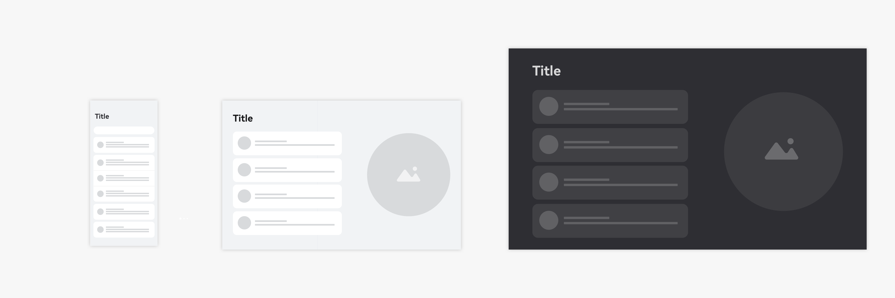
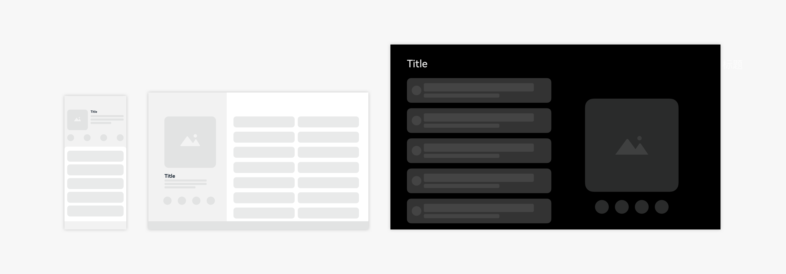
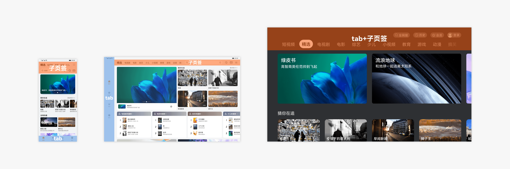

# 应用页面结构设计

## 通用页面结构

应用程序由多个页面组成。我们将常见的页面进行了梳理，总结了以下常用的页面结构。

**启动页面**

针对内容型应用，应用首页内容的获取需要花费一定的时间，此时可以使用启动页缓解页面加载内容的等待感。启动页可以展示应用的品牌形象或者广告，避免让用户等待过长时间。没有网络加载内容的应用，不需要使用启动页。

用户总是希望第一时间看到应用内容，因此在页面加载完成后，需要及时呈现内容。

从后台加载应用时，不应该显示启动页。当应用被切换到后台后，再从后台加载回来时，不应该再次显示启动页。应用需要保留应用的状态，以便从后台恢复，方便用户继续浏览。

**列表内容页面**

列表内容页面通常用于文字和数据的展示，利于提升使用效率。

列表应该按照一定的逻辑排序，便于用户浏览和操作。例如：按字母顺序排序、按时间排序。

列表应该是同类项的集合，应该对外呈现一致的布局样式。常见的是单行列表、双行列表和三行列表。

列表显示的内容要主次分明，用户一眼就能关注到重要的信息和操作。

**网格内容页面**

网格内容页面通常用于图片和视频的展示，利于沉浸浏览内容。

网格视图显示同等重要的项目，具有统一的布局。

网格视图以图像为主组织内容。例如图库中用网格视图展示图片。

网格视图可以辅以文字和操作。例如应用市场中使用网格展示应用程序图标、简单描述和下载按钮。

网格视图应该考虑响应式布局。在横竖屏切换时，网格视图应该能够调整网格的数量以适应页面的宽度变化。

**多选页面**

多选页面是对页面内的数据多项选择，然后进行批量处理。常见的是针对列表的多项选择或宫格的多项选择。

**详情页面**

详情页用于展示应用的详细描述和操作。

**空页面**

在页面内没有数据的时候，使用空页面。

**设置页面**

设置页面通常是一个模块所有设置项的聚合。

**我的页面**

针对内容型应用，可以提供我的页面，用于承载用户的信息和资产内容。

**关于页面**

关于页面用于呈现应用的基本情况，包括联系方式，法律条款等内容。

## 垂类页面结构

垂类是指垂直领域，为特定的人群提供特定的服务，属于应用的细分类别。例如：华为音乐、网易云音乐等属于音乐类，华为视频、优酷等属于视频类，快手、抖音等属于直播类。垂类页面结构是在特定领域长期使用的过程中，形成的广受用户接受和理解的页面结构。

例如：

音乐类应用都有音乐歌单，音乐专辑，音乐播放界面。

视频类应用都有视频详情和视频播放界面。

直播类应用，都有瀑布流推荐和直播界面。

...

常见的垂类页面结构有：

- 音乐播放页面

- 专辑详情页面

- 视频详情页面

- 视频播放页面

**音乐播放界面**

音乐类应用中的播放器界面，该界面通常有音乐操控（播放，暂停，上一首，下一首）、歌词显示等功能。

**专辑详情页**

音乐类应用中的音乐专辑详情界面，该界面通常有专辑介绍、专辑包含的歌曲列表等功能。

**视频详情页面**

视频类应用的视频详情界面，该界面通常有视频播放器、视频剧集显示、视频简介等功能。

**视频播放界面**

视频类应用的视频播放界面，该界面通常有视频画面预览、播放控制等功能。

## 特殊页面结构

部分应用界面在差异较大的设备间切换，无法使用自适应和响应式布局设计方法进行适配，从用户预期上也需要调整应用架构时，将需要做特殊适配。

例如，同时具有底部Tab和子页签的页面，在大屏上应考虑将底部入口置于顶部工具栏或与子页签融合。

