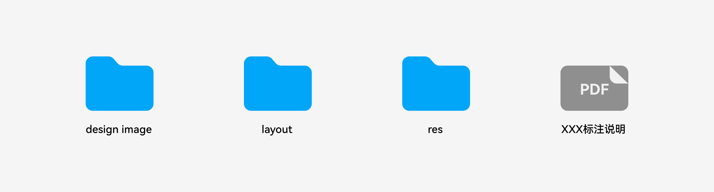

# 概述

为使UX设计详尽准确地实现并传递给用户，设计师需向开发者提供必要的设计交付件，包括但不限于：应用规格说明、交互流程、视觉效果、视觉标注、视觉规格说明、切图资源、动效参数资源、音效资源等内容。

面向多设备多尺寸的应用UX设计交付件，以完整说明界面布局与视觉设计为主要目的，至少应包含：效果图、标注图、规格说明和切图资源。

下面将分别介绍不同交付内容的用途与规范。

为方便UX设计师以及开发者参考使用，本文特提供符合规范的设计交付件样例，详见：[资源](design-resources.md)
