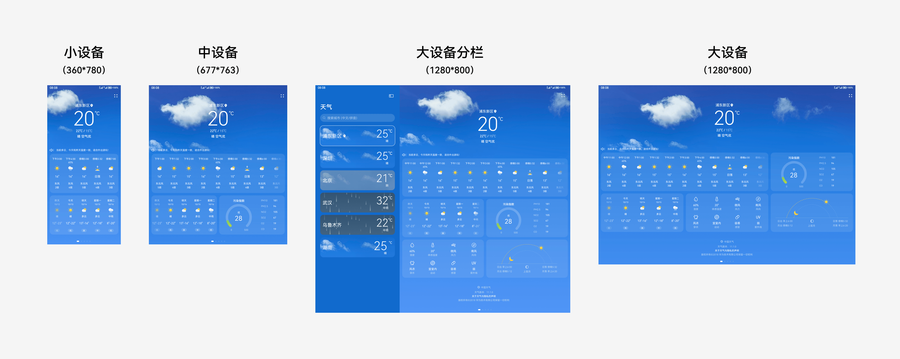

# 效果图

效果图是表达UX设计的关键内容，用于直观呈现目标体验的静态效果，并作为开发者与测试工程师的实现与验收依据。效果图一般为jpg或png格式。

在优秀的设计交付件中，针对不同前置条件下，各交互流程所途经的每个界面都应匹配效果图。对于大量重复使用的组件元素，如弹窗和即时反馈，亦可配合规格统一说明，不做过多重复设计。

在多设备设计中，为了清晰表达设计效果，设计师仍需要针对不同尺寸的关键界面提供符合规范的效果图。关键界面包括且不限于：

- 应用的首页

- 可以从首页直接进入的各二级界面

- 核心使用流程途经的各界面

- 能典型体现多数界面的自适应与响应式规格的界面

不同尺寸的效果图，至少应包含小设备、中设备、大设备。根据业务涉及的设备特点，可补充超小尺寸效果，及不同设备的横竖屏效果，提前充分验证并优化UX设计体现的差异性、一致性、灵活性、兼容性。

对应不同设备效果图的设计画板尺寸推荐如下：

  | 设备类型 | 屏幕宽度 | 画板尺寸（vp） | 
| -------- | -------- | -------- |
| 超小设备 | [0,&nbsp;320) | 240\*320 | 
| 小设备 | [320,&nbsp;520) | 360\*780 | 
| 中设备 | [520,&nbsp;840) | 677\*763 | 
| 大设备 | [840,&nbsp;+) | 1280\*800 | 

多设备效果示意图

>  **说明：**
> - 画板尺寸为不同宽度断点下的典型设备屏幕尺寸，可根据业务具体针对的设备选择其他画板尺寸
> 
> - 画板尺寸以vp为单位提供，根据实际设计所需精度，可统一把设计文档中所有画板设置为1倍或多倍的px尺寸
> 
> - 如效果图需要展示一屏以上的内容，如列表内容较长，建议保持宽度不变并增加画板高度以容纳更多内容
