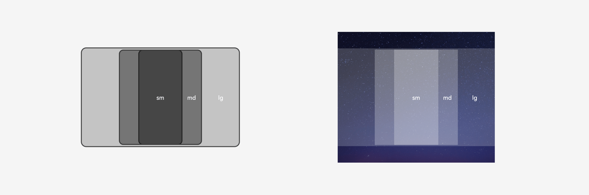

# 切图资源

包含在设计效果中的素材，如图标、图片、序列帧等，应根据实际需要输出为合适的格式提供开发者置入界面内。·

为了更好在多设备上根据设备dpi展示清晰的图像，一分优秀的应用应含有多套同名的切图资源，它们分别存放在mdpi、ldpi、xldpi、xxldpi的文件夹目录下，最终会存放到应用资源包的同名路径中。

多套同名切图文件夹示意图

图标资源可以是png、jpg、webp、svg等格式，推荐在多设备设计中使用svg图标资源，因为能充分利用矢量图片体积较小、可以自由缩放且不出现锯齿、可根据色彩参数实时赋色的特点，仅用一套资源即可满足复杂场景的UX规范。

图片资源可根据设计效果提供一张复用到多设备的资源，或不同设备单独交付的资源

夜晚单张适配多设备宽度示意图

晴天多张适配多设备宽度示意图

