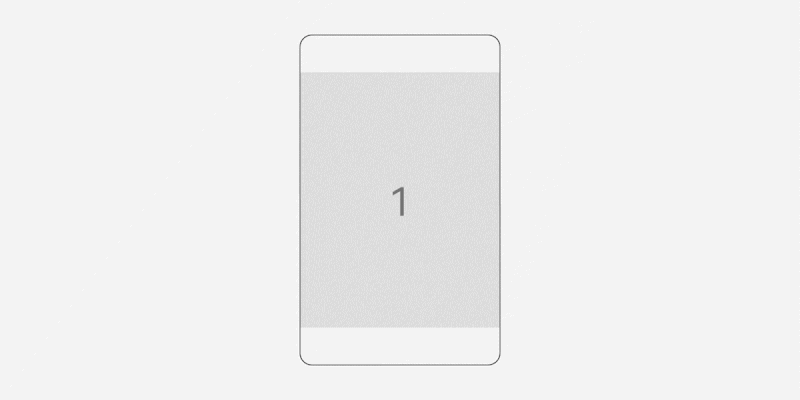

# 手势动效

是指手势在终端屏幕上或者触摸板等输入设备上进行跟手操作的动效，大致分为滑动、点击、拖拽、捏合等持续操作动效，比如手势导航上滑、捏合照片等动效。我们主张无阻塞感的动效设计，结合动效物理引擎，将自然属性运用到界面的操作中，比如摩擦力、弹性、碰撞影响等。

## 概述

手势动效的设计是为了用户在使用交互手势时，交互对象与用户手势建立流畅的操作反馈感，通过弹性曲线等物理模型，还原真实可行的手势操作体验。聚焦在手势操作的常用几个类型：

- 点击

- 滑动

- 翻动

- 夹捏

- 拖拽

## 点击

点击手势通常包含两个行为：按下（touch down）和抬起（touch up）。按下接触过程平均时长100~130ms中，这期间对象无反馈，为提升响应速度，点击手势动效设计在按下那一刻即响应动效反馈，这一可先行的触控响应机制强化了界面元素的视觉反馈，为用户理解界面状态提供了更多的线索信息。

## 滑动

滑动手势是指手抬起时带有方向和速度的动作。以列表样式场景为例，主要分为跟手阶段、离手瞬间、离手后阶段这三大部分，跟手阶段着重对象的跟手响应性；离手瞬间需要对象继承手速进行离手后的动画反馈，保证对象动效反馈的结果与手势动作的连贯性是滑动手势动效设计的关键。

## 翻动

翻动通过抛滑和拖拽手势进行操作，由翻页这类场景承载。翻页是基于设定区域进行对象内容的翻动切换，离手后对象不会处于任一坐标位置上，有明显的限位属性，页在这里等同于设定区域。翻页有成功与否，未成功会停留在当前内容上；成功则显示下一页/几页的内容。为了提示性翻页也有过界拖拽的场景。

## 夹捏

夹捏手势是指双/多指合拢或分开的动作，是自然手势的重要体现，分为跟手阶段、离手瞬间、离手后阶段这三大部分，跟手阶段着重对象的跟手响应性，对象需要基于手势动作进行缩放、旋转、移动等反馈；离手瞬间需要对象继承手速进行离手后的动画反馈。

## 拖拽

拖拽手势是指手指按下同时进行移动的动作，动效设计了对象通过拖拽行为进行状态转换的整个过程，这其中包括跟手阶段显控比设计；离手后对象运动曲线以及属性变化设计。

- 标题联动

- 左右横滑联动

- 下拉返回

### 标题联动

对象主内容区与标题区的联动设计，在主内容区到达顶部边界时继续进行拖拽操作，除了主内容区因过界显控比设计产生的阻尼感，上方的标题区与其产生不同阻尼感的联动设计，让过界拖拽体验更灵动并富有层次感。

### 卡片左右滑

卡片横向滑动可扩展更多功能，显控比设计让横向拖拽手势在一定距离后产生阻尼感，提示并引导用户进行后续操作。

### 下拉返回

下拉过程中加入递进的显控比设计，渐强的阻尼感让对象的拖拽手感更富有质感。离手后对象继承手速并按设定进行动画反馈。

