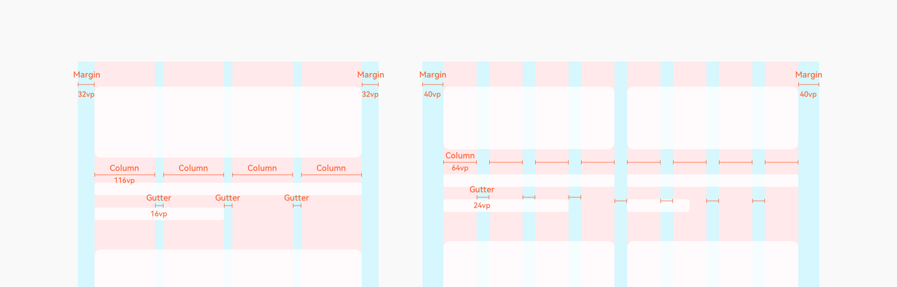

# 栅格系统

栅格系统是一个多设备下通用的辅助定位系统，适用于应用窗口的整体布局，也支持界面局部内容使用。栅格系统由 Margin，Gutter，Column 三个属性构成。Margin是相对屏幕、窗口等父容器左右边缘的距离，决定了内容可展示的整体宽度；Gutter是每个Column的间距，决定内容间的紧密程度； Column是内容的占位元素，其数量决定了内容的布局复杂度。Margin大小、Gutter大小、Column数量综合决定Column的具体宽度。

通过栅格系统进行布局，可以更好达到多设备下布局的一致性。

Margin、Gutter的大小、Column的数量均可自定义，界面内容跟据Column的边缘定位。通过采用不同数值调整内容信息量和紧密程度，一般推荐使用4或8的倍数。例如Margin 32vp、Gutter 16vp、Column数量为4，或Margin 40vp、Gutter 24vp、Column数量为8。

