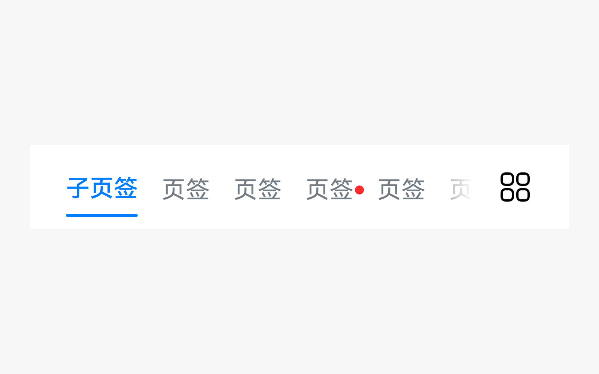
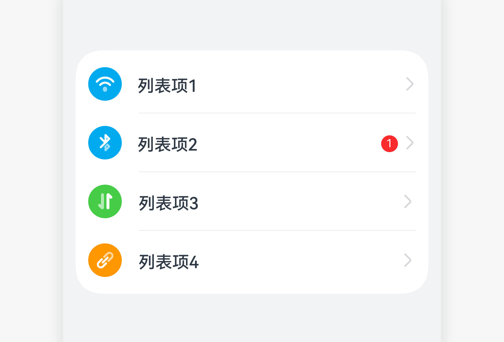

# 新事件标记

新事件标记是用来提醒用户应用有待处理请求的控件。

## 如何使用

- 新事件标记用于底部页签、列表项、工具栏图标、内容区的分类图标、头像等控件上。

- 应用中可能有需用户关注的新事件提醒，需要采用新事件标记来标识。

- 应避免对新事件标记的滥用。用户打开被标记项时，如果看到的内容跟预期不符，就会失去对新事件标记的兴趣，反而降低点击率。

## 分类

- 圆点标记

- 数字标记
    |  |   |
  | -------- | -------- |
  | 圆点标记 | 数字标记 | 

### 圆点标记

- 圆点标记适用于标识应用中的次要事件，通常出现在底部页签、列表项、工具栏图标、内容区的分类图标、头像上。点击后，圆点标记消失。

- 运营活动失效时，对应的圆点标记需主动消失。

- 纯文字时，新事件红点统一放在文字右侧。

- 图标＋文字时，新事件红点放在图标右上角。
    | | | |
  | -------- | -------- | -------- |
  | 图标+圆点 | 圆点在列表 | 圆点在子页签 | 

### 数字标记

- 桌面图标数字标记只显示应用中的主要事件。例如应用市场中有应用更新、活动推广等多种类型的事件，其中应用更新为主要事件，因此在桌面图标上显示应用更新的数字提示。

- 设置里的“系统更新”用数字，与桌面设置图标的数字标记相对应。
    | |  |
  | -------- | -------- |
  | 桌面图标数字标记 | 列表数字标记 | 

- 圆点跟随文本宽度自适应，数字最多99+
  

## 资源

新事件标记相关的开发者文档详见容器组件[“Badge”](https://gitee.com/openharmony/docs/blob/master/zh-cn/application-dev/reference/arkui-ts/ts-container-badge.md)。
