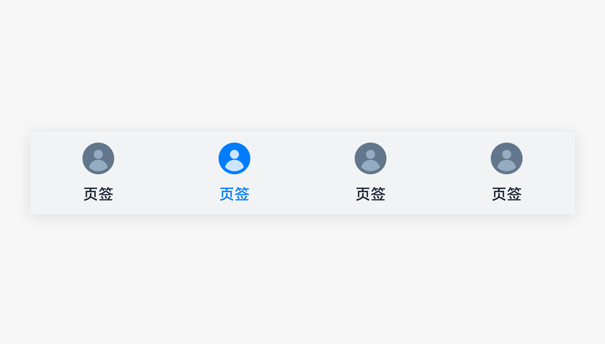
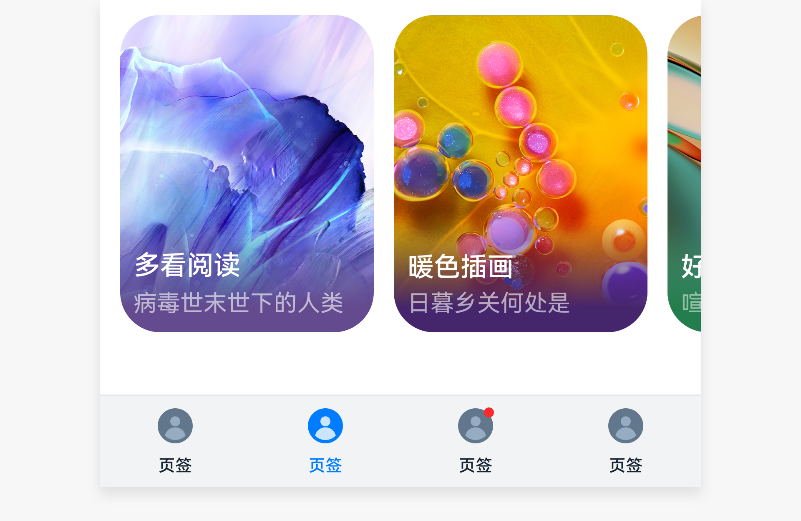

# 底部页签

底部页签是一种常见的界面导航控件，通过它用户可以快捷的访问应用的不同模块。

## 如何使用

- 仅在一级界面上使用，用于快速切换不同页签的内容。

- 放置在屏幕底部，体现应用的一级分类，这些分类以平等的方式呈现。使用底部页签也方便用户单手操作。

- 底部页签上的每一个页签，都是图标+文本的形式，用户单击页签时，该页签会被激活，视觉上会高亮显示。

- 在平板上的横屏界面，底部页签通常会转化为侧边页签，方便用户双手握持操作。

- 底部页签上的文本要精练，不要使用太长的字符串。

- 为了避免页面拥挤，底部页签的展示数量不宜过多，建议在2-5个之间。

- 底部页签上允许有新事件标记，用于通知用户该页签下有新的内容或消息，详见[“多态控件”>“新事件标记”](multimodal-badge.md)。

- 在平板上，底部页签通常会转化为侧边页签，方便用户双手握持操作。

- 底部页签个数在2-5个之间。

- 底部页签采用图标+文本的构成形式。

## 资源

底部页签相关的开发文档详见容器组件[“Tabs”](https://gitee.com/openharmony/docs/blob/master/zh-cn/application-dev/reference/arkui-ts/ts-container-tabs.md)和[“TabContent”](https://gitee.com/openharmony/docs/blob/master/zh-cn/application-dev/reference/arkui-ts/ts-container-tabcontent.md)。
