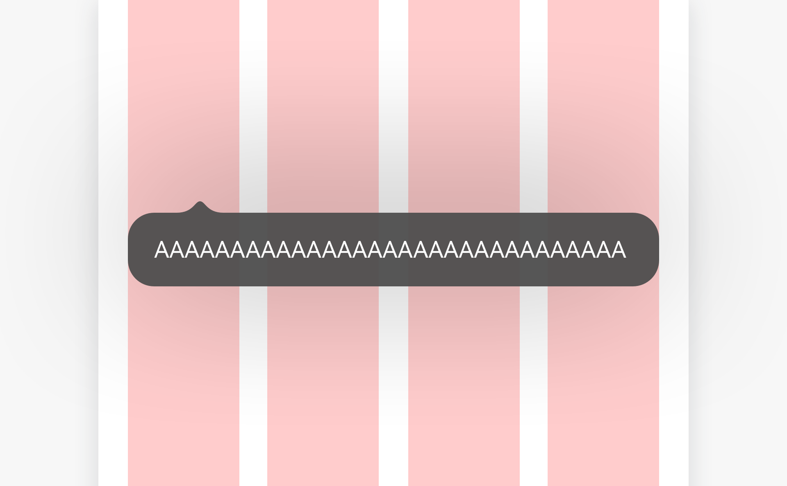
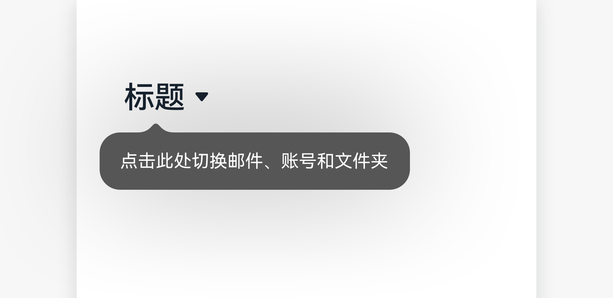
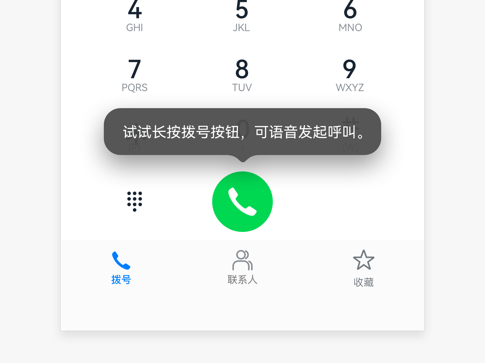
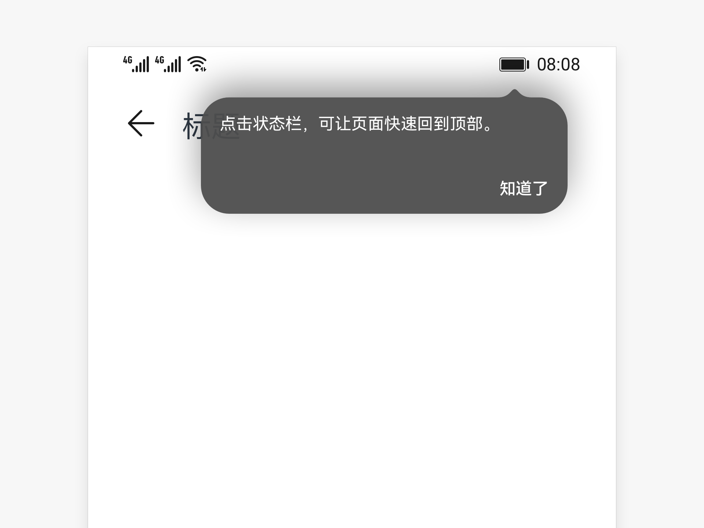

# 气泡提示

气泡提示是一种轻量的提示控件，提示用户当前如何操作，一般不阻碍用户的操作。

## 如何使用

- 气泡提示用于用户初次进入界面时，使用气泡提示告知用户某个功能如何去使用，气泡指向与提示强相关的元素或区域上。

- 需要在刚进入界面时就给出提示。

## 分类

- 不带操作的气泡提示

- 带操作的气泡提示

### 不带操作的气泡提示

- 只可以使用向上或向下的指示箭头。

- 提示的文字需要简洁明了，避免设计复杂给用户带来困扰。

- 点击气泡，气泡直接消失。点击屏幕任何区域或导航键，气泡消失。

- 离开当前界面，下次再进入此界面，气泡消失。
  

### 带操作的气泡提示

- 只可以使用向上或向下的指示箭头。

- 提示的文字需要简洁明了，避免设计复杂给用户带来困扰。

- 点击气泡，气泡直接消失。点击屏幕任何区域或导航键，气泡消失。

- 离开当前界面，下次再进入此界面，气泡消失。
  

## 资源

气泡提示相关的开发者文档详见通用属性[“Popup控制”](https://gitee.com/openharmony/docs/blob/master/zh-cn/application-dev/reference/arkui-ts/ts-universal-attributes-popup.md)。
