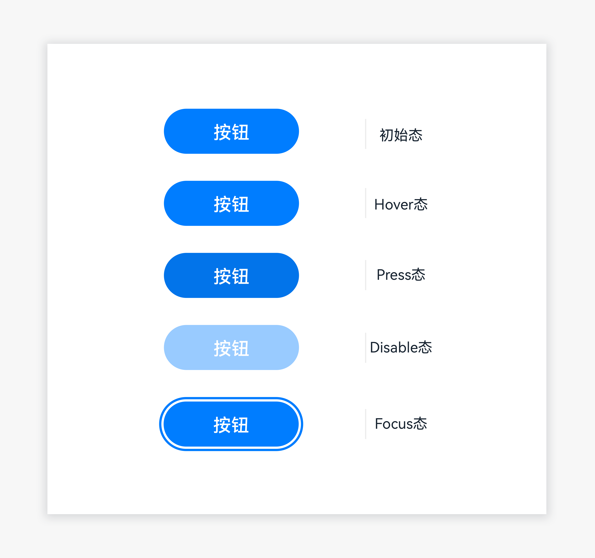
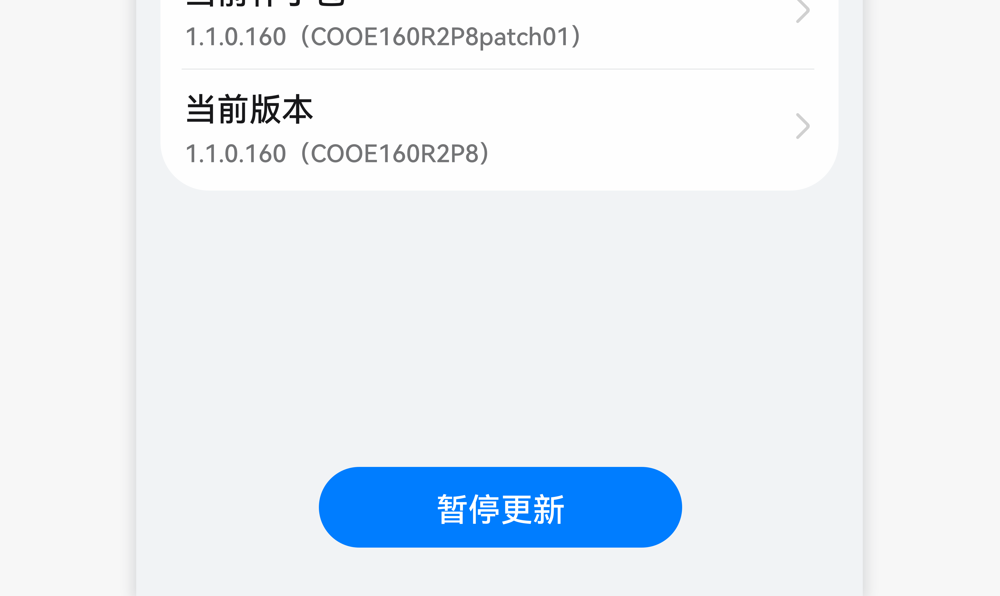

# 按钮

按钮是能够帮助用户通过点击来触发对应操作的控件。

## 如何使用

- 按钮是系统与用户行为间的桥梁。

- 在界面上很突出，通过颜色填充强调当前的重要操作。

|   |   |
|  --------  |  --------  |

按钮文字的放置居中，不能靠左或靠右；文字不能换行。

## 界面写作规则

- 按钮长度：中文 2-4 个字，单行显示。

## 资源

按钮相关的开发者文档详见基础组件[“Button”](https://gitee.com/openharmony/docs/blob/master/zh-cn/application-dev/reference/arkui-ts/ts-basic-components-button.md)。
