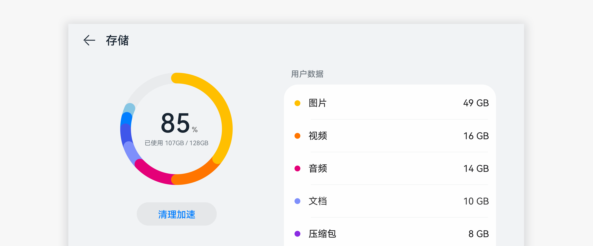

# 数据可视化

数据可视化是将传统数据转换成可视化图形的控件，把隐藏在数据中的信息以更加直观、友好、视觉化的方式直接展现于用户面前，提升用户获取数据信息效率。

## 如何使用

- 数据可视化用于需要进行展示与数据信息相关的界面。

- 根据产品、应用的具体功能和需求，选择合适的数据可视化控件，让数据可视化控件发挥它最形象生动的作用。

- 占比类适合在有多个数据总和时使用，可突出数据总和后各个数据的占比，从而突出表现各自份额。

## 资源

占比类数据可视化相关的开发者文档详见基础组件[“DataPanel”](https://gitee.com/openharmony/docs/blob/master/zh-cn/application-dev/reference/arkui-ts/ts-basic-components-datapanel.md)。
