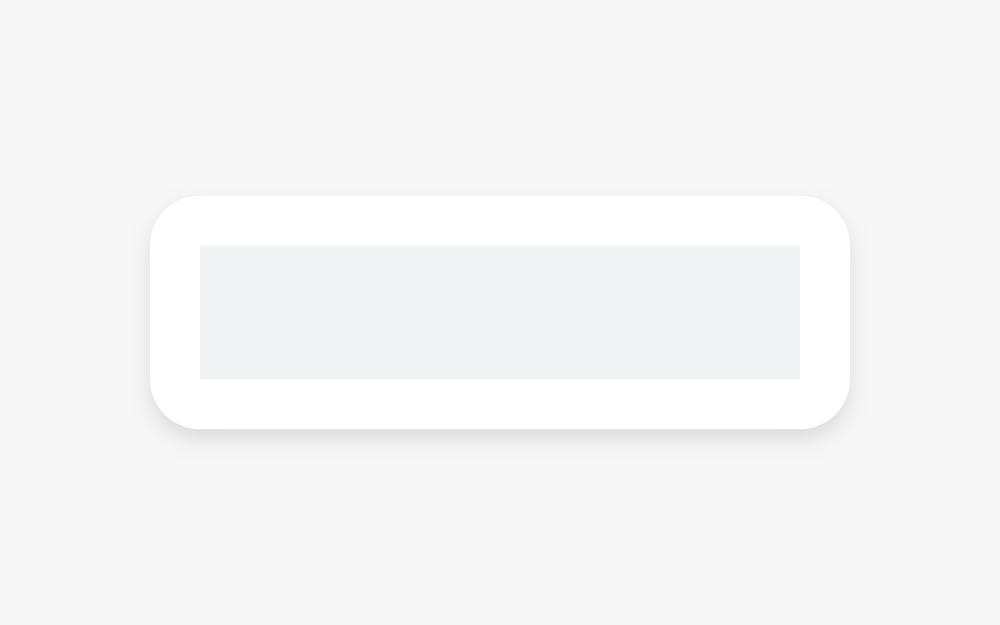
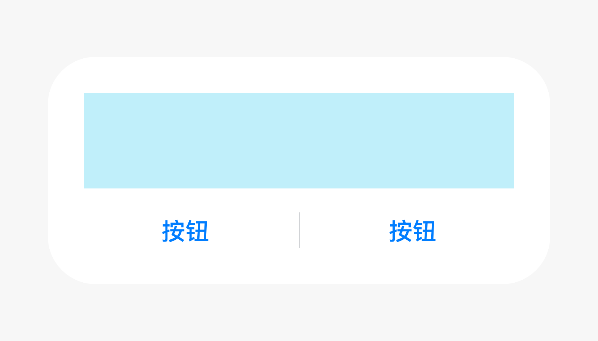
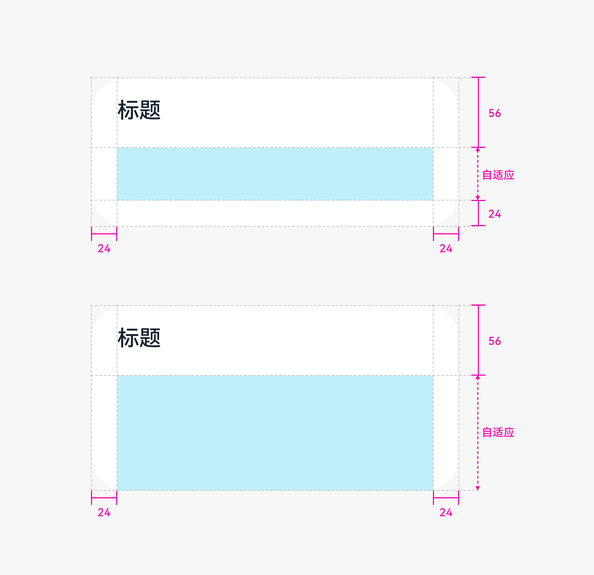
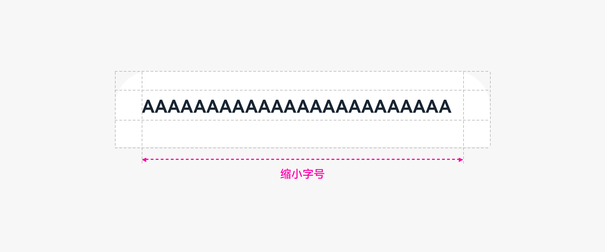
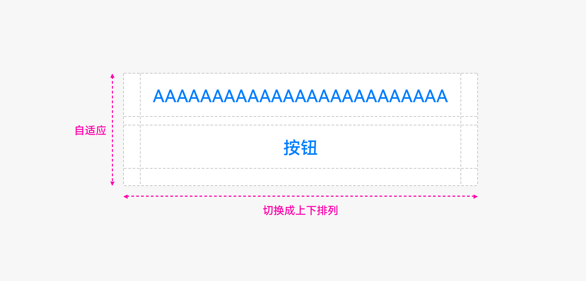
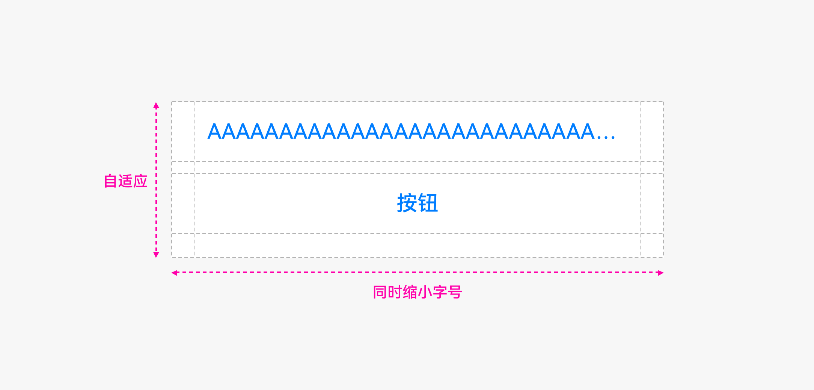

# 弹出框

弹出框是一种模态窗口，在弹出框消失之前，用户无法操作其他界面内容，干扰性比较强。

## 如何使用

- 弹出框常用于展示用户当前需要的或用户必须关注的信息或操作，其他情况不建议使用弹出框，可考虑通知等其他非模态窗口。

- 弹出框的内容通常是不同控件进行组合布局。例如文本（可带格式，如缩进、链接、粗体等）、列表、输入框、网格、图标或图片。常用于选择或确认信息。

## 分类

- 无标题弹出框

- 有标题弹出框

- 纯文本

### 无标题弹出框

没有标题的弹出框。

内容区域上下留 24vp 的间隔，但内容如果为列表类的内容，则不需要上下留 24vp 的间隔。

  |  |  |
| -------- | -------- |
| 纯内容 | 内容+操作按钮 | 

### 有标题弹出框

标题分为：纯标题（单/双行标题）、标题+操作图标。

  |   |
| -------- |
| 标题+内容 | 

当内容为列表类内容时，则不需要在底部留 24vp 的间隔。

### 纯文本

只有标题时，标题居中。

## 高度规则与位置

竖屏与横屏定义不同。

### 竖屏

弹出框最大高度= 0.8x（屏幕高度-状态栏-导航栏）

位置始终保持在导航栏上方（含导航栏隐藏场景）。

### 横屏

弹出框最大高度= 0.9x（屏幕高度-状态栏） 位置在减去状态栏的区域居中显示。

## 界面写作原则

### 操作确认

**标题**

- 句子短，无断句，且为陈述句时，不加句号。

- 感叹句、问句，需加对应标点（感叹号、问号）。

- 标题简明扼要，清晰描述要进行的操作。可为短语（动词+名词）。

**内容文本**

- 描述需用户确认的内容（确认后产生的影响、效果、影响范围等），可为疑问句或陈述句。尽量不用辅助说明，若仍需要，避免与标题重复。

**按钮**

- 按钮让用户选择是否进行下一步动作。操作按钮应使用真实的操作内容。

- 通常与标题栏中的动词一致。不要使用“是”或“否”。

### 信息确认

**内容文本**

- 以陈述语气描述需告知用户的具体事项。例如目前没有可用的更新。

**按钮**

- 只有一个，例如“知道了”。避免使用“确认”、“好”。

## 界面用语超长处理
### 弹出框标题

- 先逐级缩小字号到 15fp。

  

- 继续超长，换行处理，支持换一行。

- 最后，“...“截断处理。

### 弹出框按钮

- 按钮不支持换行。

- 继续超长，先考虑改变布局，左右变上下（若是上下布局，则不考虑此方式）。

- 其次缩小文字。按钮文本同时逐级缩小，最小字号为 9fp。

- 最后，“...“截断处理。

  

## 资源

弹出框相关的开发者文档详见[API接口](http://gitee.com/openharmony/docs/blob/master/zh-cn/application-dev/reference/apis/js-apis-promptAction.md)。