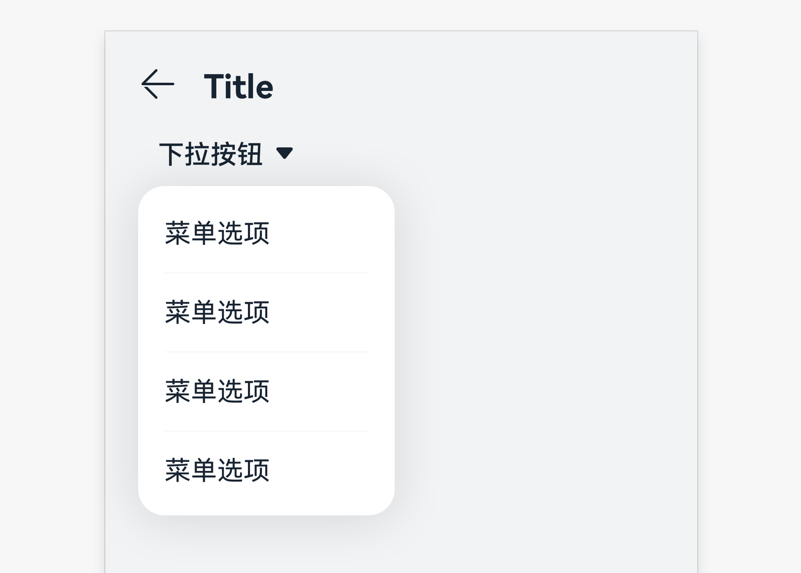

# 下拉按钮

下拉按钮可让用户在多个选项之间选择。

## 如何使用

- 下拉按钮常用于需过滤当前界面内容、快速切换类型或选项内容的场景。

- 点击后显示一个选项菜单，当前的选项需用颜色标示，箭头方向向下不变。点击其中一个选项后，菜单会关闭，并在按钮上显示新的选项值。

## 界面写作规则

- 下拉按钮文本以短语形式呈现，建议使用名词或名词词组。文字间无空格。不可使用多个词组。不带句末标点。

- 句式统一。

## 资源

下拉按钮相关的开发者文档详见基础组件[“Select”](https://gitee.com/openharmony/docs/blob/master/zh-cn/application-dev/reference/arkui-ts/ts-basic-components-select.md)。
