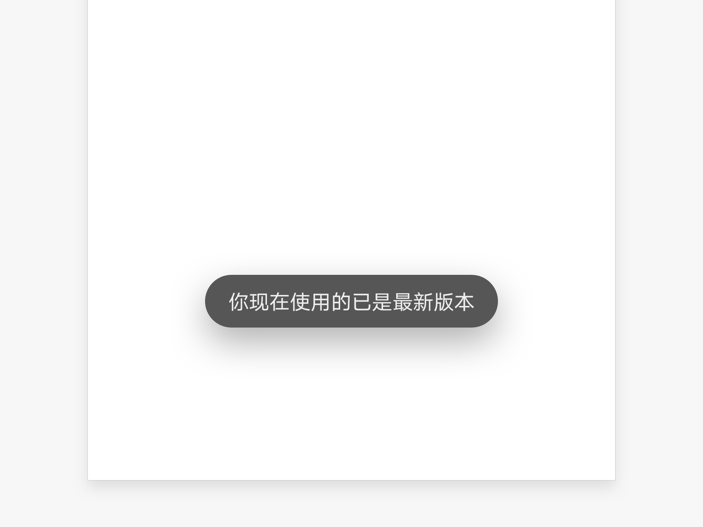
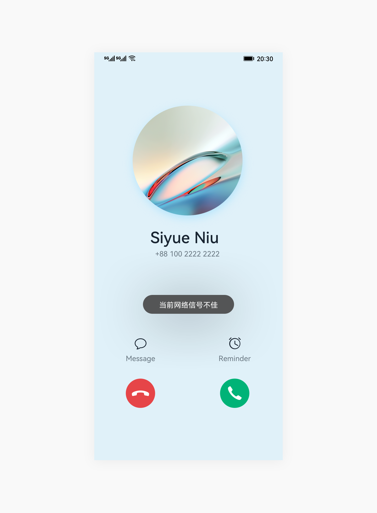

# 即时反馈

即时反馈是用于在屏幕底部或中部显示一个操作的轻量级反馈的控件。

## 如何使用

- 即时反馈用于希望确保用户看到某些信息时，进行提醒。

- 若无必要，不要对所有操作给出即时反馈。

- 不阻碍用户在界面上的其他操作。

- 超过规定时间自动消失。不能通过点击，手指在屏幕上滑动的方式使之消失。

- 界面上不能同时出现多个即时反馈。若一个即时反馈消失前，另一个即时反馈被触发，则第一个即时反馈应在第二个即时反馈出现前消失。

