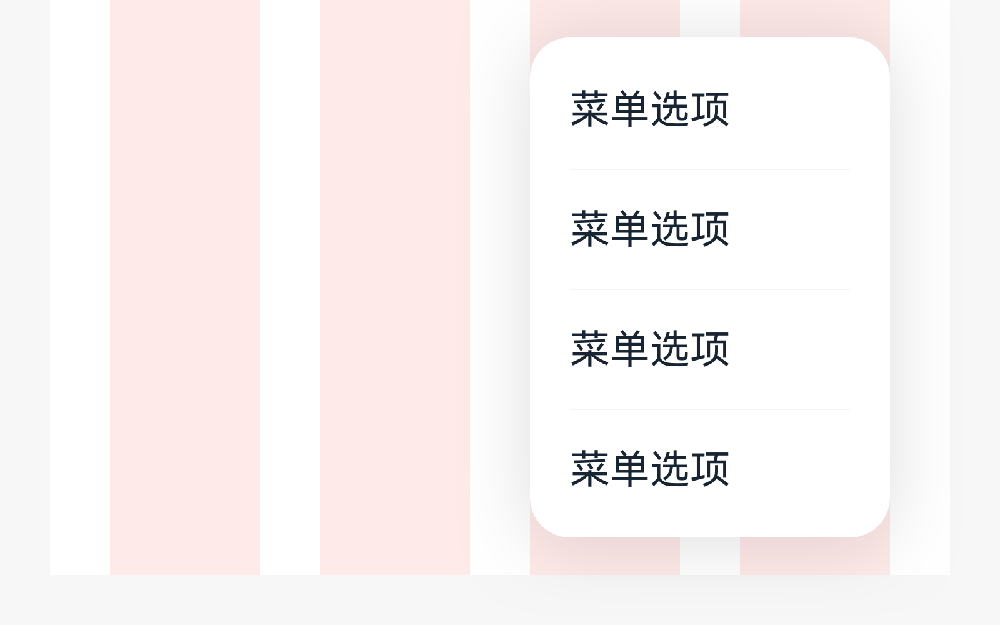
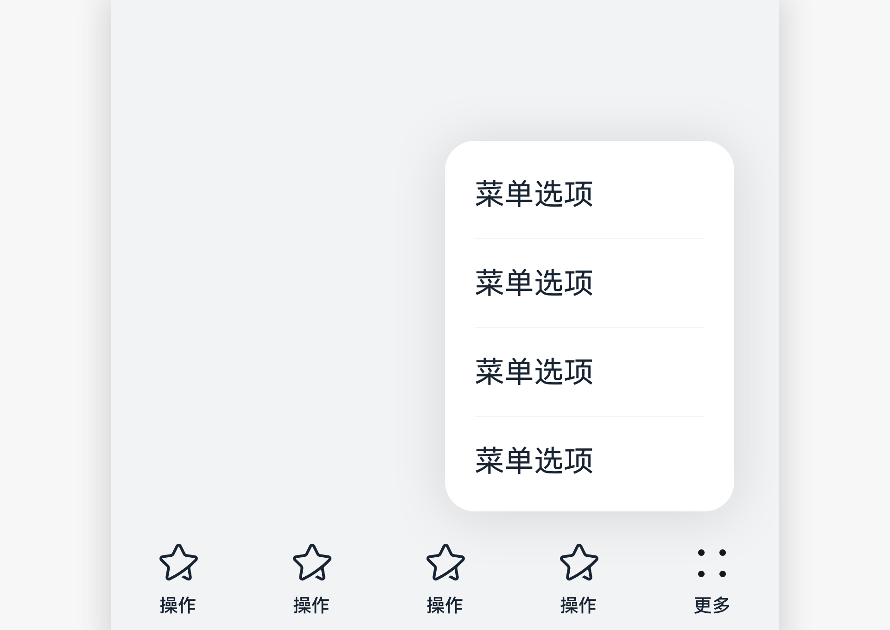
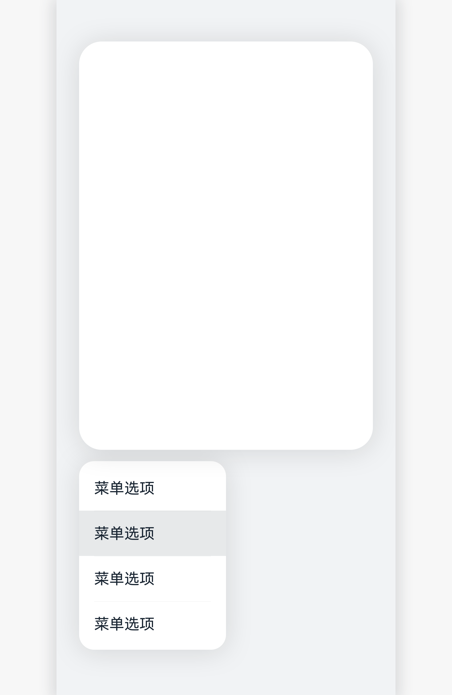

# 菜单

菜单是一种临时性弹出窗口，用于展示用户可执行操作的控件。

## 如何使用

- 当用户点击工具栏或标题栏上的“更多”时可以出现菜单，帮助展示更多的选项和信息。

- 菜单项中不显示与当前内容无关的项。

- 最常用菜单项放在菜单顶部依次排列。

- 选项内容需要左对齐。

- 当用户点击返回键、空白处或选择一个菜单项，菜单就会消失。

## 分类

- 普通菜单

- 长按菜单

### 普通菜单

点击工具栏上或标题栏上的“更多”时出现。

### 长按菜单

在某个操作对象上长按时出现。

## 资源

菜单相关开发者文档详见基础组件[“Menu”](https://gitee.com/openharmony/docs/blob/master/zh-cn/application-dev/reference/arkui-ts/ts-basic-components-menu.md)。
